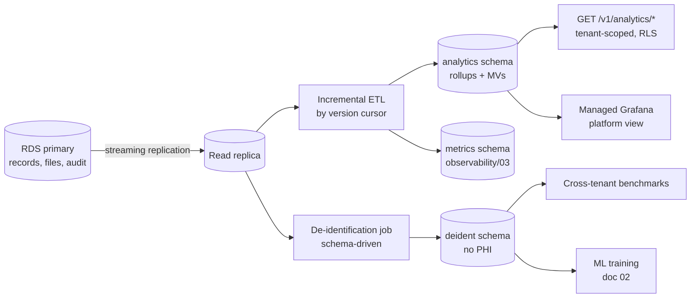
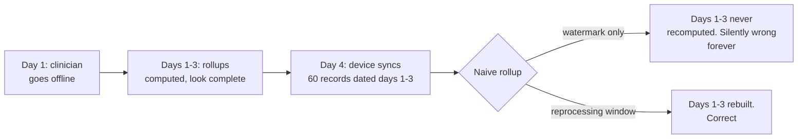

# 01 — Data Warehouse Architecture

**Phase 6.1 deliverable** · Sources: `BUSINESS_PRODUCT_PLANNING.md`, `observability/03`, `database/03`, `database/04`
**Status:** Draft for review — new documentation, no prior source document

Covers the analytics data model, ETL, tenant-facing analytics, de-identification, and the
migration path to a warehouse.

---

## What a Business Associate may do with tenant data

This governs the whole design and is the reason the architecture is conservative.

The platform holds PHI belonging to covered entities. It is not the platform's data. HIPAA permits
a Business Associate to use it only as the BAA permits, plus two narrow exceptions relevant here:

| Use | Permitted? |
|---|---|
| Analytics served back to the originating tenant | Yes — this is the service being provided |
| Operations and quality improvement for that tenant | Yes, if the BAA says so |
| **Data aggregation across covered entities** | Only if the BAA explicitly permits it, and only to produce analyses *for those entities* |
| Product analytics, benchmarking, model training for the platform's benefit | **No, not on PHI.** Requires de-identification first |
| Anything on de-identified data | Yes — de-identified data is no longer PHI |

`BUSINESS_PRODUCT_PLANNING.md:725` names a "multi-tenant data lake and analytics" as a months
13–24 feature. That is achievable, and it has to be built on the de-identified path, not by
pooling raw PHI and restricting access afterwards. Access control is not de-identification.

Two practical consequences that shape every table below: **tenant-scoped analytics operate on
real data**, and **anything crossing tenants operates on de-identified data**. Those are separate
pipelines with separate stores, and conflating them is the failure this section exists to prevent.

---

## Boundary with `observability/03`

`observability/03_BUSINESS_METRICS_DASHBOARDS.md` already builds a `metrics` schema on the read
replica. That work is not duplicated here; the split is by *whose* data it is:

| | `observability/03` | This document |
|---|---|---|
| Subject | The platform's business | The tenant's business |
| Examples | MRR, churn, DAU, feature adoption, SLO attainment | Records by type over time, workflow throughput, clinician workload |
| Audience | Platform staff, exec, engineering | The tenant's own users |
| Contains PHI | No — counts and identifiers only | Derived from PHI; aggregates only |
| Store | `metrics` schema | `analytics` schema, same replica |

Both live on the read replica, both are RLS-protected, and they share the ETL machinery. They are
separate schemas because their access rules differ: platform staff read `metrics`, tenants read
`analytics` for their own tenant only.

---

## Architecture



No new infrastructure. The read replica already exists for read scaling (`database/08`), the
aggregation machinery already exists for `observability/03`, and Postgres handles rollup
aggregation over tens of GB per tenant without difficulty. A separate warehouse is a real
decision with real cost, and the trigger conditions for it are at the end of this document.

### Rollup model

Daily grain, per tenant, per record type — the coarsest grain that answers the questions tenants
actually ask, computed once and read many times.

```sql
CREATE SCHEMA analytics;

CREATE TABLE analytics.record_daily (
    tenant_id        UUID NOT NULL REFERENCES tenants(tenant_id) ON DELETE CASCADE,
    day              DATE NOT NULL,
    record_type      VARCHAR(100) NOT NULL,

    created_count    INTEGER NOT NULL DEFAULT 0,
    updated_count    INTEGER NOT NULL DEFAULT 0,
    deleted_count    INTEGER NOT NULL DEFAULT 0,
    active_total     INTEGER NOT NULL DEFAULT 0,   -- snapshot at end of day
    distinct_authors INTEGER NOT NULL DEFAULT 0,

    -- Bookkeeping: which source versions this row reflects, and when it was last built.
    max_version      BIGINT NOT NULL,
    computed_at      TIMESTAMP WITH TIME ZONE NOT NULL DEFAULT NOW(),
    is_provisional   BOOLEAN NOT NULL DEFAULT TRUE,  -- see late-arriving data

    PRIMARY KEY (tenant_id, day, record_type)
) PARTITION BY RANGE (day);

CREATE TABLE analytics.workflow_daily (
    tenant_id     UUID NOT NULL,
    day           DATE NOT NULL,
    record_type   VARCHAR(100) NOT NULL,
    from_state    VARCHAR(100),
    to_state      VARCHAR(100) NOT NULL,
    transitions   INTEGER NOT NULL DEFAULT 0,
    p50_dwell_sec INTEGER,          -- time spent in from_state before moving
    p95_dwell_sec INTEGER,
    PRIMARY KEY (tenant_id, day, record_type, from_state, to_state)
) PARTITION BY RANGE (day);

ALTER TABLE analytics.record_daily   ENABLE ROW LEVEL SECURITY;
ALTER TABLE analytics.record_daily   FORCE  ROW LEVEL SECURITY;
CREATE POLICY tenant_isolation ON analytics.record_daily FOR ALL TO app_user
    USING (tenant_id = current_setting('app.current_tenant_id')::UUID);
-- ... same for every analytics table.
```

`workflow_daily` is derived from `record_state_transitions` (`database/03`) and answers the
question tenants ask most in this domain — where work is piling up — which the transition log
makes possible and the current-state column alone does not.

**Rollups carry no PHI.** Counts, distinct counts and durations only. No titles, no `data` fields,
no record ids. A rollup row that can be traced to one patient is not a rollup.

Aggregates over small groups are suppressed: any cell derived from fewer than five underlying
records reports `NULL` rather than a count, because a count of one in a small clinic identifies a
person.

### ETL

Incremental, driven by the same `records.version` watermark that the sync protocol uses
(`database/03`, `api/02`) rather than by timestamps:

```sql
-- Idempotent and restartable. Re-running produces the same result.
INSERT INTO analytics.record_daily AS t (tenant_id, day, record_type, created_count, max_version, is_provisional)
SELECT r.tenant_id, r.created_at::date, r.record_type, COUNT(*), MAX(r.version), TRUE
  FROM records r
 WHERE r.version > $last_watermark
   AND r.version <= $current_watermark
 GROUP BY 1, 2, 3
ON CONFLICT (tenant_id, day, record_type) DO UPDATE
   SET created_count = t.created_count + EXCLUDED.created_count,
       max_version   = GREATEST(t.max_version, EXCLUDED.max_version),
       computed_at   = NOW();
```

The version watermark is what makes this correct. A timestamp cursor has the same failure the
sync protocol had (`frontend/05`): clock differences and long transactions mean rows can commit
with a timestamp earlier than the last cursor and be skipped permanently.

### Late-arriving data breaks naive rollups

This is the sharpest problem in the design and it comes from the platform being offline-first.

A clinician works offline for three days and then syncs. Records arrive **now** carrying
`created_at` from three days ago. A daily rollup that ran at midnight each of those nights is
wrong, and nothing about the new data announces that it should be recomputed — the rows just
appear, dated in the past.



Handling:

- **A reprocessing window.** Every run rebuilds the last 7 days from source, not just the new
  watermark range. Seven days covers realistic offline periods; a longer device outage is handled
  by the next point.
- **`is_provisional`.** A day is provisional until the reprocessing window has passed it *and* no
  device has an outstanding sync cursor older than that day. Tenant-facing charts label
  provisional days rather than silently presenting them as final.
- **Out-of-window arrivals trigger a targeted rebuild.** The sync service emits the oldest
  `created_at` in each accepted batch; anything older than the window queues a rebuild for those
  specific days.

Without this, a tenant whose staff work offline sees permanently understated numbers, and there is
no error anywhere to indicate it.

---

## Tenant-facing analytics

Served through the API, not by giving anyone database access:

```
GET /v1/analytics/records?type=patient&from=2026-06-01&to=2026-08-31&grain=day
GET /v1/analytics/workflow?type=incident&from=…
GET /v1/analytics/activity?from=…            users active, records touched
```

Rules, several inherited from `observability/03`:

| Rule | Reason |
|---|---|
| Serving queries run under RLS with the tenant GUC (`api/06`) | An aggregate computed before the filter is a cross-tenant leak RLS cannot catch |
| `analytics:read` permission required | Analytics is not automatically visible to every user |
| PHI access rules do not apply — aggregates are not PHI | But small-cell suppression is mandatory (above) |
| Range capped at 24 months, grain capped at day | An unbounded query is a denial of service against the replica |
| Results cached per tenant with a short TTL, tenant-prefixed keys | `api/06` — a cache key without the tenant is a leak |
| Cross-tenant benchmarks require ≥ 20 tenants in the cohort | `observability/03`; below that a benchmark identifies a competitor |

Benchmarks are served from the **de-identified** store, never from tenant rollups, because a
benchmark is by definition a use of other covered entities' data for a purpose beyond serving
them individually.

## De-identification

The pipeline that makes cross-tenant work legitimate. **HIPAA Safe Harbor** (45 CFR §164.514(b)(2))
is used rather than Expert Determination: it is a checklist rather than a statistician's opinion,
it is defensible without an engagement, and it is mechanically verifiable in CI.

The generic record model would normally make this impossible — you cannot remove identifiers from
a JSONB blob without knowing which keys hold them. Here the type registry does know:
`record_type_definitions.is_phi` marks which types carry PHI, and `form_versions.schema` describes
every field. So each field is classified once, in the schema, and the pipeline is driven by it:

```jsonc
// Field annotations in form_versions.schema
{ "mrn":        { "type": "string", "phi_class": "direct_identifier" },   // removed
  "birth_date": { "type": "date",   "phi_class": "date" },                // → year only
  "zip":        { "type": "string", "phi_class": "geo" },                 // → first 3 digits
  "bp_systolic":{ "type": "number", "phi_class": "clinical" } }           // retained
```

| Safe Harbor rule | Implementation |
|---|---|
| Remove the 18 identifier categories | Fields classed `direct_identifier` dropped |
| Dates → year only | `date` fields truncated; date arithmetic precomputed before truncation |
| Ages > 89 → single "90+" bucket | Derived at export |
| Geography → first three ZIP digits, and suppressed where that unit has < 20,000 people | Lookup table, updated with census data |
| No other unique identifying number | `external_id`, device ids, `record_id` replaced with a per-dataset salted hash |
| **No actual knowledge that re-identification is possible** | Reviewed per record type before a type is enabled for export |

The last row is the one that gets forgotten. Safe Harbor is not satisfied by removing the 18
categories if you *know* the remainder identifies someone — a free-text clinical note mentioning
"the patient who is the mayor" is still identifying. **Free-text fields are not exported at all**
unless a type has been reviewed and explicitly allowlisted, which for clinical notes it will not
be.

Quasi-identifier risk is checked as well as the checklist: the exported combination of retained
fields is tested for k-anonymity (k ≥ 20) across the dataset, and combinations below that are
generalised further or suppressed.

De-identified datasets are versioned and immutable, with lineage recorded — which dataset version
fed which model (doc 02) has to be answerable years later.

## Erasure and retention propagate

An erasure request or retention purge on source records (`database/04`) must reach the analytics
layer, and the two stores behave differently:

- **`analytics` rollups**: aggregates only, and small cells are already suppressed, so an
  individual is not recoverable. Rollups are rebuilt on the normal schedule; no targeted deletion
  is needed. If a *tenant* is offboarded, their partitions are dropped.
- **`deident` datasets**: genuinely de-identified data is no longer PHI and is out of scope for
  erasure. That is only true if the de-identification actually holds, which is why the
  k-anonymity check and the free-text exclusion are not optional — they are what makes this
  statement defensible.

Retention policies (`retention_policies`) apply to analytics partitions as they do to source
data, and legal holds block partition drops the same way.

---

## When this needs to become a warehouse

Documented now so the trigger is recognised rather than discovered:

| Signal | Threshold |
|---|---|
| Rollup build time | Exceeds the nightly window |
| Analytics query load on the replica | Materially affects application reads |
| Tenant data volume | A single tenant's rollups exceed ~100 GB |
| Query shape | Ad-hoc exploration across many dimensions, not fixed rollups |
| Source diversity | Analytics must join non-Postgres sources |

The migration path is S3 plus Athena rather than Redshift or Snowflake: the ETL already produces
partitioned rollups, so the change is a write target, and staying in AWS avoids adding a vendor to
BAA and audit scope (`infrastructure/04`). The de-identified store migrates first, since it
carries no PHI and is therefore the cheapest thing to move.

---

## Open questions

1. **Field classification is unbuilt work.** `phi_class` annotations do not exist in
   `form_versions.schema` today; adding them is a Phase 1 change and a per-industry-pack authoring
   task. Nothing cross-tenant can ship before it exists.
2. **Small-cell threshold.** Five for suppression and twenty for benchmarks are conventional
   figures, not derived ones. A privacy review should set them.
3. **Reprocessing window.** Seven days is a guess at realistic offline duration. It should be
   measured from real sync cursor ages once there is traffic.
4. **Does the BAA permit aggregation?** The de-identified path avoids needing it, but the standard
   BAA language should be checked — if aggregation is permitted, some analyses get easier and some
   de-identification cost disappears.
5. **Provisional data in the UI.** Labelling days as provisional is honest and will generate
   questions. How it is presented is a product decision, not an engineering one.
