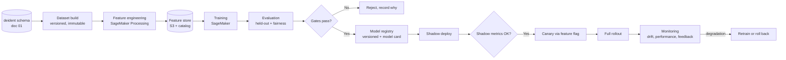

# 02 — Machine Learning Integration

**Phase 6.1 deliverable** · Sources: `BUSINESS_PRODUCT_PLANNING.md`, doc 01, `infrastructure/04`
**Status:** Draft for review — new documentation, no prior source document

Covers training and deployment pipelines, feature engineering, model monitoring, and the A/B
testing framework.

`BUSINESS_PRODUCT_PLANNING.md:708-713` places ML at months 13–24: predictive analytics,
NLP for data entry, document extraction, workflow recommendations, and a chatbot.

---

## Two constraints that come before any pipeline

### Models train on de-identified data only

All training uses the Safe Harbor de-identified datasets from doc 01. Cross-tenant training is
then permissible, because de-identified data is not PHI and its use is not restricted by the BAA.

The alternative — per-tenant models on raw PHI — is legitimate but was not chosen. It has a cold
start for every new tenant, N models to train, serve, monitor and retrain, and it makes the
platform's model quality a function of tenant size.

There is a security reason as well as a compliance one. **Models memorise their training data.**
Language models reproduce training strings verbatim under the right prompt; even tabular models
leak through membership inference. A model trained on one covered entity's PHI and served to
another is a disclosure channel that no access control closes, because the disclosure is inside
the weights. Training on de-identified data removes the channel rather than guarding it.

### Clinical predictions may be a regulated device

This is a legal question that engineering cannot answer and must not assume past.

Software that analyses patient-specific data and makes a recommendation a clinician acts on can
be **Clinical Decision Support software regulated by the FDA**. The 21st Century Cures Act carves
out CDS that meets four conditions — notably that the clinician can independently review the basis
for the recommendation and does not rely primarily on it. Software that fails the carve-out is a
medical device requiring clearance.

| Feature from the roadmap | Likely posture |
|---|---|
| Document extraction (OCR to fields) | Not CDS — no clinical recommendation |
| NLP for data entry / autocomplete | Not CDS if the user reviews and confirms |
| Workflow recommendations (operational) | Not CDS — routing work, not clinical judgement |
| Chatbot answering product questions | Not CDS |
| **Predictive analytics on patient outcomes** | **Very likely CDS. Needs regulatory review before it is built** |
| Risk scoring that drives clinical priority | Likely CDS |

Design rules that keep the non-CDS features on the safe side of the line, and which are cheap if
adopted from the start and expensive to retrofit:

- **Always human-in-the-loop.** The model proposes, a person confirms. Nothing auto-applies to a
  clinical record.
- **Always show the basis.** Extracted values show the source region of the document; suggestions
  show what they were derived from. This is both a usability property and the Cures Act condition.
- **Never rank patients clinically** without regulatory sign-off.
- **Record the decision.** Whether the user accepted or rejected a suggestion goes to
  `user_audit_log`, which is the evidence base for both model monitoring and any later review.

---

## Pipeline



SageMaker throughout: it is HIPAA-eligible under the AWS BAA (`infrastructure/04`), which matters
even though training data is de-identified — inference runs against live tenant data, and that is
PHI in transit.

| Stage | Requirement |
|---|---|
| Dataset build | Immutable, versioned, hash recorded. A model must be reproducible from its dataset version years later |
| Feature engineering | Deterministic and shared between training and inference — see skew below |
| Training | Containerised, pinned dependencies, seeded. Same inputs, same model |
| Evaluation | Held-out set from a *different time period*, not a random split |
| Registry | Version, dataset hash, metrics, model card, approver |
| Deployment | Behind a feature flag, per tenant (`tenant_configurations.features`) |

**Training/serving skew is the defect that produces a model that tests well and fails in
production.** It happens when the feature computed at training differs subtly from the one
computed at inference — a different null handling, a timezone, a rounding rule. The mitigation is
one implementation, packaged once and imported by both paths, with a CI test asserting that the
same input produces identical features through each.

**Evaluation splits by time, not at random.** A random split leaks the future into the training
set through correlated records, and every model looks excellent. Splitting at a date is the only
honest simulation of deployment.

## Feature engineering on de-identified data

De-identification removes signal, and being explicit about what survives keeps expectations
realistic:

| Lost | Consequence | Mitigation |
|---|---|---|
| Exact dates | No day-of-week or seasonality below the year | Derive intervals **before** truncation — "days since previous visit" is not an identifier |
| Precise geography | Only 3-digit ZIP | Usually sufficient for regional signal |
| Ages > 89 | Bucketed | Rarely material outside geriatric use cases |
| Free text | Excluded entirely (doc 01) | The largest real loss; document extraction must work from structured fields or run per-tenant on PHI under that tenant's BAA |
| Record linkage across time | Salted-hash ids, stable within a dataset version only | Longitudinal features must be computed before export |

The pattern that runs through this: **derive the feature before de-identifying, export the
feature rather than the raw values.** "Days between appointments" carries no identifier and
survives; two exact dates do not.

Free text is the honest limitation. Document extraction — one of the named roadmap features —
mostly needs the text. That specific capability is therefore either a per-tenant model under that
tenant's BAA, or a third-party service under a BAA (Amazon Textract and Comprehend Medical are
HIPAA-eligible), rather than a cross-tenant model. Worth deciding before it is scoped.

---

## Monitoring

A model degrades silently. Nothing errors, the numbers just get worse.

| Signal | Method | Action |
|---|---|---|
| Data drift | Population stability index on input features vs training | PSI > 0.2 → investigate; > 0.25 → retrain |
| Concept drift | Rolling accuracy against outcomes as they arrive | Below floor → roll back |
| **Acceptance rate** | Suggestions accepted ÷ shown, from `user_audit_log` | The earliest and most honest signal |
| Performance by tenant | Metrics segmented per tenant | A model good on average can be useless for one tenant |
| Fairness | Metrics across available demographic slices | Disparity beyond threshold → block release |
| Latency and cost | Inference p95, cost per 1,000 | Budget |

**Acceptance rate is the metric to build first.** Ground truth for a clinical prediction may take
months to arrive; whether a clinician accepted the suggestion is known immediately, and a falling
acceptance rate means the model is wrong long before any outcome data confirms it.

Fairness monitoring is constrained by de-identification — race, exact age and precise geography
are largely gone, which limits what can be measured. That is a genuine tension: privacy and
fairness auditing want opposite things from the same fields. Where a fairness question is
material, the honest answer is a governed, consented analysis rather than pretending the de-
identified data can answer it.

Every model carries a **model card**: purpose, training data version, evaluation results, known
limitations, populations it should not be used on, and the approver. It is the artifact an auditor
or a clinical safety review asks for, and writing it after the fact is how limitations get
forgotten.

---

## A/B testing

The framework rides on the feature-flag machinery that already exists
(`tenant_configurations.features`, `frontend/01`), with assignment at tenant or user level.

```
experiments (experiment_id, key, hypothesis, metric, min_sample, start, end, status)
experiment_assignments (experiment_id, subject_type, subject_id, variant, assigned_at)
experiment_events (experiment_id, subject_id, event, value, occurred_at)
```

| Rule | Reason |
|---|---|
| Assignment is deterministic — hash of (experiment, subject) | Stable across sessions and devices without storing state on the client |
| Assign at **tenant** level for workflow changes | Two users in one clinic seeing different workflows is confusing and contaminates the result |
| Assign at **user** level only for individual-scope UI | |
| Sample size fixed in advance | Peeking until significance appears manufactures results |
| One primary metric, declared before start | Choosing the metric afterwards guarantees a winner |
| Guardrail metrics always monitored | Error rate, latency, task completion — a variant that wins on the primary and breaks something else must not ship |
| Auto-stop on guardrail breach | |

**Clinical caution.** A/B testing a UI colour is ordinary product work. A/B testing something that
changes clinical behaviour — which patients get flagged, what order work appears in — is human
subjects research in a healthcare setting, and it needs review before it runs, not after. The
framework does not distinguish these; the governance around it must.

Tenants are told that experimentation happens, and enterprise tenants can opt out — some will
require it contractually, and discovering that after the fact is worse than the feature.

---

## Design notes for a section with no prior source

Because Phase 6.1 is new documentation, this is a specification rather than a correction — but
several things are worth stating explicitly, since the natural implementation of the roadmap
features would get them wrong:

| # | Risk in the obvious implementation | Position taken |
|---|---|---|
| 1 | Pooling tenant PHI into a shared training set, protected by access control | De-identify first; access control is not de-identification |
| 2 | Training a model on one tenant's data and serving it to others | Models memorise; this is disclosure inside the weights |
| 3 | Shipping "predictive analytics" as a product feature without regulatory review | Likely FDA-regulated CDS; review before building |
| 4 | Auto-applying model output to records | Human-in-the-loop always; show the basis |
| 5 | Random train/test split | Split by time, or the model is evaluated on leaked future data |
| 6 | Separate feature code for training and inference | One implementation, CI-asserted, or skew is inevitable |
| 7 | Waiting for outcome data to detect degradation | Acceptance rate first; ground truth may take months |
| 8 | A/B testing clinical behaviour like a UI change | Governance review; tenant opt-out |
| 9 | Discarding the dataset once a model is trained | Immutable versioned datasets — reproducibility is an audit requirement |

---

## Open questions

1. **Is any of this in scope before month 13?** The roadmap says no. If a specific ML feature is
   pulled forward for competitive reasons, the de-identification pipeline (doc 01) is the
   prerequisite and it is not built.
2. **Document extraction is the exception that does not fit.** It needs free text, which the
   cross-tenant path excludes. Per-tenant models or a HIPAA-eligible managed service are the two
   viable routes, and the choice affects cost and quality substantially.
3. **Regulatory review owner.** Deciding whether a feature is CDS is not an engineering call. It
   needs a named owner and a route to counsel before anything predictive is scoped.
4. **Fairness auditing versus de-identification.** These pull in opposite directions and the
   tension has no clean technical resolution. It should be settled as policy.
5. **Experiment governance.** Where the line sits between product experimentation and human
   subjects research needs defining before the first experiment touches clinical workflow.
