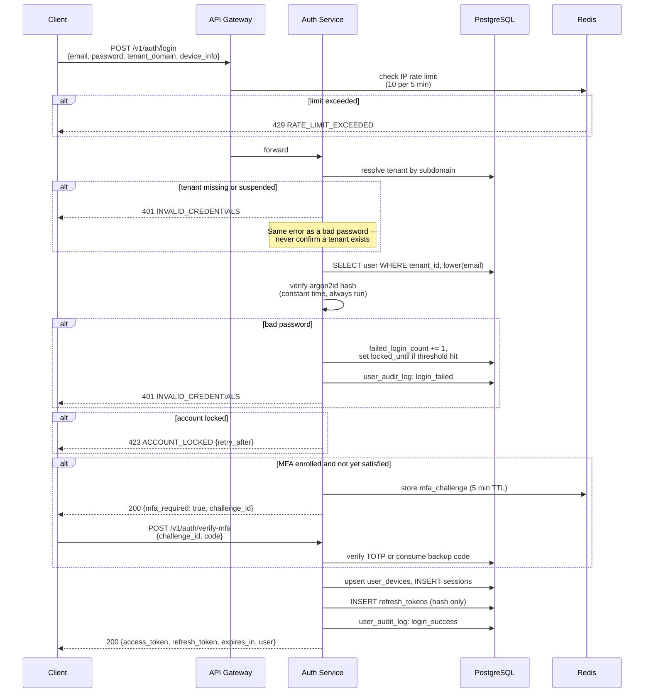
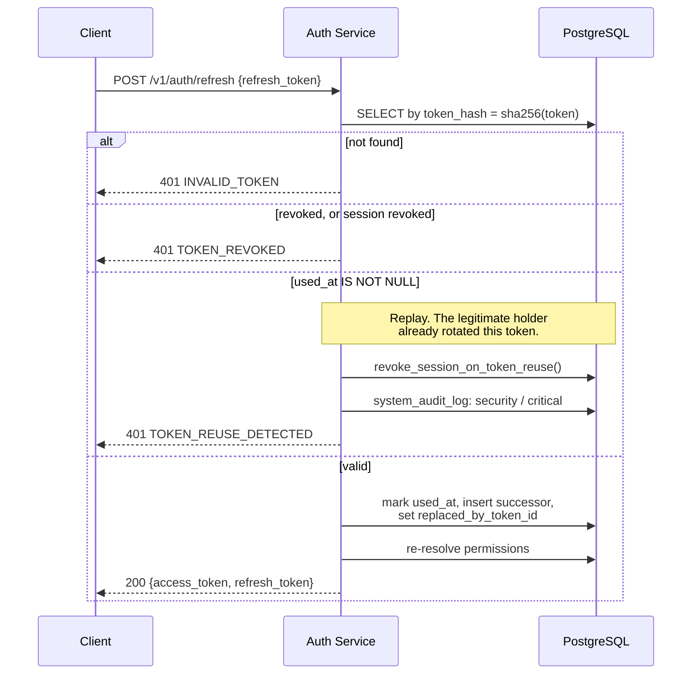
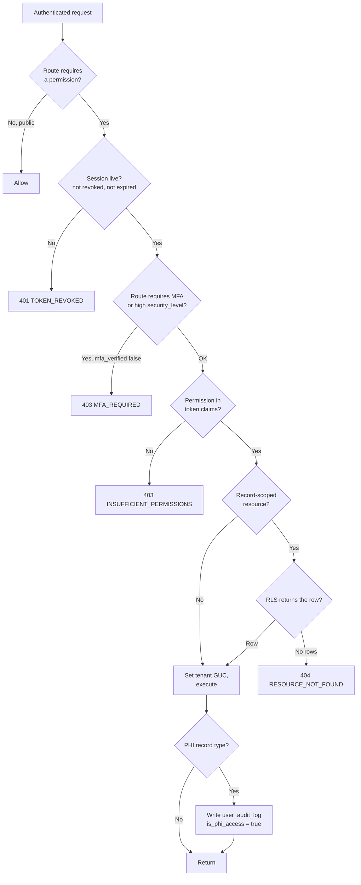
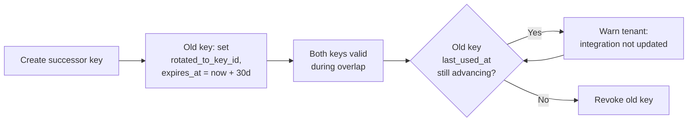

# 01 — Authentication & Authorization Flows

**Phase 2.1 deliverable** · Sources: `API_ARCHITECTURE.md`, `SECURITY_ARCHITECTURE.md`, `database/02_USER_AUTH_ERD.md`
**Status:** Draft for review

Covers the login sequence, JWT lifecycle and refresh rotation, tenant resolution, the RBAC
decision path, and API key management and rotation.

---

## The correction that must land first: tenant resolution

`API_ARCHITECTURE.md:88-95` shows a request carrying **both** a bearer token and
`X-Tenant-ID: healthcare-plus`, and the gateway pipeline lists "Tenant Resolution — extract from
header/domain" as step 2, *before* "Auth Validation" as step 3.

That ordering is exploitable. If the tenant context is taken from a client-supplied header, a
user holding a valid token for tenant A sets `X-Tenant-ID: B` and the application sets
`app.current_tenant_id = B`. Row-level security then works perfectly — enforcing the attacker's
chosen tenant. Nothing errors, and the audit log records the access as legitimate.

**The JWT `tenant_id` claim is the only authoritative source.** Everything else is a hint:

| Source | Trust | Use |
|---|---|---|
| JWT `tenant_id` claim | **Authoritative** | Sets `app.current_tenant_id` |
| Subdomain (`healthcare-plus.allguds.com`) | Untrusted | Pre-auth routing; which tenant's login page to render |
| `X-Tenant-ID` header | Untrusted | Logging and diagnostics only |

Resolution order is therefore: **authenticate first, then derive the tenant from the verified
token.** Where an untrusted source is also present, it is compared and a mismatch is rejected —
not silently ignored, because a mismatch is either a client bug or an attack, and both are worth
seeing:

```
if (header.tenantId && header.tenantId !== claims.tenant_domain) {
    // 403 TENANT_MISMATCH, logged to system_audit_log as a security event
}
```

The one endpoint that legitimately resolves a tenant before authentication is `POST /auth/login`,
which needs the subdomain to find the user. That path runs as the restricted `auth_service` role
described in `database/02_USER_AUTH_ERD.md`, which can read `tenant_users` and nothing else.

---

## Login



Three details that are load-bearing rather than cosmetic:

**The password hash is verified even when the user does not exist.** Skipping it turns response
latency into a user-enumeration oracle. Compare against a dummy hash and discard the result.

**`INVALID_CREDENTIALS` covers unknown tenant, unknown user, and wrong password.** The error
catalogue in `API_ARCHITECTURE.md` includes `TENANT_NOT_FOUND`, which is safe on tenant-resolution
endpoints but must never be returned from `/auth/login`.

**`423 ACCOUNT_LOCKED` is a deliberate addition** to the status codes in `API_ARCHITECTURE.md`,
which has no code for a temporarily disabled account. The alternative — reusing 401 — leaves a
locked-out user with no way to distinguish "wrong password" from "stop trying for 15 minutes".

---

## Token lifecycle

`SECURITY_ARCHITECTURE.md:96-130` defines the claim set. Access tokens live one hour, refresh
tokens sixty days.

| Claim | Source | Notes |
|---|---|---|
| `sub` | `tenant_users.user_id` | |
| `tenant_id` | `tenant_users.tenant_id` | **The only trusted tenant source** |
| `roles` | `user_roles` | Codes, not UUIDs |
| `permissions` | `effective_user_permissions` view | Resolved at mint; see staleness below |
| `session_id` | `sessions.session_id` | Enables revocation |
| `device_id` | `user_devices.device_id` | |
| `mfa_verified` | `sessions.mfa_verified` | |
| `jti` (refresh only) | `refresh_tokens.token_id` | Revocation key |

### Refresh rotation and reuse detection



Reuse revokes **the whole session chain**, not just the presented token — the implementation is
`revoke_session_on_token_reuse()` in `database/02_USER_AUTH_ERD.md`. A replayed refresh token
means either a stolen token or a buggy client, and both warrant ending the session.

### Permission staleness

Permissions are stamped into the access token at mint time, so a revoked permission stays live
for up to one hour. That is the standard trade and it is acceptable for ordinary changes. It is
**not** acceptable for offboarding or a compromised account, where the revocation must be
immediate. Those paths revoke the session:

```sql
UPDATE sessions SET revoked_at = NOW(), revoked_reason = 'admin'
 WHERE user_id = $1 AND revoked_at IS NULL;
```

Which only helps if session state is actually consulted. **Access tokens must be checked against
the session on every request**, not merely verified as signed — a purely stateless check makes
`sessions.revoked_at` decorative. Cache the check in Redis keyed by `session_id` with a short TTL
(~60 s) so it costs a memory lookup rather than a query; publish revocations to invalidate.

---

## Authorization



**A tenant-mismatched resource returns 404, not 403.** RLS makes another tenant's record simply
invisible, and that is the correct externally-visible behaviour: a 403 would confirm the record
exists. This differs from a permission failure inside your own tenant, which is a genuine 403.

Permission codes follow `resource:action` from `database/02_USER_AUTH_ERD.md` —
`records:read`, `records:write`, `records:delete`, `records:export`, `records:import`,
`files:read`, `files:write`, `files:share`, `users:read`, `users:write`, `billing:read`,
`billing:write`, `webhooks:manage`, `api_keys:manage`, `audit:read`.

`audit:read` deserves note: reading the audit log is itself an auditable event, and
`GET /v1/audit-logs` must write its own `user_audit_log` entry. An audit trail that does not
record who read it is incomplete for HIPAA purposes.

---

## API keys

Nothing in Phase 1 models API keys, though `API_ARCHITECTURE.md` references them for third-party
integrations and Phase 2.1 requires key management and rotation. Defined here.

```sql
CREATE TABLE api_keys (
    api_key_id          UUID PRIMARY KEY DEFAULT gen_random_uuid(),
    tenant_id           UUID NOT NULL REFERENCES tenants(tenant_id) ON DELETE CASCADE,
    name                VARCHAR(150) NOT NULL,        -- 'Zapier production'
    environment         VARCHAR(10) NOT NULL DEFAULT 'live',   -- 'live' | 'test'

    key_prefix          VARCHAR(16) NOT NULL,         -- shown in the UI, used for lookup
    key_hash            VARCHAR(64) NOT NULL UNIQUE,  -- SHA-256 of the full key

    created_by          UUID REFERENCES tenant_users(user_id),
    last_used_at        TIMESTAMP WITH TIME ZONE,
    last_used_ip        INET,
    expires_at          TIMESTAMP WITH TIME ZONE,
    revoked_at          TIMESTAMP WITH TIME ZONE,
    revoked_reason      VARCHAR(50),
    rotated_to_key_id   UUID REFERENCES api_keys(api_key_id),

    created_at          TIMESTAMP WITH TIME ZONE NOT NULL DEFAULT NOW(),

    UNIQUE (tenant_id, name)
);

CREATE TABLE api_key_scopes (
    api_key_id    UUID NOT NULL REFERENCES api_keys(api_key_id) ON DELETE CASCADE,
    permission_id UUID NOT NULL REFERENCES permissions(permission_id) ON DELETE CASCADE,
    PRIMARY KEY (api_key_id, permission_id)
);

CREATE INDEX idx_api_keys_prefix ON api_keys(key_prefix) WHERE revoked_at IS NULL;

ALTER TABLE api_keys       ENABLE ROW LEVEL SECURITY;
ALTER TABLE api_keys       FORCE  ROW LEVEL SECURITY;
CREATE POLICY tenant_isolation ON api_keys FOR ALL TO app_user
    USING (tenant_id = current_setting('app.current_tenant_id')::UUID);
```

### Key format

```
hsc_live_7f3a9c2e_QK8vN2pXmR4tYwLzB6dHjF9sA1gE5cU3
└┬─┘ └┬─┘ └───┬──┘ └──────────────┬───────────────┘
 │    │       │                   └ 32 random chars (192 bits), never stored
 │    │       └ prefix, stored and indexed for O(1) lookup
 │    └ environment
 └ platform marker, so leaked keys are greppable in public repos
```

The full key is returned **once**, at creation, and never again — only `key_hash` is stored.
The `hsc_live_` marker exists so that secret-scanning services (GitHub, GitGuardian) can
recognise a leaked key and so the platform can search its own logs for accidental capture.

Lookup is by `key_prefix`, then constant-time comparison of the SHA-256 of the presented key
against `key_hash`. Unlike a password, an API key is high-entropy and machine-generated, so a
plain SHA-256 is appropriate — argon2 on every API request would be a self-inflicted denial of
service.

### Scoping

API keys carry their own scopes, drawn from the same `permissions` catalogue as user roles, and
**a key's scopes are a subset of what its creator could grant**. A key cannot exceed the
permissions of the user who created it; validate at creation, not at use.

Keys are tenant-scoped and have no user identity. Audit rows written by a key-authenticated
request carry a null `user_id` and the key id in `details` — which means `data_audit_log.changed_by`
will be null for those writes, and compliance reporting must handle that rather than assume every
change has a human actor.

### Rotation



The overlap window is what makes rotation safe for an integration the tenant does not control.
`last_used_at` is what tells you whether it is safe to close the window — without it, revocation
is a guess. Expiry defaults to 30 days and is capped at 90; a rotation that never completes is
just two live keys.

Compromise is different: `POST /v1/api-keys/{id}/revoke` takes effect immediately with no overlap,
and writes a `security` severity row to `system_audit_log`.

---

## Auth error responses

| Condition | Status | Code |
|---|---|---|
| No `Authorization` header | 401 | `MISSING_AUTHORIZATION` |
| Malformed or bad signature | 401 | `INVALID_TOKEN` |
| Expired access token | 401 | `TOKEN_EXPIRED` (with `refresh_endpoint`) |
| Session revoked | 401 | `TOKEN_REVOKED` |
| Refresh token replayed | 401 | `TOKEN_REUSE_DETECTED` |
| Bad credentials, unknown user, unknown tenant | 401 | `INVALID_CREDENTIALS` |
| Account locked out | 423 | `ACCOUNT_LOCKED` |
| MFA enrolled, challenge unsatisfied | 403 | `MFA_REQUIRED` |
| Token valid, permission absent | 403 | `INSUFFICIENT_PERMISSIONS` |
| `X-Tenant-ID` contradicts the token | 403 | `TENANT_MISMATCH` |
| API key revoked or expired | 401 | `INVALID_API_KEY` |
| API key lacks the scope | 403 | `INSUFFICIENT_SCOPE` |

`TOKEN_EXPIRED` is separated from `INVALID_TOKEN` deliberately: clients need to distinguish
"refresh and retry" from "log in again", and collapsing both into `INVALID_TOKEN` as
`API_ARCHITECTURE.md` does forces every client to guess.

---

## Corrections to `API_ARCHITECTURE.md`

| # | Severity | Issue | Resolution |
|---|---|---|---|
| 1 | **Critical** | Tenant resolved from `X-Tenant-ID` / subdomain *before* auth validation; a valid token plus a forged header reads another tenant | JWT claim is authoritative; header is a hint; mismatch → 403 |
| 2 | **High** | Access tokens are verified as signed but never checked against `sessions.revoked_at`, making logout and admin revocation ineffective for up to an hour | Session check on every request, Redis-cached |
| 3 | **High** | No API key model exists despite endpoints and integrations depending on one | `api_keys`, `api_key_scopes` |
| 4 | Medium | `TENANT_NOT_FOUND` is a user-enumeration oracle if returned from login | Collapsed into `INVALID_CREDENTIALS` on auth endpoints |
| 5 | Medium | No status code for a locked account | `423 ACCOUNT_LOCKED` |
| 6 | Medium | `INVALID_TOKEN` conflates expiry with invalidity, so clients cannot tell refresh from re-login | `TOKEN_EXPIRED` split out |
| 7 | Low | Login response embeds full `permissions` and tenant `features` objects, inflating every login payload | Return permission codes; features via `GET /v1/tenant/config` |

---

## Open questions

1. **Token signing.** HS256 is implied by the examples. RS256/EdDSA lets services verify without
   holding the signing key, which matters once the sync and file services verify independently.
   Recommend asymmetric with a JWKS endpoint, decided before the first token is issued.
2. **Session check cache TTL.** 60 s bounds revocation latency but adds a Redis round trip per
   request. If Redis is unavailable, does the check fail open or closed? Recommend closed for
   PHI routes, open otherwise — needs security sign-off.
3. **API key expiry default.** Non-expiring keys are convenient and are how most integrations
   break in year three. Recommend a 12-month default with renewal reminders.
4. **Device trust.** `user_devices.trusted_at` exists but nothing yet decides when MFA can be
   skipped for a known device. Needs a policy before it is wired in.
5. **Machine-to-machine OAuth.** API keys cover integrations today. If partners need delegated
   per-user access, that is a full OAuth 2.0 authorization-code server — a much larger build, and
   worth confirming it is out of scope for v1.
