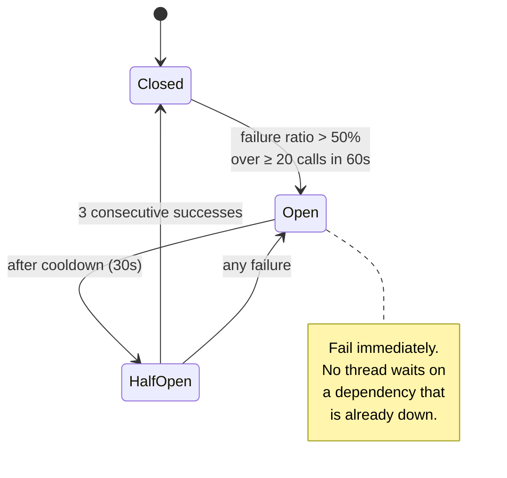

# 03 — Rate Limiting & Throttling

**Phase 2.1 deliverable** · Sources: `API_ARCHITECTURE.md`, `database/01_TENANT_MANAGEMENT_ERD.md`, `database/08_SCALING_ARCHITECTURE.md`
**Status:** Draft for review

Covers the limiting algorithms, tier and endpoint quotas, response headers, circuit breaking,
and behaviour when the limiter itself is unavailable.

---

## Two defects in the documented implementation

`API_ARCHITECTURE.md:449-480` gives a Redis sliding-window implementation. It has an off-by-one
and a self-inflicted lockout.

```js
pipeline.zremrangebyscore(key, 0, now - window);
pipeline.zcard(key);                                  // <- count read BEFORE the add
pipeline.zadd(key, now, `${now}-${Math.random()}`);   // <- added even when denied
pipeline.expire(key, Math.ceil(window / 1000));
const count = results[1][1];
return { allowed: count <= limit, … };                // <- <= allows limit + 1
```

**Bug 1 — the limit is off by one.** `count` is the number of requests *before* this one. With
`limit = 1000`, a request arriving when `count = 1000` is allowed, because `1000 <= 1000`. Every
tier permits `limit + 1` requests per window. The comparison must be `count >= limit → deny`.

**Bug 2 — denied requests still consume the window.** The `zadd` runs unconditionally, so a
client that is already over its limit keeps adding entries and keeps pushing its own reset
forward. A misbehaving retry loop can hold itself out indefinitely, and the `X-RateLimit-Reset`
returned to it is wrong. Denied requests must not be recorded.

A third issue is structural: `pipeline` is not atomic. Between the `zcard` and the `zadd`,
another of the 2–20 API tasks (`ARCHITECTURE_DESIGN.md`) can run the same sequence, so under
concurrency both admit a request that should have been refused. It needs a Lua script, which
Redis executes atomically.

### Corrected sliding-window log

```lua
-- KEYS[1] = bucket key
-- ARGV[1] = now (ms)   ARGV[2] = window (ms)
-- ARGV[3] = limit      ARGV[4] = unique member id (the request id)
redis.call('ZREMRANGEBYSCORE', KEYS[1], 0, ARGV[1] - ARGV[2])

local count = redis.call('ZCARD', KEYS[1])
if count >= tonumber(ARGV[3]) then
    -- Deny WITHOUT recording, so a throttled client's window still drains.
    local oldest = redis.call('ZRANGE', KEYS[1], 0, 0, 'WITHSCORES')
    return {0, count, oldest[2]}          -- {allowed, count, oldest_ms}
end

redis.call('ZADD',    KEYS[1], ARGV[1], ARGV[4])
redis.call('PEXPIRE', KEYS[1], ARGV[2])
return {1, count + 1, 0}
```

`reset` is computed from the oldest entry (`oldest_ms + window`), not from `now + window` — the
window slides, so the next slot frees when the oldest request ages out, which is sooner than a
full window away. The documented code returns `now + window`, which overstates the wait and makes
well-behaved clients back off far longer than necessary.

The member is the request id rather than `${now}-${Math.random()}`: it is already unique, already
logged, and makes a bucket's contents traceable to real requests during an incident.

---

## The log algorithm does not scale to the documented tiers

A sliding-window log stores one sorted-set member per request. `API_ARCHITECTURE.md:398-411`
defines an enterprise tier of **1,000,000 requests/hour per tenant**. At roughly 90 bytes per
sorted-set entry that is about **90 MB of Redis for a single enterprise tenant's hourly bucket**,
before per-user and per-endpoint buckets. Ten such tenants exhaust a `cache.m6g.large`.

The algorithm has to vary by limit size:

| Limit size | Algorithm | Memory per key | Used for |
|---|---|---|---|
| ≤ 1,000 per window | Sliding-window log | ~90 B × limit | Auth endpoints, sensitive actions |
| > 1,000 per window | Token bucket | 2 fields (~90 B) | Tenant and user quotas |
| Burst-sensitive | Token bucket | 2 fields | Sync, file upload |

Token bucket is also a better fit for the product: it permits a short burst (a page loading
twenty resources at once) while holding the sustained rate, which a fixed window does not.

```lua
-- Token bucket. KEYS[1] = bucket
-- ARGV[1] = now(ms)  ARGV[2] = capacity  ARGV[3] = refill/sec  ARGV[4] = cost
local state    = redis.call('HMGET', KEYS[1], 'tokens', 'ts')
local capacity = tonumber(ARGV[2])
local tokens   = tonumber(state[1]) or capacity
local ts       = tonumber(state[2]) or tonumber(ARGV[1])

tokens = math.min(capacity, tokens + ((ARGV[1] - ts) / 1000) * tonumber(ARGV[3]))

local cost = tonumber(ARGV[4])
if tokens < cost then
    local wait = math.ceil(((cost - tokens) / tonumber(ARGV[3])) * 1000)
    return {0, math.floor(tokens), wait}
end

redis.call('HMSET',   KEYS[1], 'tokens', tokens - cost, 'ts', ARGV[1])
redis.call('PEXPIRE', KEYS[1], math.ceil((capacity / tonumber(ARGV[3])) * 2000))
return {1, math.floor(tokens - cost), 0}
```

`cost` lets expensive endpoints draw more than one token — a report generation costing 50 tokens
is throttled proportionally to what it actually consumes, rather than needing its own bucket.

---

## Limits come from the plan, not from code

`API_ARCHITECTURE.md` hard-codes four tiers. `database/01_TENANT_MANAGEMENT_ERD.md` already
stores `plans.limits` as JSONB and gives enterprise tenants custom limits — so the limiter reads
the plan, and the documented tiers become seed data:

```json
{
  "requests_per_hour": 100000,
  "user_requests_per_minute": 2000,
  "concurrent_connections": 200,
  "max_upload_bytes": 1073741824,
  "webhook_endpoints": 20
}
```

Resolved limits are cached in Redis for 5 minutes, keyed by `tenant_id`, and invalidated when a
subscription changes. Two consequences worth stating: a plan upgrade takes effect within minutes
rather than at the next deploy, and "custom rate limits available" for enterprise needs no code —
it is a row edit.

### Documented tier values (seed data)

| Tier | Req/hour (tenant) | Req/min (user) | Concurrent | Upload | Webhooks |
|---|---|---|---|---|---|
| Free trial | 1,000 | 100 | 10 | 50 MB | 1 |
| Basic | 10,000 | 500 | 50 | 200 MB | 5 |
| Professional | 100,000 | 2,000 | 200 | 1 GB | 20 |
| Enterprise | 1,000,000 | 10,000 | 1,000 | 5 GB | unlimited |

### Endpoint overrides

| Endpoint | Limit | Keyed by | Algorithm |
|---|---|---|---|
| `POST /auth/login` | 10 / 5 min | IP **and** email | log |
| `POST /auth/forgot-password` | 3 / hour | email | log |
| `POST /auth/refresh` | 100 / hour | session | log |
| `POST /auth/verify-mfa` | 10 / 5 min | challenge | log |
| `POST /files` | 50 / hour | user | bucket |
| `POST /search/advanced` | 1,000 / hour | tenant | bucket |
| `POST /reports/generate` | 10 / hour | tenant | bucket (cost 50) |
| `POST /sync/pull` | 1 / 5 s | device | bucket |
| `POST /sync/push` | 1 / 2 s | device | bucket |
| `POST /imports` | 1 / 10 min | tenant | log |

`/auth/login` is keyed on **both** IP and email, evaluated independently. IP alone lets a
distributed attempt spread across addresses to hammer one account; email alone lets one host
enumerate many accounts. Both must pass.

These interact with `tenant_users.failed_login_count` and `locked_until`
(`database/02_USER_AUTH_ERD.md`): rate limiting throttles the *request*, account lockout disables
the *account*. Rate limiting alone lets an attacker try ten passwords every five minutes forever;
lockout alone lets an attacker lock every account in a tenant. Both, together.

---

## Response headers

`API_ARCHITECTURE.md` uses `X-RateLimit-*`. Those are kept for compatibility, alongside the
standard names from the IETF `RateLimit` header draft, which is what current SDKs look for:

```http
RateLimit-Limit: 100000
RateLimit-Remaining: 98432
RateLimit-Reset: 2847
RateLimit-Policy: 100000;w=3600

X-RateLimit-Limit: 100000
X-RateLimit-Remaining: 98432
X-RateLimit-Reset: 1725186930
X-RateLimit-Window: 3600
```

`RateLimit-Reset` is **seconds remaining**; `X-RateLimit-Reset` is a Unix timestamp. They are
genuinely different units — emitting the same number in both is a common and confusing bug.

When several buckets apply, the headers describe the **most constrained** one, so a client backing
off on them backs off enough.

On 429, `Retry-After` is mandatory:

```http
HTTP/1.1 429 Too Many Requests
Retry-After: 900
```

The body follows `API_ARCHITECTURE.md:497-515` unchanged. Adding `scope` (`tenant` | `user` |
`ip` | `endpoint` | `device`) to `details` tells the client whether backing off will help or
whether every user in the tenant is blocked.

---

## Circuit breaking

Rate limits protect the platform from clients. Circuit breakers protect it from its own
dependencies — the outbound calls in `04_INTEGRATION_WEBHOOK_FLOWS.md`, plus S3, Stripe, and the
email and SMS providers.



Breaker state is per dependency **and per tenant** where the dependency is tenant-specific: one
tenant's broken webhook endpoint must not open the breaker for every other tenant's webhooks.

Timeouts are set below the client's own patience — a 30-second upstream timeout behind a
10-second client timeout means the API holds a connection nobody is waiting for. Every outbound
call gets an explicit timeout; there is no default that is safe.

---

## When Redis is down

`database/08_SCALING_ARCHITECTURE.md` places Redis on the request path for rate limiting, session
checks and caching. If it is unreachable, the limiter must decide, and there is no single right
answer:

| Endpoint class | Behaviour | Why |
|---|---|---|
| `/auth/*` | **Fail closed** — 503 | An unlimited login endpoint is a credential-stuffing target. Losing login for the duration of a Redis outage is the lesser harm. |
| Everything else | **Fail open** — allow, log | The database and connection pool are the real backstop; refusing all traffic because the limiter is down converts a degraded cache into a full outage. |

Failing open must be loud: a `system_audit_log` entry at `warning`, a metric, and an alert. An
open limiter that nobody notices is how a quiet outage becomes an expensive one.

Per-process fallback counters are deliberately **not** used as a substitute. With 20 tasks, a
per-process limit is effectively 20× the intended one, which is close enough to no limit to be
misleading while looking like a safeguard.

---

## Redis key design

```
rl:t:{tenant_id}:h                 tenant hourly bucket
rl:u:{user_id}:m                   user per-minute bucket
rl:ip:{ip}:login                   login attempts by IP
rl:em:{sha256(email)}:login        login attempts by email
rl:d:{device_id}:sync_pull         device sync bucket
rl:k:{api_key_id}:h                API key hourly bucket
cb:{dependency}:{tenant_id}        circuit breaker state
```

Email is hashed rather than stored raw: an unauthenticated endpoint's rate-limit keys should not
turn a Redis dump into a list of customer email addresses.

Every key carries a TTL. A bucket without one is a leak, and rate-limit keys are numerous enough
that the leak is measured in gigabytes.

---

## Corrections to `API_ARCHITECTURE.md`

| # | Severity | Issue | Resolution |
|---|---|---|---|
| 1 | **High** | Sliding-window log at the enterprise tier needs ~90 MB of Redis per tenant per hour; the algorithm cannot serve the documented limits | Token bucket above 1,000/window; log retained for small limits |
| 2 | **High** | `pipeline` is not atomic; concurrent API tasks both admit requests over the limit | Lua script |
| 3 | Medium | `allowed: count <= limit` permits `limit + 1` requests | `count >= limit → deny` |
| 4 | Medium | Denied requests are still recorded, so a throttled client extends its own block | Deny without recording |
| 5 | Medium | `resetTime: now + window` overstates the wait for a sliding window | Computed from the oldest entry |
| 6 | Medium | Tiers hard-coded, contradicting `plans.limits` and "custom rate limits available" | Limits read from the plan, cached 5 min |
| 7 | Low | `/auth/login` keyed by IP only; distributed attempts bypass it | Keyed by IP and email independently |
| 8 | Low | Only `X-RateLimit-*` headers; current SDKs expect the standard names | Both emitted, with correct differing units |
| 9 | Low | No `Retry-After` on 429 | Mandatory |

---

## Open questions

1. **Sliding-window counter as a middle option.** Two fixed buckets with a weighted average
   approximates a sliding window at constant memory. More accurate than a fixed window, cheaper
   than a log. Worth considering for the 1,000–10,000 range rather than jumping to token bucket.
2. **Concurrent connection limits.** The tiers specify them (10 to 1,000) but they cannot be
   enforced in Redis usefully — they belong at the ALB or in the gateway. Currently unowned.
3. **Cost weighting.** `POST /reports/generate` is assigned cost 50 as an illustration. Real
   weights need measurement; guessing produces limits that are either theatre or an outage.
4. **Fail-closed blast radius.** Failing `/auth/*` closed means a Redis outage locks out every
   user of every tenant. A read replica of Redis, or a small in-process token bucket reserved for
   auth only, would soften that. Needs a decision with the security review.
5. **Per-API-key vs per-tenant.** A key's usage currently counts against the tenant bucket, so one
   noisy integration can starve the tenant's own users. Separate budgets may be wanted.
