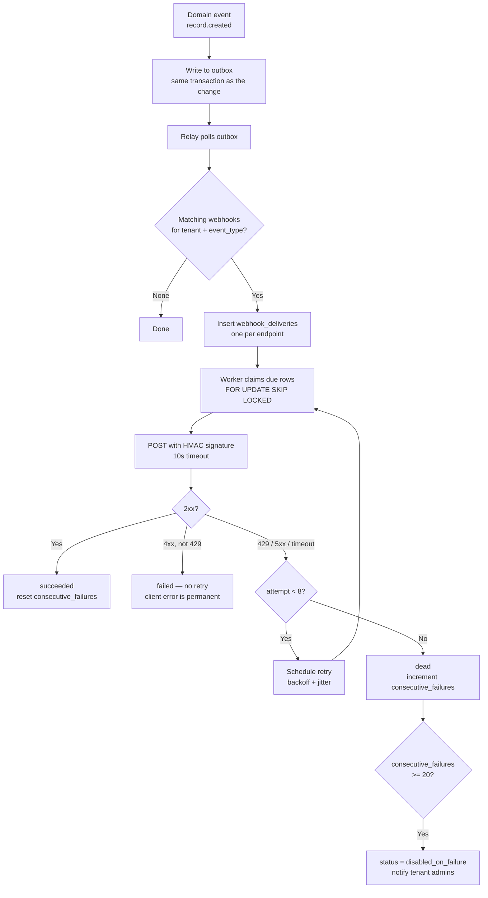

# 04 — Third-Party Integration & Webhook Flows

**Phase 2.1 deliverable** · Sources: `API_ARCHITECTURE.md`, `database/04_AUDIT_COMPLIANCE_ERD.md`, `database/05_FILE_DOCUMENT_ERD.md`
**Status:** Draft for review

Covers outbound webhook delivery and retry, payload signing, the event catalogue, outbound OAuth
to external services, integration health monitoring, and SDK architecture.

`API_ARCHITECTURE.md` defines `/webhooks` CRUD endpoints and an Integration Service, but no data
model exists anywhere in Phase 1. The tables below fill that gap.

---

## The compliance constraint: webhook payloads carry no PHI

A webhook is an unauthenticated outbound HTTP POST to a URL a tenant typed into a form. It
crosses the platform boundary, is retried, is logged by intermediaries, and frequently terminates
at a third-party automation tool the tenant has not assessed.

Sending patient data through that path defeats every control in
`database/04_AUDIT_COMPLIANCE_ERD.md`: the receiving system is outside the audit trail, outside
the retention policy, and — unless the tenant has a BAA with the recipient — outside HIPAA
compliance entirely.

**Webhook payloads carry identifiers and metadata only.** The receiver authenticates back to the
API to fetch content, at which point access is authorized, scoped, and audited normally.

```json
{
  "id": "evt_01J8XK4M2P",
  "type": "record.created",
  "created_at": "2026-09-01T10:15:30Z",
  "tenant_id": "…",
  "data": {
    "record_id": "6f1c…",
    "record_type": "patient",
    "version": 1,
    "url": "https://api.allguds.com/v1/records/6f1c…"
  }
}
```

Not the patient's name, not the form data, not the file contents. For record types where
`record_type_definitions.is_phi` is true this is enforced, not advisory: the serializer emits ids
only and there is no tenant setting to override it. For non-PHI types a tenant may opt into
richer payloads, defaulting off.

---

## Data model

```sql
CREATE TYPE webhook_status   AS ENUM ('active', 'paused', 'disabled_on_failure', 'revoked');
CREATE TYPE delivery_status  AS ENUM ('pending', 'delivering', 'succeeded', 'failed', 'dead');

CREATE TABLE webhooks (
    webhook_id            UUID PRIMARY KEY DEFAULT gen_random_uuid(),
    tenant_id             UUID NOT NULL REFERENCES tenants(tenant_id) ON DELETE CASCADE,
    name                  VARCHAR(150) NOT NULL,
    url                   TEXT NOT NULL,
    event_types           TEXT[] NOT NULL,          -- ['record.created','file.uploaded']

    signing_secret_hash   VARCHAR(64) NOT NULL,     -- shown once at creation
    secret_rotated_at     TIMESTAMP WITH TIME ZONE,
    previous_secret_hash  VARCHAR(64),              -- valid during the rotation overlap

    status                webhook_status NOT NULL DEFAULT 'active',
    consecutive_failures  INTEGER NOT NULL DEFAULT 0,
    last_success_at       TIMESTAMP WITH TIME ZONE,
    last_failure_at       TIMESTAMP WITH TIME ZONE,
    last_failure_reason   TEXT,

    include_payload       BOOLEAN NOT NULL DEFAULT FALSE,   -- ignored for PHI types
    created_by            UUID REFERENCES tenant_users(user_id),
    created_at            TIMESTAMP WITH TIME ZONE NOT NULL DEFAULT NOW(),

    CHECK (url LIKE 'https://%'),
    CHECK (array_length(event_types, 1) > 0)
);

CREATE TABLE webhook_deliveries (
    delivery_id      UUID PRIMARY KEY DEFAULT gen_random_uuid(),
    tenant_id        UUID NOT NULL REFERENCES tenants(tenant_id) ON DELETE CASCADE,
    webhook_id       UUID NOT NULL REFERENCES webhooks(webhook_id) ON DELETE CASCADE,

    event_id         VARCHAR(40) NOT NULL,          -- stable across retries
    event_type       VARCHAR(100) NOT NULL,
    payload          JSONB NOT NULL,                -- ids and metadata only

    status           delivery_status NOT NULL DEFAULT 'pending',
    attempt          INTEGER NOT NULL DEFAULT 0,
    next_attempt_at  TIMESTAMP WITH TIME ZONE,

    response_status  INTEGER,
    response_headers JSONB,
    response_body    TEXT,                          -- truncated to 2 KB
    duration_ms      INTEGER,
    error            TEXT,

    created_at       TIMESTAMP WITH TIME ZONE NOT NULL DEFAULT NOW(),
    completed_at     TIMESTAMP WITH TIME ZONE,

    UNIQUE (webhook_id, event_id)
);

CREATE INDEX idx_deliveries_due ON webhook_deliveries(next_attempt_at)
    WHERE status IN ('pending', 'failed');
CREATE INDEX idx_deliveries_webhook ON webhook_deliveries(webhook_id, created_at DESC);

ALTER TABLE webhooks           ENABLE ROW LEVEL SECURITY;
ALTER TABLE webhooks           FORCE  ROW LEVEL SECURITY;
ALTER TABLE webhook_deliveries ENABLE ROW LEVEL SECURITY;
ALTER TABLE webhook_deliveries FORCE  ROW LEVEL SECURITY;
CREATE POLICY tenant_isolation ON webhooks FOR ALL TO app_user
    USING (tenant_id = current_setting('app.current_tenant_id')::UUID);
CREATE POLICY tenant_isolation ON webhook_deliveries FOR ALL TO app_user
    USING (tenant_id = current_setting('app.current_tenant_id')::UUID);
```

`UNIQUE (webhook_id, event_id)` is what makes delivery idempotent from the platform's side: a
retry updates the existing row rather than creating a second delivery of the same event.

`idx_deliveries_due` is the queue index and is deliberately cross-tenant — the delivery worker
runs as the platform role and sweeps every tenant's due deliveries in one pass.

---

## Delivery



**The outbox pattern is not optional.** The event row is written in the *same transaction* as the
change that produced it. Emitting from application code after commit means a crash between the
two loses the event silently; emitting before commit means a rolled-back transaction fires a
webhook for something that never happened. Both are unacceptable when the receiver is a billing
or clinical system.

`FOR UPDATE SKIP LOCKED` lets multiple workers drain the queue without coordination — the same
pattern used for backfills in `database/07_DATA_MIGRATION_WORKFLOWS.md`.

### Retry schedule

| Attempt | Delay | Cumulative |
|---|---|---|
| 1 | immediate | 0 |
| 2 | 10 s | 10 s |
| 3 | 1 min | ~1 min |
| 4 | 5 min | ~6 min |
| 5 | 30 min | ~36 min |
| 6 | 2 h | ~2.6 h |
| 7 | 6 h | ~8.6 h |
| 8 | 12 h | ~21 h |

Roughly a day of retries, then dead. Each delay carries ±20% jitter: without it, a receiver that
comes back after an outage is hit by every pending delivery from every tenant simultaneously —
the retry storm becomes the second outage.

`4xx` other than `429` is **not** retried. A 400 or 404 means the receiver rejected the request
and will reject it identically eight more times; retrying wastes a day before surfacing a
misconfiguration the tenant could have fixed immediately.

### Ordering and duplicates

Delivery is **at-least-once and unordered**. Receivers must be idempotent on `event.id` and must
not assume `record.updated` arrives after `record.created`. Both properties are consequences of
parallel workers and independent retry schedules, and pretending otherwise would require a
per-endpoint serial queue — which converts one slow receiver into an unbounded backlog.

This is stated prominently in the integration guide, because it is the assumption integrators
most often get wrong.

---

## Signing

```http
POST /hooks/allguds HTTP/1.1
Content-Type: application/json
Webhook-Id: evt_01J8XK4M2P
Webhook-Timestamp: 1756721730
Webhook-Signature: v1,3XvKmQ8...=
```

Signature base is `{id}.{timestamp}.{raw_body}`, HMAC-SHA256 with the endpoint's signing secret,
base64-encoded. Receivers must:

1. Reject if `|now − timestamp| > 5 minutes` — bounds replay.
2. Compare in **constant time**; a `==` on the signature is a timing oracle.
3. Verify against the **raw body**, before JSON parsing. Re-serializing changes whitespace and
   key order, and the signature will not match.

The timestamp is inside the signed material, so it cannot be altered to extend the replay window.

`Webhook-Signature` may carry several comma-separated signatures during secret rotation
(`v1,<new> v1,<old>`), letting a receiver update its secret without a coordinated cutover —
the same overlap principle as API key rotation in doc 01. `previous_secret_hash` is cleared 24
hours after `secret_rotated_at`.

### Egress safety

A tenant-supplied URL is an SSRF vector: `http://169.254.169.254/…` reaches the instance metadata
service, and `http://10.0.0.5/` reaches internal services. Before any delivery:

- HTTPS only (enforced by the `CHECK` constraint, re-validated at request time after redirects).
- Resolve the hostname and **reject private, loopback, link-local and metadata ranges** — checked
  against the resolved IP, not the hostname, to defeat DNS rebinding.
- Do not follow redirects. A 30x is a failed delivery.
- Cap the response body read at 2 KB; a receiver streaming gigabytes back should not exhaust the
  worker.
- Deliver from a worker subnet with no access to internal services.

---

## Event catalogue

| Event | Fires when | Payload ids |
|---|---|---|
| `record.created` | A record is inserted | `record_id`, `record_type`, `version` |
| `record.updated` | A record changes | `record_id`, `version`, `changed_fields` |
| `record.deleted` | Soft-deleted | `record_id`, `record_type` |
| `record.state_changed` | Workflow transition | `record_id`, `from_state`, `to_state` |
| `record.linked` | Link created | `from_record_id`, `to_record_id`, `link_type` |
| `file.uploaded` | Scan clean, file available | `file_id`, `record_id`, `mime_type`, `file_size` |
| `file.scan_failed` | Threat detected | `file_id`, `scan_status` |
| `user.invited` | Invitation issued | `invitation_id`, `email` |
| `user.activated` | Invitation accepted | `user_id` |
| `user.deactivated` | Access removed | `user_id` |
| `import.completed` | Import job finished | `import_job_id`, counts |
| `subscription.updated` | Plan or status change | `subscription_id`, `status`, `plan_code` |
| `invoice.payment_failed` | Payment failed | `invoice_id`, `amount_due_cents` |

`changed_fields` on `record.updated` is a field-name list — never before/after values, which
would put PHI in the payload through the back door.

`file.uploaded` fires only after `scan_status = 'clean'`. Announcing a file that is still being
scanned invites a receiver to fetch something the platform is about to quarantine.

---

## Outbound integrations

Inbound webhooks are one direction; the Integration Service also calls *out* to services the
tenant has authorized (calendars, e-signature, accounting).

```sql
CREATE TABLE integration_connections (
    connection_id           UUID PRIMARY KEY DEFAULT gen_random_uuid(),
    tenant_id               UUID NOT NULL REFERENCES tenants(tenant_id) ON DELETE CASCADE,
    provider                VARCHAR(50) NOT NULL,       -- 'google_calendar', 'docusign'
    external_account_id     VARCHAR(255),
    access_token_encrypted  TEXT NOT NULL,
    refresh_token_encrypted TEXT,
    token_expires_at        TIMESTAMP WITH TIME ZONE,
    scopes                  TEXT[] NOT NULL,
    connected_by            UUID REFERENCES tenant_users(user_id),
    status                  VARCHAR(20) NOT NULL DEFAULT 'active',
    last_error              TEXT,
    last_used_at            TIMESTAMP WITH TIME ZONE,
    created_at              TIMESTAMP WITH TIME ZONE NOT NULL DEFAULT NOW(),

    UNIQUE (tenant_id, provider, external_account_id)
);
```

Tokens are envelope-encrypted with the same KMS key as `files.encryption_key_id`, and are added
to `mask_sensitive()` in `database/04_AUDIT_COMPLIANCE_ERD.md` so they never reach the audit log
in plaintext. Refresh happens ahead of `token_expires_at` on a schedule, not lazily on the
request path — a token refresh inside a user request adds an unpredictable external round trip to
an interactive call.

Every outbound call goes through the circuit breaker in doc 03, keyed per provider **and** per
tenant.

---

## Health monitoring

| Signal | Source | Threshold |
|---|---|---|
| Consecutive failures | `webhooks.consecutive_failures` | Warn at 5, auto-disable at 20 |
| Delivery success rate | `webhook_deliveries` over 24 h | Warn below 95% |
| p95 delivery latency | `duration_ms` | Warn above 5 s |
| Queue depth | Rows due but unclaimed | Warn above 10,000 |
| Oldest pending delivery | `min(next_attempt_at)` | Alert above 1 h |
| Dead deliveries | `status = 'dead'` per day | Alert on any |

Auto-disable at 20 consecutive failures stops the platform spending worker capacity on an
endpoint that has been gone for a day. It emails tenant admins, sets
`status = 'disabled_on_failure'`, and requires an explicit re-enable — which is deliberately
manual, since silently resuming after a tenant decommissioned a system produces surprising
traffic.

Tenants see their own delivery history and can replay:

```
GET  /v1/webhooks/{id}/deliveries
POST /v1/webhooks/{id}/deliveries/{delivery_id}/retry
POST /v1/webhooks/{id}/test
```

Delivery rows are retained 30 days, then purged by a `retention_policies` row.

---

## SDK architecture

One generated core per language from `openapi.yaml` (doc 05), plus a thin hand-written layer for
what a spec cannot express:

| Layer | Contents |
|---|---|
| Generated | Models, endpoint methods, serialization |
| Hand-written | Auth and token refresh, cursor auto-pagination, retry with backoff, idempotency keys, webhook signature verification helper |

Targets: TypeScript (browser and Node), Python, and — because the platform ships one — a mobile
client wrapper.

The hand-written layer is where correctness lives. `verifyWebhook(rawBody, headers, secret)`
exists specifically so integrators do not implement constant-time comparison themselves, which
is the step most often got wrong.

SDK retry must respect `Retry-After` and never retry a non-idempotent POST that lacks an
`Idempotency-Key` — a blind retry of an un-keyed create is how duplicates get made.

---

## Additions and corrections to `API_ARCHITECTURE.md`

| # | Severity | Issue | Resolution |
|---|---|---|---|
| 1 | **High** | Webhook endpoints exist with no data model at all | `webhooks`, `webhook_deliveries`, `integration_connections` |
| 2 | **High** | No guidance on payload contents; the obvious implementation ships PHI to arbitrary URLs | Ids and metadata only; enforced for PHI types |
| 3 | **High** | Tenant-supplied URLs with no egress restriction are an SSRF path to instance metadata | HTTPS only, resolved-IP allowlist, no redirects |
| 4 | **High** | Nothing specifies how events are emitted; the natural implementation drops events on crash | Transactional outbox |
| 5 | Medium | No signing scheme specified | HMAC-SHA256 over `{id}.{timestamp}.{body}`, 5-minute replay window |
| 6 | Medium | No retry policy, so a receiver outage means silent data loss | 8 attempts with jitter over ~21 h, then dead |
| 7 | Medium | Nothing disables a permanently failing endpoint | Auto-disable at 20 consecutive failures |
| 8 | Low | Delivery ordering and duplication guarantees unstated, so integrators assume both | Documented as at-least-once and unordered |

---

## Open questions

1. **Webhook secret display.** Shown once at creation, like API keys. Tenants will lose them and
   ask for retrieval; the answer is rotation, and the UI should make that obvious rather than
   making it feel like a failure.
2. **Per-tenant delivery concurrency.** One tenant generating a bulk import's worth of events can
   monopolise the worker pool. A per-tenant concurrency cap is probably needed; the value is a
   guess until real traffic exists.
3. **Event replay window.** Delivery rows are retained 30 days, so replay is bounded by that. If
   integrators need to rebuild state from further back, that is an export, not a replay.
4. **PHI opt-in.** Enforced ids-only for PHI types with no override. A tenant with a signed BAA
   and a genuine need may push back; if so it must be a contract-gated per-endpoint flag with
   explicit acceptance recorded, not a checkbox.
5. **Marketplace direction.** `NEXT_STAGE_NOTES.md` Phase 8 anticipates third-party apps.
   `integration_connections` covers platform-built integrations only; a marketplace needs
   per-app OAuth clients and consent, which is a larger build.
