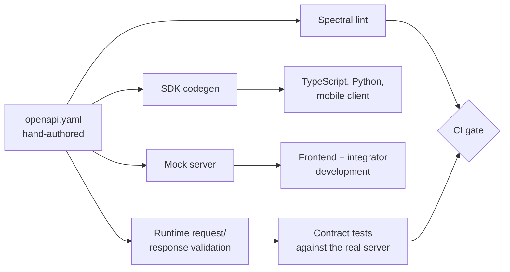

# 05 — OpenAPI Specification

**Phase 2.1 deliverable** · Companion to [`openapi.yaml`](openapi.yaml)
**Status:** Draft for review

Covers how the specification is authored and maintained, per-tenant alias generation, code
generation, linting, contract testing, and the mock server.

The spec file itself is the deliverable; this document explains the conventions it encodes and
the tooling that keeps it honest.

---

## What is in the spec today

[`openapi.yaml`](openapi.yaml) — OpenAPI 3.1.0, 13 paths, 17 schemas, all `$ref`s resolving:

| Area | Paths |
|---|---|
| Authentication | `/auth/login`, `/auth/refresh`, `/auth/logout` |
| Records | `/records`, `/records/{id}`, `/records/{id}/links`, `/records/{id}/advance` |
| Files | `/files`, `/files/{id}/download` |
| Sync | `/sync/pull`, `/sync/push` |
| Webhooks | `/webhooks` |
| Administration | `/audit-logs` |

This is the representative surface, not the complete one — enough to pin every cross-cutting
convention (envelope, pagination, concurrency, idempotency, error shape) so that the remaining
endpoints from doc 02 are mechanical to add. The endpoints deliberately included are the ones
that establish a rule: `/records/{id}` for `If-Match`, `/sync/push` for per-item results,
`/files/{id}/download` for the scan gate, `/audit-logs` for the self-auditing read.

Still to add: `/forms`, `/workflows`, `/users`, `/tenant/*`, `/api-keys`, `/imports`,
`/search/advanced`, the remaining file and upload routes, and the rest of the auth endpoints.

---

## Spec-first, not generated from code

The spec is hand-authored and is the source of truth; the server is validated against it. The
alternative — generating the spec from decorators in the implementation — makes the document
describe whatever the code currently does, including its accidents, and removes the ability to
review an interface change before it exists.

Runtime validation is what closes the loop. The API validates incoming requests and — in
non-production environments — outgoing responses against the spec, so drift fails a test rather
than reaching an SDK consumer. Response validation stays off in production: the cost is real and
the failure mode (rejecting a valid response because the spec lags) is worse than the drift.

## Conventions the spec encodes

| Convention | Where it shows up |
|---|---|
| Every success wraps in `Envelope` (`success`, `data`, `meta`) | `allOf` composition on each 2xx |
| Every error wraps in `ErrorEnvelope` | Shared `responses/*` components |
| Cursor pagination only | `parameters/Cursor`; no offset parameter exists anywhere |
| `If-Match` required on record mutations | `parameters/IfMatch` with `required: true`, plus a `428` response |
| `Idempotency-Key` required on creates | `parameters/IdempotencyKey` |
| Cross-tenant resources are invisible | `responses/NotFound` documents the 404-not-403 rule |
| Errors branch on `code`, never `message` | Documented on `Error.code` |
| Unknown fields and enum values must be ignored | Stated in `info.description` |

The last one is the most consequential and the least enforceable: it is what makes additive
changes non-breaking. It belongs in `info.description`, in the SDK contract, and in the
integration guide, because a client that hard-fails on an unrecognised enum turns every product
change into a coordinated release.

---

## Per-tenant projected aliases

Doc 02 exposes generated aliases (`/patients`, `/appointments`) alongside canonical `/records`.
Those cannot live in the shared spec — they differ per tenant, since they derive from
`record_type_definitions`.

Two documents are published:

| Document | Contents | Audience |
|---|---|---|
| `openapi.yaml` | Canonical routes only | Public docs, SDK generation, contract tests |
| `GET /v1/openapi.json` | Canonical routes **plus** this tenant's aliases | The tenant's own developers |

The tenant document is generated at request time from the shared spec plus the registry: for each
active record type, clone the `/records` operations, fix `type`, name the path from
`plural_name`, and narrow `Record.data` to that type's `form_versions.schema` — which turns a
generic `additionalProperties: true` blob into a real, checkable schema for that tenant's patient
record. That is the actual payoff of the hybrid model at the API layer.

The generated document is cached and invalidated when the registry or a form version changes.
SDKs are generated from the **canonical** spec only: an SDK built from one tenant's projection
would not compile against another's.

---

## Linting

Spectral, run in CI on every change to the spec, with the OpenAPI ruleset plus project rules:

| Rule | Rationale |
|---|---|
| Every operation has `operationId` | It becomes the SDK method name; auto-generated ones are unusable |
| Every operation has `tags` | Drives documentation grouping |
| Every operation documents 401, 403, 429 | Omitted error responses are the most common spec gap |
| Every 2xx on a collection has a `Page` | Catches an endpoint that forgot pagination |
| No `type: object` without `properties` or `additionalProperties` | Catches an unspecified payload |
| No inline schemas over 5 properties | Forces reuse through `components` |
| Path segments are `kebab-case`; properties are `snake_case` | Consistency, mechanically checked |
| No `example` containing a plausible identifier | Stops example PHI drifting into public docs |

The last rule matters more than it looks: examples get copied into documentation sites and
support tickets, and an example patient with a realistic name and MRN is the kind of thing that
ends up in a search index.

CI fails on any error-level finding. The spec is also diffed against the previous release with
`oasdiff`; a breaking change without a major version bump fails the build rather than relying on
a reviewer noticing.

---

## Code generation

| Target | Generator | Output |
|---|---|---|
| TypeScript | `openapi-typescript` + `openapi-fetch` | Types and a typed client |
| Python | `openapi-python-client` | Dataclasses and a sync/async client |
| Mobile | `openapi-typescript` | Shares the web types |
| Docs | Redoc / Scalar | Static reference site |
| Postman | `openapi-to-postmanv2` | Importable collection |

Generated code is committed, not built at install time, so SDK diffs are reviewable — a codegen
upgrade that quietly renames a method is otherwise invisible until it breaks a consumer.

What generators cannot express, and therefore lives in the hand-written SDK layer (doc 04): token
refresh, cursor auto-pagination, retry honouring `Retry-After`, idempotency key generation, and
webhook signature verification.

---

## Mock server and contract testing

Prism serves `openapi.yaml` as a mock, so frontend and integrator work starts before the endpoint
exists. Mock responses come from the `examples` in the spec, which gives examples a second job —
they are exercised, so they cannot rot unnoticed.

Contract tests run the real server against the spec:

1. Boot the API against a seeded test database.
2. For each operation, issue a request built from the spec's own examples.
3. Assert the response validates against the declared schema **and** the declared status code.
4. Assert documented error paths actually produce the documented `code`.

Step 4 is the one usually skipped and the one that catches the most drift: error responses are
rarely covered by ordinary tests, and an endpoint that returns `INVALID_TOKEN` where the spec
promises `TOKEN_EXPIRED` breaks every client's refresh logic while all the happy-path tests stay
green.

---

## Publishing

`https://docs.allguds.com/api` is rebuilt from the spec on merge to `main`. Each major version
stays published for the full deprecation window from doc 02 — a sunset endpoint that vanishes
from the docs before it vanishes from the API leaves integrators debugging blind.

The spec is served at `https://api.allguds.com/v1/openapi.yaml` unauthenticated (it describes the
interface, not data), while `GET /v1/openapi.json` — the tenant projection — requires
authentication, since the set of installed record types is tenant information.

---

## Open questions

1. **Completing the surface.** Roughly 25 endpoints from doc 02 are not yet in the spec. They are
   mechanical, but "mechanical" work still needs an owner and a definition of done, or the spec
   drifts from the day the first unlisted endpoint ships.
2. **`Record.data` in the canonical spec.** Currently `additionalProperties: true`, because the
   shape is per type and per tenant. Correct for the shared document; it does mean generated
   SDKs give no type safety on the most important field. The tenant projection solves this only
   for hand-written clients.
3. **Webhook payloads in the spec.** OpenAPI 3.1 `webhooks` can describe outbound events. Adding
   the doc 04 catalogue there would let receivers generate typed handlers — worth doing, not yet
   done.
4. **Versioning the spec file itself.** `info.version` currently tracks the API version. If it
   tracks the document revision instead, consumers can tell a docs fix from an API change. Pick
   one convention before the first external consumer depends on it.
5. **Response validation in production.** Off by default here. If it is ever wanted as a
   safety net, it needs sampling rather than every response, and a decision about whether a
   validation failure degrades the response or merely alerts.
