# 06 — Middleware Architecture

**Phase 2.1 deliverable** · Sources: `API_ARCHITECTURE.md`, `database/04_AUDIT_COMPLIANCE_ERD.md`, `database/08_SCALING_ARCHITECTURE.md`
**Status:** Draft for review

Covers the request pipeline and its ordering constraints, transaction and tenant-context
handling, PHI access logging, security middleware, response caching, error handling, and
profiling.

`API_ARCHITECTURE.md:96-125` sketches a six-stage gateway pipeline. This document specifies the
full stack, in order, with the constraints that make the order non-negotiable — several of the
platform's compliance and isolation guarantees are properties of *where* a middleware sits, not
of what it does.

---

## The stack

```mermaid
flowchart TD
    A[Request] --> B["1. Request context<br/>request_id, trace span, timers"]
    B --> C["2. Security headers<br/>helmet, HSTS, CSP"]
    C --> D["3. CORS"]
    D --> E["4. Body limits<br/>+ content-type check"]
    E --> F["5. IP rate limit<br/>pre-auth, cheap"]
    F --> G["6. Authentication<br/>JWT or API key -> claims"]
    G --> H["7. Session check<br/>sessions.revoked_at, Redis-cached"]
    H --> I["8. Tenant binding<br/>claims.tenant_id is authoritative;<br/>reject header mismatch"]
    I --> J["9. Tenant/user rate limit<br/>needs the resolved plan"]
    J --> K["10. Authorization<br/>permission from route metadata"]
    K --> L["11. Request validation<br/>against OpenAPI schema"]
    L --> M["12. Idempotency<br/>replay check"]
    M --> N["13. Transaction + SET LOCAL<br/>tenant and user GUCs"]
    N --> O["Route handler"]
    O --> P["14. PHI access log<br/>on the way out"]
    P --> Q["15. Response cache write"]
    Q --> R["16. Envelope + rate-limit headers"]
    R --> S["17. Error handler<br/>outermost, catches everything"]
    S --> T[Response]
```



### Why the order is what it is

| Constraint | Reason |
|---|---|
| Request context is first | Everything downstream logs `request_id`; a failure before it exists is untraceable |
| Body limits before authentication | Otherwise a 5 GB unauthenticated body is buffered before being rejected |
| IP rate limit before authentication | Auth does password hashing and database work; unauthenticated floods must be cheap to refuse |
| Session check after authentication | Needs `session_id` from the verified claims |
| Tenant binding after authentication | **The security property from doc 01** — deriving tenancy from an untrusted header before verifying the token is the cross-tenant read |
| Tenant rate limit after tenant binding | Limits come from `plans.limits`, which needs the tenant |
| Authorization after tenant binding | Permissions are tenant-scoped |
| Validation after authorization | Detailed validation errors on a resource you cannot access leak its shape |
| Idempotency after validation | An invalid request should not burn a key |
| Transaction last, immediately around the handler | Held open for the minimum time; see below |
| PHI logging after the handler | Only successful reads are access events |
| Error handler outermost | It must catch failures from every layer, including the ones above it |

`API_ARCHITECTURE.md` places tenant resolution at stage 2 and auth at stage 3. That inversion is
correction 1 of doc 01 and the single most important ordering change here.

---

## Transaction and tenant context

This is where `database/08_SCALING_ARCHITECTURE.md` lands in the request path, and getting it
wrong is a cross-tenant data leak rather than a bug.

With PgBouncer in transaction pooling mode, a **session**-scoped `SET app.current_tenant_id`
persists on the pooled connection after the request finishes and is inherited by whichever tenant
gets that connection next. The context must be transaction-scoped:

```ts
// The ONLY place tenant context is established. No handler sets it, and no handler
// touches the database outside this wrapper.
export async function withTenantContext<T>(
  ctx: RequestContext,
  fn: (tx: TransactionClient) => Promise<T>,
): Promise<T> {
  return prisma.$transaction(async (tx) => {
    await tx.$executeRaw`SELECT set_config('app.current_tenant_id', ${ctx.tenantId}, true)`;
    await tx.$executeRaw`SELECT set_config('app.current_user_id',   ${ctx.userId ?? ''}, true)`;
    return fn(tx);
  }, { timeout: 15_000, maxWait: 5_000 });
}
```

`set_config(..., true)` is the function form of `SET LOCAL` — transaction-scoped, discarded at
commit or rollback. Parameterisation also avoids interpolating a tenant id into SQL text.

Three rules that make this hold:

- **No database access outside this wrapper.** A single query that bypasses it runs with whatever
  context the pooled connection happened to carry. This should be enforced by lint rule or by
  keeping the raw client private to this module — not by convention.
- **The transaction covers the handler, not the whole request.** Wrapping the entire pipeline
  would hold a connection open across authentication, validation and external calls, exhausting
  the pool at a fraction of the intended concurrency.
- **No external calls inside it.** An outbound HTTP request inside an open transaction pins a
  connection to the latency of a third party. Events go to the outbox (doc 04); delivery happens
  after commit.

`userId` is empty for API-key requests, which is why the audit trigger's actor resolution uses
`NULLIF(current_setting(..., TRUE), '')` in `database/04_AUDIT_COMPLIANCE_ERD.md` — the two
decisions have to agree or every key-authenticated write fails.

### Read replica routing

Read-only routes may target a replica, but not blindly. Per doc 08, `/sync/pull` must read the
primary, and any tenant that has written recently must read the primary for a lag budget
afterwards. The middleware picks the target from route metadata plus a per-tenant
"recently written" marker in Redis; the same `withTenantContext` wrapper applies either way,
since replicas enforce RLS identically.

---

## PHI access logging

`database/04_AUDIT_COMPLIANCE_ERD.md` establishes that HIPAA requires logging *reads* of PHI, and
that a database trigger cannot observe a `SELECT`. That makes read logging an API-layer
obligation, and this middleware is where it is discharged.

```ts
// After the handler, for successful responses only.
if (res.statusCode < 400 && route.resourceType) {
  const isPhi = await recordTypeIsPhi(ctx.tenantId, resolvedRecordType);
  if (isPhi || route.alwaysAudit) {
    await writeUserAuditLog({
      tenantId: ctx.tenantId,
      userId: ctx.userId,
      sessionId: ctx.sessionId,
      action: methodToAction(req.method),   // view | create | update | delete | export
      resourceType: route.resourceType,
      resourceId: resolvedResourceId,
      isPhiAccess: isPhi,
      ipAddress: ctx.ip,
      userAgent: ctx.userAgent,
    });
  }
}
```

Four details that decide whether this is actually compliant:

**Log after success, not before.** A 403 is not an access. Logging attempts too is useful, but as
a separate `access_denied` action — conflating the two makes the PHI access report wrong.

**Log list reads, not just single-record reads.** `GET /records?type=patient` returning 50
patients is 50 PHI accesses. Recording it as one event with a result count and the query, rather
than 50 rows, is the practical compromise — but it must be recorded.

**Log exports and downloads.** `GET /files/{id}/download` and any report generation are the
highest-value events in the whole log; they are also the easiest to miss, because the response
is a redirect rather than data.

**Never block the response on the audit write, but never drop it either.** Writing synchronously
adds a round trip to every PHI read; writing fire-and-forget loses events on crash. The audit row
goes to a bounded in-process queue drained by a background writer, and — per doc 04 — **if that
queue is saturated or the writer is failing, the API stops accepting requests**. An audit trail
that silently degrades under load is worse than none, because it looks complete.

---

## Security middleware

| Middleware | Configuration | Note |
|---|---|---|
| Security headers | HSTS `max-age=31536000; includeSubDomains; preload`, `X-Content-Type-Options: nosniff`, `X-Frame-Options: DENY`, `Referrer-Policy: no-referrer` | CSP is set by the web app, not the API |
| CORS | Allowlist of `*.allguds.com` plus tenant custom domains from `tenant_domains` | Never `*` with credentials; the browser refuses it and the intent is wrong anyway |
| Body limits | 1 MB JSON, 10 MB multipart direct upload | Chunked uploads bypass via their own route |
| Content-type | Reject a body whose declared type the route does not accept | Blocks a class of parser confusion |
| Input handling | Parameterised queries throughout; **no** HTML sanitisation of stored values | See below |

`API_ARCHITECTURE.md:117-123` lists "XSS prevention — input sanitization" at the gateway.
Sanitising on input is the wrong layer: it corrupts legitimate data (a clinical note containing
`<` is not an attack), and it does not protect a consumer that renders the value in a different
context. **Escape on output, in the context that renders it.** The API's obligation is to store
what it was given, return correct `Content-Type` headers, and never interpolate user input into
SQL or shell commands.

SQL injection is prevented structurally by Prisma's parameterisation, not by pattern-matching
input for keywords — a filter that rejects `DROP` also rejects a patient named O'Drop.

---

## Response caching

| Layer | What it may hold | TTL |
|---|---|---|
| CDN | Public, unauthenticated assets only | Long |
| Redis | Tenant config, resolved permissions, record type registry, plan limits | 5 min |
| In-process | Route metadata, compiled schemas | Process lifetime |

**Nothing tenant-scoped is ever cached at the CDN.** Every authenticated response carries:

```http
Cache-Control: private, no-store
Vary: Authorization
```

`no-store` rather than `no-cache` for PHI-bearing responses: `no-cache` still permits storage,
and a shared corporate proxy retaining patient data on disk is a breach regardless of whether it
revalidates.

Redis cache keys are **always prefixed with the tenant id**. A cache key built from a record id
alone is a cross-tenant leak that RLS cannot see, because the read never reaches the database.
This is the same class of failure as the pooling issue, one layer up, and it needs the same
discipline: a single cache wrapper that takes the tenant from the request context and no way to
call the raw client.

Invalidation is by publish on change — a tenant config `PATCH` publishes to a channel every task
subscribes to. TTL alone means a config change takes up to five minutes to appear, which users
read as the save having failed.

---

## Error handling

The outermost middleware. Its job is to turn anything thrown into the doc 02 error contract
without leaking internals.

```ts
app.use((err, req, res, _next) => {
  const requestId = req.ctx.requestId;

  if (err instanceof ApiError) {
    // Deliberate, user-facing. Safe to describe.
    return res.status(err.status).json(envelope(err.code, err.message, err.details, requestId));
  }

  if (isPrismaKnownError(err)) {
    // Map the ones with a sensible public meaning; never pass through the driver's message.
    const mapped = mapPrismaError(err);          // unique violation -> 409 RESOURCE_ALREADY_EXISTS
    if (mapped) return res.status(mapped.status).json(envelope(mapped.code, mapped.message, undefined, requestId));
  }

  // Everything else is opaque outside.
  logger.error({ err, requestId, route: req.route?.path, tenantId: req.ctx?.tenantId });
  writeSystemAuditLog({ severity: 'error', category: 'system', correlationId: requestId, message: err.message });
  return res.status(500).json(envelope('INTERNAL_ERROR',
    'An unexpected error occurred. Quote the request_id when contacting support.', undefined, requestId));
});
```

This implements correction 3 of doc 02. The distinction that matters is between errors the API
*chose* to raise — safe and useful to describe — and errors that escaped, which are described
only by a `request_id` the client can quote and support can look up in `system_audit_log`.

Prisma errors need explicit mapping rather than pass-through: their messages contain table and
column names, which describe the schema to anyone who can trigger one.

---

## Observability

Every request opens an OpenTelemetry span (`ENHANCEMENT_OPPORTUNITIES.md:177`) carrying
`request_id`, `tenant_id`, route, and outcome — never `user_id` as a searchable attribute, and
never request bodies, which for this platform contain PHI.

Child spans: authentication, authorization, database transaction, each external call, cache
lookup. The database span records statement count, which is how N+1 queries against
`record_links` (`database/06_INDEXING_STRATEGY.md`) become visible before they become a
production incident.

`request_id` propagates as `X-Request-Id` (echoed to the client, quoted in support tickets) and
as `traceparent` to downstream services. It is the correlation key across the API log, the APM
trace, `system_audit_log`, and webhook delivery rows — one identifier through the whole system.

Sampling: 100% of errors and slow requests, 100% of PHI-access routes, 5% of the rest.

---

## Additions and corrections to `API_ARCHITECTURE.md`

| # | Severity | Issue | Resolution |
|---|---|---|---|
| 1 | **Critical** | Tenant resolution precedes auth validation in the documented pipeline | Reordered; tenant binding derives from verified claims only |
| 2 | **Critical** | No specification of how tenant context reaches the database; the natural implementation leaks across pooled connections | `withTenantContext` with `set_config(..., true)`, single entry point |
| 3 | **High** | No PHI read logging in the pipeline, though HIPAA requires it and no trigger can supply it | Post-handler audit middleware, fail-closed on writer failure |
| 4 | **High** | "Input sanitization" at the gateway corrupts clinical data and does not prevent XSS | Escape on output; parameterised queries for injection |
| 5 | Medium | No cache-key tenant scoping specified; a record-id key leaks across tenants without RLS seeing it | Tenant-prefixed keys behind a single wrapper |
| 6 | Medium | API caching at the CDN listed for "API responses" with no exclusion for tenant data | `private, no-store` on all authenticated responses |
| 7 | Medium | Body size limits after authentication would buffer large unauthenticated payloads | Moved before auth |
| 8 | Low | No request-id propagation specified, so audit rows, traces and support tickets cannot be correlated | `X-Request-Id` + `traceparent` throughout |

---

## Open questions

1. **Enforcing the database wrapper.** `withTenantContext` is only a guarantee if nothing can
   bypass it. An ESLint rule banning direct client imports outside the module is the cheap
   version; a stricter option is a Prisma client extension that throws when the GUC is unset.
   Recommend both, and a test that runs two tenants through one pooled connection.
2. **Audit queue depth and backpressure.** "Stop accepting requests when the audit writer fails"
   is the right default and needs a concrete threshold — queue depth, failure duration, or both —
   agreed with whoever owns the compliance position.
3. **List-read audit granularity.** One row per list read with a result count is proposed. If an
   auditor requires per-record granularity, volume rises by orders of magnitude and the
   partitioning in doc 04 becomes load-bearing much sooner.
4. **Session-check failure mode.** Doc 01 leaves open whether a Redis outage fails the session
   check open or closed. The same answer must apply here and in doc 03's rate limiter, or the two
   middlewares disagree about whether the platform is up.
5. **Trace sampling and PHI.** 5% baseline sampling assumes spans carry no PHI. That holds only
   while nobody adds a request body to a span for debugging — worth a lint rule or a span
   processor that strips unexpected attributes rather than trusting review.
