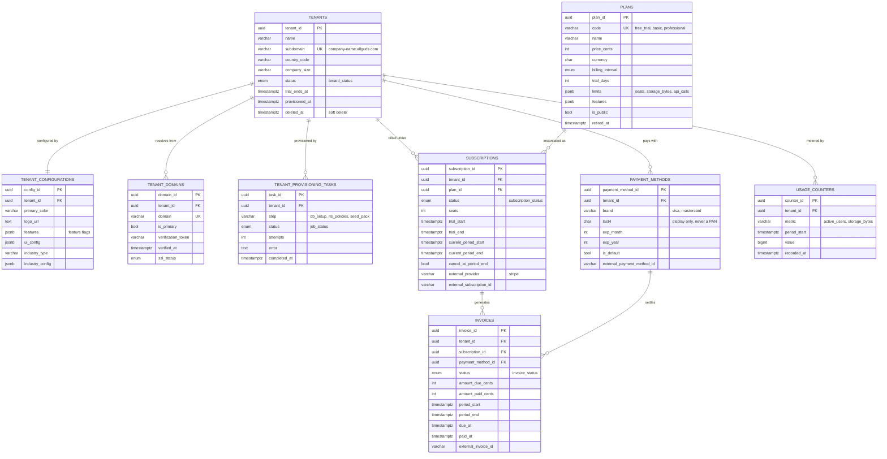

# 01 — Tenant Management ERD

**Phase 1.1 deliverable** · Sources: `DATABASE_SCHEMA.md`, `TENANT_ONBOARDING_FLOW.md`, `BUSINESS_PRODUCT_PLANNING.md`
**Status:** Draft for review

Covers tenant identity, configuration, domains, provisioning, and the subscription/billing
data model. Billing is the largest gap in the current schema: `tenants.plan_type` is a bare
`VARCHAR(50)`, which cannot express trials, renewal periods, seat counts, or payment state —
all of which `TENANT_ONBOARDING_FLOW.md` assumes exist.

---

## Entity Diagram



---

## DDL

### Enumerated types

`DATABASE_SCHEMA.md` references `tenant_status` but never creates it — the existing
`CREATE TABLE tenants` statement will fail on a clean database. Defined here.

```sql
CREATE TYPE tenant_status       AS ENUM ('pending', 'provisioning', 'active', 'suspended', 'churned');
CREATE TYPE subscription_status AS ENUM ('trialing', 'active', 'past_due', 'paused', 'canceled', 'expired');
CREATE TYPE invoice_status      AS ENUM ('draft', 'open', 'paid', 'void', 'uncollectible');
CREATE TYPE billing_interval    AS ENUM ('monthly', 'annual');
CREATE TYPE ssl_status          AS ENUM ('pending', 'issued', 'failed', 'expired');
CREATE TYPE job_status          AS ENUM ('pending', 'running', 'succeeded', 'failed', 'skipped');
```

### Tenant identity

```sql
-- Additive changes to the existing tenants table.
ALTER TABLE tenants
    ADD COLUMN country_code   CHAR(2),
    ADD COLUMN company_size   VARCHAR(20),      -- '1-10', '11-50', '51-200', '200+'
    ADD COLUMN trial_ends_at  TIMESTAMP WITH TIME ZONE,
    ADD COLUMN provisioned_at TIMESTAMP WITH TIME ZONE,
    ADD COLUMN deleted_at     TIMESTAMP WITH TIME ZONE;

-- plan_type is superseded by the subscriptions table; retain only until migration completes.
COMMENT ON COLUMN tenants.plan_type IS
    'DEPRECATED - read the active row in subscriptions instead. Drop after backfill.';

-- Subdomains are user-facing and must not collide with platform routes.
ALTER TABLE tenants ADD CONSTRAINT tenants_subdomain_format
    CHECK (subdomain ~ '^[a-z0-9]([a-z0-9-]{1,48}[a-z0-9])$'
           AND subdomain NOT IN ('www', 'api', 'app', 'admin', 'static', 'cdn', 'status'));

CREATE TABLE tenant_domains (
    domain_id          UUID PRIMARY KEY DEFAULT gen_random_uuid(),
    tenant_id          UUID NOT NULL REFERENCES tenants(tenant_id) ON DELETE CASCADE,
    domain             VARCHAR(255) NOT NULL UNIQUE,
    is_primary         BOOLEAN NOT NULL DEFAULT FALSE,
    verification_token VARCHAR(64) NOT NULL,
    verified_at        TIMESTAMP WITH TIME ZONE,
    ssl_status         ssl_status NOT NULL DEFAULT 'pending',
    created_at         TIMESTAMP WITH TIME ZONE NOT NULL DEFAULT NOW()
);

-- At most one primary domain per tenant.
CREATE UNIQUE INDEX uq_tenant_domains_primary
    ON tenant_domains(tenant_id) WHERE is_primary;

CREATE TABLE tenant_provisioning_tasks (
    task_id      UUID PRIMARY KEY DEFAULT gen_random_uuid(),
    tenant_id    UUID NOT NULL REFERENCES tenants(tenant_id) ON DELETE CASCADE,
    step         VARCHAR(100) NOT NULL,
    status       job_status NOT NULL DEFAULT 'pending',
    attempts     INTEGER NOT NULL DEFAULT 0,
    error        TEXT,
    started_at   TIMESTAMP WITH TIME ZONE,
    completed_at TIMESTAMP WITH TIME ZONE,
    created_at   TIMESTAMP WITH TIME ZONE NOT NULL DEFAULT NOW(),

    UNIQUE (tenant_id, step)
);
```

### Plans and subscriptions

`plans` is a global catalogue, not tenant-scoped: it carries no `tenant_id` and no RLS policy.

```sql
CREATE TABLE plans (
    plan_id          UUID PRIMARY KEY DEFAULT gen_random_uuid(),
    code             VARCHAR(50) NOT NULL UNIQUE,
    name             VARCHAR(255) NOT NULL,
    description      TEXT,
    price_cents      INTEGER NOT NULL DEFAULT 0,
    currency         CHAR(3) NOT NULL DEFAULT 'USD',
    billing_interval billing_interval NOT NULL DEFAULT 'monthly',
    trial_days       INTEGER NOT NULL DEFAULT 0,

    -- Quota ceilings enforced against usage_counters.
    limits           JSONB NOT NULL DEFAULT '{}',   -- {"seats":25,"storage_bytes":107374182400}
    features         JSONB NOT NULL DEFAULT '{}',   -- merged into tenant_configurations.features

    is_public        BOOLEAN NOT NULL DEFAULT TRUE,
    sort_order       INTEGER NOT NULL DEFAULT 0,
    retired_at       TIMESTAMP WITH TIME ZONE,      -- grandfathers existing subscribers
    created_at       TIMESTAMP WITH TIME ZONE NOT NULL DEFAULT NOW()
);

CREATE TABLE subscriptions (
    subscription_id          UUID PRIMARY KEY DEFAULT gen_random_uuid(),
    tenant_id                UUID NOT NULL REFERENCES tenants(tenant_id) ON DELETE CASCADE,
    plan_id                  UUID NOT NULL REFERENCES plans(plan_id),

    status                   subscription_status NOT NULL DEFAULT 'trialing',
    seats                    INTEGER NOT NULL DEFAULT 1 CHECK (seats > 0),

    trial_start              TIMESTAMP WITH TIME ZONE,
    trial_end                TIMESTAMP WITH TIME ZONE,
    current_period_start     TIMESTAMP WITH TIME ZONE NOT NULL,
    current_period_end       TIMESTAMP WITH TIME ZONE NOT NULL,
    cancel_at_period_end     BOOLEAN NOT NULL DEFAULT FALSE,
    canceled_at              TIMESTAMP WITH TIME ZONE,

    external_provider        VARCHAR(50) DEFAULT 'stripe',
    external_customer_id     VARCHAR(255),
    external_subscription_id VARCHAR(255),

    created_at               TIMESTAMP WITH TIME ZONE NOT NULL DEFAULT NOW(),
    updated_at               TIMESTAMP WITH TIME ZONE NOT NULL DEFAULT NOW(),

    CHECK (current_period_end > current_period_start),
    CHECK ((trial_start IS NULL) = (trial_end IS NULL))
);

-- A tenant may keep historical subscription rows but only one that is currently live.
CREATE UNIQUE INDEX uq_subscriptions_active_per_tenant
    ON subscriptions(tenant_id)
    WHERE status IN ('trialing', 'active', 'past_due', 'paused');

CREATE TABLE payment_methods (
    payment_method_id          UUID PRIMARY KEY DEFAULT gen_random_uuid(),
    tenant_id                  UUID NOT NULL REFERENCES tenants(tenant_id) ON DELETE CASCADE,
    brand                      VARCHAR(50),
    last4                      CHAR(4),
    exp_month                  SMALLINT CHECK (exp_month BETWEEN 1 AND 12),
    exp_year                   SMALLINT,
    is_default                 BOOLEAN NOT NULL DEFAULT FALSE,
    external_payment_method_id VARCHAR(255) NOT NULL,
    created_at                 TIMESTAMP WITH TIME ZONE NOT NULL DEFAULT NOW(),
    detached_at                TIMESTAMP WITH TIME ZONE
);

CREATE UNIQUE INDEX uq_payment_methods_default
    ON payment_methods(tenant_id) WHERE is_default AND detached_at IS NULL;

CREATE TABLE invoices (
    invoice_id          UUID PRIMARY KEY DEFAULT gen_random_uuid(),
    tenant_id           UUID NOT NULL REFERENCES tenants(tenant_id) ON DELETE RESTRICT,
    subscription_id     UUID REFERENCES subscriptions(subscription_id) ON DELETE SET NULL,
    payment_method_id   UUID REFERENCES payment_methods(payment_method_id) ON DELETE SET NULL,

    status              invoice_status NOT NULL DEFAULT 'draft',
    amount_due_cents    INTEGER NOT NULL,
    amount_paid_cents   INTEGER NOT NULL DEFAULT 0,
    currency            CHAR(3) NOT NULL DEFAULT 'USD',

    period_start        TIMESTAMP WITH TIME ZONE NOT NULL,
    period_end          TIMESTAMP WITH TIME ZONE NOT NULL,
    issued_at           TIMESTAMP WITH TIME ZONE,
    due_at              TIMESTAMP WITH TIME ZONE,
    paid_at             TIMESTAMP WITH TIME ZONE,

    external_invoice_id VARCHAR(255) UNIQUE,
    hosted_url          TEXT,
    pdf_url             TEXT,

    created_at          TIMESTAMP WITH TIME ZONE NOT NULL DEFAULT NOW()
);
```

`invoices.tenant_id` is `ON DELETE RESTRICT`, deliberately unlike the rest of the tenant tree:
financial records must survive tenant deletion for tax and audit retention. Tenant offboarding
soft-deletes via `tenants.deleted_at` rather than issuing a `DELETE`.

### Usage metering

```sql
CREATE TABLE usage_counters (
    counter_id   UUID PRIMARY KEY DEFAULT gen_random_uuid(),
    tenant_id    UUID NOT NULL REFERENCES tenants(tenant_id) ON DELETE CASCADE,
    metric       VARCHAR(50) NOT NULL,   -- 'active_users' | 'storage_bytes' | 'api_calls'
    period_start TIMESTAMP WITH TIME ZONE NOT NULL,
    value        BIGINT NOT NULL DEFAULT 0,
    recorded_at  TIMESTAMP WITH TIME ZONE NOT NULL DEFAULT NOW(),

    UNIQUE (tenant_id, metric, period_start)
);
```

`storage_bytes` is the counter the file-quota check in `FILE_UPLOAD_STORAGE.md` reads before
accepting an upload — see `05_FILE_DOCUMENT_ERD.md`.

---

## Row-Level Security

```sql
ALTER TABLE tenant_domains            ENABLE ROW LEVEL SECURITY;
ALTER TABLE tenant_provisioning_tasks ENABLE ROW LEVEL SECURITY;
ALTER TABLE subscriptions             ENABLE ROW LEVEL SECURITY;
ALTER TABLE invoices                  ENABLE ROW LEVEL SECURITY;
ALTER TABLE payment_methods           ENABLE ROW LEVEL SECURITY;
ALTER TABLE usage_counters            ENABLE ROW LEVEL SECURITY;

-- FORCE also subjects the table owner to the policy. Without it, any connection that happens
-- to own the table silently bypasses tenant isolation.
ALTER TABLE tenant_domains            FORCE ROW LEVEL SECURITY;
ALTER TABLE tenant_provisioning_tasks FORCE ROW LEVEL SECURITY;
ALTER TABLE subscriptions             FORCE ROW LEVEL SECURITY;
ALTER TABLE invoices                  FORCE ROW LEVEL SECURITY;
ALTER TABLE payment_methods           FORCE ROW LEVEL SECURITY;
ALTER TABLE usage_counters            FORCE ROW LEVEL SECURITY;

CREATE POLICY tenant_isolation ON tenant_domains  FOR ALL TO app_user
    USING (tenant_id = current_setting('app.current_tenant_id')::UUID);
CREATE POLICY tenant_isolation ON subscriptions   FOR ALL TO app_user
    USING (tenant_id = current_setting('app.current_tenant_id')::UUID);
CREATE POLICY tenant_isolation ON invoices        FOR ALL TO app_user
    USING (tenant_id = current_setting('app.current_tenant_id')::UUID);
CREATE POLICY tenant_isolation ON payment_methods FOR ALL TO app_user
    USING (tenant_id = current_setting('app.current_tenant_id')::UUID);
CREATE POLICY tenant_isolation ON usage_counters  FOR ALL TO app_user
    USING (tenant_id = current_setting('app.current_tenant_id')::UUID);

-- plans is a public catalogue: readable by every tenant, writable only by the platform role.
GRANT SELECT ON plans TO app_user;
```

RLS scopes billing rows to the right tenant, but it does **not** decide which *users* inside
that tenant may read them. Billing endpoints must additionally require the `billing:read` /
`billing:write` permissions defined in `02_USER_AUTH_ERD.md`.

---

## Indexes

```sql
CREATE INDEX idx_tenants_status         ON tenants(status) WHERE deleted_at IS NULL;
CREATE INDEX idx_tenant_domains_tenant  ON tenant_domains(tenant_id);
CREATE INDEX idx_provisioning_pending   ON tenant_provisioning_tasks(status, created_at)
    WHERE status IN ('pending', 'running');
CREATE INDEX idx_subscriptions_tenant   ON subscriptions(tenant_id);
CREATE INDEX idx_subscriptions_renewal  ON subscriptions(current_period_end)
    WHERE status IN ('trialing', 'active');
CREATE INDEX idx_invoices_tenant_issued ON invoices(tenant_id, issued_at DESC);
CREATE INDEX idx_invoices_unpaid        ON invoices(due_at) WHERE status = 'open';
CREATE INDEX idx_usage_counters_lookup  ON usage_counters(tenant_id, metric, period_start DESC);
```

`idx_subscriptions_renewal` and `idx_invoices_unpaid` are the two the billing cron scans on
every run; both are partial so they stay small as churned tenants accumulate.

---

## Corrections to `DATABASE_SCHEMA.md`

| # | Issue | Resolution |
|---|---|---|
| 1 | `CREATE TABLE tenants` references type `tenant_status`, which is never created — the DDL fails on a clean database | `CREATE TYPE tenant_status` added above |
| 2 | `tenants.plan_type VARCHAR(50)` cannot express trial windows, renewal periods, seats, or payment state that `TENANT_ONBOARDING_FLOW.md:218-222` depends on | Superseded by `subscriptions`; column marked deprecated pending backfill |
| 3 | No table backs the "company domain verification (for enterprise)" step | `tenant_domains` |
| 4 | Provisioning is described as a multi-step automated process with no state stored anywhere | `tenant_provisioning_tasks` |
| 5 | File-upload quota checks have no counter to read | `usage_counters` |
| 6 | `tenants` has no soft-delete column, so offboarding must hard-delete and cascade away invoices | `deleted_at` added; `invoices` FK set to `RESTRICT` |

---

## Open questions

1. **Seat enforcement.** Is `subscriptions.seats` a hard cap (block the invite) or a soft one
   (allow, then true up on the next invoice)? This decides whether the check lives in a database
   constraint or the invite handler.
2. **Plan changes mid-period.** Proration is assumed to be delegated to Stripe, with invoices
   mirrored back by webhook. If proration must be computed in-platform, a `subscription_items`
   child table is required.
3. **Currency.** The schema allows a per-plan currency, but genuine multi-currency pricing needs
   a `plan_prices` child table. Single-currency (USD) is assumed until international expansion.
4. **Usage counter granularity.** `period_start` implies fixed buckets; monthly is assumed.
   Daily buckets for `api_calls` would enable rate-limit analytics at a cost in row count.
