# 02 — User & Authentication ERD

**Phase 1.1 deliverable** · Sources: `DATABASE_SCHEMA.md`, `SECURITY_ARCHITECTURE.md`, `TENANT_ONBOARDING_FLOW.md`
**Status:** Draft for review

Covers user profiles, the RBAC model, session and token management, MFA, and SSO.

The driving gap: `SECURITY_ARCHITECTURE.md:96-130` specifies a JWT carrying `session_id`,
`device_id` and a refresh-token `jti` described as being "for revocation" — but nothing in the
schema persists any of them. Revocation is impossible against a purely stateless token, so a
logout, a password change, or a stolen-device report currently cannot invalidate anything until
the token expires on its own (60 days for refresh tokens).

---

## Entity Diagram

```mermaid
erDiagram
    TENANTS ||--o{ TENANT_USERS : "employs"
    TENANTS ||--o{ ROLES : "defines"
    TENANTS ||--o{ SSO_CONNECTIONS : "federates via"
    TENANTS ||--o{ USER_INVITATIONS : "issues"

    TENANT_USERS ||--o{ USER_ROLES : "assigned"
    ROLES ||--o{ USER_ROLES : "granted through"
    ROLES ||--o{ ROLE_PERMISSIONS : "carries"
    PERMISSIONS ||--o{ ROLE_PERMISSIONS : "included in"
    ROLES ||--o{ ROLES : "inherits from"

    TENANT_USERS ||--o{ USER_PERMISSION_OVERRIDES : "excepted by"
    PERMISSIONS ||--o{ USER_PERMISSION_OVERRIDES : "targeted by"

    TENANT_USERS ||--o{ SESSIONS : "opens"
    SESSIONS ||--o{ REFRESH_TOKENS : "rotates"
    TENANT_USERS ||--o{ USER_DEVICES : "registers"
    USER_DEVICES ||--o{ SESSIONS : "originates"

    TENANT_USERS ||--o{ MFA_METHODS : "enrolls"
    TENANT_USERS ||--o{ MFA_BACKUP_CODES : "holds"
    TENANT_USERS ||--o{ USER_VERIFICATION_TOKENS : "verifies with"
    TENANT_USERS ||--o{ SSO_IDENTITIES : "linked as"
    SSO_CONNECTIONS ||--o{ SSO_IDENTITIES : "authenticates"

    TENANT_USERS {
        uuid user_id PK
        uuid tenant_id FK
        varchar email UK "unique per tenant"
        varchar password_hash "argon2id, null for SSO-only"
        varchar first_name
        varchar last_name
        varchar job_title
        varchar phone_e164
        enum status "user_status"
        timestamptz email_verified_at
        int failed_login_count
        timestamptz locked_until
        timestamptz password_changed_at
        timestamptz last_login
        timestamptz deleted_at
    }

    ROLES {
        uuid role_id PK
        uuid tenant_id FK "null for system templates"
        uuid parent_role_id FK
        varchar code "tenant_admin, manager, user"
        varchar name
        bool is_system "not editable by tenant"
    }

    PERMISSIONS {
        uuid permission_id PK
        varchar code UK "records:read"
        varchar resource "records, users, billing"
        varchar action "read, write, export, delete"
        bool is_phi_scoped "HIPAA-relevant"
    }

    ROLE_PERMISSIONS {
        uuid role_id PK
        uuid permission_id PK
    }

    USER_ROLES {
        uuid user_id PK
        uuid role_id PK
        uuid granted_by FK
        timestamptz granted_at
        timestamptz expires_at "temporary elevation"
    }

    USER_PERMISSION_OVERRIDES {
        uuid override_id PK
        uuid user_id FK
        uuid permission_id FK
        enum effect "allow or deny; deny wins"
        text reason
        timestamptz expires_at
    }

    SESSIONS {
        uuid session_id PK
        uuid tenant_id FK
        uuid user_id FK
        uuid device_id FK
        inet ip_address
        text user_agent
        bool mfa_verified
        varchar security_level "risk assessment"
        timestamptz last_seen_at
        timestamptz expires_at
        timestamptz revoked_at
        varchar revoked_reason
    }

    REFRESH_TOKENS {
        uuid token_id PK "the jti claim"
        uuid session_id FK
        uuid user_id FK
        varchar token_hash "sha256, never the raw token"
        timestamptz expires_at "60 days"
        timestamptz used_at
        uuid replaced_by_token_id FK "rotation chain"
        timestamptz revoked_at
    }

    USER_DEVICES {
        uuid device_id PK
        uuid user_id FK
        varchar fingerprint UK
        varchar platform "ios, android, web"
        varchar app_version
        varchar push_token
        timestamptz trusted_at
        timestamptz last_seen_at
    }

    MFA_METHODS {
        uuid mfa_id PK
        uuid user_id FK
        enum method_type "totp, sms, email, webauthn"
        text secret_encrypted
        varchar phone_e164
        bool is_primary
        timestamptz confirmed_at
        timestamptz last_used_at
    }

    MFA_BACKUP_CODES {
        uuid code_id PK
        uuid user_id FK
        varchar code_hash
        timestamptz used_at
    }

    SSO_CONNECTIONS {
        uuid connection_id PK
        uuid tenant_id FK
        enum protocol "saml, oidc"
        varchar provider_name
        text idp_metadata
        jsonb attribute_mapping
        bool jit_provisioning
        uuid default_role_id FK
        varchar enforced_email_domain
        bool is_active
    }

    SSO_IDENTITIES {
        uuid identity_id PK
        uuid user_id FK
        uuid connection_id FK
        varchar external_subject_id UK
        timestamptz last_login_at
    }

    USER_VERIFICATION_TOKENS {
        uuid token_id PK
        uuid user_id FK
        enum purpose "email_verify, password_reset"
        varchar token_hash
        timestamptz expires_at
        timestamptz used_at
        inet requested_ip
    }

    USER_INVITATIONS {
        uuid invitation_id PK
        uuid tenant_id FK
        varchar email
        uuid role_id FK
        uuid invited_by FK
        varchar token_hash
        timestamptz expires_at
        timestamptz accepted_at
    }
```



---

## DDL

### Enumerated types

```sql
CREATE TYPE user_status        AS ENUM ('invited', 'active', 'suspended', 'deactivated');
CREATE TYPE mfa_method_type    AS ENUM ('totp', 'sms', 'email', 'webauthn');
CREATE TYPE sso_protocol       AS ENUM ('saml', 'oidc');
CREATE TYPE permission_effect  AS ENUM ('allow', 'deny');
CREATE TYPE verification_purpose AS ENUM ('email_verify', 'password_reset', 'phone_verify');
```

### User profile

```sql
ALTER TABLE tenant_users
    ADD COLUMN job_title           VARCHAR(150),
    ADD COLUMN phone_e164          VARCHAR(20),
    ADD COLUMN phone_verified_at   TIMESTAMP WITH TIME ZONE,
    ADD COLUMN email_verified_at   TIMESTAMP WITH TIME ZONE,
    ADD COLUMN status              user_status NOT NULL DEFAULT 'invited',
    ADD COLUMN failed_login_count  INTEGER NOT NULL DEFAULT 0,
    ADD COLUMN locked_until        TIMESTAMP WITH TIME ZONE,
    ADD COLUMN password_changed_at TIMESTAMP WITH TIME ZONE,
    ADD COLUMN must_change_password BOOLEAN NOT NULL DEFAULT FALSE,
    ADD COLUMN deleted_at          TIMESTAMP WITH TIME ZONE;

-- SSO-only users never set a local password.
ALTER TABLE tenant_users ALTER COLUMN password_hash DROP NOT NULL;

-- is_active is replaced by the richer status enum; keep in sync until callers migrate.
COMMENT ON COLUMN tenant_users.is_active IS
    'DEPRECATED - superseded by status. Drop after callers migrate.';

-- roles/permissions JSONB are replaced by the normalized tables below.
COMMENT ON COLUMN tenant_users.roles IS
    'DEPRECATED - superseded by user_roles. JSONB roles cannot be joined, constrained, or audited.';
COMMENT ON COLUMN tenant_users.permissions IS
    'DEPRECATED - superseded by role_permissions + user_permission_overrides.';

-- mfa_secret held a single TOTP secret; MFA_METHODS supports multiple enrolled factors.
COMMENT ON COLUMN tenant_users.mfa_secret IS
    'DEPRECATED - superseded by mfa_methods.secret_encrypted (which is encrypted, unlike this).';
```

`mfa_secret VARCHAR(255)` in the original schema stores a TOTP seed in plaintext. A TOTP seed is
a bearer credential: anyone reading that column can generate valid second factors indefinitely.
`mfa_methods.secret_encrypted` is envelope-encrypted with the same KMS key referenced by
`files.encryption_key_id`.

### RBAC

```sql
CREATE TABLE roles (
    role_id        UUID PRIMARY KEY DEFAULT gen_random_uuid(),
    tenant_id      UUID REFERENCES tenants(tenant_id) ON DELETE CASCADE,  -- NULL = system template
    parent_role_id UUID REFERENCES roles(role_id) ON DELETE SET NULL,
    code           VARCHAR(50) NOT NULL,
    name           VARCHAR(150) NOT NULL,
    description    TEXT,
    is_system      BOOLEAN NOT NULL DEFAULT FALSE,
    created_at     TIMESTAMP WITH TIME ZONE NOT NULL DEFAULT NOW()
);

-- Codes are unique per tenant; system templates (tenant_id IS NULL) are unique globally.
CREATE UNIQUE INDEX uq_roles_tenant_code    ON roles(tenant_id, code) WHERE tenant_id IS NOT NULL;
CREATE UNIQUE INDEX uq_roles_system_code    ON roles(code)            WHERE tenant_id IS NULL;

CREATE TABLE permissions (
    permission_id  UUID PRIMARY KEY DEFAULT gen_random_uuid(),
    code           VARCHAR(100) NOT NULL UNIQUE,   -- 'records:read'
    resource       VARCHAR(50)  NOT NULL,
    action         VARCHAR(50)  NOT NULL,
    description    TEXT,
    is_phi_scoped  BOOLEAN NOT NULL DEFAULT FALSE, -- drives HIPAA read-logging (see doc 04)
    UNIQUE (resource, action)
);

CREATE TABLE role_permissions (
    role_id       UUID NOT NULL REFERENCES roles(role_id) ON DELETE CASCADE,
    permission_id UUID NOT NULL REFERENCES permissions(permission_id) ON DELETE CASCADE,
    PRIMARY KEY (role_id, permission_id)
);

CREATE TABLE user_roles (
    user_id    UUID NOT NULL REFERENCES tenant_users(user_id) ON DELETE CASCADE,
    role_id    UUID NOT NULL REFERENCES roles(role_id) ON DELETE RESTRICT,
    granted_by UUID REFERENCES tenant_users(user_id),
    granted_at TIMESTAMP WITH TIME ZONE NOT NULL DEFAULT NOW(),
    expires_at TIMESTAMP WITH TIME ZONE,             -- temporary elevation
    PRIMARY KEY (user_id, role_id)
);

CREATE TABLE user_permission_overrides (
    override_id   UUID PRIMARY KEY DEFAULT gen_random_uuid(),
    user_id       UUID NOT NULL REFERENCES tenant_users(user_id) ON DELETE CASCADE,
    permission_id UUID NOT NULL REFERENCES permissions(permission_id) ON DELETE CASCADE,
    effect        permission_effect NOT NULL,
    reason        TEXT NOT NULL,                     -- required: overrides must be justifiable at audit
    granted_by    UUID REFERENCES tenant_users(user_id),
    expires_at    TIMESTAMP WITH TIME ZONE,
    created_at    TIMESTAMP WITH TIME ZONE NOT NULL DEFAULT NOW(),
    UNIQUE (user_id, permission_id)
);
```

**Resolution order** — the effective permission set for a user is:

1. Union of permissions from all non-expired `user_roles`, walking `parent_role_id` upward.
2. Plus any `user_permission_overrides` with `effect = 'allow'` and not expired.
3. Minus any `user_permission_overrides` with `effect = 'deny'` and not expired.

Deny always wins, and is evaluated last. The resolved set is what gets stamped into the JWT
`permissions` claim at login, so a permission change does not take effect until the access token
is refreshed (at most one hour). Revocations that must be immediate have to also revoke the
session — see `sessions.revoked_at`.

```sql
CREATE OR REPLACE VIEW effective_user_permissions AS
WITH RECURSIVE role_tree AS (
    SELECT ur.user_id, r.role_id, r.parent_role_id
      FROM user_roles ur
      JOIN roles r ON r.role_id = ur.role_id
     WHERE ur.expires_at IS NULL OR ur.expires_at > NOW()
    UNION
    SELECT rt.user_id, p.role_id, p.parent_role_id
      FROM role_tree rt
      JOIN roles p ON p.role_id = rt.parent_role_id
),
granted AS (
    SELECT DISTINCT rt.user_id, rp.permission_id
      FROM role_tree rt
      JOIN role_permissions rp ON rp.role_id = rt.role_id
    UNION
    SELECT o.user_id, o.permission_id
      FROM user_permission_overrides o
     WHERE o.effect = 'allow' AND (o.expires_at IS NULL OR o.expires_at > NOW())
)
SELECT g.user_id, g.permission_id, p.code
  FROM granted g
  JOIN permissions p ON p.permission_id = g.permission_id
 WHERE NOT EXISTS (
       SELECT 1 FROM user_permission_overrides d
        WHERE d.user_id = g.user_id
          AND d.permission_id = g.permission_id
          AND d.effect = 'deny'
          AND (d.expires_at IS NULL OR d.expires_at > NOW()));
```

### Sessions and tokens

```sql
CREATE TABLE user_devices (
    device_id     UUID PRIMARY KEY DEFAULT gen_random_uuid(),
    tenant_id     UUID NOT NULL REFERENCES tenants(tenant_id) ON DELETE CASCADE,
    user_id       UUID NOT NULL REFERENCES tenant_users(user_id) ON DELETE CASCADE,
    fingerprint   VARCHAR(255) NOT NULL,
    platform      VARCHAR(20),           -- 'ios' | 'android' | 'web'
    app_version   VARCHAR(20),
    push_token    TEXT,
    trusted_at    TIMESTAMP WITH TIME ZONE,   -- set once the device passes MFA
    last_seen_at  TIMESTAMP WITH TIME ZONE,
    created_at    TIMESTAMP WITH TIME ZONE NOT NULL DEFAULT NOW(),
    UNIQUE (user_id, fingerprint)
);

CREATE TABLE sessions (
    session_id     UUID PRIMARY KEY DEFAULT gen_random_uuid(),
    tenant_id      UUID NOT NULL REFERENCES tenants(tenant_id) ON DELETE CASCADE,
    user_id        UUID NOT NULL REFERENCES tenant_users(user_id) ON DELETE CASCADE,
    device_id      UUID REFERENCES user_devices(device_id) ON DELETE SET NULL,

    ip_address     INET,
    user_agent     TEXT,
    mfa_verified   BOOLEAN NOT NULL DEFAULT FALSE,
    security_level VARCHAR(20) NOT NULL DEFAULT 'normal',  -- 'low' | 'normal' | 'high'

    created_at     TIMESTAMP WITH TIME ZONE NOT NULL DEFAULT NOW(),
    last_seen_at   TIMESTAMP WITH TIME ZONE NOT NULL DEFAULT NOW(),
    expires_at     TIMESTAMP WITH TIME ZONE NOT NULL,
    revoked_at     TIMESTAMP WITH TIME ZONE,
    revoked_reason VARCHAR(50)   -- 'logout' | 'password_change' | 'admin' | 'reuse_detected' | 'idle_timeout'
);

CREATE TABLE refresh_tokens (
    token_id             UUID PRIMARY KEY DEFAULT gen_random_uuid(),  -- the JWT 'jti' claim
    session_id           UUID NOT NULL REFERENCES sessions(session_id) ON DELETE CASCADE,
    tenant_id            UUID NOT NULL REFERENCES tenants(tenant_id) ON DELETE CASCADE,
    user_id              UUID NOT NULL REFERENCES tenant_users(user_id) ON DELETE CASCADE,

    token_hash           VARCHAR(64) NOT NULL UNIQUE,   -- SHA-256 of the token, never the token
    issued_at            TIMESTAMP WITH TIME ZONE NOT NULL DEFAULT NOW(),
    expires_at           TIMESTAMP WITH TIME ZONE NOT NULL,
    used_at              TIMESTAMP WITH TIME ZONE,
    replaced_by_token_id UUID REFERENCES refresh_tokens(token_id) ON DELETE SET NULL,
    revoked_at           TIMESTAMP WITH TIME ZONE
);
```

**Refresh-token rotation.** Each refresh mints a new row and sets `used_at` and
`replaced_by_token_id` on the old one. If a token that already has `used_at` set is presented
again, it has been replayed — the correct response is to revoke the entire session chain, not
just that token, and write a `security` event to `system_audit_log`:

```sql
CREATE OR REPLACE FUNCTION revoke_session_on_token_reuse(p_token_id UUID)
RETURNS VOID AS $$
BEGIN
    UPDATE sessions s
       SET revoked_at = NOW(), revoked_reason = 'reuse_detected'
      FROM refresh_tokens rt
     WHERE rt.token_id = p_token_id
       AND s.session_id = rt.session_id
       AND s.revoked_at IS NULL;

    UPDATE refresh_tokens
       SET revoked_at = NOW()
     WHERE session_id = (SELECT session_id FROM refresh_tokens WHERE token_id = p_token_id)
       AND revoked_at IS NULL;
END;
$$ LANGUAGE plpgsql;
```

Storing `token_hash` rather than the token means a database disclosure does not yield usable
refresh tokens. The same reasoning applies to `user_verification_tokens` and `user_invitations`.

### MFA

```sql
CREATE TABLE mfa_methods (
    mfa_id           UUID PRIMARY KEY DEFAULT gen_random_uuid(),
    tenant_id        UUID NOT NULL REFERENCES tenants(tenant_id) ON DELETE CASCADE,
    user_id          UUID NOT NULL REFERENCES tenant_users(user_id) ON DELETE CASCADE,
    method_type      mfa_method_type NOT NULL,
    secret_encrypted TEXT,               -- envelope-encrypted TOTP seed / WebAuthn credential
    phone_e164       VARCHAR(20),        -- for sms
    is_primary       BOOLEAN NOT NULL DEFAULT FALSE,
    confirmed_at     TIMESTAMP WITH TIME ZONE,   -- NULL until the enrollment challenge passes
    last_used_at     TIMESTAMP WITH TIME ZONE,
    created_at       TIMESTAMP WITH TIME ZONE NOT NULL DEFAULT NOW()
);

CREATE UNIQUE INDEX uq_mfa_primary ON mfa_methods(user_id) WHERE is_primary;

CREATE TABLE mfa_backup_codes (
    code_id    UUID PRIMARY KEY DEFAULT gen_random_uuid(),
    tenant_id  UUID NOT NULL REFERENCES tenants(tenant_id) ON DELETE CASCADE,
    user_id    UUID NOT NULL REFERENCES tenant_users(user_id) ON DELETE CASCADE,
    code_hash  VARCHAR(64) NOT NULL,
    used_at    TIMESTAMP WITH TIME ZONE,
    created_at TIMESTAMP WITH TIME ZONE NOT NULL DEFAULT NOW()
);

CREATE INDEX idx_mfa_backup_unused ON mfa_backup_codes(user_id) WHERE used_at IS NULL;
```

Backup codes are single-use: verification sets `used_at` in the same transaction as the login,
so a code cannot be redeemed twice concurrently.

### SSO

```sql
CREATE TABLE sso_connections (
    connection_id         UUID PRIMARY KEY DEFAULT gen_random_uuid(),
    tenant_id             UUID NOT NULL REFERENCES tenants(tenant_id) ON DELETE CASCADE,
    protocol              sso_protocol NOT NULL,
    provider_name         VARCHAR(100) NOT NULL,     -- 'Okta', 'Azure AD', ...

    -- SAML
    idp_entity_id         TEXT,
    idp_sso_url           TEXT,
    idp_certificate       TEXT,

    -- OIDC
    oidc_issuer           TEXT,
    oidc_client_id        VARCHAR(255),
    oidc_client_secret_encrypted TEXT,

    attribute_mapping     JSONB NOT NULL DEFAULT '{}',  -- IdP claim -> tenant_users column
    jit_provisioning      BOOLEAN NOT NULL DEFAULT FALSE,
    default_role_id       UUID REFERENCES roles(role_id) ON DELETE SET NULL,
    enforced_email_domain VARCHAR(255),   -- reject assertions outside this domain
    is_active             BOOLEAN NOT NULL DEFAULT TRUE,

    created_at            TIMESTAMP WITH TIME ZONE NOT NULL DEFAULT NOW(),
    updated_at            TIMESTAMP WITH TIME ZONE NOT NULL DEFAULT NOW(),

    CHECK (jit_provisioning = FALSE OR default_role_id IS NOT NULL)
);

CREATE TABLE sso_identities (
    identity_id         UUID PRIMARY KEY DEFAULT gen_random_uuid(),
    tenant_id           UUID NOT NULL REFERENCES tenants(tenant_id) ON DELETE CASCADE,
    user_id             UUID NOT NULL REFERENCES tenant_users(user_id) ON DELETE CASCADE,
    connection_id       UUID NOT NULL REFERENCES sso_connections(connection_id) ON DELETE CASCADE,
    external_subject_id VARCHAR(255) NOT NULL,
    last_login_at       TIMESTAMP WITH TIME ZONE,
    created_at          TIMESTAMP WITH TIME ZONE NOT NULL DEFAULT NOW(),

    UNIQUE (connection_id, external_subject_id)
);
```

The identity is keyed on `external_subject_id`, not email: IdPs let users change their email
address, and matching on a mutable attribute is an account-takeover path.

The `CHECK` on `jit_provisioning` prevents the failure mode where just-in-time provisioning is
enabled without a default role, silently creating users who can authenticate but do nothing.

### Verification tokens and invitations

```sql
CREATE TABLE user_verification_tokens (
    token_id      UUID PRIMARY KEY DEFAULT gen_random_uuid(),
    tenant_id     UUID NOT NULL REFERENCES tenants(tenant_id) ON DELETE CASCADE,
    user_id       UUID NOT NULL REFERENCES tenant_users(user_id) ON DELETE CASCADE,
    purpose       verification_purpose NOT NULL,
    token_hash    VARCHAR(64) NOT NULL UNIQUE,
    expires_at    TIMESTAMP WITH TIME ZONE NOT NULL,
    used_at       TIMESTAMP WITH TIME ZONE,
    requested_ip  INET,
    created_at    TIMESTAMP WITH TIME ZONE NOT NULL DEFAULT NOW()
);

-- Only one live token per purpose per user; re-requesting supersedes the previous one.
CREATE UNIQUE INDEX uq_verification_live
    ON user_verification_tokens(user_id, purpose) WHERE used_at IS NULL;

CREATE TABLE user_invitations (
    invitation_id UUID PRIMARY KEY DEFAULT gen_random_uuid(),
    tenant_id     UUID NOT NULL REFERENCES tenants(tenant_id) ON DELETE CASCADE,
    email         VARCHAR(255) NOT NULL,
    role_id       UUID NOT NULL REFERENCES roles(role_id) ON DELETE RESTRICT,
    invited_by    UUID REFERENCES tenant_users(user_id),
    token_hash    VARCHAR(64) NOT NULL UNIQUE,
    expires_at    TIMESTAMP WITH TIME ZONE NOT NULL,
    accepted_at   TIMESTAMP WITH TIME ZONE,
    revoked_at    TIMESTAMP WITH TIME ZONE,
    created_at    TIMESTAMP WITH TIME ZONE NOT NULL DEFAULT NOW()
);

CREATE UNIQUE INDEX uq_invitations_pending
    ON user_invitations(tenant_id, lower(email))
    WHERE accepted_at IS NULL AND revoked_at IS NULL;
```

---

## Row-Level Security

```sql
ALTER TABLE roles                     ENABLE ROW LEVEL SECURITY;
ALTER TABLE user_roles                ENABLE ROW LEVEL SECURITY;
ALTER TABLE user_permission_overrides ENABLE ROW LEVEL SECURITY;
ALTER TABLE sessions                  ENABLE ROW LEVEL SECURITY;
ALTER TABLE refresh_tokens            ENABLE ROW LEVEL SECURITY;
ALTER TABLE user_devices              ENABLE ROW LEVEL SECURITY;
ALTER TABLE mfa_methods               ENABLE ROW LEVEL SECURITY;
ALTER TABLE mfa_backup_codes          ENABLE ROW LEVEL SECURITY;
ALTER TABLE sso_connections           ENABLE ROW LEVEL SECURITY;
ALTER TABLE sso_identities            ENABLE ROW LEVEL SECURITY;
ALTER TABLE user_verification_tokens  ENABLE ROW LEVEL SECURITY;
ALTER TABLE user_invitations          ENABLE ROW LEVEL SECURITY;

-- ... matching FORCE ROW LEVEL SECURITY for each, as in doc 01.

CREATE POLICY tenant_isolation ON sessions       FOR ALL TO app_user
    USING (tenant_id = current_setting('app.current_tenant_id')::UUID);
CREATE POLICY tenant_isolation ON refresh_tokens FOR ALL TO app_user
    USING (tenant_id = current_setting('app.current_tenant_id')::UUID);
CREATE POLICY tenant_isolation ON mfa_methods    FOR ALL TO app_user
    USING (tenant_id = current_setting('app.current_tenant_id')::UUID);
-- ... etc. for every table above carrying tenant_id.

-- roles carries a nullable tenant_id: system templates must be visible to all tenants.
CREATE POLICY tenant_isolation ON roles FOR ALL TO app_user
    USING (tenant_id IS NULL OR tenant_id = current_setting('app.current_tenant_id')::UUID);

-- user_roles has no tenant_id of its own; scope it through the user.
CREATE POLICY tenant_isolation ON user_roles FOR ALL TO app_user
    USING (EXISTS (SELECT 1 FROM tenant_users u
                    WHERE u.user_id = user_roles.user_id
                      AND u.tenant_id = current_setting('app.current_tenant_id')::UUID));
```

**Chicken-and-egg on login.** `app.current_tenant_id` is set from the JWT, but the login endpoint
has no JWT yet — it must look up a user by email before a tenant context exists. Authentication
therefore runs as a separate, minimally-privileged `auth_service` role that resolves the tenant
from the subdomain first, then sets `app.current_tenant_id` before touching any other table.
`auth_service` must be granted `BYPASSRLS` on `tenant_users` alone and nothing else.

---

## Indexes

```sql
CREATE INDEX idx_users_tenant_status   ON tenant_users(tenant_id, status) WHERE deleted_at IS NULL;
CREATE INDEX idx_users_email_lookup    ON tenant_users(lower(email));
CREATE INDEX idx_sessions_user_live    ON sessions(user_id, last_seen_at DESC) WHERE revoked_at IS NULL;
CREATE INDEX idx_sessions_expiry       ON sessions(expires_at) WHERE revoked_at IS NULL;
CREATE INDEX idx_refresh_session       ON refresh_tokens(session_id);
CREATE INDEX idx_refresh_cleanup       ON refresh_tokens(expires_at) WHERE revoked_at IS NULL;
CREATE INDEX idx_user_roles_role       ON user_roles(role_id);
CREATE INDEX idx_role_permissions_perm ON role_permissions(permission_id);
CREATE INDEX idx_sso_identities_user   ON sso_identities(user_id);
CREATE INDEX idx_devices_user          ON user_devices(user_id, last_seen_at DESC);
```

`idx_users_email_lookup` is on `lower(email)` because login is case-insensitive while the
existing `UNIQUE(tenant_id, email)` constraint is not — see correction 6 below.

---

## Corrections to `DATABASE_SCHEMA.md`

| # | Issue | Resolution |
|---|---|---|
| 1 | JWT carries `session_id`, `device_id` and refresh `jti` "for revocation", but nothing persists them — no logout, password change, or device revocation can invalidate a live token | `sessions`, `refresh_tokens`, `user_devices` |
| 2 | `mfa_secret VARCHAR(255)` stores a TOTP seed in plaintext, and only one factor | `mfa_methods.secret_encrypted`, multi-factor |
| 3 | Phase 1.1 requires MFA backup codes; none exist | `mfa_backup_codes` |
| 4 | `roles JSONB` / `permissions JSONB` cannot be joined, constrained, or reported on — "who has records:delete?" is a full table scan with JSON parsing | `roles`, `permissions`, `role_permissions`, `user_roles`, `user_permission_overrides` |
| 5 | SSO is named as a requirement with no data model | `sso_connections`, `sso_identities` |
| 6 | `UNIQUE(tenant_id, email)` is case-sensitive, so `Bob@x.com` and `bob@x.com` are two accounts in the same tenant | Add `UNIQUE(tenant_id, lower(email))`; index on `lower(email)` |
| 7 | `password_hash` is `NOT NULL`, making SSO-only users impossible to represent | Constraint dropped |
| 8 | No account-lockout state despite "Rate Limit" and "Failed Login" branches in `SECURITY_ARCHITECTURE.md:73-87` | `failed_login_count`, `locked_until` |
| 9 | No password-reset or email-verification token storage, though onboarding requires email verification | `user_verification_tokens` |

---

## Open questions

1. **Password hashing.** `password_hash VARCHAR(255)` fits argon2id and bcrypt both. Argon2id is
   assumed; if bcrypt is chosen for library reasons, note that it silently truncates at 72 bytes.
2. **Session idle vs. absolute timeout.** `expires_at` currently expresses one lifetime.
   HIPAA practice usually wants both an idle timeout (~15 min) and an absolute cap (~12 h),
   which needs a second column or a computed check against `last_seen_at`.
3. **Role scope.** Roles are tenant-wide. If permissions must vary by record type — a user who
   is an editor for incidents but read-only for patients — `user_roles` needs a nullable
   `scope_record_type` column. Worth deciding before RBAC is built rather than after.
4. **`auth_service` privileges.** Granting `BYPASSRLS` is the pragmatic answer to the login
   chicken-and-egg. The alternative is a `SECURITY DEFINER` lookup function with a narrow
   signature, which is tighter but harder to keep auditable. Needs a security-review decision.
5. **Concurrent session cap.** Nothing currently limits how many live sessions a user may hold.
   If a cap is wanted, it belongs in the session-creation path, not a constraint.
