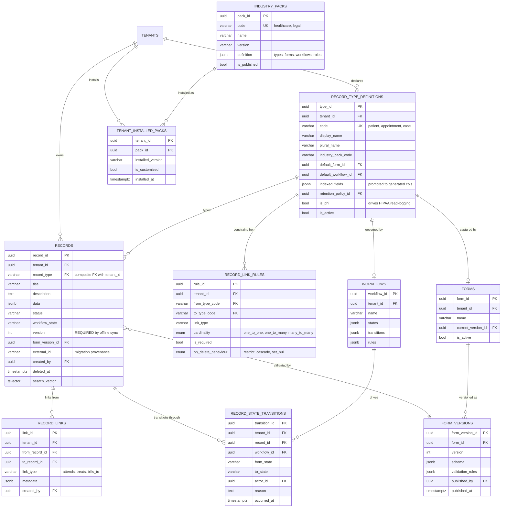
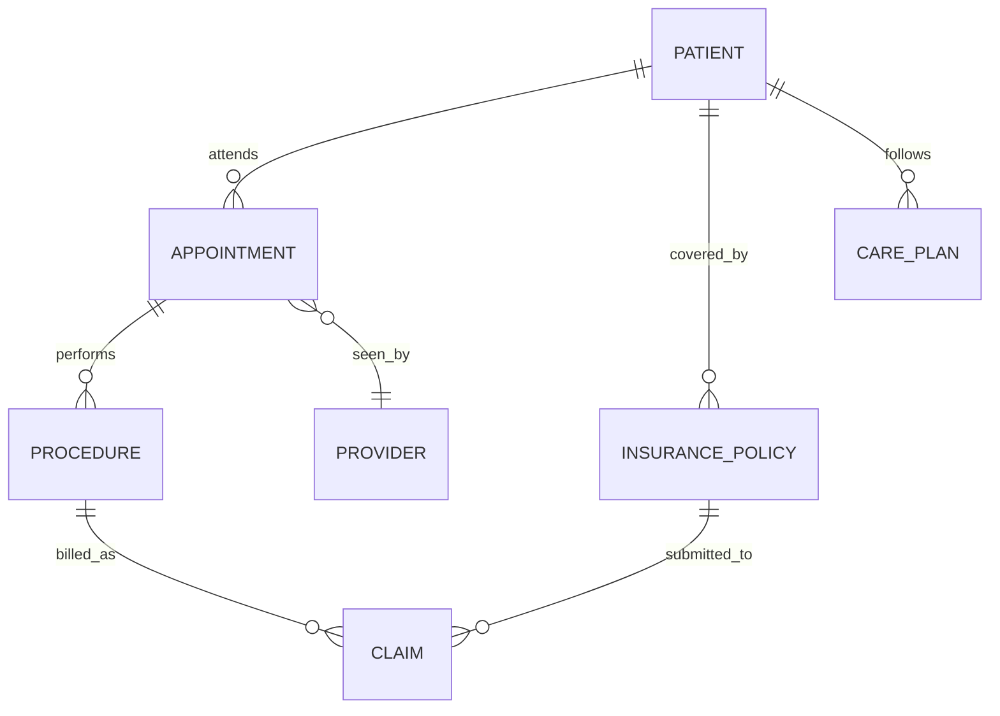

# 03 — Core Business Entity ERD

**Phase 1.1 deliverable** · Sources: `DATABASE_SCHEMA.md`, `TECH_STACK_PLAN.md`, `OFFLINE_SYNC_PROCESS.md`, `BUSINESS_PRODUCT_PLANNING.md`
**Status:** Draft for review

Covers the record substrate and how each industry vertical is expressed on top of it.

## Modelling approach: hybrid

`TECH_STACK_PLAN.md` commits the platform to being industry-agnostic — JSON-driven forms,
configurable workflows, custom fields, a plugin architecture. Adding real `patients` and
`appointments` tables would contradict that and force a schema migration per vertical.

But a pure JSONB store has no referential integrity: nothing stops an appointment from pointing
at a deleted patient, or at a record in another tenant, and there is no way to ask "show me every
appointment for this patient" without scanning JSON.

The hybrid keeps `records` as the single generic substrate and adds three things around it:

| Layer | Table | Purpose |
|---|---|---|
| **Type registry** | `record_type_definitions` | Declares that `patient` exists in this tenant, what form describes it, what workflow governs it |
| **Relationships** | `record_links` + `record_link_rules` | Real FK-backed edges between records, with declared, enforced cardinality |
| **Query surface** | Generated columns + partial indexes | Promotes hot JSONB fields (MRN, appointment date) to indexed columns without changing the storage model |

An "industry ERD" is therefore a *catalogue* — a set of record types, their form schemas, and
the links permitted between them — not a set of tables. Installing the healthcare pack seeds
rows, never DDL.

---

## Entity Diagram



---

## DDL

### Corrections to `records`

```sql
CREATE TYPE link_cardinality AS ENUM ('one_to_one', 'one_to_many', 'many_to_many');
CREATE TYPE link_on_delete   AS ENUM ('restrict', 'cascade', 'set_null');

ALTER TABLE records
    -- Offline sync compares local vs server version to detect conflicts. Without this column,
    -- the conflict-resolution flow in OFFLINE_SYNC_PROCESS.md:129-170 has nothing to compare.
    ADD COLUMN version         INTEGER NOT NULL DEFAULT 1,
    -- Which form schema validated this record. Schemas change; a record captured under v1
    -- must not be re-validated against v4 on read.
    ADD COLUMN form_version_id UUID REFERENCES form_versions(form_version_id),
    -- Provenance for migrated rows, so a re-run of an import is idempotent.
    ADD COLUMN external_id     VARCHAR(255);

CREATE UNIQUE INDEX uq_records_external_id
    ON records(tenant_id, record_type, external_id) WHERE external_id IS NOT NULL;
```

`version` must increment on every update, and must do so in the database rather than the
application — an offline client that syncs directly, or a bulk SQL fix, would otherwise leave
the counter stale and silently break conflict detection:

```sql
CREATE OR REPLACE FUNCTION bump_record_version() RETURNS TRIGGER AS $$
BEGIN
    IF NEW.version = OLD.version THEN        -- caller did not set it explicitly
        NEW.version := OLD.version + 1;
    END IF;
    NEW.updated_at := NOW();
    RETURN NEW;
END;
$$ LANGUAGE plpgsql;

CREATE TRIGGER records_version_trigger
    BEFORE UPDATE ON records
    FOR EACH ROW EXECUTE FUNCTION bump_record_version();
```

### Type registry

```sql
CREATE TABLE record_type_definitions (
    type_id             UUID PRIMARY KEY DEFAULT gen_random_uuid(),
    tenant_id           UUID NOT NULL REFERENCES tenants(tenant_id) ON DELETE CASCADE,
    code                VARCHAR(100) NOT NULL,      -- 'patient', 'appointment', 'case'
    display_name        VARCHAR(150) NOT NULL,
    plural_name         VARCHAR(150) NOT NULL,
    icon                VARCHAR(50),

    industry_pack_code  VARCHAR(50),                -- NULL for tenant-authored types
    default_form_id     UUID REFERENCES forms(form_id) ON DELETE SET NULL,
    default_workflow_id UUID REFERENCES workflows(workflow_id) ON DELETE SET NULL,

    -- Fields promoted out of data JSONB into indexed generated columns.
    indexed_fields      JSONB NOT NULL DEFAULT '[]',   -- ["mrn","date_of_birth"]

    retention_policy_id UUID,                       -- FK added in doc 04
    is_phi              BOOLEAN NOT NULL DEFAULT FALSE,
    is_active           BOOLEAN NOT NULL DEFAULT TRUE,
    created_at          TIMESTAMP WITH TIME ZONE NOT NULL DEFAULT NOW(),

    UNIQUE (tenant_id, code)
);

-- Ties every record to a declared type, per tenant. A typo in record_type now fails loudly
-- instead of creating an invisible orphan class of records.
ALTER TABLE records ADD CONSTRAINT fk_records_type
    FOREIGN KEY (tenant_id, record_type)
    REFERENCES record_type_definitions(tenant_id, code)
    ON UPDATE CASCADE;
```

The composite FK is what makes the hybrid safe: it costs nothing at query time, preserves every
existing index on `records(tenant_id, record_type, ...)`, and makes cross-tenant type references
structurally impossible.

`is_phi` is the flag that drives HIPAA read-logging in `04_AUDIT_COMPLIANCE_ERD.md` — reads of a
PHI record type must be logged, reads of a non-PHI one need not be.

### Relationships

```sql
CREATE TABLE record_links (
    link_id        UUID PRIMARY KEY DEFAULT gen_random_uuid(),
    tenant_id      UUID NOT NULL REFERENCES tenants(tenant_id) ON DELETE CASCADE,
    from_record_id UUID NOT NULL REFERENCES records(record_id) ON DELETE CASCADE,
    to_record_id   UUID NOT NULL REFERENCES records(record_id) ON DELETE CASCADE,
    link_type      VARCHAR(100) NOT NULL,      -- 'attends', 'treats', 'bills_to'
    metadata       JSONB NOT NULL DEFAULT '{}',
    created_by     UUID REFERENCES tenant_users(user_id),
    created_at     TIMESTAMP WITH TIME ZONE NOT NULL DEFAULT NOW(),

    UNIQUE (from_record_id, to_record_id, link_type),
    CHECK  (from_record_id <> to_record_id)
);

CREATE TABLE record_link_rules (
    rule_id             UUID PRIMARY KEY DEFAULT gen_random_uuid(),
    tenant_id           UUID NOT NULL REFERENCES tenants(tenant_id) ON DELETE CASCADE,
    from_type_code      VARCHAR(100) NOT NULL,
    to_type_code        VARCHAR(100) NOT NULL,
    link_type           VARCHAR(100) NOT NULL,
    cardinality         link_cardinality NOT NULL DEFAULT 'many_to_many',
    is_required         BOOLEAN NOT NULL DEFAULT FALSE,
    on_delete_behaviour link_on_delete NOT NULL DEFAULT 'restrict',
    created_at          TIMESTAMP WITH TIME ZONE NOT NULL DEFAULT NOW(),

    UNIQUE (tenant_id, from_type_code, to_type_code, link_type),
    FOREIGN KEY (tenant_id, from_type_code)
        REFERENCES record_type_definitions(tenant_id, code) ON UPDATE CASCADE,
    FOREIGN KEY (tenant_id, to_type_code)
        REFERENCES record_type_definitions(tenant_id, code) ON UPDATE CASCADE
);
```

A plain FK cannot express "an appointment links to exactly one patient" when both live in the
same table, so a trigger enforces the declared rule:

```sql
CREATE OR REPLACE FUNCTION enforce_record_link_rule() RETURNS TRIGGER AS $$
DECLARE
    v_from_type TEXT;
    v_to_type   TEXT;
    v_rule      record_link_rules%ROWTYPE;
    v_existing  INTEGER;
BEGIN
    SELECT record_type, tenant_id INTO v_from_type, NEW.tenant_id
      FROM records WHERE record_id = NEW.from_record_id;
    SELECT record_type INTO v_to_type
      FROM records WHERE record_id = NEW.to_record_id;

    SELECT * INTO v_rule FROM record_link_rules
     WHERE tenant_id      = NEW.tenant_id
       AND from_type_code = v_from_type
       AND to_type_code   = v_to_type
       AND link_type      = NEW.link_type;

    IF NOT FOUND THEN
        RAISE EXCEPTION 'No link rule permits % -> % via %', v_from_type, v_to_type, NEW.link_type
            USING ERRCODE = 'check_violation';
    END IF;

    IF v_rule.cardinality IN ('one_to_one', 'one_to_many') THEN
        SELECT COUNT(*) INTO v_existing FROM record_links
         WHERE from_record_id = NEW.from_record_id
           AND link_type      = NEW.link_type
           AND link_id       <> COALESCE(NEW.link_id, '00000000-0000-0000-0000-000000000000'::UUID);
        IF v_existing > 0 THEN
            RAISE EXCEPTION 'Cardinality % violated for link_type %', v_rule.cardinality, NEW.link_type
                USING ERRCODE = 'check_violation';
        END IF;
    END IF;

    RETURN NEW;
END;
$$ LANGUAGE plpgsql;

CREATE TRIGGER record_links_rule_trigger
    BEFORE INSERT OR UPDATE ON record_links
    FOR EACH ROW EXECUTE FUNCTION enforce_record_link_rule();
```

Both endpoints are resolved from `records`, which is itself under RLS, so a link can never span
two tenants: the lookup of a foreign record simply returns no row and the insert fails.

### Form versioning

`forms.version INTEGER` in the current schema is a counter with no history — editing a form
overwrites the schema that existing records were captured under.

```sql
CREATE TABLE form_versions (
    form_version_id  UUID PRIMARY KEY DEFAULT gen_random_uuid(),
    tenant_id        UUID NOT NULL REFERENCES tenants(tenant_id) ON DELETE CASCADE,
    form_id          UUID NOT NULL REFERENCES forms(form_id) ON DELETE CASCADE,
    version          INTEGER NOT NULL,
    schema           JSONB NOT NULL,
    validation_rules JSONB NOT NULL DEFAULT '{}',
    published_by     UUID REFERENCES tenant_users(user_id),
    published_at     TIMESTAMP WITH TIME ZONE,
    created_at       TIMESTAMP WITH TIME ZONE NOT NULL DEFAULT NOW(),

    UNIQUE (form_id, version)
);

ALTER TABLE forms ADD COLUMN current_version_id UUID REFERENCES form_versions(form_version_id);

COMMENT ON COLUMN forms.schema IS
    'DEPRECATED - migrate to form_versions.schema. Editing in place destroys the schema that
     already-submitted records were validated against.';
```

### Workflow history

```sql
CREATE TABLE record_state_transitions (
    transition_id UUID PRIMARY KEY DEFAULT gen_random_uuid(),
    tenant_id     UUID NOT NULL REFERENCES tenants(tenant_id) ON DELETE CASCADE,
    record_id     UUID NOT NULL REFERENCES records(record_id) ON DELETE CASCADE,
    workflow_id   UUID REFERENCES workflows(workflow_id) ON DELETE SET NULL,
    from_state    VARCHAR(100),
    to_state      VARCHAR(100) NOT NULL,
    actor_id      UUID REFERENCES tenant_users(user_id),
    reason        TEXT,
    occurred_at   TIMESTAMP WITH TIME ZONE NOT NULL DEFAULT NOW()
);

CREATE INDEX idx_transitions_record ON record_state_transitions(record_id, occurred_at DESC);
```

`records.workflow_state` holds only the current state. Compliance questions are almost always
historical — "who approved this incident report, and when?" — which needs the transition log.

### Industry packs

```sql
CREATE TABLE industry_packs (
    pack_id      UUID PRIMARY KEY DEFAULT gen_random_uuid(),
    code         VARCHAR(50) NOT NULL,
    name         VARCHAR(150) NOT NULL,
    version      VARCHAR(20) NOT NULL,
    definition   JSONB NOT NULL,   -- record types, forms, workflows, link rules, seed roles
    is_published BOOLEAN NOT NULL DEFAULT FALSE,
    created_at   TIMESTAMP WITH TIME ZONE NOT NULL DEFAULT NOW(),

    UNIQUE (code, version)
);

CREATE TABLE tenant_installed_packs (
    tenant_id         UUID NOT NULL REFERENCES tenants(tenant_id) ON DELETE CASCADE,
    pack_id           UUID NOT NULL REFERENCES industry_packs(pack_id) ON DELETE RESTRICT,
    installed_version VARCHAR(20) NOT NULL,
    is_customized     BOOLEAN NOT NULL DEFAULT FALSE,  -- blocks silent pack upgrades
    installed_at      TIMESTAMP WITH TIME ZONE NOT NULL DEFAULT NOW(),

    PRIMARY KEY (tenant_id, pack_id)
);
```

Installing a pack expands `definition` into `record_type_definitions`, `forms`, `form_versions`,
`workflows`, and `record_link_rules` rows for that tenant. Once a tenant edits any of those,
`is_customized` is set and upgrades require an explicit merge rather than an overwrite.

### Promoting hot fields

Fields listed in `indexed_fields` become generated columns. These are per-tenant-vertical DDL,
generated by the pack installer rather than hand-written:

```sql
-- Healthcare pack: medical record number and DOB drive nearly every patient lookup.
ALTER TABLE records
    ADD COLUMN gc_mrn TEXT GENERATED ALWAYS AS (data ->> 'mrn') STORED,
    ADD COLUMN gc_dob DATE GENERATED ALWAYS AS ((data ->> 'date_of_birth')::DATE) STORED;

CREATE UNIQUE INDEX uq_records_mrn ON records(tenant_id, gc_mrn)
    WHERE record_type = 'patient' AND gc_mrn IS NOT NULL AND deleted_at IS NULL;

CREATE INDEX idx_records_dob ON records(tenant_id, gc_dob)
    WHERE record_type = 'patient';
```

A generated column reads from JSONB but is stored and indexed like any other column, so this
buys real uniqueness and index performance without abandoning the flexible storage model.

Note `(data ->> 'date_of_birth')::DATE` is only immutable for a fixed input format; the form
schema must constrain DOB to ISO-8601 or the `ALTER TABLE` will fail on bad rows.

---

## Industry catalogues

These are seed data for `industry_packs.definition`, not tables.

### Healthcare



| record_type | is_phi | Key `data` fields | Links |
|---|---|---|---|
| `patient` | yes | mrn, date_of_birth, sex, contact, emergency_contact | → insurance_policy (`covered_by`, 1:N) |
| `provider` | no | npi, specialty, credentials, license_expiry | — |
| `appointment` | yes | scheduled_at, duration_min, location, reason | → patient (`attends`, N:1), → provider (`seen_by`, N:1) |
| `procedure` | yes | cpt_code, performed_at, notes, outcome | → appointment (`performs`, N:1) |
| `insurance_policy` | yes | payer, member_id, group_number, effective_dates | → patient (`covered_by`, N:1) |
| `claim` | yes | claim_number, amount_cents, status, submitted_at | → procedure, → insurance_policy |
| `care_plan` | yes | goals, review_due, assigned_to | → patient (`follows`, N:1) |

### Legal

| record_type | Key `data` fields | Links |
|---|---|---|
| `client` | organisation, contacts, conflict_check_status | — |
| `case` | matter_number, jurisdiction, opened_at, status | → client (`represents`, N:1) |
| `matter_document` | doc_type, filed_at, court_reference | → case (`filed_under`, N:1) |
| `time_entry` | minutes, rate_cents, narrative, billable | → case (`charged_to`, N:1) |

### Professional services

| record_type | Key `data` fields | Links |
|---|---|---|
| `client` | organisation, industry, account_manager | — |
| `project` | code, budget_cents, start_date, end_date | → client (`delivered_for`, N:1) |
| `task` | title, estimate_hours, due_date, status | → project (`part_of`, N:1) |
| `resource_assignment` | allocation_pct, from_date, to_date | → task, → user |

---

## Row-Level Security

```sql
ALTER TABLE record_type_definitions   ENABLE ROW LEVEL SECURITY;
ALTER TABLE record_links              ENABLE ROW LEVEL SECURITY;
ALTER TABLE record_link_rules         ENABLE ROW LEVEL SECURITY;
ALTER TABLE record_state_transitions  ENABLE ROW LEVEL SECURITY;
ALTER TABLE form_versions             ENABLE ROW LEVEL SECURITY;
ALTER TABLE tenant_installed_packs    ENABLE ROW LEVEL SECURITY;
-- plus FORCE ROW LEVEL SECURITY on each, and on the pre-existing records/forms/workflows.

CREATE POLICY tenant_isolation ON record_type_definitions  FOR ALL TO app_user
    USING (tenant_id = current_setting('app.current_tenant_id')::UUID);
CREATE POLICY tenant_isolation ON record_links             FOR ALL TO app_user
    USING (tenant_id = current_setting('app.current_tenant_id')::UUID);
CREATE POLICY tenant_isolation ON record_link_rules        FOR ALL TO app_user
    USING (tenant_id = current_setting('app.current_tenant_id')::UUID);
CREATE POLICY tenant_isolation ON record_state_transitions FOR ALL TO app_user
    USING (tenant_id = current_setting('app.current_tenant_id')::UUID);
CREATE POLICY tenant_isolation ON form_versions            FOR ALL TO app_user
    USING (tenant_id = current_setting('app.current_tenant_id')::UUID);

-- industry_packs is a global catalogue.
GRANT SELECT ON industry_packs TO app_user;
```

---

## Indexes

```sql
CREATE INDEX idx_record_types_tenant   ON record_type_definitions(tenant_id) WHERE is_active;
CREATE INDEX idx_links_from            ON record_links(from_record_id, link_type);
CREATE INDEX idx_links_to              ON record_links(to_record_id, link_type);
CREATE INDEX idx_links_tenant_type     ON record_links(tenant_id, link_type);
CREATE INDEX idx_form_versions_form    ON form_versions(form_id, version DESC);
CREATE INDEX idx_records_type_updated  ON records(tenant_id, record_type, updated_at DESC)
    WHERE deleted_at IS NULL;
```

`idx_links_to` matters as much as `idx_links_from`: "which appointments belong to this patient?"
traverses the edge backwards, and without it that is a sequential scan of every link in the tenant.

`idx_records_type_updated` is the index the incremental sync in `OFFLINE_SYNC_PROCESS.md` uses to
pull everything changed since the client's last checkpoint.

---

## Corrections to `DATABASE_SCHEMA.md`

| # | Issue | Resolution |
|---|---|---|
| 1 | `records` has no `version` column, but offline sync detects conflicts by comparing local and server versions — sync as documented cannot work | `version` column plus `bump_record_version()` trigger |
| 2 | `record_type` is a free-text `VARCHAR(100)` with no registry; a typo creates an invisible new class of records | `record_type_definitions` + composite FK |
| 3 | No way to relate one record to another, so "this appointment's patient" is unrepresentable | `record_links` + `record_link_rules` |
| 4 | `forms.version` is a counter with no history; editing a form invalidates records captured under the old schema | `form_versions`, `records.form_version_id` |
| 5 | `records.workflow_state` keeps only the current state, so approval history is lost | `record_state_transitions` |
| 6 | "Plugin architecture / industry-specific modules" has no data model | `industry_packs`, `tenant_installed_packs` |
| 7 | No provenance column for migrated data, so re-running an import duplicates rows | `external_id` + partial unique index |

---

## Open questions

1. **Link deletion semantics.** `record_link_rules.on_delete_behaviour` is declared but not yet
   enforced — `record_links` currently cascades on record delete regardless. Deleting a patient
   with live appointments should probably be `restrict`; needs a rule-driven delete trigger.
2. **Soft delete and links.** `records.deleted_at` is a soft delete, so a link can point at a
   soft-deleted record. Should link traversal filter these out by default? Recommend yes, via a
   view, but it changes every read path.
3. **Generated column proliferation.** Each vertical adds `gc_*` columns to the shared `records`
   table, so a tenant on the legal pack still carries healthcare's `gc_mrn`. At three verticals
   this is harmless; at twenty it is not. Partitioning `records` by `record_type`, or moving hot
   fields to a sidecar table, is the escape hatch if the column count grows.
4. **`data` schema enforcement.** Nothing currently validates `data` against
   `form_versions.schema` at the database level. Application-layer validation is assumed;
   a `jsonb_matches_schema` CHECK (pg_jsonschema extension) is the alternative.
5. **Healthcare vs. health-and-safety vocabulary.** This catalogue uses the patient/appointment/
   claim entities named in `NEXT_STAGE_NOTES.md`. If the primary vertical is actually workplace
   health & safety (incidents, inspections, corrective actions, SDS), the healthcare pack should
   be re-scoped before it is seeded. Flagged as a naming question, not a modelling one.
