# 04 — Audit & Compliance ERD

**Phase 1.1 deliverable** · Sources: `DATABASE_SCHEMA.md`, `SECURITY_ARCHITECTURE.md`, `REMAINING_PLANNING_AREAS.md`
**Status:** Draft for review

Covers the three audit logs, audit immutability, retention and purge, legal holds, and
GDPR/CCPA subject-rights records.

Per `RULE-HSC-01`/`RULE-HSC-02` in the project invariants: tenant isolation is enforced by
row-level security and every data access is audit-logged by database trigger. A write path that
skips the audit trigger is a compliance defect, not merely a bug — which makes the two trigger
faults in `DATABASE_SCHEMA.md` (below) the highest-priority corrections in this whole phase.

---

## Entity Diagram

```mermaid
erDiagram
    TENANTS ||--o{ USER_AUDIT_LOG : "scoped to"
    TENANTS ||--o{ DATA_AUDIT_LOG : "scoped to"
    TENANTS ||--o{ SYSTEM_AUDIT_LOG : "scoped to"
    TENANTS ||--o{ RETENTION_POLICIES : "defines"
    TENANTS ||--o{ RETENTION_HOLDS : "places"
    TENANTS ||--o{ DATA_SUBJECT_REQUESTS : "processes"
    TENANTS ||--o{ CONSENT_RECORDS : "records"

    TENANT_USERS ||--o{ USER_AUDIT_LOG : "acts in"
    TENANT_USERS ||--o{ DATA_AUDIT_LOG : "changes via"
    RECORD_TYPE_DEFINITIONS ||--o{ RETENTION_POLICIES : "governed by"
    RETENTION_POLICIES ||--o{ PURGE_JOBS : "executed by"
    RETENTION_HOLDS ||--o{ PURGE_JOBS : "blocks"
    USER_AUDIT_LOG ||--o{ AUDIT_LOG_ARCHIVES : "sealed into"

    USER_AUDIT_LOG {
        uuid audit_id PK
        uuid tenant_id FK
        uuid user_id FK
        varchar user_email "denormalized, survives user deletion"
        varchar action "login, view, create, export"
        varchar resource_type
        uuid resource_id
        bool is_phi_access "HIPAA read logging"
        inet ip_address
        text user_agent
        uuid session_id FK
        jsonb details
        timestamptz timestamp
    }

    DATA_AUDIT_LOG {
        uuid audit_id PK
        uuid tenant_id FK
        varchar table_name
        uuid record_id "resolved per-table PK"
        varchar operation "INSERT, UPDATE, DELETE"
        jsonb old_values
        jsonb new_values
        text_array changed_fields
        uuid changed_by FK
        timestamptz timestamp
    }

    SYSTEM_AUDIT_LOG {
        uuid audit_id PK
        uuid tenant_id FK "null for platform events"
        varchar event_type
        varchar event_category "security, performance, data"
        varchar severity
        text message
        jsonb details
        uuid correlation_id
        timestamptz timestamp
    }

    RETENTION_POLICIES {
        uuid policy_id PK
        uuid tenant_id FK
        enum scope "record_type, file, audit_log"
        varchar target_code "the record_type it applies to"
        int retain_for_days
        enum action "purge, anonymize, archive"
        varchar legal_basis "HIPAA 6yr, GDPR"
        bool is_active
    }

    RETENTION_HOLDS {
        uuid hold_id PK
        uuid tenant_id FK
        enum scope
        uuid target_id "null = whole scope"
        text reason
        uuid placed_by FK
        timestamptz placed_at
        timestamptz released_at
    }

    PURGE_JOBS {
        uuid job_id PK
        uuid tenant_id FK
        uuid policy_id FK
        timestamptz scheduled_for
        enum status "job_status"
        int rows_affected
        int rows_skipped_on_hold
        text error
        timestamptz completed_at
    }

    DATA_SUBJECT_REQUESTS {
        uuid request_id PK
        uuid tenant_id FK
        varchar subject_email
        uuid subject_record_id FK
        enum request_type "access, erasure, portability"
        enum status
        timestamptz received_at
        timestamptz due_at "statutory deadline"
        timestamptz completed_at
        uuid handled_by FK
        uuid export_file_id FK
    }

    CONSENT_RECORDS {
        uuid consent_id PK
        uuid tenant_id FK
        uuid subject_record_id FK
        varchar purpose "treatment, marketing"
        bool granted
        varchar policy_version
        varchar source "web_form, paper, verbal"
        timestamptz granted_at
        timestamptz withdrawn_at
    }

    AUDIT_LOG_ARCHIVES {
        uuid archive_id PK
        uuid tenant_id FK
        varchar log_table
        timestamptz period_start
        timestamptz period_end
        text object_key "S3 Glacier"
        varchar checksum
        bigint row_count
        timestamptz sealed_at
    }
```



---

## Critical corrections to the existing audit trigger

### Fault 1 — the trigger throws on two of the three tables it is attached to

`DATABASE_SCHEMA.md` defines `create_audit_log()` referencing `NEW.record_id` / `OLD.record_id`,
then attaches it to three tables:

| Table | Primary key | Result |
|---|---|---|
| `records` | `record_id` | works |
| `files` | `file_id` | **`record "new" has no field "record_id"` at runtime** |
| `tenant_users` | `user_id` | **`record "new" has no field "record_id"` at runtime** |

Every insert, update, and delete on `files` and `tenant_users` currently fails. That is not a
silent gap — those two tables are simply unwritable until this is fixed.

### Fault 2 — `current_setting` without `missing_ok` aborts non-request writes

`current_setting('app.current_user_id')::UUID` raises `undefined_object` whenever the GUC is
unset. It is unset for every background job, migration, webhook handler, and psql session. Any
such write to an audited table therefore fails.

### Corrected function

```sql
CREATE OR REPLACE FUNCTION create_audit_log() RETURNS TRIGGER AS $$
DECLARE
    v_pk_column TEXT := TG_ARGV[0];      -- PK column name, passed per trigger
    v_row       JSONB;
    v_record_id UUID;
    v_actor     UUID;
    v_changed   TEXT[];
BEGIN
    -- NULL when no request context is set (background jobs, migrations) instead of raising.
    v_actor := NULLIF(current_setting('app.current_user_id', TRUE), '')::UUID;

    v_row := to_jsonb(COALESCE(NEW, OLD));
    v_record_id := (v_row ->> v_pk_column)::UUID;

    IF TG_OP = 'UPDATE' THEN
        SELECT array_agg(key) INTO v_changed
          FROM jsonb_each(to_jsonb(NEW))
         WHERE to_jsonb(NEW) -> key IS DISTINCT FROM to_jsonb(OLD) -> key;

        -- Nothing actually changed (e.g. a no-op save); do not write an empty audit row.
        IF v_changed IS NULL THEN
            RETURN NEW;
        END IF;
    END IF;

    INSERT INTO data_audit_log (
        tenant_id, table_name, record_id, operation,
        old_values, new_values, changed_fields, changed_by, timestamp
    ) VALUES (
        COALESCE(NEW.tenant_id, OLD.tenant_id),
        TG_TABLE_NAME,
        v_record_id,
        TG_OP,
        CASE WHEN TG_OP IN ('UPDATE', 'DELETE') THEN to_jsonb(OLD) END,
        CASE WHEN TG_OP IN ('INSERT', 'UPDATE') THEN to_jsonb(NEW) END,
        v_changed,
        v_actor,
        NOW()
    );

    RETURN COALESCE(NEW, OLD);
END;
$$ LANGUAGE plpgsql SECURITY DEFINER;
```

`SECURITY DEFINER` matters: the audit tables deny `INSERT` to `app_user` directly (see
immutability below), so the trigger must run with the owner's rights to write them.

```sql
DROP TRIGGER IF EXISTS records_audit_trigger      ON records;
DROP TRIGGER IF EXISTS files_audit_trigger        ON files;
DROP TRIGGER IF EXISTS tenant_users_audit_trigger ON tenant_users;

CREATE TRIGGER records_audit_trigger AFTER INSERT OR UPDATE OR DELETE ON records
    FOR EACH ROW EXECUTE FUNCTION create_audit_log('record_id');
CREATE TRIGGER files_audit_trigger AFTER INSERT OR UPDATE OR DELETE ON files
    FOR EACH ROW EXECUTE FUNCTION create_audit_log('file_id');
CREATE TRIGGER tenant_users_audit_trigger AFTER INSERT OR UPDATE OR DELETE ON tenant_users
    FOR EACH ROW EXECUTE FUNCTION create_audit_log('user_id');

-- Tables added in this phase that also hold regulated or security-relevant state.
CREATE TRIGGER record_links_audit_trigger AFTER INSERT OR UPDATE OR DELETE ON record_links
    FOR EACH ROW EXECUTE FUNCTION create_audit_log('link_id');
CREATE TRIGGER user_roles_audit_trigger AFTER INSERT OR UPDATE OR DELETE ON user_roles
    FOR EACH ROW EXECUTE FUNCTION create_audit_log('user_id');
CREATE TRIGGER sso_connections_audit_trigger AFTER INSERT OR UPDATE OR DELETE ON sso_connections
    FOR EACH ROW EXECUTE FUNCTION create_audit_log('connection_id');
```

**Do not attach this trigger to `tenant_users` without masking.** `to_jsonb(NEW)` on that table
copies `password_hash` and `mfa_secret` into `data_audit_log.new_values` in plaintext, turning
the audit log into a credential store that outlives password rotation. Mask before writing:

```sql
CREATE OR REPLACE FUNCTION mask_sensitive(p_table TEXT, p_row JSONB) RETURNS JSONB AS $$
BEGIN
    IF p_table = 'tenant_users' THEN
        RETURN p_row - 'password_hash' - 'mfa_secret';
    ELSIF p_table = 'sso_connections' THEN
        RETURN p_row - 'oidc_client_secret_encrypted';
    ELSIF p_table = 'mfa_methods' THEN
        RETURN p_row - 'secret_encrypted';
    END IF;
    RETURN p_row;
END;
$$ LANGUAGE plpgsql IMMUTABLE;
```

...applied to both `old_values` and `new_values` in the insert above.

### Fault 3 — reads are not logged, but HIPAA requires it

`data_audit_log` is written by a trigger on INSERT/UPDATE/DELETE only. HIPAA §164.312(b)
requires recording *access* to PHI, and `SECURITY_ARCHITECTURE.md:291-293` lists "record
views", "file downloads", and "search queries" among the events to audit. A database trigger
cannot observe a `SELECT`.

Read logging must therefore be written by the application into `user_audit_log`, on every read
of a record whose `record_type_definitions.is_phi` is true. This is a load-bearing application
responsibility that the schema cannot enforce — worth stating explicitly in the API layer's
definition of done.

```sql
ALTER TABLE user_audit_log
    ADD COLUMN is_phi_access BOOLEAN NOT NULL DEFAULT FALSE,
    ADD COLUMN session_id    UUID;   -- correlate to sessions (doc 02)

CREATE INDEX idx_user_audit_phi ON user_audit_log(tenant_id, timestamp DESC)
    WHERE is_phi_access;
```

---

## Audit immutability

An audit log that the application can rewrite is not evidence. Nothing in the current schema
prevents `app_user` from updating or deleting audit rows.

```sql
REVOKE UPDATE, DELETE, TRUNCATE ON user_audit_log, data_audit_log, system_audit_log FROM app_user;
REVOKE INSERT ON data_audit_log FROM app_user;   -- trigger-only, via SECURITY DEFINER
GRANT  SELECT ON user_audit_log, data_audit_log, system_audit_log TO app_user;
GRANT  INSERT ON user_audit_log, system_audit_log TO app_user;   -- app writes reads/events

CREATE OR REPLACE FUNCTION deny_audit_mutation() RETURNS TRIGGER AS $$
BEGIN
    RAISE EXCEPTION 'Audit records are append-only (attempted % on %)', TG_OP, TG_TABLE_NAME
        USING ERRCODE = 'insufficient_privilege';
END;
$$ LANGUAGE plpgsql;

CREATE TRIGGER user_audit_immutable   BEFORE UPDATE OR DELETE ON user_audit_log
    FOR EACH STATEMENT EXECUTE FUNCTION deny_audit_mutation();
CREATE TRIGGER data_audit_immutable   BEFORE UPDATE OR DELETE ON data_audit_log
    FOR EACH STATEMENT EXECUTE FUNCTION deny_audit_mutation();
CREATE TRIGGER system_audit_immutable BEFORE UPDATE OR DELETE ON system_audit_log
    FOR EACH STATEMENT EXECUTE FUNCTION deny_audit_mutation();
```

The trigger is deliberately belt-and-braces alongside the `REVOKE`: privileges can be re-granted
by a later migration without anyone noticing, whereas a dropped trigger is conspicuous.

Retention purges must therefore run as the table owner, not `app_user` — the one legitimate
path that bypasses these triggers, and one that writes its own `system_audit_log` entry.

### Missing RLS on `system_audit_log`

`DATABASE_SCHEMA.md` enables RLS on seven tables but omits `system_audit_log`, which carries a
nullable `tenant_id`. Every tenant can currently read every other tenant's system events.

```sql
ALTER TABLE system_audit_log ENABLE ROW LEVEL SECURITY;
ALTER TABLE system_audit_log FORCE  ROW LEVEL SECURITY;

-- Tenant-scoped rows are visible to that tenant; platform rows (tenant_id IS NULL) to no one.
CREATE POLICY tenant_isolation ON system_audit_log FOR ALL TO app_user
    USING (tenant_id = current_setting('app.current_tenant_id')::UUID);

-- And add FORCE to the eight tables that already have RLS enabled but not forced.
ALTER TABLE tenant_configurations FORCE ROW LEVEL SECURITY;
ALTER TABLE tenant_users          FORCE ROW LEVEL SECURITY;
ALTER TABLE records               FORCE ROW LEVEL SECURITY;
ALTER TABLE forms                 FORCE ROW LEVEL SECURITY;
ALTER TABLE files                 FORCE ROW LEVEL SECURITY;
ALTER TABLE workflows             FORCE ROW LEVEL SECURITY;
ALTER TABLE user_audit_log        FORCE ROW LEVEL SECURITY;
ALTER TABLE data_audit_log        FORCE ROW LEVEL SECURITY;
```

---

## Partitioning

Audit volume is the fastest-growing thing in the database, and retention deletes by age. Monthly
range partitions turn a multi-hour `DELETE` into an instant `DROP PARTITION`.

```sql
-- Declared at table creation; existing definitions need a rebuild-and-copy migration.
CREATE TABLE data_audit_log (
    -- ... columns as corrected above ...
    PRIMARY KEY (audit_id, timestamp)     -- partition key must be in the PK
) PARTITION BY RANGE (timestamp);

CREATE TABLE data_audit_log_2026_09 PARTITION OF data_audit_log
    FOR VALUES FROM ('2026-09-01') TO ('2026-10-01');
```

Partition creation is a monthly maintenance job; `pg_partman` is the assumed tool. The same
applies to `user_audit_log` and `system_audit_log`.

Note the primary key must become composite — `(audit_id, timestamp)` — because Postgres requires
the partition key to be part of every unique constraint.

---

## Retention, holds, and purge

```sql
CREATE TYPE retention_scope  AS ENUM ('record_type', 'file', 'audit_log');
CREATE TYPE retention_action AS ENUM ('purge', 'anonymize', 'archive');
CREATE TYPE dsr_type         AS ENUM ('access', 'erasure', 'portability', 'rectification');
CREATE TYPE dsr_status       AS ENUM ('received', 'verifying', 'in_progress', 'completed', 'rejected');

CREATE TABLE retention_policies (
    policy_id       UUID PRIMARY KEY DEFAULT gen_random_uuid(),
    tenant_id       UUID NOT NULL REFERENCES tenants(tenant_id) ON DELETE CASCADE,
    scope           retention_scope NOT NULL,
    target_code     VARCHAR(100),          -- record_type code, or NULL for whole-scope
    retain_for_days INTEGER NOT NULL CHECK (retain_for_days > 0),
    action          retention_action NOT NULL DEFAULT 'archive',
    legal_basis     VARCHAR(255) NOT NULL, -- 'HIPAA 45 CFR 164.316(b)(2) - 6 years'
    is_active       BOOLEAN NOT NULL DEFAULT TRUE,
    created_at      TIMESTAMP WITH TIME ZONE NOT NULL DEFAULT NOW(),

    UNIQUE (tenant_id, scope, target_code)
);

ALTER TABLE record_type_definitions ADD CONSTRAINT fk_rtd_retention
    FOREIGN KEY (retention_policy_id) REFERENCES retention_policies(policy_id) ON DELETE SET NULL;

CREATE TABLE retention_holds (
    hold_id     UUID PRIMARY KEY DEFAULT gen_random_uuid(),
    tenant_id   UUID NOT NULL REFERENCES tenants(tenant_id) ON DELETE CASCADE,
    scope       retention_scope NOT NULL,
    target_id   UUID,                      -- specific record/file, or NULL for the whole scope
    reason      TEXT NOT NULL,
    placed_by   UUID REFERENCES tenant_users(user_id),
    placed_at   TIMESTAMP WITH TIME ZONE NOT NULL DEFAULT NOW(),
    released_at TIMESTAMP WITH TIME ZONE
);

CREATE INDEX idx_holds_active ON retention_holds(tenant_id, scope, target_id)
    WHERE released_at IS NULL;

CREATE TABLE purge_jobs (
    job_id               UUID PRIMARY KEY DEFAULT gen_random_uuid(),
    tenant_id            UUID NOT NULL REFERENCES tenants(tenant_id) ON DELETE CASCADE,
    policy_id            UUID REFERENCES retention_policies(policy_id) ON DELETE SET NULL,
    scheduled_for        TIMESTAMP WITH TIME ZONE NOT NULL,
    status               job_status NOT NULL DEFAULT 'pending',
    rows_affected        INTEGER NOT NULL DEFAULT 0,
    rows_skipped_on_hold INTEGER NOT NULL DEFAULT 0,
    error                TEXT,
    started_at           TIMESTAMP WITH TIME ZONE,
    completed_at         TIMESTAMP WITH TIME ZONE
);
```

**A legal hold always outranks a retention policy.** Every purge must exclude held targets and
count what it skipped — `rows_skipped_on_hold` is the number an auditor asks for. Purging data
under legal hold is spoliation, so this is the one place where failing closed matters more than
completing the job.

```sql
CREATE OR REPLACE FUNCTION is_on_hold(p_tenant UUID, p_scope retention_scope, p_target UUID)
RETURNS BOOLEAN AS $$
    SELECT EXISTS (
        SELECT 1 FROM retention_holds
         WHERE tenant_id = p_tenant
           AND scope     = p_scope
           AND released_at IS NULL
           AND (target_id IS NULL OR target_id = p_target));
$$ LANGUAGE sql STABLE;
```

### Archive sealing

```sql
CREATE TABLE audit_log_archives (
    archive_id   UUID PRIMARY KEY DEFAULT gen_random_uuid(),
    tenant_id    UUID REFERENCES tenants(tenant_id) ON DELETE SET NULL,
    log_table    VARCHAR(50) NOT NULL,
    period_start TIMESTAMP WITH TIME ZONE NOT NULL,
    period_end   TIMESTAMP WITH TIME ZONE NOT NULL,
    object_key   TEXT NOT NULL,          -- S3 Glacier object, Object Lock enabled
    checksum     VARCHAR(64) NOT NULL,   -- SHA-256 of the exported file
    row_count    BIGINT NOT NULL,
    sealed_at    TIMESTAMP WITH TIME ZONE NOT NULL DEFAULT NOW()
);
```

`checksum` is what makes a restored archive provably the one that was sealed; without it, a
cold-storage export is not evidence either.

---

## Subject rights (GDPR / CCPA)

`REMAINING_PLANNING_AREAS.md` commits to GDPR, CCPA, and PIPEDA compliance, and
`SECURITY_ARCHITECTURE.md` has a "Privacy Rights Automation" section. Neither has a data model.

```sql
CREATE TABLE data_subject_requests (
    request_id        UUID PRIMARY KEY DEFAULT gen_random_uuid(),
    tenant_id         UUID NOT NULL REFERENCES tenants(tenant_id) ON DELETE CASCADE,
    subject_email     VARCHAR(255),
    subject_record_id UUID REFERENCES records(record_id) ON DELETE SET NULL,
    request_type      dsr_type NOT NULL,
    status            dsr_status NOT NULL DEFAULT 'received',
    received_at       TIMESTAMP WITH TIME ZONE NOT NULL DEFAULT NOW(),
    due_at            TIMESTAMP WITH TIME ZONE NOT NULL,   -- GDPR: received_at + 30 days
    completed_at      TIMESTAMP WITH TIME ZONE,
    handled_by        UUID REFERENCES tenant_users(user_id),
    export_file_id    UUID,                                -- FK to files, see doc 05
    rejection_reason  TEXT,

    CHECK (status <> 'rejected' OR rejection_reason IS NOT NULL)
);

CREATE INDEX idx_dsr_due ON data_subject_requests(due_at)
    WHERE status NOT IN ('completed', 'rejected');

CREATE TABLE consent_records (
    consent_id        UUID PRIMARY KEY DEFAULT gen_random_uuid(),
    tenant_id         UUID NOT NULL REFERENCES tenants(tenant_id) ON DELETE CASCADE,
    subject_record_id UUID NOT NULL REFERENCES records(record_id) ON DELETE CASCADE,
    purpose           VARCHAR(100) NOT NULL,    -- 'treatment' | 'marketing' | 'research'
    granted           BOOLEAN NOT NULL,
    policy_version    VARCHAR(20) NOT NULL,     -- which privacy policy they agreed to
    source            VARCHAR(50) NOT NULL,     -- 'web_form' | 'paper' | 'verbal'
    granted_at        TIMESTAMP WITH TIME ZONE,
    withdrawn_at      TIMESTAMP WITH TIME ZONE,
    created_at        TIMESTAMP WITH TIME ZONE NOT NULL DEFAULT NOW()
);

CREATE INDEX idx_consent_subject ON consent_records(subject_record_id, purpose);
```

An erasure request is not a `DELETE`. HIPAA retention (six years) and GDPR erasure genuinely
conflict for the same row, and the retention obligation wins for records with a treatment basis.
`retention_action = 'anonymize'` is the resolution: strip direct identifiers, keep the clinical
record and its audit trail. The `data_subject_requests` row is itself retained as proof the
request was handled — which is why erasure never cascades to this table.

---

## Row-Level Security

```sql
ALTER TABLE retention_policies    ENABLE ROW LEVEL SECURITY;
ALTER TABLE retention_holds       ENABLE ROW LEVEL SECURITY;
ALTER TABLE purge_jobs            ENABLE ROW LEVEL SECURITY;
ALTER TABLE data_subject_requests ENABLE ROW LEVEL SECURITY;
ALTER TABLE consent_records       ENABLE ROW LEVEL SECURITY;
ALTER TABLE audit_log_archives    ENABLE ROW LEVEL SECURITY;
-- plus FORCE ROW LEVEL SECURITY on each.

CREATE POLICY tenant_isolation ON retention_policies    FOR ALL TO app_user
    USING (tenant_id = current_setting('app.current_tenant_id')::UUID);
CREATE POLICY tenant_isolation ON retention_holds       FOR ALL TO app_user
    USING (tenant_id = current_setting('app.current_tenant_id')::UUID);
CREATE POLICY tenant_isolation ON data_subject_requests FOR ALL TO app_user
    USING (tenant_id = current_setting('app.current_tenant_id')::UUID);
CREATE POLICY tenant_isolation ON consent_records       FOR ALL TO app_user
    USING (tenant_id = current_setting('app.current_tenant_id')::UUID);
```

---

## Indexes

```sql
-- Existing indexes stay; these are added for the compliance query paths.
CREATE INDEX idx_data_audit_record    ON data_audit_log(tenant_id, table_name, record_id, timestamp DESC);
CREATE INDEX idx_data_audit_actor     ON data_audit_log(tenant_id, changed_by, timestamp DESC);
CREATE INDEX idx_user_audit_actor     ON user_audit_log(tenant_id, user_id, timestamp DESC);
CREATE INDEX idx_user_audit_resource  ON user_audit_log(tenant_id, resource_type, resource_id, timestamp DESC);
CREATE INDEX idx_system_audit_corr    ON system_audit_log(correlation_id) WHERE correlation_id IS NOT NULL;
```

`idx_data_audit_record` answers the single most common audit question — "show me the full history
of this one record" — which the existing `(tenant_id, table_name, timestamp)` index cannot do
without scanning a whole table's worth of audit rows.

---

## Corrections to `DATABASE_SCHEMA.md`

| # | Severity | Issue | Resolution |
|---|---|---|---|
| 1 | **Blocking** | `create_audit_log()` reads `NEW.record_id`, but is attached to `files` (PK `file_id`) and `tenant_users` (PK `user_id`) — every write to those two tables raises | PK column passed as `TG_ARGV[0]`, row read via `to_jsonb` |
| 2 | **Blocking** | `current_setting('app.current_user_id')` without `missing_ok` raises for every background job, migration, and webhook write | `current_setting(..., TRUE)` wrapped in `NULLIF` |
| 3 | **High** | Trigger copies `password_hash` and `mfa_secret` into `data_audit_log` in plaintext, outliving password rotation | `mask_sensitive()` applied to both value columns |
| 4 | **High** | `system_audit_log` has no RLS despite a nullable `tenant_id`; every tenant can read every other tenant's system events | RLS enabled + policy |
| 5 | **High** | No table uses `FORCE ROW LEVEL SECURITY`, so the owning role bypasses tenant isolation entirely | `FORCE` added across all tenant tables |
| 6 | **High** | Audit tables are freely updatable and deletable by `app_user` | `REVOKE` + append-only triggers |
| 7 | **High** | HIPAA requires logging PHI *reads*; a write trigger cannot see `SELECT` | `user_audit_log.is_phi_access`, written by the application |
| 8 | Medium | `changed_fields TEXT[]` is declared but never populated by the trigger | Computed via `jsonb_each` diff |
| 9 | Medium | No retention, legal-hold, purge, consent, or subject-request model despite all being committed to | Tables added above |
| 10 | Medium | Audit tables are unpartitioned, so retention deletes will be long-running `DELETE`s against the hottest tables | Monthly range partitioning |

---

## Open questions

1. **Retention defaults.** `retain_for_days` is per-tenant with no default. HIPAA is six years
   from creation or last effective date; GDPR has no fixed period. A platform default of 2190
   days for PHI record types is the safe starting point but needs legal sign-off, not an
   engineering decision.
2. **Audit of the audit tables.** Retention purges are the only writes that bypass immutability.
   Should the purge itself be counter-signed — e.g. an entry in a separate append-only ledger —
   or is a `system_audit_log` row sufficient evidence?
3. **`data_audit_log` size.** Storing full `old_values` and `new_values` roughly triples storage
   for update-heavy record types. Storing only the changed-field delta is far smaller but makes
   point-in-time reconstruction require replaying the whole chain.
4. **Cross-tenant platform events.** `system_audit_log` rows with `tenant_id IS NULL` are now
   invisible to `app_user`. Platform operators need a separate role and read path; that role's
   own access to tenant data must itself be audited.
5. **Subject identity matching.** `data_subject_requests.subject_email` is free text. Matching a
   request to the right `records` row across a tenant with unverified emails is the hard part of
   subject-rights automation, and is not solved by the schema alone.
