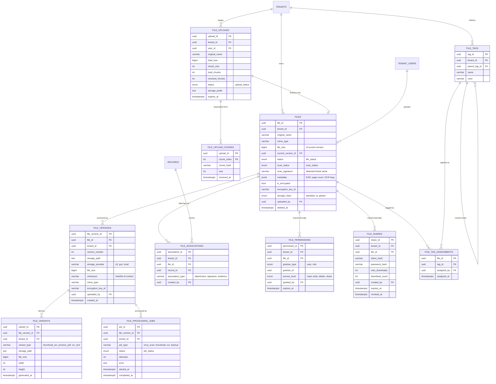

# 05 — File & Document Management ERD

**Phase 1.1 deliverable** · Sources: `DATABASE_SCHEMA.md`, `FILE_UPLOAD_STORAGE.md`, `OFFLINE_SYNC_PROCESS.md`
**Status:** Draft for review

Covers file metadata and versioning, processing variants, chunked-upload state, tagging,
permissions and sharing, and storage lifecycle.

The two source documents disagree about what the `files` table contains.
`FILE_UPLOAD_STORAGE.md:165-190` lists `checksum`, `processed_variants`, `access_permissions`,
`metadata`, `updated_at` and `deleted_at`; `DATABASE_SCHEMA.md` has none of them. This document
reconciles the two, taking the upload document as the requirement and the schema document as the
starting point.

---

## Entity Diagram



---

## DDL

### Enumerated types

```sql
CREATE TYPE file_status   AS ENUM ('uploading', 'scanning', 'available', 'quarantined', 'failed', 'deleted');
CREATE TYPE scan_status   AS ENUM ('pending', 'clean', 'infected', 'unscannable', 'skipped');
CREATE TYPE upload_status AS ENUM ('initiated', 'in_progress', 'assembling', 'completed', 'aborted', 'expired');
CREATE TYPE storage_class AS ENUM ('standard', 'infrequent_access', 'glacier', 'deep_archive');
CREATE TYPE grantee_type  AS ENUM ('user', 'role');
CREATE TYPE file_access   AS ENUM ('read', 'write', 'delete', 'share');
```

### `files` reconciliation

```sql
ALTER TABLE files
    ADD COLUMN current_version_id UUID,          -- FK added after file_versions exists
    ADD COLUMN status             file_status NOT NULL DEFAULT 'uploading',
    ADD COLUMN scan_status        scan_status NOT NULL DEFAULT 'pending',
    ADD COLUMN scan_signature     VARCHAR(255),  -- threat name when infected
    ADD COLUMN scanned_at         TIMESTAMP WITH TIME ZONE,
    ADD COLUMN metadata           JSONB NOT NULL DEFAULT '{}',
    ADD COLUMN storage_class      storage_class NOT NULL DEFAULT 'standard',
    ADD COLUMN transitioned_at    TIMESTAMP WITH TIME ZONE,
    ADD COLUMN updated_at         TIMESTAMP WITH TIME ZONE NOT NULL DEFAULT NOW(),
    ADD COLUMN deleted_at         TIMESTAMP WITH TIME ZONE;

-- Per-version storage moves to file_versions; these stay only until backfill completes.
COMMENT ON COLUMN files.storage_path IS
    'DEPRECATED - read file_versions.storage_path for the current_version_id.';
COMMENT ON COLUMN files.file_type IS
    'DEPRECATED - redundant with mime_type.';
```

**A file is not downloadable until it is scanned.** `FILE_UPLOAD_STORAGE.md:253-255` puts virus
scanning between upload and availability, but nothing in the schema records the outcome, so a
download handler has nothing to check. The `status`/`scan_status` pair is what the handler gates
on, and the constraint makes the invalid combination unrepresentable:

```sql
ALTER TABLE files ADD CONSTRAINT files_available_implies_clean
    CHECK (status <> 'available' OR scan_status IN ('clean', 'skipped'));
```

### Versioning

```sql
CREATE TABLE file_versions (
    file_version_id  UUID PRIMARY KEY DEFAULT gen_random_uuid(),
    tenant_id        UUID NOT NULL REFERENCES tenants(tenant_id) ON DELETE CASCADE,
    file_id          UUID NOT NULL REFERENCES files(file_id) ON DELETE CASCADE,
    version_number   INTEGER NOT NULL,
    storage_path     TEXT NOT NULL,
    storage_provider VARCHAR(50) NOT NULL DEFAULT 's3',
    file_size        BIGINT NOT NULL,
    checksum         VARCHAR(64) NOT NULL,     -- SHA-256 of the stored object
    mime_type        VARCHAR(100),
    encryption_key_id VARCHAR(255),
    uploaded_by      UUID REFERENCES tenant_users(user_id),
    created_at       TIMESTAMP WITH TIME ZONE NOT NULL DEFAULT NOW(),

    UNIQUE (file_id, version_number)
);

ALTER TABLE files ADD CONSTRAINT fk_files_current_version
    FOREIGN KEY (current_version_id) REFERENCES file_versions(file_version_id) ON DELETE SET NULL;
```

`checksum` serves three purposes: verifying a chunked assembly matches what the client sent,
detecting silent storage corruption, and de-duplicating identical uploads within a tenant. It is
mandatory on every version — a version without one cannot be verified after the fact.

Versions are immutable once written. A new upload against an existing `file_id` inserts a new
`file_versions` row and repoints `files.current_version_id`; it never rewrites a storage path.

### Variants and processing

```sql
CREATE TABLE file_variants (
    variant_id      UUID PRIMARY KEY DEFAULT gen_random_uuid(),
    tenant_id       UUID NOT NULL REFERENCES tenants(tenant_id) ON DELETE CASCADE,
    file_version_id UUID NOT NULL REFERENCES file_versions(file_version_id) ON DELETE CASCADE,
    variant_type    VARCHAR(50) NOT NULL,   -- 'thumbnail_sm' | 'preview_pdf' | 'ocr_text' | 'compressed'
    storage_path    TEXT NOT NULL,
    file_size       BIGINT,
    width           INTEGER,
    height          INTEGER,
    generated_at    TIMESTAMP WITH TIME ZONE NOT NULL DEFAULT NOW(),

    UNIQUE (file_version_id, variant_type)
);

CREATE TABLE file_processing_jobs (
    job_id          UUID PRIMARY KEY DEFAULT gen_random_uuid(),
    tenant_id       UUID NOT NULL REFERENCES tenants(tenant_id) ON DELETE CASCADE,
    file_version_id UUID NOT NULL REFERENCES file_versions(file_version_id) ON DELETE CASCADE,
    job_type        VARCHAR(50) NOT NULL,   -- 'virus_scan' | 'thumbnail' | 'ocr' | 'backup'
    status          job_status NOT NULL DEFAULT 'pending',
    attempts        INTEGER NOT NULL DEFAULT 0,
    error           TEXT,
    started_at      TIMESTAMP WITH TIME ZONE,
    completed_at    TIMESTAMP WITH TIME ZONE,
    created_at      TIMESTAMP WITH TIME ZONE NOT NULL DEFAULT NOW(),

    UNIQUE (file_version_id, job_type)
);

CREATE INDEX idx_processing_pending ON file_processing_jobs(status, created_at)
    WHERE status IN ('pending', 'running');
```

`FILE_UPLOAD_STORAGE.md` models variants as a `processed_variants` JSONB blob on `files`. A table
is used here instead: variants belong to a *version* (a re-upload invalidates every thumbnail),
they need their own storage paths for lifecycle and deletion, and "find every file whose OCR
failed" is a query, not a JSON scan. `files.metadata` remains JSONB for genuinely unstructured
attributes — EXIF, page count, detected language.

### Chunked upload state

```sql
CREATE TABLE file_uploads (
    upload_id       UUID PRIMARY KEY DEFAULT gen_random_uuid(),
    tenant_id       UUID NOT NULL REFERENCES tenants(tenant_id) ON DELETE CASCADE,
    user_id         UUID NOT NULL REFERENCES tenant_users(user_id) ON DELETE CASCADE,
    file_id         UUID REFERENCES files(file_id) ON DELETE SET NULL,  -- set on finalize
    original_name   VARCHAR(500) NOT NULL,
    total_size      BIGINT NOT NULL,
    chunk_size      INTEGER NOT NULL,
    total_chunks    INTEGER NOT NULL,
    received_chunks INTEGER NOT NULL DEFAULT 0,
    status          upload_status NOT NULL DEFAULT 'initiated',
    storage_prefix  TEXT NOT NULL,          -- where partial chunks land
    expires_at      TIMESTAMP WITH TIME ZONE NOT NULL,
    created_at      TIMESTAMP WITH TIME ZONE NOT NULL DEFAULT NOW(),

    CHECK (received_chunks <= total_chunks)
);

CREATE TABLE file_upload_chunks (
    upload_id   UUID NOT NULL REFERENCES file_uploads(upload_id) ON DELETE CASCADE,
    chunk_index INTEGER NOT NULL,
    chunk_hash  VARCHAR(64) NOT NULL,       -- the X-Chunk-Hash header
    size        INTEGER NOT NULL,
    received_at TIMESTAMP WITH TIME ZONE NOT NULL DEFAULT NOW(),

    PRIMARY KEY (upload_id, chunk_index)
);

CREATE INDEX idx_uploads_expired ON file_uploads(expires_at)
    WHERE status IN ('initiated', 'in_progress');
```

The composite primary key makes chunk re-uploads idempotent: a retried chunk conflicts on
`(upload_id, chunk_index)` and can be resolved with `ON CONFLICT DO UPDATE` rather than
accumulating duplicates. `expires_at` plus `idx_uploads_expired` is what the sweeper uses to
reclaim orphaned chunks from abandoned uploads — without it, a client that disconnects at 58 of
102 chunks leaves paid-for storage behind forever.

### Associations

The current schema attaches files to records with a `associated_record_id` /
`associated_record_type` pair and no foreign key — an unenforceable polymorphic reference. Every
record deletion silently orphans its files.

```sql
CREATE TABLE file_associations (
    association_id   UUID PRIMARY KEY DEFAULT gen_random_uuid(),
    tenant_id        UUID NOT NULL REFERENCES tenants(tenant_id) ON DELETE CASCADE,
    file_id          UUID NOT NULL REFERENCES files(file_id) ON DELETE CASCADE,
    record_id        UUID NOT NULL REFERENCES records(record_id) ON DELETE CASCADE,
    association_type VARCHAR(50) NOT NULL DEFAULT 'attachment',  -- 'signature' | 'evidence'
    created_by       UUID REFERENCES tenant_users(user_id),
    created_at       TIMESTAMP WITH TIME ZONE NOT NULL DEFAULT NOW(),

    UNIQUE (file_id, record_id, association_type)
);

COMMENT ON COLUMN files.associated_record_id IS
    'DEPRECATED - superseded by file_associations. No FK, so deleting a record orphaned its files.';
```

This also makes many-to-many attachment possible — one consent PDF referenced by several
appointments — which the single-column pair could not express.

### Permissions and external sharing

```sql
CREATE TABLE file_permissions (
    permission_id UUID PRIMARY KEY DEFAULT gen_random_uuid(),
    tenant_id     UUID NOT NULL REFERENCES tenants(tenant_id) ON DELETE CASCADE,
    file_id       UUID NOT NULL REFERENCES files(file_id) ON DELETE CASCADE,
    grantee_type  grantee_type NOT NULL,
    grantee_id    UUID NOT NULL,          -- tenant_users.user_id or roles.role_id
    access_level  file_access NOT NULL,
    granted_by    UUID REFERENCES tenant_users(user_id),
    expires_at    TIMESTAMP WITH TIME ZONE,
    created_at    TIMESTAMP WITH TIME ZONE NOT NULL DEFAULT NOW(),

    UNIQUE (file_id, grantee_type, grantee_id, access_level)
);

CREATE TABLE file_shares (
    share_id       UUID PRIMARY KEY DEFAULT gen_random_uuid(),
    tenant_id      UUID NOT NULL REFERENCES tenants(tenant_id) ON DELETE CASCADE,
    file_id        UUID NOT NULL REFERENCES files(file_id) ON DELETE CASCADE,
    token_hash     VARCHAR(64) NOT NULL UNIQUE,   -- SHA-256, never the raw token
    password_hash  VARCHAR(255),                  -- optional second factor on the link
    max_downloads  INTEGER,
    download_count INTEGER NOT NULL DEFAULT 0,
    created_by     UUID REFERENCES tenant_users(user_id),
    expires_at     TIMESTAMP WITH TIME ZONE NOT NULL,
    revoked_at     TIMESTAMP WITH TIME ZONE,
    created_at     TIMESTAMP WITH TIME ZONE NOT NULL DEFAULT NOW(),

    CHECK (max_downloads IS NULL OR download_count <= max_downloads)
);
```

`file_permissions` replaces the `access_permissions JSONB` column proposed in
`FILE_UPLOAD_STORAGE.md` for the same reason as the RBAC tables in doc 02: "which files can this
user reach?" must be a join, not a JSON scan across every file in the tenant.

`expires_at` is `NOT NULL` on `file_shares` deliberately. A share link is a credential that
bypasses authentication entirely; a non-expiring one is a permanent unauthenticated route to
regulated data. Callers must choose a lifetime.

### Tagging

```sql
CREATE TABLE file_tags (
    tag_id        UUID PRIMARY KEY DEFAULT gen_random_uuid(),
    tenant_id     UUID NOT NULL REFERENCES tenants(tenant_id) ON DELETE CASCADE,
    parent_tag_id UUID REFERENCES file_tags(tag_id) ON DELETE CASCADE,
    name          VARCHAR(100) NOT NULL,
    color         VARCHAR(7),
    created_at    TIMESTAMP WITH TIME ZONE NOT NULL DEFAULT NOW(),

    UNIQUE (tenant_id, parent_tag_id, name)
);

CREATE TABLE file_tag_assignments (
    file_id     UUID NOT NULL REFERENCES files(file_id) ON DELETE CASCADE,
    tag_id      UUID NOT NULL REFERENCES file_tags(tag_id) ON DELETE CASCADE,
    assigned_by UUID REFERENCES tenant_users(user_id),
    assigned_at TIMESTAMP WITH TIME ZONE NOT NULL DEFAULT NOW(),

    PRIMARY KEY (file_id, tag_id)
);
```

### Storage quota

The upload handler checks the tenant's quota before accepting bytes, against
`usage_counters.storage_bytes` from doc 01 and `plans.limits`:

```sql
CREATE OR REPLACE FUNCTION tenant_storage_available(p_tenant UUID)
RETURNS BIGINT AS $$
    SELECT COALESCE((p.limits ->> 'storage_bytes')::BIGINT, 0)
         - COALESCE((SELECT uc.value FROM usage_counters uc
                      WHERE uc.tenant_id = p_tenant
                        AND uc.metric = 'storage_bytes'
                   ORDER BY uc.period_start DESC LIMIT 1), 0)
      FROM subscriptions s
      JOIN plans p ON p.plan_id = s.plan_id
     WHERE s.tenant_id = p_tenant
       AND s.status IN ('trialing', 'active', 'past_due')
     LIMIT 1;
$$ LANGUAGE sql STABLE;
```

The counter must include every `file_versions.file_size`, not just current versions — retaining
old versions consumes real storage, and billing them as free is a margin leak.

---

## Row-Level Security

```sql
ALTER TABLE file_versions        ENABLE ROW LEVEL SECURITY;
ALTER TABLE file_variants        ENABLE ROW LEVEL SECURITY;
ALTER TABLE file_processing_jobs ENABLE ROW LEVEL SECURITY;
ALTER TABLE file_uploads         ENABLE ROW LEVEL SECURITY;
ALTER TABLE file_associations    ENABLE ROW LEVEL SECURITY;
ALTER TABLE file_permissions     ENABLE ROW LEVEL SECURITY;
ALTER TABLE file_shares          ENABLE ROW LEVEL SECURITY;
ALTER TABLE file_tags            ENABLE ROW LEVEL SECURITY;
-- plus FORCE ROW LEVEL SECURITY on each, and on the pre-existing files table.

CREATE POLICY tenant_isolation ON file_versions     FOR ALL TO app_user
    USING (tenant_id = current_setting('app.current_tenant_id')::UUID);
CREATE POLICY tenant_isolation ON file_variants     FOR ALL TO app_user
    USING (tenant_id = current_setting('app.current_tenant_id')::UUID);
CREATE POLICY tenant_isolation ON file_uploads      FOR ALL TO app_user
    USING (tenant_id = current_setting('app.current_tenant_id')::UUID);
CREATE POLICY tenant_isolation ON file_associations FOR ALL TO app_user
    USING (tenant_id = current_setting('app.current_tenant_id')::UUID);
CREATE POLICY tenant_isolation ON file_permissions  FOR ALL TO app_user
    USING (tenant_id = current_setting('app.current_tenant_id')::UUID);
CREATE POLICY tenant_isolation ON file_shares       FOR ALL TO app_user
    USING (tenant_id = current_setting('app.current_tenant_id')::UUID);
CREATE POLICY tenant_isolation ON file_tags         FOR ALL TO app_user
    USING (tenant_id = current_setting('app.current_tenant_id')::UUID);

-- file_upload_chunks and file_tag_assignments have no tenant_id; scope through the parent.
CREATE POLICY tenant_isolation ON file_upload_chunks FOR ALL TO app_user
    USING (EXISTS (SELECT 1 FROM file_uploads u
                    WHERE u.upload_id = file_upload_chunks.upload_id
                      AND u.tenant_id = current_setting('app.current_tenant_id')::UUID));
```

**Public share links bypass RLS by design.** A recipient of a `file_shares` token has no session
and therefore no `app.current_tenant_id`. That endpoint must resolve the share row through a
narrow `SECURITY DEFINER` function that takes only the token hash, returns only that one file,
and writes a `user_audit_log` row with a null `user_id` — never by disabling RLS on the request.

---

## Indexes

```sql
CREATE INDEX idx_files_tenant_status    ON files(tenant_id, status) WHERE deleted_at IS NULL;
CREATE INDEX idx_files_scan_pending     ON files(scan_status, created_at) WHERE scan_status = 'pending';
CREATE INDEX idx_file_versions_file     ON file_versions(file_id, version_number DESC);
CREATE INDEX idx_file_versions_checksum ON file_versions(tenant_id, checksum);   -- dedup lookups
CREATE INDEX idx_variants_version       ON file_variants(file_version_id);
CREATE INDEX idx_associations_record    ON file_associations(record_id);
CREATE INDEX idx_associations_file      ON file_associations(file_id);
CREATE INDEX idx_file_perms_grantee     ON file_permissions(grantee_type, grantee_id);
CREATE INDEX idx_shares_live            ON file_shares(expires_at) WHERE revoked_at IS NULL;
CREATE INDEX idx_tag_assignments_tag    ON file_tag_assignments(tag_id);
CREATE INDEX idx_files_lifecycle        ON files(storage_class, updated_at) WHERE deleted_at IS NULL;
```

`idx_associations_record` is the hot path — rendering a record's detail screen lists its
attachments — and `idx_files_lifecycle` drives the nightly job that transitions cold files to
infrequent-access and Glacier.

---

## Corrections to `DATABASE_SCHEMA.md`

| # | Severity | Issue | Resolution |
|---|---|---|---|
| 1 | **High** | No virus-scan outcome is stored, though scanning is a documented pipeline stage — the download handler has nothing to gate on | `status`, `scan_status`, `scan_signature` + `files_available_implies_clean` CHECK |
| 2 | **High** | `associated_record_id` / `associated_record_type` is a polymorphic pair with no FK; deleting a record silently orphans its files | `file_associations` with real FKs |
| 3 | **High** | The audit trigger on `files` throws (`file_id` vs `record_id`) — see doc 04, correction 1 | Fixed in `04_AUDIT_COMPLIANCE_ERD.md` |
| 4 | Medium | No versioning, though "File metadata and versioning" is a Phase 1.1 requirement and `FILE_UPLOAD_STORAGE.md` shows version processing | `file_versions` |
| 5 | Medium | `checksum` is specified in `FILE_UPLOAD_STORAGE.md:174` but absent from the table; chunked assembly cannot be verified without it | `file_versions.checksum` NOT NULL |
| 6 | Medium | Chunked upload is specified in detail with no table to hold partial state; interrupted uploads cannot resume and orphaned chunks are never reclaimed | `file_uploads`, `file_upload_chunks` |
| 7 | Medium | No tagging or categorization model, though Phase 1.1 requires it | `file_tags`, `file_tag_assignments` |
| 8 | Medium | `access_permissions JSONB` cannot answer "which files can this user reach?" without scanning every row | `file_permissions` |
| 9 | Medium | `files` has no `updated_at` or `deleted_at`, so files cannot be soft-deleted or synced incrementally | Both added |
| 10 | Low | `file_type` and `mime_type` are redundant | `file_type` deprecated |

---

## Open questions

1. **Version retention.** Every version is kept forever by default, which is both a storage cost
   and a HIPAA exposure — an erasure request must reach old versions too. Recommend a per-tenant
   `keep_last_n_versions` setting on `tenant_configurations`, wired to the retention policies in
   doc 04.
2. **Quarantined files.** When a scan finds a threat, is the object deleted from storage or held
   for forensics? Holding it means paying to store known malware; deleting it means an incident
   cannot be investigated. Needs a security-policy decision, then a `retention_policies` row.
3. **Client-side encryption.** `encryption_key_id` implies envelope encryption with a KMS key.
   If keys are ever per-tenant rather than per-platform, key rotation must rewrite every
   `file_versions` row for that tenant — worth confirming before the first upload ships.
4. **De-duplication scope.** `idx_file_versions_checksum` enables dedup within a tenant.
   Cross-tenant dedup would save more but means one tenant's storage referencing another's
   object, which is difficult to reconcile with RLS and with per-tenant encryption keys.
   Recommend within-tenant only.
5. **Offline file sync.** `OFFLINE_SYNC_PROCESS.md` has a `local_files` table with a
   `sync_status`, but there is no server-side notion of which device holds which file. If mobile
   needs to know that a cached file is stale, `file_versions.checksum` is the value to compare —
   confirm that is the intended mechanism.
