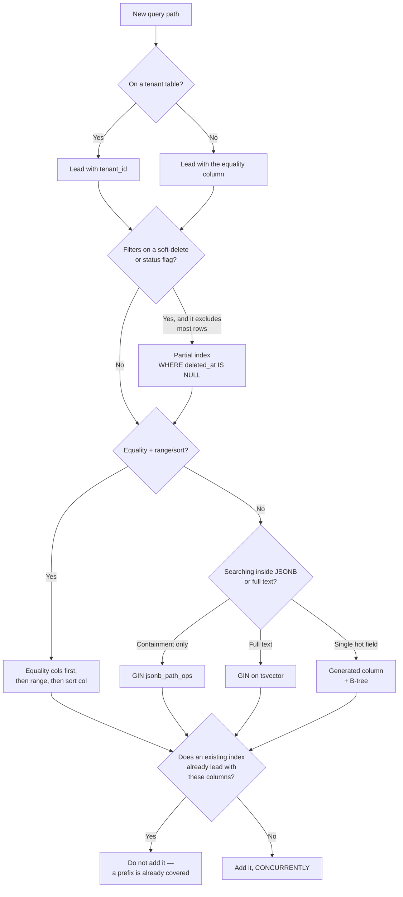

# 06 — Database Indexing Strategy

**Phase 1.1 deliverable** ("Implementation Diagrams") · Sources: `DATABASE_SCHEMA.md`, `ARCHITECTURE_DESIGN.md`, ERD docs 01–05
**Status:** Draft for review

Covers the indexing rules this schema follows, the composite indexes each hot query path needs,
query patterns to prefer and avoid, and index maintenance procedures.

---

## The rule that drives everything: RLS makes `tenant_id` the leading column

Every tenant table carries a policy of the form:

```sql
USING (tenant_id = current_setting('app.current_tenant_id')::UUID)
```

Postgres ANDs that predicate into **every** query against the table, including ones the
application wrote without mentioning `tenant_id`. So a query that looks like
`WHERE record_type = 'patient' ORDER BY updated_at DESC` is actually executed as
`WHERE tenant_id = $1 AND record_type = 'patient' ORDER BY updated_at DESC`.

An index that does not lead with `tenant_id` therefore cannot serve it efficiently — the planner
must either scan the index and filter, or scan the table. **Every index on a tenant table leads
with `tenant_id`**, with three deliberate exceptions:

| Exception | Why |
|---|---|
| Global catalogues (`plans`, `permissions`, `industry_packs`) | No `tenant_id`, no RLS |
| Cross-tenant platform jobs (`idx_subscriptions_renewal`, `idx_uploads_expired`, `idx_processing_pending`) | Run as the platform role over all tenants; a leading `tenant_id` would defeat them |
| Unique constraints that must hold globally (`tenants.subdomain`, `file_shares.token_hash`) | Uniqueness spans tenants by definition |

`current_setting()` is `STABLE`, not `IMMUTABLE`, so the planner treats it as a runtime constant
and can still use it for index lookup. It cannot use it at plan time for partition pruning,
which is why the audit partitions in doc 04 are ranged on `timestamp` rather than on tenant.

### The leakproof caveat

Postgres will not push a user-supplied qual ahead of an RLS security qual unless the function
involved is `LEAKPROOF`. In practice this means a `WHERE` clause calling a custom function may be
evaluated *after* the tenant filter rather than being merged into an index condition. Keep
filters in query predicates expressible as plain operators on indexed columns; push anything
exotic into a generated column (doc 03) instead of a function call in the `WHERE`.

---

## Index selection



**Column ordering within a composite index:** equality predicates first, then the range
predicate, then the sort column. `records(tenant_id, record_type, updated_at DESC)` serves
`tenant_id = $1 AND record_type = $2 ORDER BY updated_at DESC` as a single ordered scan with no
sort node. Reversing the last two columns would force a sort of every matching row.

**Partial indexes are the default here, not an optimization.** Most tables in this schema
soft-delete (`deleted_at`), and most queries want only live rows. A partial index stays small as
deleted rows accumulate and, unlike a full index, does not degrade over the lifetime of a busy
tenant.

---

## Redundant indexes in the current schema

An index whose columns are a *prefix* of another index is dead weight: it is never chosen by the
planner, but every write still maintains it. `DATABASE_SCHEMA.md` defines four such indexes, and
two of them duplicate an index Postgres already creates for a constraint.

```sql
-- Prefix of idx_records_type_status (tenant_id, record_type, status).
DROP INDEX idx_records_tenant_id;

-- UNIQUE(tenant_id, email) on tenant_users already creates this exact index.
DROP INDEX idx_tenant_users_email;

-- Prefix of that same unique constraint's index.
DROP INDEX idx_tenant_users_tenant_id;

-- Prefix of idx_files_tenant_status (tenant_id, status) added in doc 05.
DROP INDEX idx_files_tenant_id;

-- Superseded by idx_records_type_updated (tenant_id, record_type, updated_at DESC),
-- which serves both the sync delta pull and per-type listing.
DROP INDEX idx_records_updated_at;
```

`idx_forms_tenant_id` and `idx_workflows_tenant_id` stay: neither table has a composite index
leading with `tenant_id`, and both are read on nearly every request to resolve tenant config.

### A missing constraint, not a missing index

`tenant_configurations` is one-to-one with `tenants` in the ERD, but nothing enforces it — a
second configuration row for the same tenant is currently legal, and which one wins is
whichever the query happens to return first.

```sql
ALTER TABLE tenant_configurations
    ADD CONSTRAINT uq_tenant_configurations_tenant UNIQUE (tenant_id);

-- The constraint's index replaces the plain one.
DROP INDEX idx_tenant_configurations_tenant_id;
```

---

## Hot query paths and the index that serves each

| # | Query path | Index |
|---|---|---|
| 1 | Tenant resolution by subdomain, on every request | `tenants.subdomain` (unique) |
| 2 | Login by email | `idx_users_email_lookup` on `lower(email)` |
| 3 | Session validation on every authenticated request | `sessions` PK, plus `idx_sessions_user_live` |
| 4 | Permission resolution at token mint | `idx_user_roles_role`, `idx_role_permissions_perm` |
| 5 | List records of a type, newest first | `idx_records_type_updated` (partial on `deleted_at IS NULL`) |
| 6 | Full-text record search | `idx_records_search` (GIN on `search_vector`) |
| 7 | Patient lookup by MRN | `uq_records_mrn` (generated column, partial) |
| 8 | Traverse a record's links in both directions | `idx_links_from`, `idx_links_to` |
| 9 | Sync delta pull since client checkpoint | `idx_records_type_updated` |
| 10 | Record attachments on a detail screen | `idx_associations_record` |
| 11 | Full audit history of one record | `idx_data_audit_record` |
| 12 | PHI access report for a date range | `idx_user_audit_phi` (partial) |
| 13 | Billing renewal sweep | `idx_subscriptions_renewal` (partial, cross-tenant) |
| 14 | Storage lifecycle transition sweep | `idx_files_lifecycle` |
| 15 | Abandoned-upload reclaim | `idx_uploads_expired` (partial, cross-tenant) |

Paths 5, 9 and 11 are the ones that decide whether the product feels fast: they run on every
list screen, every mobile sync cycle, and every compliance export respectively.

---

## JSONB indexing

`records.data` is the flexible substrate, and how it is indexed depends on how it is queried:

```sql
-- Containment queries only (data @> '{"status":"open"}'). Roughly a third smaller and
-- faster to build than the default opclass, but supports only @>, not ? / ?& / ?|.
CREATE INDEX idx_records_data_gin ON records USING GIN (data jsonb_path_ops);
```

Prefer promoting a field to a generated column (doc 03) over adding a GIN index whenever the
field is queried with equality, range, or sort. A B-tree on a generated column is smaller,
supports ordering, and can enforce uniqueness — a GIN index can do none of those. Reserve GIN
for genuinely ad-hoc containment queries over the whole document.

`search_vector` is already a `STORED` generated column with a GIN index in the base schema; that
is the right shape and needs no change.

---

## Query patterns

**Use keyset pagination, not `OFFSET`.** `OFFSET 10000` makes Postgres read and discard ten
thousand rows on every page. With `idx_records_type_updated` in place, keyset paging is an index
seek regardless of depth:

```sql
-- Instead of: ... ORDER BY updated_at DESC LIMIT 50 OFFSET 10000
SELECT * FROM records
 WHERE record_type = $1
   AND deleted_at IS NULL
   AND (updated_at, record_id) < ($2, $3)   -- last row of the previous page
 ORDER BY updated_at DESC, record_id DESC
 LIMIT 50;
```

The tiebreak on `record_id` matters: `updated_at` is not unique, and paging on a non-unique
column alone silently skips or repeats rows.

**Batch link traversal.** Rendering fifty appointments with their patients is one query against
`idx_links_from` with `from_record_id = ANY($1)`, not fifty queries. This is the N+1 that the
generic record model makes easiest to write by accident.

**Count carefully.** `SELECT COUNT(*)` on a large tenant's records is a full index scan every
time. For list screens, prefer an approximate count from `pg_class.reltuples` scaled by the
tenant's share, or cap the count (`SELECT COUNT(*) FROM (SELECT 1 FROM ... LIMIT 1000) t`).

**Verify with `EXPLAIN (ANALYZE, BUFFERS)`, not `EXPLAIN`.** On a table with RLS the plan you get
as a superuser is not the plan `app_user` gets, because the policy is not applied. Always
explain as the application role:

```sql
SET ROLE app_user;
SET LOCAL app.current_tenant_id = '...';
EXPLAIN (ANALYZE, BUFFERS) SELECT ...;
```

---

## Index maintenance

### Creating indexes on a live database

```sql
CREATE INDEX CONCURRENTLY idx_example ON records (tenant_id, status);
```

`CONCURRENTLY` avoids taking an `ACCESS EXCLUSIVE` lock, which would block every read and write
to the table for the duration of the build. It has one constraint that bites in practice:
**it cannot run inside a transaction block**, and Prisma Migrate wraps each migration in one. Such
indexes need their own migration marked to run unwrapped — see doc 07.

A `CONCURRENTLY` build that fails leaves an `INVALID` index behind, which is not used by the
planner but is still maintained on every write. Sweep for them:

```sql
SELECT indexrelid::regclass AS index_name
  FROM pg_index WHERE NOT indisvalid;
```

### Finding indexes that earn nothing

```sql
SELECT s.relname AS table_name,
       s.indexrelname AS index_name,
       s.idx_scan AS scans,
       pg_size_pretty(pg_relation_size(s.indexrelid)) AS size
  FROM pg_stat_user_indexes s
  JOIN pg_index i ON i.indexrelid = s.indexrelid
 WHERE s.idx_scan = 0
   AND NOT i.indisunique          -- unique indexes enforce correctness, not speed
   AND pg_relation_size(s.indexrelid) > 10 * 1024 * 1024
 ORDER BY pg_relation_size(s.indexrelid) DESC;
```

Read this only after a full business cycle — a month-end report may be the sole consumer of an
index that shows zero scans on the 14th. Never drop a unique index on the basis of scan count.

### Bloat and rebuilds

Update-heavy tables (`records`, `sessions`, `files`) accumulate index bloat. `REINDEX
CONCURRENTLY` rebuilds without an exclusive lock:

```sql
REINDEX INDEX CONCURRENTLY idx_records_type_updated;
```

Schedule against the largest indexes quarterly, or when bloat estimates exceed ~30%.

### Autovacuum for append-only audit tables

The audit tables are insert-only, so they never accumulate dead tuples — but they also never get
vacuumed under default settings, which means their visibility maps stay cold and index-only
scans degrade to heap fetches. Compliance exports scan these tables hard, so it is worth forcing
periodic vacuums:

```sql
ALTER TABLE data_audit_log SET (
    autovacuum_vacuum_scale_factor  = 0.01,
    autovacuum_analyze_scale_factor = 0.005
);
```

Apply per partition as partitions are created (doc 04); settings on the parent are not inherited
by partitions created afterwards.

### What to watch

| Signal | Query | Act when |
|---|---|---|
| Slowest statements | `pg_stat_statements` ordered by `total_exec_time` | A single statement exceeds 5% of total DB time |
| Sequential scans on big tables | `pg_stat_user_tables.seq_scan` vs `idx_scan` | `seq_scan` rising on a table over ~100k rows |
| Invalid indexes | `pg_index WHERE NOT indisvalid` | Any result |
| Unused indexes | query above | Reviewed quarterly |
| Cache hit ratio | `pg_statio_user_tables` | Below ~99% sustained |

`pg_stat_statements` must be enabled in the RDS parameter group; it is the single highest-value
diagnostic on this list and costs almost nothing.

---

## Consolidated index inventory

Full DDL lives in the ERD docs; this is the index count each contributes, for capacity planning.

| Source | Indexes | Notably |
|---|---|---|
| `DATABASE_SCHEMA.md` (existing) | 16, minus 5 dropped above | 11 retained |
| Doc 01 — tenant/billing | 8 | 3 partial, 2 cross-tenant |
| Doc 02 — users/auth | 10 | 2 partial, 1 functional (`lower(email)`) |
| Doc 03 — business entities | 6 + generated-column indexes per pack | `idx_links_to` is the easy one to forget |
| Doc 04 — audit/compliance | 5 + per-partition | Grows with partition count |
| Doc 05 — files | 11 | 4 partial |

Roughly 50 indexes at MVP, excluding partitions and per-vertical generated columns. That is a
reasonable write-amplification budget for this workload; the number to watch is indexes per
*write-hot* table — `records` carries seven, which is near the point where insert throughput
starts to be measurably index-bound.

---

## Open questions

1. **Generated-column indexes per vertical.** Each installed pack adds `gc_*` columns and their
   indexes to the shared `records` table (doc 03, open question 3). At three verticals this is
   fine; the ceiling needs establishing before it is hit.
2. **`records` index count.** Seven indexes on the hottest write table is defensible now. If
   bulk import throughput becomes a problem, the standard answer is dropping non-unique indexes
   for the load and rebuilding after — which doc 07 should adopt explicitly.
3. **GIN on `data`.** Not added by default above. Whether it is needed depends on whether the UI
   exposes ad-hoc JSONB filtering or only filters on promoted columns. Recommend deferring until
   a real query needs it.
4. **`pg_stat_statements` sampling.** On RDS this is cheap, but `track_utility` and
   `pg_stat_statements.max` need setting deliberately or the ring buffer evicts the interesting
   statements before anyone reads them.
