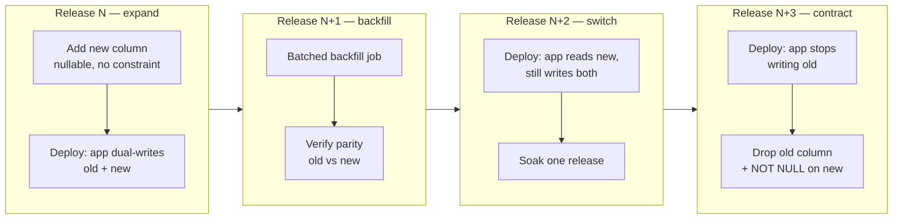
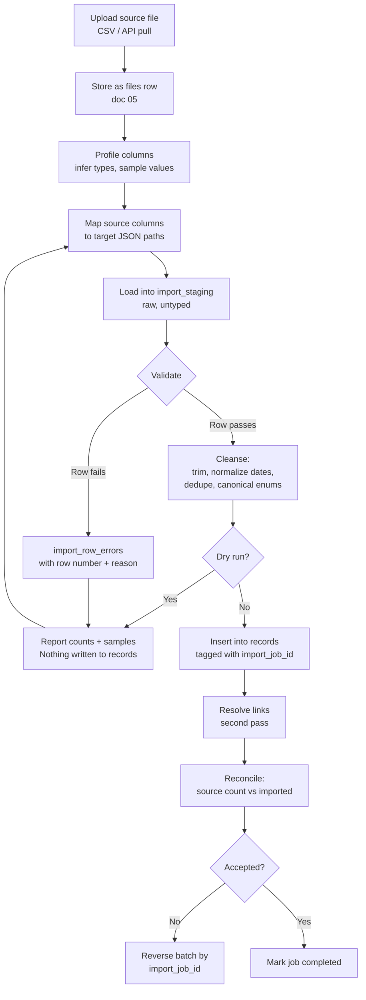

# 07 — Data Migration Workflows

**Phase 1.1 deliverable** ("Implementation Diagrams") · Sources: `CICD_PIPELINE.md`, `TENANT_ONBOARDING_FLOW.md`, ERD docs 01–06
**Status:** Draft for review

"Migration" means two unrelated things in this project, and conflating them is how production
databases get damaged. This document treats them separately:

| | **Schema migrations** | **Tenant data imports** |
|---|---|---|
| What moves | DDL | A customer's legacy records |
| Who runs it | CI/CD, once per deploy | The tenant, during onboarding |
| Blast radius | Every tenant | One tenant |
| Reversal | Compensating migration | Batch delete by `import_job_id` |
| Owner | Platform engineering | Customer success + the import wizard |

Both matter commercially: `CICD_PIPELINE.md:109-113` runs migrations automatically on deploy,
and `TENANT_ONBOARDING_FLOW.md:438,472` puts data import at 35% of onboarding time and names
"data import confusion" as a major support topic.

---

## Part A — Schema migrations

### The constraint that shapes everything: two app versions run at once

`CICD_PIPELINE.md:558-681` specifies blue-green and canary deployment. During a canary, 5% of
traffic runs v1.2.4 while 95% runs v1.2.3 — **against the same database**. A migration that the
old version cannot tolerate takes down 95% of traffic the moment it applies.

Every migration must therefore be backward compatible with the currently deployed version. That
rules out, in a single deploy: dropping a column, renaming a column, narrowing a type, or adding
a `NOT NULL` column without a default.

### Expand / contract



Each arrow is a separate deploy. Skipping a step is what breaks canaries.

### The four backfills this schema already needs

Docs 01, 02 and 05 deprecate columns rather than dropping them, precisely so they can follow the
sequence above. Each is a worked example:

| # | From | To | Shape |
|---|---|---|---|
| 1 | `tenants.plan_type` | `subscriptions` row | One row per tenant, derived from plan code + `created_at` |
| 2 | `tenant_users.roles` JSONB | `user_roles` rows | Fan-out: one row per role in the array |
| 3 | `files.storage_path` | `file_versions` v1 | One version row per file |
| 4 | `files.associated_record_id` | `file_associations` row | Only where the target record still exists |

Backfill 4 is the one to watch: the polymorphic pair has no foreign key (doc 05, correction 2),
so some rows will point at records that no longer exist. Those must be counted and reported, not
silently dropped:

```sql
-- Batched, restartable, and reports orphans rather than discarding them quietly.
WITH batch AS (
    SELECT file_id, tenant_id, associated_record_id
      FROM files
     WHERE associated_record_id IS NOT NULL
       AND NOT EXISTS (SELECT 1 FROM file_associations fa WHERE fa.file_id = files.file_id)
     ORDER BY file_id
     LIMIT 5000
     FOR UPDATE SKIP LOCKED
)
INSERT INTO file_associations (tenant_id, file_id, record_id, association_type)
SELECT b.tenant_id, b.file_id, b.associated_record_id, 'attachment'
  FROM batch b
  JOIN records r ON r.record_id = b.associated_record_id AND r.tenant_id = b.tenant_id
ON CONFLICT DO NOTHING;
```

`FOR UPDATE SKIP LOCKED` plus a `NOT EXISTS` guard makes the job restartable and safe to run
concurrently — it never processes the same row twice and never blocks on a row a user is editing.
Run it in a loop until it reports zero rows, never as a single statement: an unbatched `UPDATE`
over a large table holds locks and bloats the table in one long transaction.

### Migration checklist

Every migration that creates a table on a tenant-scoped entity must also secure it. A new table
without RLS is not a missing feature — it is a cross-tenant data leak, and per `RULE-HSC-02` a
compliance defect.

```sql
-- Required for every new tenant-scoped table:
ALTER TABLE new_table ENABLE ROW LEVEL SECURITY;
ALTER TABLE new_table FORCE  ROW LEVEL SECURITY;   -- doc 04, correction 5
CREATE POLICY tenant_isolation ON new_table FOR ALL TO app_user
    USING (tenant_id = current_setting('app.current_tenant_id')::UUID);
GRANT SELECT, INSERT, UPDATE, DELETE ON new_table TO app_user;
```

- [ ] Backward compatible with the currently deployed app version
- [ ] RLS enabled, **forced**, policy created, grants issued
- [ ] Audit trigger attached if the table holds regulated or security-relevant state, with the correct PK passed as `TG_ARGV[0]` (doc 04)
- [ ] Sensitive columns added to `mask_sensitive()` if audited
- [ ] Indexes lead with `tenant_id` (doc 06)
- [ ] Any `CREATE INDEX CONCURRENTLY` in its own unwrapped migration
- [ ] Tested against a production-sized copy, not an empty dev database
- [ ] Lock impact reviewed — see below

### `CREATE INDEX CONCURRENTLY` and Prisma

Prisma Migrate wraps each migration file in a transaction; `CONCURRENTLY` cannot run inside one.
Such statements need their own migration, applied outside the wrapper — in practice, a separate
migration file executed by the deploy job rather than `prisma migrate deploy`, or Prisma's
unwrapped-migration escape hatch. Whichever route, it must be a deliberate, reviewed exception,
and the follow-up check for `INVALID` indexes (doc 06) belongs in the same deploy step.

### Lock discipline

A migration that waits on a lock queues every query behind it. Always bound the wait:

```sql
SET lock_timeout = '3s';
SET statement_timeout = '60s';
ALTER TABLE records ADD COLUMN example TEXT;   -- fails fast rather than freezing the API
```

Adding a nullable column with no default is instant in modern Postgres. Adding one *with* a
default is also instant (Postgres 11+), but adding a `CHECK` or `NOT NULL` constraint rewrites or
full-scans the table — use `NOT VALID` then `VALIDATE CONSTRAINT` as two steps:

```sql
ALTER TABLE records ADD CONSTRAINT chk_example CHECK (version > 0) NOT VALID;
ALTER TABLE records VALIDATE CONSTRAINT chk_example;   -- takes only a SHARE UPDATE EXCLUSIVE lock
```

### Rollback

**Forward-only in production.** A `DOWN` migration that drops a column destroys data written
since the deploy, and cannot be tested meaningfully. The rollback procedure is:

1. Roll back the *application* (blue-green switch or canary abort) — instant, and per
   `CICD_PIPELINE.md` already automated.
2. Leave the schema change in place. Expand/contract guarantees the previous app version still
   works against it.
3. If the migration is itself the fault, write a compensating forward migration.

This is why every deploy stops at the expand step: it is the only stage that is safely
reversible by reverting code alone.

Non-negotiable safety net: an automated pre-migration snapshot, retained through the soak
window, with restore tested — not merely taken. `ARCHITECTURE_DESIGN.md` commits to point-in-time
recovery; the migration job should record its start LSN/timestamp so a PITR target is known
without guesswork.

---

## Part B — Tenant data import

### Flow



The two-pass structure matters. Links (doc 03) can only be created once both endpoints exist, so
records land first and `record_links` are resolved afterwards, matching on `external_id`.

**Dry run is the loop, not a formality.** `TENANT_ONBOARDING_FLOW.md:472` names import confusion
as a top support driver; the fix is letting the customer iterate on the mapping against real
validation output without ever writing a record.

### Import tables

```sql
CREATE TYPE import_source AS ENUM ('csv', 'api', 'manual');

CREATE TABLE import_jobs (
    import_job_id      UUID PRIMARY KEY DEFAULT gen_random_uuid(),
    tenant_id          UUID NOT NULL REFERENCES tenants(tenant_id) ON DELETE CASCADE,
    source_type        import_source NOT NULL,
    source_file_id     UUID REFERENCES files(file_id) ON DELETE SET NULL,
    target_record_type VARCHAR(100) NOT NULL,
    is_dry_run         BOOLEAN NOT NULL DEFAULT TRUE,

    status             job_status NOT NULL DEFAULT 'pending',
    total_rows         INTEGER NOT NULL DEFAULT 0,
    valid_rows         INTEGER NOT NULL DEFAULT 0,
    error_rows         INTEGER NOT NULL DEFAULT 0,
    imported_rows      INTEGER NOT NULL DEFAULT 0,

    created_by         UUID REFERENCES tenant_users(user_id),
    started_at         TIMESTAMP WITH TIME ZONE,
    completed_at       TIMESTAMP WITH TIME ZONE,
    reversed_at        TIMESTAMP WITH TIME ZONE,
    created_at         TIMESTAMP WITH TIME ZONE NOT NULL DEFAULT NOW(),

    FOREIGN KEY (tenant_id, target_record_type)
        REFERENCES record_type_definitions(tenant_id, code) ON UPDATE CASCADE
);

CREATE TABLE import_field_mappings (
    mapping_id     UUID PRIMARY KEY DEFAULT gen_random_uuid(),
    tenant_id      UUID NOT NULL REFERENCES tenants(tenant_id) ON DELETE CASCADE,
    import_job_id  UUID REFERENCES import_jobs(import_job_id) ON DELETE CASCADE,
    template_name  VARCHAR(150),          -- set instead of job id to save a reusable mapping
    source_column  VARCHAR(255) NOT NULL,
    target_path    VARCHAR(255) NOT NULL, -- 'title' | 'data.mrn' | 'data.date_of_birth'
    transform      VARCHAR(50),           -- 'trim' | 'iso_date' | 'e164' | 'upper'
    is_required    BOOLEAN NOT NULL DEFAULT FALSE,
    default_value  TEXT,

    CHECK (import_job_id IS NOT NULL OR template_name IS NOT NULL)
);

CREATE TABLE import_row_errors (
    error_id      UUID PRIMARY KEY DEFAULT gen_random_uuid(),
    tenant_id     UUID NOT NULL REFERENCES tenants(tenant_id) ON DELETE CASCADE,
    import_job_id UUID NOT NULL REFERENCES import_jobs(import_job_id) ON DELETE CASCADE,
    row_number    INTEGER NOT NULL,
    source_row    JSONB NOT NULL,        -- the raw row, so the user can see what failed
    error_code    VARCHAR(50) NOT NULL,  -- 'required_missing' | 'bad_date' | 'duplicate_key'
    error_message TEXT NOT NULL,
    created_at    TIMESTAMP WITH TIME ZONE NOT NULL DEFAULT NOW()
);

CREATE INDEX idx_import_errors_job ON import_row_errors(import_job_id, row_number);
```

Records carry their provenance so a batch can be reversed:

```sql
ALTER TABLE records ADD COLUMN import_job_id UUID REFERENCES import_jobs(import_job_id);
CREATE INDEX idx_records_import_job ON records(import_job_id) WHERE import_job_id IS NOT NULL;
```

`import_row_errors.source_row` holds customer data — including PHI when the import is a patient
list. It inherits RLS like any other tenant table, and a retention policy (doc 04) should purge
it once the job is accepted; keeping failed rows indefinitely creates a second, unmanaged copy of
regulated data.

### Legacy mapping

Mapping is per-source and cannot be fully generalised, but three rules hold across all of them:

1. **Everything lands in `data` unless it is a first-class column.** `title`, `status` and
   `workflow_state` are promoted; the rest stays in JSONB and, if hot, becomes a generated column
   (doc 03).
2. **The legacy primary key becomes `records.external_id`.** This is what makes re-running an
   import idempotent — `uq_records_external_id` (doc 03) turns a duplicate load into a conflict
   rather than a duplicate record.
3. **Legacy relationships become `record_links`, resolved by `external_id` on the second pass.**
   A legacy `appointment.patient_id` is not a UUID in this system; it is a lookup key.

```sql
-- Second pass: resolve links from staged foreign keys.
INSERT INTO record_links (tenant_id, from_record_id, to_record_id, link_type)
SELECT a.tenant_id, a.record_id, p.record_id, 'attends'
  FROM records a
  JOIN import_staging s ON s.external_id = a.external_id AND s.import_job_id = a.import_job_id
  JOIN records p ON p.tenant_id = a.tenant_id
                AND p.record_type = 'patient'
                AND p.external_id = s.source_row ->> 'patient_id'
 WHERE a.record_type = 'appointment'
   AND a.import_job_id = $1
ON CONFLICT DO NOTHING;
```

### Validation and cleansing

| Stage | Check | On failure |
|---|---|---|
| Structural | Column count, encoding (UTF-8), delimiter | Reject the file |
| Required | Every `is_required` mapping has a value | Row → `import_row_errors` |
| Type | Dates parse to ISO-8601, numbers are numeric, enums are in range | Row → errors |
| Schema | Row validates against the target `form_versions.schema` | Row → errors |
| Uniqueness | `external_id` unique within the file and against existing records | Row → errors (`duplicate_key`) |
| Referential | Every foreign key resolves to a row in this batch or already present | Row imported, link deferred and reported |
| Business | Link cardinality permitted by `record_link_rules` | Row → errors |

Cleansing applies only the transforms declared in `import_field_mappings.transform` — trim
whitespace, normalise dates to ISO-8601, phone numbers to E.164, casing on enums. **Anything not
declared is not silently altered.** Guessing at a customer's data is how imports become
untrustworthy, and the date-format check matters concretely: doc 03's `gc_dob` generated column
fails to build if any DOB is not ISO-8601.

### Import throughput

For large loads, drop non-unique indexes on `records` for the duration and rebuild
`CONCURRENTLY` afterwards (doc 06, open question 2). Keep every unique index — they are
correctness, not performance. The audit trigger fires per row; for imports above roughly 100k
rows, a single `system_audit_log` entry recording the batch is more useful than a million
`data_audit_log` rows, but this is an explicit, logged exception to `RULE-HSC-02` and needs
compliance sign-off before it is used.

### Reversal

```sql
-- Reverses an entire import batch. Safe only before the tenant edits imported records.
BEGIN;
DELETE FROM record_links WHERE from_record_id IN
    (SELECT record_id FROM records WHERE import_job_id = $1);
DELETE FROM records WHERE import_job_id = $1;
UPDATE import_jobs SET reversed_at = NOW(), status = 'skipped' WHERE import_job_id = $1;
COMMIT;
```

Reversal must refuse to run once any imported record has been modified — `records.updated_at >
created_at`, or a `data_audit_log` entry from a real user — otherwise it destroys the tenant's
own work. Check first; fail loudly rather than deleting.

---

## Open questions

1. **`import_staging` shape.** Referenced above but not defined: a single wide JSONB table for
   all imports is simplest and is the assumption here; per-job temporary tables are faster but
   harder to inspect when a customer asks why row 4,812 failed.
2. **Import size ceiling.** No limit is set. Onboarding imports of a few hundred thousand rows
   are plausible for an established clinic; beyond that, a streaming loader (`COPY`) rather than
   row-by-row insert is needed.
3. **PHI in error rows.** Recommend a default retention of 30 days on `import_row_errors`, but
   this needs the same legal sign-off as the retention defaults in doc 04.
4. **Who may import.** Importing bypasses the UI's per-field validation and can create thousands
   of records at once. A dedicated `records:import` permission (doc 02) rather than plain
   `records:write` is the safer default.
5. **Mapping templates across tenants.** `import_field_mappings.template_name` is tenant-scoped.
   Platform-supplied templates for common legacy systems would be a real onboarding accelerant,
   but need to live in a global table like `industry_packs`.
