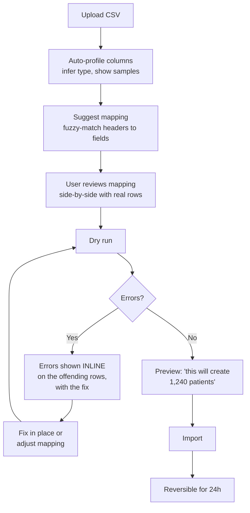

# 01 — User Journey Implementation

**Phase 6.2 deliverable** · Sources: `TENANT_ONBOARDING_FLOW.md`, `UI_WIREFRAMES.md`, `frontend/01`, `api/02`
**Status:** Draft for review — new documentation, no prior source document

Covers onboarding implementation, task-based workflow optimization, error state handling, and
WCAG 2.1 AA accessibility.

Unlike Phase 6.1, this is near-term: `BUSINESS_PRODUCT_PLANNING.md:701` places in-app help and
guided onboarding in **Launch, months 10–12**.

---

## Onboarding: five known bottlenecks

`TENANT_ONBOARDING_FLOW.md:461-479` already measured where tenants drop out. This is unusually
good input — most onboarding work starts from opinion — so the implementation is organised around
those five findings rather than around a generic funnel.

| # | Bottleneck | Measured | Implementation |
|---|---|---|---|
| 1 | Email verification delay | 15% abandon | Verify asynchronously — let the user continue into setup while unverified, gating only invites and data export. Instant verification for pre-approved domains |
| 2 | Payment friction | 13% abandon | Do not ask for payment before the trial. Collect at conversion, when value is already demonstrated |
| 3 | Setup wizard too complex | 10% abandon | Split into a 3-minute required core and a deferrable remainder; progress indicator; every step resumable |
| 4 | **Data import confusion** | Top support topic, 1.8 days to first use | The largest single win — see below |
| 5 | Mobile app discovery | 32% never install | QR code in the web app after first record created, not during signup |

The ordering matters: 1 and 2 are removals rather than improvements. The cheapest fix for an
abandonment point in a trial funnel is usually to stop requiring the thing.

### Data import is the highest-value target

45% of new-tenant support tickets are setup help, import is 35% of onboarding effort and the
single largest named support topic, and time-to-first-value is 1.8 days
(`TENANT_ONBOARDING_FLOW.md:438-473`).

`database/07_DATA_MIGRATION_WORKFLOWS.md` already specifies the import machinery — staging,
mapping, dry run, validation, reversal. What's missing is the experience over it:

Four things carry the weight: **suggested mappings** so the common case needs confirmation rather
than construction; **dry run as the default**, iterated freely; **errors shown on the row that
failed** with the specific fix, not as a downloadable error log; and a **preview stating exactly
what will happen** before anything is written. `import_row_errors.source_row` (`database/07`)
exists precisely to make the third possible.

### Progressive setup

The wizard asks for the minimum to reach a working state, and defers the rest into contextual
prompts:

| Required (3 min) | Deferred |
|---|---|
| Company name, industry pack | Branding and colours |
| Admin account | Team invites |
| Subdomain | Custom fields and workflows |
| — | Integrations |
| — | Data import |

Deferred items surface as a dismissible checklist and at the moment they become relevant —
branding when someone first opens settings, invites after the first records exist. A tenant that
reaches a working state in three minutes and completes setup over a week converts better than one
that faces twelve steps up front.

---

## Task-based workflows

The wireframes (`UI_WIREFRAMES.md:44-79`) already lead with "Quick Actions" per industry, which is
the right instinct. Three implementation rules:

**Optimise the repeated path, not the impressive one.** In a clinical setting the same three or
four actions happen dozens of times a day. Those get keyboard shortcuts, a one-tap entry point,
and no confirmation dialogs on reversible actions.

**Preserve context across navigation.** A user who opens a record from a filtered list and goes
back returns to the same filter and scroll position (`frontend/03` — this is why filters live in
the URL). Losing a filter after every record is a small cost paid a hundred times a day.

**Optimistic UI with honest failure.** Writes render immediately against the local database
(`frontend/05`) and reconcile on sync. When reconciliation fails, the UI must say so on the
affected record rather than with a global toast that has already disappeared.

Bulk operations exist for the same reason: `/records/bulk` returns `207 Multi-Status` (`api/02`)
specifically so a partial failure can be shown per item rather than as one opaque error.

---

## Error states

The API's error contract (`api/02`) gives stable machine-readable codes. This maps them to what
the user sees, which is the part that determines whether they can recover or contact support.

| Class | Example codes | Message shape | Recovery |
|---|---|---|---|
| Validation | `VALIDATION_FAILED` | On the field, stating the rule | Fix inline |
| Permission | `INSUFFICIENT_PERMISSIONS` | "You don't have access. Ask an admin for X" | Named next step |
| Not found | `RESOURCE_NOT_FOUND` | "This record no longer exists" | Back to list |
| Conflict | `VERSION_CONFLICT` | Side-by-side diff of both versions | Choose or merge |
| Quota | `QUOTA_EXCEEDED` | "You've reached your plan's limit of X" | Upgrade link |
| Rate limit | `RATE_LIMIT_EXCEEDED` | "Too many requests, retrying in Ns" | Automatic retry |
| Offline | — | Banner: working offline, N changes pending | Automatic on reconnect |
| Server | `INTERNAL_ERROR` | "Something went wrong. Reference: req_01J…" | Retry, or contact support with the reference |

Four principles behind the table:

**Never show a raw error code as the message.** The code is for support and logs; the user sees a
sentence. The `request_id` is displayed, because it is what makes a support conversation solvable
(doc 02).

**Distinguish "you can't" from "it's broken".** A permission error and a server error look
identical to a user unless the copy says otherwise, and the response is completely different.

**Errors that resolve themselves say so.** Rate limits and offline states are temporary; a message
that implies user action for something the app will fix is worse than no message.

**Conflicts get real UI.** `frontend/05` requires PHI conflicts to escalate to the user rather
than auto-resolve. That escalation is only useful if the user can see both versions, understand
what differs, and choose — a dialog saying "conflict detected" with an OK button is where offline
work quietly gets lost.

### Offline states

The app is offline-first, so offline is a normal condition, not an error. A persistent, unobtrusive
banner shows connection state and pending change count; individual records show a pending
indicator; and the sync surface (`UI_WIREFRAMES.md:139`) shows real last-sync time. Nothing is
blocked while offline except operations that genuinely require the server — payment, invites,
export.

---

## Accessibility — WCAG 2.1 AA

A stated commitment in `NEXT_STAGE_NOTES.md`. Two things about this platform make it harder than
usual, and both are already documented in Phase 3.

### Tenant branding can break contrast

`frontend/01_COMPONENT_ARCHITECTURE.md` establishes that tenants supply `primary_color`,
`secondary_color` and `accent_color`, and that a pale brand colour produces unreadable text. The
platform would then be shipping an accessibility failure **on the tenant's behalf, through
configuration**, with no code change involved.

The mitigations are already specified there and are restated because this is where the
requirement lives: `derivePalette` computes contrast-appropriate text for every derived colour,
and `PATCH /v1/tenant/config` rejects a palette that cannot reach 4.5:1, suggesting the nearest
compliant alternative. Contrast is validated in CI against the seeded industry palettes.

### Generated forms are where accessibility usually fails

`DynamicForm` renders from `form_versions.schema` (`frontend/01`). Hand-written forms get
accessibility attention; generated ones inherit whatever the generator does, for every tenant and
every record type at once. That makes the generator the highest-leverage place to get this right.

| Requirement | Generator behaviour |
|---|---|
| Every input has a programmatic label | `<label for>` always, never placeholder-as-label |
| Errors associated with fields | `aria-describedby` to the message, `aria-invalid` on the field |
| Error summary on submit | Focus moved to a summary listing each error as a link to its field |
| Required fields marked | `required` and visible text, never colour or an asterisk alone |
| Grouped inputs | `<fieldset>` and `<legend>` for radio and checkbox groups |
| Help text | `aria-describedby`, not a `title` attribute |
| Dynamic sections | `aria-live="polite"` when fields appear conditionally |

Because it is one generator, one fix corrects every form on the platform — and one defect breaks
all of them, which is the argument for testing it hard.

### The rest

| Area | Requirement |
|---|---|
| Contrast | 4.5:1 text, 3:1 large text and UI components |
| Keyboard | Every action reachable; visible focus; no traps; skip-to-content |
| Focus management | Moved into modals and returned on close; announced on route change — Ionic's stack navigation does not do this by default |
| Screen readers | Tested with VoiceOver (iOS/macOS) and TalkBack (Android), not only with a desktop reader |
| Touch targets | 44×44 px minimum everywhere (`UI_WIREFRAMES.md:248`) |
| Motion | `prefers-reduced-motion` disables page transitions and animation |
| Text scaling | Usable at 200% zoom and at the OS's largest text size — the settings screen offers a text size control, so it must actually work |
| Tables | Real `<th>` with scope; the mobile card-list alternative is equally accessible |
| Status messages | `aria-live` for toasts, sync status and save confirmations |
| Language | `lang` on the document; per-field where content differs |

Testing: `axe-core` in CI on every route (catches roughly a third of issues and all the mechanical
ones), manual keyboard-only walkthrough of the core task paths each release, screen reader
testing on both mobile platforms each release, and an external audit before any claim of
conformance is published.

**Route-change announcements matter more here than in a typical web app.** Ionic's stack
navigation changes content without a page load, so a screen reader user gets no indication that
anything happened unless the route change is announced explicitly.

---

## Measurement

Funnel instrumentation using the metric definitions from `observability/03`, subject to the PHI
rules in `observability/01` — route patterns and event names only, never field content.

| Metric | Target |
|---|---|
| Signup → working state | < 10 min |
| Time to first value (first record by a non-admin) | < 4 h, from 1.8 days |
| Setup wizard completion | > 90%, from ~77% implied by the drop-offs |
| Import success on first attempt | > 80% |
| Mobile install within 7 days | > 80%, from 68% |
| Support tickets per new tenant | < 0.8, from 1.3 |
| Task completion rate on core flows | > 95% |
| Accessibility defects found externally | Zero AA violations |

---

## Open questions

1. **Deferring payment collection** (bottleneck 2) reduces abandonment and lowers trial quality —
   card-less trials attract more tyre-kickers. It is a growth decision with a real trade-off, not
   purely a UX one.
2. **Whether the measured baselines are real.** The figures in `TENANT_ONBOARDING_FLOW.md` are
   presented as measurements, but the platform is not built. If they are projections, the targets
   above need re-baselining against actual data.
3. **Text scaling versus dense clinical layouts.** 200% zoom on a data table is genuinely hard.
   The card-list alternative may need to become the default above a scaling threshold rather than
   a breakpoint.
4. **External audit timing.** Before launch is the honest answer if AA conformance is claimed
   publicly, and it has a lead time that needs scheduling now.
5. **Localisation.** The settings screen offers a language selector and nothing specifies RTL
   support (`frontend/01`, open question 5). Retrofitting logical properties later is expensive.
