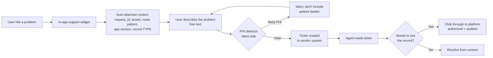

# 02 — Customer Support Integration

**Phase 6.2 deliverable** · Sources: `REMAINING_PLANNING_AREAS.md`, `TENANT_ONBOARDING_FLOW.md`, `database/04`, `api/01`
**Status:** Draft for review — new documentation, no prior source document

Covers the in-app help system, knowledge base search, ticket integration, support impersonation,
and feedback collection.

`REMAINING_PLANNING_AREAS.md:47-56` specifies tiered support, multi-channel, 24/7 for enterprise,
and a self-service knowledge base. `TENANT_ONBOARDING_FLOW.md:452-460` gives the baseline: 1.3
tickets per new tenant, 45% setup help, 4.2 hours to resolve, 4.6/5.0 satisfaction.

---

## The rule: PHI does not enter the support system

A support ticket is the easiest accidental disclosure path in a healthcare product. A user
describing a problem attaches a screenshot of the screen they were on — which is a patient record
— to a system operated by a vendor, stored outside the audit trail, readable by support staff with
no clinical relationship to that patient, and retained under the vendor's policy rather than
`retention_policies`.

The support vendor (Zendesk or Intercom) operates under a **signed BAA**, because no control is
perfect and the fallback matters. But the design goal is that PHI never arrives in the first
place:

| Attached automatically | Never attached |
|---|---|
| `request_id` (correlates to logs and traces) | Screenshots |
| Tenant id and plan tier | Record content or titles |
| Route **pattern** (`/records/:type/:id`) | Resolved URLs |
| Record **type** (`patient`) | Record ids in free text |
| App version, platform, browser | User's own PHI-adjacent notes |
| Sync queue depth, last sync time | File contents |
| Error code | Stack traces with data |

`request_id` is the highest-value field here. It joins the ticket to the API log, the trace and
`system_audit_log` (`api/06`), which is what turns "it didn't work this morning" into a specific
failed request — and it carries no PHI.

**Screenshot upload is disabled** in the support widget. It is the single most common way PHI
enters a helpdesk, and users will do it helpfully and without thinking. Where a visual is
genuinely needed, the agent requests one through the platform's own file upload, which is
encrypted, audited and retained under tenant policy (`database/05`).

The client-side detector is a warning, not a filter — it looks for patterns suggesting patient
detail (long free-text with names, numbers shaped like MRNs or SSNs) and prompts the user to
reconsider. It will have false positives and misses; it exists to catch the thoughtless case, and
the BAA covers the rest.

---

## Agent access to records

Support cannot always resolve from metadata. When an agent must see the actual record, they go
through the platform, not around it.

| Requirement | Implementation |
|---|---|
| Explicit tenant consent | Per-tenant setting, default **off**, enabled by a tenant admin |
| Time-boxed | Grant expires; default 24 hours, maximum 7 days |
| Scoped | To the specific records referenced in the ticket where possible |
| Audited as PHI access | `user_audit_log` with `is_phi_access`, actor is the agent (`database/04`) |
| Visible to the tenant | Tenant admins see every support access in their own audit view |
| Step-up authenticated | Agent re-authenticates (`infrastructure/05`) |
| Reason recorded | Ticket id stored with the access record |

### Impersonation

"Log in as this user" is the most useful support tool and the most dangerous. It is specified
tightly rather than left to be built casually:

- Impersonation is a **distinct session type**, not a role swap. `sessions` records
  `impersonated_by` alongside `user_id`, so every downstream audit row attributes correctly —
  the acting agent *and* the user being impersonated are both recoverable.
- **The impersonated user's permissions apply**, never the agent's. An agent must not gain access
  the user does not have.
- **A persistent banner** shows the session is impersonated, to the agent.
- **Write operations are blocked by default.** Read-only impersonation resolves most tickets; a
  write requires a separate, explicitly-granted mode with its own audit entry.
- **The tenant is notified** that an impersonation session occurred, after the fact.
- Never available for a tenant that has not enabled support access.

Without `impersonated_by` on the session, every audit row from an impersonated session attributes
to the user, and the audit trail states something false — which is worse than a gap, because it
looks complete.

---

## In-app help

Contextual rather than a help centre link. The route and record type are known, so the help
surface can be specific:

| Surface | Trigger | Content |
|---|---|---|
| Contextual panel | Help icon on any screen | Articles matching route + record type |
| Guided tours | First visit to a feature | Ionic overlay walkthrough, dismissible, resumable |
| Inline hints | Empty states and complex fields | One sentence plus a link |
| Setup checklist | Onboarding (doc 01) | Deferred setup items with progress |
| Error help | Error states | Article matching the error code from `api/02` |

Mapping articles to **error codes** is the highest-return connection: the user is stuck, the
system knows precisely why, and the relevant article can be offered without a search. It also
turns the error catalogue into a content backlog — every code should have an article.

Help content is **versioned with the product** and reviewed when a feature changes. A tour
referencing a button that moved is worse than no tour.

## Knowledge base

| Concern | Decision |
|---|---|
| Content scope | Platform-authored, global. Industry-pack articles tagged by pack |
| Tenant-authored content | **Out of scope for v1** — see below |
| Search | Postgres full-text initially, using the same `search_vector` pattern as `database/03` |
| Indexing | Article content, title, tags, mapped error codes and route patterns |
| Personalisation | Filtered by the tenant's installed packs and enabled features |
| Access | Public articles unauthenticated; tenant-specific ones behind auth |

Tenant-authored articles are deliberately deferred. The moment tenants can write help content, the
platform is indexing tenant-authored text — which may contain PHI, must be tenant-isolated, and
cannot be served cross-tenant. That is a different feature with a different risk profile, not an
extension of this one.

Search quality is measured by **null-result rate and click-through**, and searches returning
nothing become the content backlog. That is a better signal than article view counts, which mostly
measure navigation.

Deflection — sessions that view help and do not open a ticket — is the metric that justifies the
investment. Given 45% of new-tenant tickets are setup help
(`TENANT_ONBOARDING_FLOW.md:454`), contextual onboarding help is where deflection is available.

---

## Tickets

| Tier | Channels | First response |
|---|---|---|
| Trial / Basic | Email, in-app, knowledge base | 1 business day |
| Professional | + chat | 4 business hours |
| Enterprise | + phone, video, named CSM | 1 hour, 24/7 |

Tier comes from `subscriptions` (`database/01`), passed with the ticket so routing and SLA are
automatic rather than a lookup the agent does manually.

**Escalation into an incident** connects to `observability/05`: a ticket describing symptoms that
match an active incident is linked to it rather than triaged independently; multiple tickets with
the same error code within a window raise an alert, because customers frequently detect an issue
before monitoring does — and `observability/05` tracks "detected by monitoring vs by customer" as
a first-class metric precisely to notice that.

Any ticket suggesting PHI exposure or cross-tenant access is a **SEV1 immediately**
(`infrastructure/07`), routed to the incident channel before normal support triage. Support staff
need a single obvious button for this, because the judgement call at 2am should be "escalate" and
not "assess".

## Feedback

| Mechanism | Timing | Note |
|---|---|---|
| CSAT | After ticket resolution | Vendor-native |
| NPS | Quarterly, sampled | `REMAINING_PLANNING_AREAS.md:76` names it as a KPI |
| In-app micro-surveys | After a key task, sampled | One question, dismissible |
| Feature requests | In-app, linked to tenant and plan | Weighted by tier for prioritisation |

**Free-text feedback carries the same PHI risk as tickets** and gets the same treatment: a warning
prompt, no screenshots, and storage under the BAA. A user asked "how did that go?" immediately
after working on a patient record will sometimes answer with clinical detail.

Survey fatigue is real and self-defeating: at most one prompt per user per 30 days across all
mechanisms, and never during a task.

---

## Design notes

New documentation, so these are positions rather than corrections — but each is where the natural
implementation would go wrong:

| # | Risk in the obvious implementation | Position taken |
|---|---|---|
| 1 | Screenshot upload in the support widget | Disabled; visuals go through the platform's audited file path |
| 2 | Support tickets stored with whatever the user typed, in a vendor system without a BAA | BAA required, plus active PHI-avoidance and a client-side warning |
| 3 | Impersonation as a role swap | Distinct session type with `impersonated_by`, or the audit trail attributes falsely |
| 4 | Impersonation granting agent-level access | The impersonated user's permissions apply, read-only by default |
| 5 | Support access to tenant data on by default | Off by default, tenant-enabled, time-boxed, visible to the tenant |
| 6 | Help centre as a link out | Contextual by route, record type and error code |
| 7 | Tenant-authored KB articles indexed alongside platform content | Deferred — it makes the KB a tenant-isolated PHI-adjacent store |
| 8 | Tickets triaged independently of incidents | Linked; repeated error codes alert; suspected exposure is SEV1 |

---

## Open questions

1. **Vendor choice.** Zendesk and Intercom both offer BAAs; Intercom is stronger for in-app
   messaging, Zendesk for ticketing and knowledge base. The in-app help above is built either way,
   so the decision is about ticketing and cost.
2. **Impersonation write mode.** Read-only resolves most cases; some genuinely need a write.
   Whether to build it at all, and what consent it requires, is a policy decision.
3. **24/7 enterprise support** (`REMAINING_PLANNING_AREAS.md:51`) has the same staffing problem as
   the on-call rotation in `observability/05`. Committing to it in contracts before the rotation
   exists is the failure mode to avoid.
4. **Knowledge base authoring.** Content is a sustained editorial commitment, not a launch task.
   It needs an owner or it will be written once and left to drift out of date.
5. **Feedback prioritisation weighting.** Weighting feature requests by plan tier is commercially
   rational and produces a roadmap driven by the largest customers. Worth deciding deliberately
   rather than by default.
