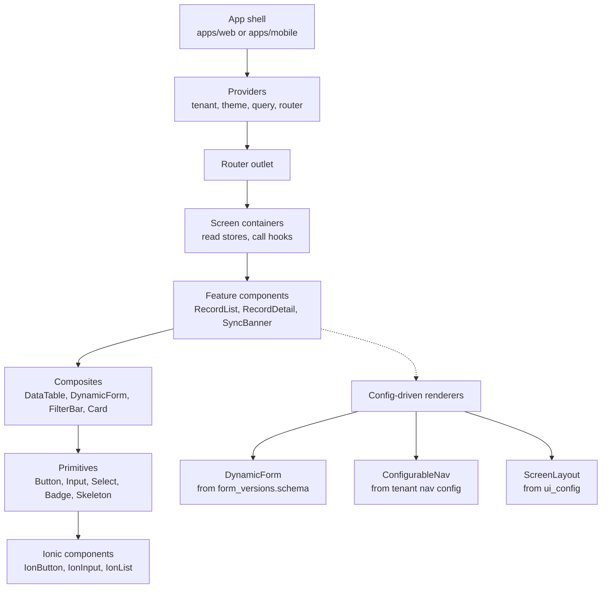

# 01 — Component Architecture

**Phase 3.1 deliverable** · Sources: `UI_WIREFRAMES.md`, `MOBILE_UI_FRAMEWORK.md`, `TECH_STACK_PLAN.md`
**Status:** Draft for review

Covers the monorepo layout, component hierarchy and composition rules, the shared component
library, the theming system, and responsive breakpoints.

---

## Repository structure

Ionic React runs unchanged in a browser and in a Capacitor WebView, so web and mobile share far
more than a typical web/native pair. The split is the shell and the native plugins, not the
application.

```
apps/
  web/                  Vite + Ionic React. Ships as SPA and PWA.
  mobile/               Capacitor shell. iOS + Android projects, native config.
packages/
  ui/                   Components, theming, icons. No data fetching, no stores.
  core/                 Stores, hooks, sync engine, domain logic. No JSX.
  api/                  Generated from api/openapi.yaml + hand-written client layer.
  config/               Tenant config resolution, feature flags, record type registry.
  platform/             Capacitor plugin wrappers behind interfaces (doc 07).
```

Two rules keep the boundary from eroding:

**`packages/ui` never imports from `packages/core`.** Components take props and callbacks;
they do not read stores. This is what makes them renderable in Storybook, testable without a
store, and reusable across the two apps' different navigation shells. Containers live in the
apps and wire the two together.

**`packages/core` never imports from `packages/platform` directly.** It depends on the
interfaces, with the implementation injected at app startup. Otherwise a unit test of the sync
engine drags in a Capacitor plugin that has no web implementation.

---

## Component hierarchy



| Layer | Owns | Never does |
|---|---|---|
| Primitives | One interaction, tokens only | Fetch, read stores, know about tenants |
| Composites | Layout and coordination of primitives | Fetch |
| Feature | Domain shape (a record, a file) | Know which screen it is on |
| Containers | Data, stores, navigation | Layout beyond composition |
| Shell | Providers, router, error boundary | Domain knowledge |

Primitives wrap Ionic rather than exposing it. Screens import `<Button>`, not `<IonButton>` —
so a variant change, an accessibility fix, or an Ionic major upgrade is one file rather than
four hundred call sites.

### Props and composition

Props flow down; events flow up; **shared state is read at the container**, not threaded through
five layers. Where a subtree genuinely needs ambient values — theme, tenant, feature flags —
those come from context, which is stable and rarely changes. Frequently-changing values never go
in context: a context update re-renders every consumer, so `isLoading` in a provider re-renders
the whole tree on every request.

Composition over configuration for layout: `<Card><Card.Header/><Card.Body/></Card>` rather than
`<Card headerText= icon= footerButtons=[...]>`. A card with eleven optional props is a component
that has absorbed four screens' worth of special cases.

---

## Theming

`MOBILE_UI_FRAMEWORK.md:70-80` hardcodes tenant colours as CSS classes:

```css
.tenant-healthcare { --primary-color: #0066CC; }
.tenant-retail     { --primary-color: #E91E63; }
```

That is not dynamic theming — onboarding a tenant would require a CSS change, a build and a
release, while `tenant_configurations` already stores `primary_color`, `secondary_color`,
`accent_color` and `logo_url` per tenant (`database/01_TENANT_MANAGEMENT_ERD.md`). The hardcoded
classes become seed values for the three example tenants and nothing more.

Runtime injection instead:

```ts
export function applyTheme(branding: TenantBranding, mode: 'light' | 'dark') {
  const root = document.documentElement;
  const palette = derivePalette(branding, mode);   // tints, shades, contrast text
  for (const [token, value] of Object.entries(palette)) {
    root.style.setProperty(token, value);
  }
}
```

`derivePalette` is where the real work is. Ionic needs more than three colours — for each brand
colour it wants `--ion-color-primary`, `-rgb`, `-contrast`, `-contrast-rgb`, `-shade`, `-tint`.
Deriving them means a tenant supplies three hex values and gets a complete, coherent palette:

```
--ion-color-primary:          #0066CC        (tenant primary_color)
--ion-color-primary-rgb:      0,102,204
--ion-color-primary-contrast: #FFFFFF        computed for >= 4.5:1
--ion-color-primary-shade:    #005AB4        primary darkened 12%
--ion-color-primary-tint:     #1A75D1        primary lightened 10%
```

**Contrast is computed, not assumed.** A tenant that picks a pale yellow primary gets black
contrast text automatically. Without this, tenant branding becomes an accessibility regression
the platform shipped on the tenant's behalf — and the WCAG 2.1 AA commitment in
`NEXT_STAGE_NOTES.md` Phase 6 is broken by configuration rather than by code.

Validate at save time too: `PATCH /v1/tenant/config` rejects a colour pair that cannot reach
4.5:1 against either surface, with the nearest compliant suggestion.

### Three theme modes, not a boolean

`MOBILE_UI_FRAMEWORK.md:99` models dark mode as `useState(false)`, but the settings wireframe
(`UI_WIREFRAMES.md:106`) offers **"Theme: Auto"**. Two states cannot represent three, and
initialising to `false` means a device in dark mode flashes light on every launch.

```ts
type ThemePreference = 'light' | 'dark' | 'auto';   // persisted
type ResolvedTheme   = 'light' | 'dark';            // what renders

// 'auto' follows prefers-color-scheme and must re-resolve when the OS changes it
// mid-session, which happens at sunset on both platforms.
```

The resolved theme is applied before first paint from a small inline script reading persisted
preference, so there is no flash of the wrong theme.

### Theme has one owner

`MOBILE_UI_FRAMEWORK.md:83-117` puts theme in React Context; `MOBILE_STATE_MANAGEMENT.md:78`
lists a Zustand "Theme Store". Two owners means they drift.

**Zustand owns theme state; context exposes it.** State lives in the store (persisted, and
readable by non-React code such as the sync engine deciding notification styling); the provider
subscribes once and supplies the derived palette to the tree. One source of truth, one
subscription.

---

## Config-driven components

The platform is industry-agnostic, so the components that matter most are the ones that render
whatever the tenant configured.

| Component | Driven by | Source |
|---|---|---|
| `DynamicForm` | `form_versions.schema` + `validation_rules` | `database/03_BUSINESS_ENTITY_ERD.md` |
| `ConfigurableNav` | `tenant_configurations.ui_config.navigation` | `MOBILE_UI_FRAMEWORK.md:219` |
| `ScreenLayout` | `ui_config.screens[screenId]` | `MOBILE_UI_FRAMEWORK.md:266` |
| `RecordList` / `RecordDetail` | `record_type_definitions` | `database/03` |
| Feature gates | `tenant_configurations.features` | `MOBILE_UI_FRAMEWORK.md:118` |

`DynamicForm` renders from the **same** `form_versions.schema` the server validates against, so
client and server validation cannot disagree — a mismatch there produces a form that submits and
is then rejected, which users read as the app being broken.

Two constraints on it: the schema arrives from the network and must be treated as untrusted input
(a malformed schema renders an error state, never crashes the screen), and a record captured under
schema v1 renders under v1 via `records.form_version_id`, not under whatever the current version
is. Re-rendering an old record against a new schema silently drops the fields that were removed.

Feature flags gate at the **route** level as well as the component level. Hiding a button while
leaving its route reachable is a UI convenience, not a control — the permission check on the API
is the actual boundary (`api/01_AUTH_AUTHORIZATION_FLOWS.md`).

---

## Responsive design

`UI_WIREFRAMES.md:243-259` defines three breakpoints. Mapped to Ionic's grid:

| Range | Ionic | Layout | Navigation |
|---|---|---|---|
| 320–768 px | `xs`, `sm` | Single column | Bottom tabs |
| 768–1024 px | `md` | Two column | Side menu, collapsible |
| 1024 px+ | `lg`, `xl` | Multi-column | Persistent sidebar |

Breakpoints live as tokens in `packages/ui`; no component hardcodes a pixel value. Layout
switching is CSS-first — media queries, not JavaScript width listeners, which cause layout
thrash and a wrong first render.

Touch targets are 44×44 px minimum everywhere, not only on mobile (`UI_WIREFRAMES.md:248`).
Touch-screen laptops and clinical tablets in desktop layouts are common in this domain.

The data table in `UI_WIREFRAMES.md:216-228` — 1,247 records with columns and row actions — does
not become a narrow table on mobile; it becomes a card list. That is a different component with
the same data source, selected by breakpoint, because a horizontally scrolling table of clinical
data is unusable on a phone.

---

## Corrections to the source documents

| # | Severity | Issue | Resolution |
|---|---|---|---|
| 1 | **High** | Tenant colours hardcoded as `.tenant-*` CSS classes; onboarding a tenant needs a code change, contradicting dynamic theming and `tenant_configurations` | Runtime CSS custom property injection from tenant config |
| 2 | **High** | No contrast derivation; a tenant's brand colour can produce unreadable text, breaking the WCAG 2.1 AA commitment by configuration | `derivePalette` computes contrast; config API validates and rejects |
| 3 | Medium | Dark mode is a boolean but the settings screen offers Light/Dark/Auto | Three-state preference, resolved separately |
| 4 | Medium | `isDarkMode` initialises to `false`, so dark-mode devices flash light on launch | Resolved from preference before first paint |
| 5 | Medium | Theme owned by both React Context and a Zustand store | Store owns; context exposes |
| 6 | Low | `createContext<ThemeContextType>()` is called with no default value — a type error as written | Explicit `undefined` union with a `useTheme` guard hook |
| 7 | Low | No mapping from the three brand colours to the six CSS variables Ionic needs per colour | `derivePalette` |

---

## Open questions

1. **Storybook scope.** `packages/ui` is designed to be renderable in isolation. Whether that is
   worth maintaining a Storybook for depends on whether design review actually happens there;
   half-maintained component docs are worse than none.
2. **Logo constraints.** `logo_url` is free-form. A tenant uploading a 4000×3000 PNG for a 32 px
   header slot needs server-side variant generation (`file_variants` in `database/05`) rather
   than CSS scaling — currently unspecified.
3. **Icon strategy.** Wireframes show industry-specific icon sets. Bundling every industry's
   icons inflates the bundle for all tenants; per-pack icon loading ties into the code splitting
   in doc 04 and needs deciding together with it.
4. **Custom navigation ordering.** The admin panel offers "Add Tab" and "Reorder Tabs". Mobile
   bottom navigation degrades badly past five items — the config API should cap it, and the
   overflow behaviour needs designing rather than left to Ionic's default.
5. **RTL and localisation.** The settings screen has a language selector, but nothing specifies
   RTL layout support. Retrofitting logical CSS properties later is significantly more expensive
   than adopting them now.
