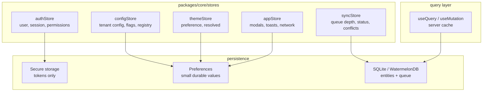
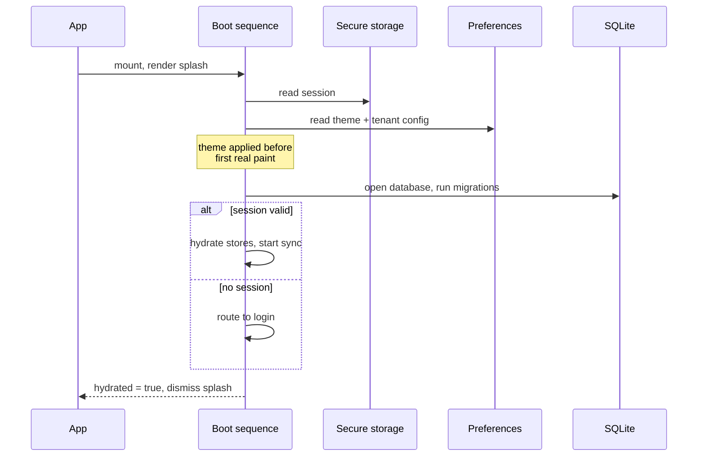

# 02 — State Management Implementation

**Phase 3.1 deliverable** · Sources: `MOBILE_STATE_MANAGEMENT.md`, `TECH_STACK_PLAN.md`
**Status:** Draft for review

Covers store structure, state ownership, middleware, persistence and hydration, and the tenant
scoping that persisted state requires.

Zustand is the choice — `TECH_STACK_PLAN.md` leaves "Redux/Zustand" open, and
`MOBILE_STATE_MANAGEMENT.md:107` settles it. Stores live in `packages/core` and are shared by
both apps.

---

## State ownership

Most state bugs in an app this shape come from two layers believing they own the same value. The
matrix is the contract:

| State | Owner | Persisted | Notes |
|---|---|---|---|
| Current route, route params, filters, pagination cursor | **URL** | — | Not the store. See doc 03 |
| Server data (records, files, users) | **Query cache + WatermelonDB** | SQLite | Doc 05 |
| Session, tokens | **Auth store** | Secure storage | Tokens never touch Preferences |
| Tenant config, feature flags, record type registry | **Config store** | Preferences | Refetched on login |
| Theme preference | **Theme store** | Preferences | Doc 01 |
| Sync queue, conflicts, network state | **Sync store** | SQLite (queue), memory (status) | Doc 05 |
| Modals, toasts, loading flags | **App store** | **never** | See below |
| Form input, validation, local toggles | **Component state** | Drafts only | |

Two entries carry most of the weight. Route state belongs to the URL, and transient UI state is
never persisted.

---

## Corrections to the documented store

### Navigation does not belong in a store

`MOBILE_STATE_MANAGEMENT.md:114-115, 174-193` puts `currentScreen` and `navigationHistory` in the
app store, with `navigateTo` and `goBack` actions maintaining a history array by hand.

The router already owns all of this. Keeping a parallel copy means:

- The two drift the moment navigation happens by any route the store does not intercept — a link,
  a redirect, an Ionic tab press, the Android hardware back button.
- Browser back and forward do not update the store, so any component reading `currentScreen`
  renders the wrong thing after a back press. This matters more here than usual: PWA support is a
  stated reason for choosing Ionic (`TECH_STACK_PLAN.md`), and browser navigation is the PWA's
  primary interaction.
- Deep links bypass it entirely.
- `goBack` pops a hand-maintained array rather than the real history stack, so it disagrees with
  the platform back gesture on both iOS and Android.

`currentScreen`, `navigationHistory`, `navigateTo` and `goBack` are removed. Components use the
router's hooks; non-React code uses an injected navigation service (doc 03).

### `persist` must not wrap the whole store

`MOBILE_STATE_MANAGEMENT.md:163-165` wraps the entire app store in `persist`. That store contains
`isLoading`, `loadingMessage`, `modals`, `alerts`, `isOnline`, `networkType` and `appState` — all
of which are rehydrated on next launch. The visible results are an app that starts showing a
spinner that never resolves, reopens a modal the user dismissed yesterday, replays stale alerts,
and believes it is online while in airplane mode.

Persist a deliberate subset, or nothing:

```ts
export const useAppStore = create<AppState & AppActions>()(
  devtools(
    persist(
      (set, get) => ({ /* … */ }),
      {
        name: storageKey('app'),          // tenant + user scoped, see below
        storage: createJSONStorage(() => capacitorPreferencesAdapter),
        // Only genuinely durable preferences survive a restart.
        partialize: (s) => ({ lastActiveScreen: s.lastActiveScreen }),
        version: 1,
        migrate: (persisted, from) => migrateAppState(persisted, from),
      },
    ),
  ),
);
```

`version` and `migrate` are not optional extras. Persisted state outlives the code that wrote it:
a user upgrading from a build two releases old rehydrates a shape the current store no longer
expects, and without a migration the app crashes on launch — the least recoverable failure mode
there is, because reinstalling is the only user-side fix.

### Storage engines are Capacitor's, not React Native's

`MOBILE_STATE_MANAGEMENT.md:77-78` names `AsyncStorage (React Native)` and `SecureStore (Expo)`,
and the data-flow diagrams at lines 953 and 976 route cache reads and writes through AsyncStorage.
The selected stack is React + Ionic + Capacitor (`TECH_STACK_PLAN.md`), which has neither.

| Documented | Actual | Notes |
|---|---|---|
| AsyncStorage (React Native) | `@capacitor/preferences` | UserDefaults / SharedPreferences. Small values only |
| SecureStore (Expo) | Keychain / Keystore plugin | Hardware-backed where available |
| "~6 MB limit" | Not applicable | An Android AsyncStorage constraint; Preferences is not a bulk store either, for different reasons |
| `localStorage` (`MOBILE_UI_FRAMEWORK.md:383`) | `@capacitor/preferences` | WKWebView can evict `localStorage` under storage pressure |

The `localStorage` substitution matters most. `ConfigurationManager` caches tenant config there
and treats it as the offline source; iOS may evict it, and the app then starts with no branding,
no feature flags and no record type registry while offline — which looks like data loss to the
user. Preferences is backed by UserDefaults and is not evicted that way.

All three are reached through one interface in `packages/platform`, with a `localStorage`
implementation for the web build and a Capacitor one for native (doc 07). Stores depend on the
interface.

---

## Store structure



Stores are **small and separate**, not one root store. A component subscribing to `themeStore`
must not re-render when the sync queue depth changes, and separate stores make that structural
rather than dependent on selector discipline.

### Selectors

```ts
// Re-renders on every change to any field in the store.
const store = useSyncStore();

// Re-renders only when queueDepth changes.
const queueDepth = useSyncStore((s) => s.queueDepth);

// Object selectors need a shallow comparator, or they allocate a new object each render
// and re-render forever.
const { queueDepth, isSyncing } = useSyncStore(
  useShallow((s) => ({ queueDepth: s.queueDepth, isSyncing: s.isSyncing })),
);
```

The middle form is the default. The third is the one that silently causes render loops when the
comparator is forgotten — worth a lint rule rather than review vigilance.

---

## Tenant and user scoping of persisted state

This is the highest-severity item in this document, and it is absent from the source.

The platform is multi-tenant, and a clinical tablet is a shared device. If persisted state is
keyed globally, then after user A logs out and user B (possibly in a different tenant) logs in,
the rehydrated store still holds A's cached config, drafts and last-viewed records. Row-level
security cannot help: nothing reaches the database, because it is read from local storage.

Two rules:

**Every persisted key is namespaced by tenant and user.**

```ts
const storageKey = (name: string) =>
  `hsc:${useAuthStore.getState().tenantId}:${useAuthStore.getState().userId}:${name}`;
```

**Logout purges everything local.** Not just tokens:

```ts
async function purgeLocalState() {
  await secureStorage.clear();                 // tokens, biometric-wrapped refresh token
  await preferences.clearPrefix('hsc:');       // config, theme, drafts, app prefs
  await database.unsafeResetDatabase();        // WatermelonDB: entities, queue, attachments
  await clearCachedFiles();                    // downloaded attachments in the filesystem
  resetAllStores();                            // in-memory
}
```

Purge runs on explicit logout, on session revocation detected during sync, and on tenant switch.
It must be **idempotent and crash-safe**: a purge interrupted halfway must not leave a device
holding half a tenant's records with no session to justify them. Write a purge-in-progress marker
first and complete it on next launch if found.

`database.unsafeResetDatabase()` is the sharpest edge here — it discards unsynced local changes.
Logout with a non-empty sync queue must warn the user and offer to sync first, because otherwise
logging out silently destroys work done offline.

---

## Middleware

| Middleware | Purpose | Notes |
|---|---|---|
| `devtools` | Time-travel debugging | Development only; strip in production builds |
| `persist` | Durable subset | With `partialize`, `version`, `migrate` |
| `immer` | Ergonomic nested updates | Optional; the modal map benefits |
| `subscribeWithSelector` | Non-React subscriptions | Sync engine reacting to auth changes |
| `logging` (custom) | Action tracing | **Must redact** — see below |

`MOBILE_STATE_MANAGEMENT.md` lists a logging middleware with "action logging" and "error
tracking". On this platform, store contents include PHI: a record being edited, a patient name in
a draft, a filename. A logger that serialises actions to the console or to a crash reporter
copies PHI into a system log the platform does not control.

The logger allowlists what it may print — action name, store name, duration, an error code — and
never payloads. The same rule applies to `devtools`: it must be disabled in production builds,
not merely unused, because the Redux DevTools extension will happily surface the whole store to
anyone who opens it on a shared machine.

---

## Hydration

Rehydration from Preferences and SQLite is asynchronous, so there is a window where the app has
rendered but the store has not loaded. Rendering the app during that window produces a flash of
signed-out UI for a signed-in user.



The splash stays up until hydration completes, which is also why theme must resolve first —
otherwise the splash dismisses into a light-themed app that repaints dark.

Failure handling matters as much as the happy path. Corrupt persisted state must not brick the
app: rehydration is wrapped so a parse or migration failure clears that key, logs a
`system_audit_log`-worthy event on next sync, and continues with defaults. A store that throws
during hydration takes the app down on every launch, and the user cannot get past it.

---

## Server state

`MOBILE_STATE_MANAGEMENT.md:575-760` hand-rolls `useQuery`, `useMutation`, caching, pagination
and optimistic updates. That is a substantial amount of infrastructure to own — invalidation,
deduplication, retry, race conditions on out-of-order responses, and stale-while-revalidate are
each subtle, and all of them are solved by TanStack Query.

The reason to hand-roll it anyway is that this app is **offline-first**: the source of truth is
WatermelonDB, not the network, and observable local queries already provide reactivity that a
network cache layer duplicates. Layering TanStack Query over a local database usually produces two
caches that disagree.

Recommendation: **no general-purpose query cache.** Reads go through WatermelonDB's observable
queries (doc 05), which update the UI when sync writes; writes go to the local database and the
sync queue. `useQuery` survives only for genuinely server-only, non-synced data — analytics,
audit logs, billing — where a thin fetch hook is enough and no cache coherence problem exists.

This is a real divergence from the source document and should be confirmed before it is built.

---

## Corrections to `MOBILE_STATE_MANAGEMENT.md`

| # | Severity | Issue | Resolution |
|---|---|---|---|
| 1 | **High** | No tenant/user scoping of persisted state; on a shared device the next user rehydrates the previous tenant's cached data, invisibly to RLS | Namespaced keys, full purge on logout and tenant switch |
| 2 | **High** | `AsyncStorage` and Expo `SecureStore` do not exist under the selected Capacitor stack | `@capacitor/preferences` and a Keychain/Keystore plugin, behind a platform interface |
| 3 | **High** | `persist` wraps the whole app store, rehydrating `isLoading`, `modals`, `alerts` and `isOnline` | `partialize` to durable values only |
| 4 | **High** | Navigation state duplicated in the store; breaks back, deep links and the PWA | Removed; the router owns it (doc 03) |
| 5 | Medium | No `version`/`migrate` on persisted state; an upgrade from an old build rehydrates an incompatible shape and crashes on launch | Versioned with migrations, and a clear-and-continue fallback |
| 6 | Medium | Logging middleware would serialise store contents containing PHI into system logs | Allowlisted fields only; devtools stripped from production |
| 7 | Medium | Hand-rolled query cache duplicates the local database as a second source of truth | Observable local queries; fetch hooks only for non-synced data |
| 8 | Low | `localStorage` for tenant config can be evicted by WKWebView, leaving an offline app unbranded and unconfigured | Preferences |
| 9 | Low | Object selectors without a shallow comparator cause render loops | `useShallow`, enforced by lint |

---

## Open questions

1. **Dropping the query cache** (correction 7) is the largest divergence here. It is right for
   synced entities and wrong if significant screens turn out to be server-only. Worth confirming
   against the screen inventory before building.
2. **Draft persistence.** Drafts are listed as persisted, which means partially-typed clinical
   notes sit in Preferences. They should arguably be in encrypted SQLite instead, and subject to
   the same retention rules as records.
3. **Logout with unsynced changes.** Warn and offer to sync is proposed. The harder case is
   forced logout on session revocation, where the user may not be present — those changes need
   somewhere to go, or an explicit decision that they are discarded.
4. **Store persistence on web.** The web app shares these stores but runs in a browser where
   Preferences maps to `localStorage`, which is readable by any script on the origin. Tokens must
   not persist there at all — session cookies or memory-only, decided with the security review.
5. **Migration testing.** Persisted-state migrations are only exercised by users upgrading from
   old builds, which no test covers by default. A fixture set of persisted states from each
   released version, replayed in CI, is the only way this stays working.
