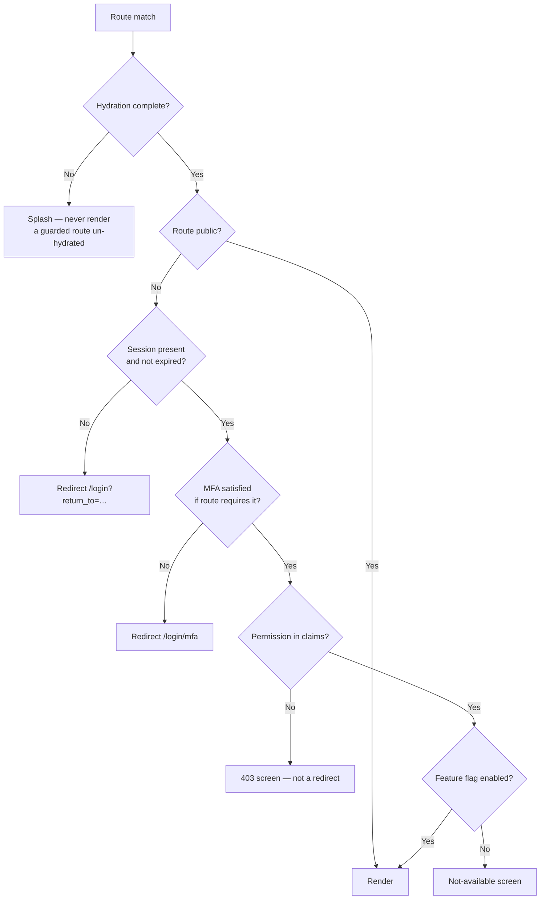

# 03 — Routing & Navigation

**Phase 3.1 deliverable** · Sources: `MOBILE_STATE_MANAGEMENT.md`, `UI_WIREFRAMES.md`, `api/02_ENDPOINT_SPECIFICATIONS.md`
**Status:** Draft for review

Covers the route table, guards, deep linking, and how navigation state is held.

---

## The URL is the source of truth

Doc 02 removes `currentScreen` and `navigationHistory` from the app store. This document is where
that decision is spent.

Everything that determines what the user is looking at lives in the URL:

```
/records/patient?status=active&cursor=eyJ1Ijoi…&sort=updated_at:desc
└──┬───┘ └──┬──┘ └────────────────┬──────────────────────────────┘
   │        │                     └ filters, cursor, sort — query params
   │        └ record type
   └ collection
```

The payoff is concrete: a clinician can bookmark a filtered worklist, a support agent can ask a
user to send the URL they are on, browser back and forward behave, refresh restores the same view,
and deep links land somewhere specific. None of that works when the view is determined by a
store field that a link cannot set.

The cursor belongs in the URL for the same reason, and it is why doc 02's pagination is cursor-
based rather than page-numbered: a cursor identifies a stable position that survives a refresh
even when records were written in between (`api/02_ENDPOINT_SPECIFICATIONS.md`).

**Ephemeral state stays out of the URL**: an open modal, a toast, an expanded row. The test is
whether a user pasting the link to a colleague should see the same thing.

For non-React callers — the sync engine wanting to surface a conflict, a push notification
handler — a navigation service is injected rather than a store written:

```ts
// packages/core, implemented in each app over its router.
export interface Navigator {
  go(path: string, opts?: { replace?: boolean }): void;
  back(): void;
  current(): string;
}
```

---

## Route table

```
/login                                  public
/login/mfa                              public, requires an active challenge
/forgot-password  /reset-password       public
/accept-invite/:token                   public

/                                       → redirect to the tenant's default screen
/dashboard                              authenticated

/records/:type                          records:read     list
/records/:type/new                      records:write
/records/:type/:id                      records:read     detail
/records/:type/:id/edit                 records:write
/records/:type/:id/files                files:read
/records/:type/:id/history              audit:read

/files                                  files:read
/files/:id                              files:read

/search                                 records:read

/settings                               authenticated
/settings/profile  /notifications  /appearance  /sync
/settings/tenant                        tenant:manage
/settings/users                         users:read
/settings/users/:id                     users:read
/settings/webhooks                      webhooks:manage
/settings/api-keys                      api_keys:manage
/settings/billing                       billing:read
/audit-logs                             audit:read
```

Routes mirror the API's canonical/alias split (`api/02`). `/records/:type` is canonical and
always resolves; per-tenant aliases (`/patients`) are registered from
`record_type_definitions.plural_name` at config load and redirect to the canonical form, so a
bookmark survives a type being renamed and there is only one route implementation.

An alias for a record type this tenant has not installed renders a "not enabled" state, not a
generic 404 — the same distinction the API draws with `RECORD_TYPE_NOT_ENABLED`.

The tenant's default screen comes from `ui_config`, since the wireframes show different landing
screens per industry (`UI_WIREFRAMES.md:44,80`) — `/` is a redirect, never a rendered page.

---

## Guards



Order matters. Checking permissions before hydration completes shows a 403 to a user who is
merely still loading, and users read that as being locked out.

**A permission failure renders a 403 screen rather than redirecting to the dashboard.** A silent
redirect makes a bookmarked link look broken, and gives no way to tell "you cannot access this"
from "this does not exist".

Guards are a **convenience, not a boundary**. The API's permission checks are the control
(`api/01_AUTH_AUTHORIZATION_FLOWS.md`); a client-side guard only avoids rendering a screen that
would fail every request. Anyone can edit client state — nothing gated purely in the router is
protected.

### `return_to` must be validated

Preserving where the user was going is standard, and is also a textbook open-redirect:

```
/login?return_to=https://evil.example/harvest
```

After login the app redirects to an attacker-controlled page carrying the platform's branding.
The rule is to accept **only same-origin relative paths**:

```ts
function safeReturnTo(raw: string | null): string {
  if (!raw) return defaultRoute();
  // Must be a single-slash-prefixed relative path. Rejects absolute URLs, protocol-relative
  // '//evil.example', and anything with a scheme.
  if (!/^\/(?!\/)/.test(raw)) return defaultRoute();
  return raw;
}
```

The `(?!\/)` is the part usually missed: `//evil.example` is protocol-relative and a browser
treats it as absolute.

---

## Navigation on mobile

Ionic's `IonRouterOutlet` maintains a native-feeling page stack with transitions, while still
being driven by the router. Two behaviours need explicit handling.

**The Android hardware back button** must integrate with routing rather than closing the app.
Priority order: dismiss an open overlay, then pop the stack, then — only at a root tab — allow
exit, with the standard double-press confirmation.

```ts
App.addListener('backButton', ({ canGoBack }) => {
  if (dismissTopOverlay()) return;
  if (canGoBack) { navigator.back(); return; }
  confirmExit();
});
```

**Tab stacks are independent.** Each bottom tab (`UI_WIREFRAMES.md:64`) keeps its own history, so
switching tabs and back again returns to where the user was rather than resetting. Tabs come from
tenant navigation config, so the set is dynamic, and the router must handle a tab disappearing
after a config change while the user is standing on it — redirect to the default screen rather
than rendering a route with no tab.

---

## Deep linking

| Source | Mechanism | Notes |
|---|---|---|
| Web | Ordinary URL | Nothing to configure |
| iOS | Universal Links | `apple-app-site-association` on the domain |
| Android | App Links | `assetlinks.json`, verified |
| Push notification | `data.path` payload | Path only — never PHI (doc 06) |
| Custom scheme | `hsc://` | Fallback only |

Universal Links and App Links are strongly preferred over the custom scheme: a custom scheme can
be registered by any other app on the device, so `hsc://records/patient/123` can be intercepted.
Verified links are bound to the domain the platform controls.

**The tenant subdomain complicates this.** With per-tenant hosts
(`healthcare-plus.allguds.com`), each tenant domain needs its own association file, which is
impractical for custom domains a tenant controls. Deep links therefore use the canonical host
with the tenant in the path:

```
https://links.allguds.com/t/healthcare-plus/records/patient/6f1c…
```

The app resolves the tenant segment, and if the current session belongs to a different tenant it
prompts to switch rather than silently failing or — worse — routing into the wrong tenant's data.

**A deep link never bypasses the guards.** It resolves to a route, which then runs the guard chain
like any other navigation; an unauthenticated deep link lands on login with `return_to` set and
resumes afterwards. This is a common shortcut and it is exactly how a link becomes an
authentication bypass.

Cold-start ordering is the subtle part: a link received before hydration completes must be
queued, not dropped, and replayed once the session and tenant config are loaded.

---

## Modals

Modals that represent a distinct destination — record detail on desktop, a conflict resolution
dialog — get a route, so back closes them and the link is shareable. Modals that are transient
interactions — a confirm, a filter sheet — stay component state.

The rule: if it renders content a user would want to link to or expect the back gesture to close,
it is a route.

---

## Corrections to `MOBILE_STATE_MANAGEMENT.md`

| # | Severity | Issue | Resolution |
|---|---|---|---|
| 1 | **High** | `currentScreen` / `navigationHistory` in the app store duplicate router state; they drift on any navigation the store does not intercept and break back, deep links and the PWA | Removed; the URL owns navigation, with a `Navigator` interface for non-React callers |
| 2 | **High** | `goBack` pops a hand-maintained array rather than real history, disagreeing with the platform back gesture and browser back | Router history |
| 3 | Medium | Nothing specifies Android hardware back handling; the default closes the app from any screen | Overlay → stack → confirm-exit chain |
| 4 | Medium | No `return_to` validation is specified anywhere; the natural implementation is an open redirect | Same-origin relative paths only, rejecting protocol-relative |
| 5 | Medium | No deep-link strategy; per-tenant subdomains make association files impractical | Canonical link host with the tenant in the path |
| 6 | Low | Nothing handles a deep link arriving before hydration | Queue and replay after boot |

---

## Open questions

1. **Tenant switching.** Users belonging to several tenants are plausible (a consultant across
   clinics), but nothing in the schema models it — `tenant_users` is one row per tenant, so
   "switching" is really logging into a different account. If genuine multi-tenant users are
   wanted, that is a Phase 1 change, not a routing one.
2. **Link host.** `links.allguds.com` is proposed to keep association files manageable. It means
   shared links do not carry tenant branding, which some tenants will object to.
3. **Scroll restoration.** Returning to a long worklist should restore position. Ionic's stack
   navigation gives this for free within a tab; browser back on the PWA does not, and it needs a
   deliberate implementation.
4. **Unsaved-change guards.** Navigating away from a partly-completed form should prompt. The
   browser's `beforeunload` covers tab close but not in-app navigation, and the two need to
   behave consistently.
5. **Route-level audit.** `api/04` requires PHI *reads* to be audited server-side. Client routing
   does not create audit events, so a user browsing a cached record offline generates no access
   record until sync. Whether offline reads of PHI must be logged locally and uploaded is a
   compliance question, not an engineering one — and it likely affects doc 05's schema.
