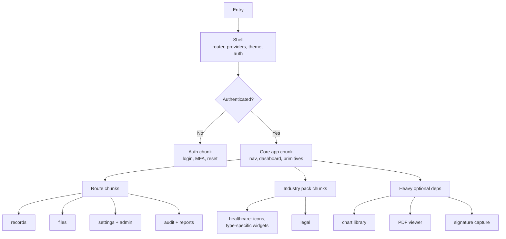

# 04 — Performance Optimization

**Phase 3.1 deliverable** · Sources: `UI_WIREFRAMES.md`, `TECH_STACK_PLAN.md`, `ARCHITECTURE_DESIGN.md`
**Status:** Draft for review

Covers bundle budgets and code splitting, tree shaking, image and asset delivery, the PWA and its
service worker, list rendering, and how any of this is measured.

---

## Budgets

Numbers first, because "optimize later" reliably means "never". These are enforced in CI; a PR
that exceeds them fails.

| Budget | Target | Hard fail |
|---|---|---|
| Initial JS (gzipped) | 180 KB | 250 KB |
| Initial CSS | 40 KB | 60 KB |
| Largest route chunk | 100 KB | 150 KB |
| Largest Contentful Paint (mid-tier mobile, 4G) | 2.0 s | 2.5 s |
| Interaction to Next Paint | 150 ms | 200 ms |
| Cumulative Layout Shift | 0.05 | 0.1 |
| Native cold start to first interactive | 1.5 s | 2.5 s |

The native target is separate because a Capacitor cold start pays costs the web does not: WebView
initialisation, opening SQLite, running pending migrations, and rehydrating stores (doc 02). The
budget is measured to *interactive*, not to splash dismissal, because dismissing a splash into a
skeleton is not a fast app.

---

## Code splitting



Four splitting axes, in order of payoff:

**Route level.** Every route is a `lazy()` import. The admin and audit routes are the easy win —
most users never open them, and `/audit-logs` pulls in date-range pickers and export machinery.

**Industry pack.** A tenant on the healthcare pack must not download the legal pack's icons and
widgets. Packs are resolved from `tenant_installed_packs` at config load, so the import is
dynamic and keyed by pack code. This is the answer to doc 01's open question about icon strategy.

**Feature flag.** A feature disabled for a tenant should not be in its bundle. This only works
where the flag is known before the chunk is requested — flags arrive with tenant config, which is
fetched during boot, so route-level flag gating works and component-level gating inside an
already-loaded chunk does not.

**Heavy dependency.** Charts, PDF rendering and signature capture are large and used on few
screens. Imported at the point of use, never at module top level.

Prefetching keeps splitting from feeling slow: on idle after the dashboard renders, prefetch the
chunks for the tenant's configured navigation tabs. The user pays no wait for the routes they are
most likely to open next, and nothing is fetched for tabs the tenant does not have.

## Tree shaking

- Ionic components are imported individually (`import { IonButton } from '@ionic/react'`), never
  as a namespace. Ionic's own CSS is imported per component rather than as the full bundle.
- No barrel files in `packages/ui`. A single `index.ts` re-exporting 200 components defeats
  shaking in most bundler configurations and makes every consumer pull the whole library.
- `sideEffects: false` in every internal package's `package.json`, with genuine side-effecting
  files (CSS, polyfills) listed explicitly.
- Date handling uses `date-fns` per-function imports or `Intl` directly. A moment-shaped library
  imported whole is typically the single largest avoidable dependency in an app like this.
- The bundle is inspected, not assumed: `rollup-plugin-visualizer` output is attached to CI and a
  new dependency over 20 KB requires a note in the PR description.

---

## Images and assets

| Asset | Delivery | Cache |
|---|---|---|
| App shell JS/CSS | CDN, content-hashed filenames | Immutable, 1 year |
| Icons, fonts | CDN, subset, preloaded | Immutable |
| Tenant logo | CDN via `file_variants` (`database/05`) | Public, short TTL, keyed by version |
| **Record attachments, uploaded photos, documents** | **Pre-signed URL, direct from storage** | **Never public, never CDN** |

The last row is the one that matters. `ARCHITECTURE_DESIGN.md` lists "CDN: static assets and API
response caching", and the natural reading extends that to uploaded images — which on this
platform are wound photographs, scanned insurance cards and lab reports.

**Attachments never transit a public CDN and are never cached at a shared edge.** They are served
by `GET /v1/files/{id}/download`, which authorizes, audits the access, checks `scan_status`, and
redirects to a short-lived pre-signed URL (`api/02_ENDPOINT_SPECIFICATIONS.md`). A CDN copy would
be reachable without authorization, invisible to the audit trail, and outside the retention and
purge policies in `database/04`.

Tenant logos are genuinely public branding and may be CDN-cached — the URL is versioned so a logo
change is not stuck behind a TTL.

Server-side variant generation (`file_variants`) does the heavy lifting: the client requests the
`thumbnail_sm` variant for a list and the full image only on demand, rather than downloading a
12 MP photograph to render at 64 px. Images carry explicit `width`/`height` so the layout does not
shift when they load, which is most of the CLS budget.

---

## PWA and the service worker

PWA support is a stated reason for choosing Ionic (`TECH_STACK_PLAN.md`), and the service worker
is where an offline-capable healthcare app most easily creates a breach.

**Cache Storage is unencrypted disk storage, readable by anyone with access to the browser
profile, and it survives logout unless explicitly cleared.** So:

| Request | Strategy | Rationale |
|---|---|---|
| App shell, JS, CSS | Precache, cache-first | Content-hashed; safe |
| Fonts, icons | Cache-first | Safe |
| Tenant logo | Stale-while-revalidate | Public branding |
| `/v1/**` — any authenticated API response | **Network only. Never cached.** | Contains PHI |
| `/v1/files/*/download` | **Network only** | Attachment content |
| Navigation requests | Network-first, offline fallback to the app shell | Shell only, no data |

Offline data comes from **SQLite via WatermelonDB** (doc 05), which is encrypted at rest and
purged on logout — not from the HTTP cache. The service worker's job is to make the *application*
available offline; the database's job is to make the *data* available offline. Conflating them
puts an unencrypted, unpurged copy of patient data on disk.

The service worker is also cleared as part of the logout purge in doc 02:

```ts
// Part of purgeLocalState()
for (const key of await caches.keys()) await caches.delete(key);
const reg = await navigator.serviceWorker.getRegistration();
await reg?.unregister();
```

Update handling: a new service worker activates on next launch, not mid-session, and the user is
prompted rather than reloaded underneath — reloading someone mid-form loses their work. A version
skew check on API responses triggers the prompt when the client is too old for the current sync
protocol (doc 07).

---

## Rendering

The data view in `UI_WIREFRAMES.md:216-230` shows 1,247 records. Rendering that as DOM nodes is
several thousand elements and a scroll that stutters on any mid-tier device.

- **Virtualize every unbounded list.** `IonVirtualScroll` or a windowing library; a fixed row
  height where possible, since variable heights force measurement passes.
- **Paginate by cursor, not by page number** (`api/02`), fetching the next page on scroll.
- **Memoize row components** and keep their props referentially stable — a virtualized list whose
  rows re-render on every parent render is slower than an unvirtualized one, because it adds
  measurement on top.
- **Narrow selectors** (doc 02): a row subscribing to the whole sync store re-renders on every
  queue-depth tick, which during a sync is continuous.
- **Debounce search input**, and cancel superseded requests. Full-text search hits
  `idx_records_search` (`database/06`) and is cheap server-side; the cost is in re-rendering
  results for every keystroke.

Long lists on mobile also need `content-visibility: auto` on off-screen sections and images
loaded lazily below the fold.

---

## Native startup

The Capacitor cold-start path costs more than the web's, and most of it is avoidable work done
eagerly:

| Stage | Cost | Mitigation |
|---|---|---|
| WebView init | Platform | Nothing to do |
| Load shell bundle | Bundle size | Budgets above; assets local, not network |
| Open SQLite | Small, unless migrating | Keep migrations forward-only and cheap (doc 05) |
| Rehydrate stores | Preferences reads | Read only what boot needs; defer the rest |
| Resolve tenant config | Network unless cached | Cached in Preferences; render from cache, revalidate after |
| First sync | Potentially large | **Never block first paint on it** |

The last is the common mistake: making the dashboard wait for a sync means an app that takes ten
seconds to open on a poor connection. Render from local data immediately, sync in the background,
and update reactively when it lands — which is what an offline-first architecture is for.

---

## Measurement

| What | Tool | Where |
|---|---|---|
| Bundle size vs budget | `size-limit` | CI, blocking |
| Lighthouse CI | Performance, a11y, PWA | CI on preview builds |
| Real user Core Web Vitals | `web-vitals` → OpenTelemetry | Production, per tenant |
| Native startup | Custom trace, splash → interactive | Production |
| Render profiling | React Profiler | Development |
| Slow queries (local) | WatermelonDB query timing | Development + sampled production |

Per-tenant vitals matter more than an aggregate here: a tenant with 50,000 records has a very
different experience from one with 200, and an average hides it. This is the client-side half of
the per-tenant observability in `database/08_SCALING_ARCHITECTURE.md`.

**Performance telemetry must not carry PHI.** Route patterns (`/records/:type/:id`), never
resolved URLs; no search terms; no record titles in span names. Same rule as doc 02's logging
middleware, and worth enforcing with a span processor rather than review.

---

## Corrections to the source documents

| # | Severity | Issue | Resolution |
|---|---|---|---|
| 1 | **High** | "CDN: API response caching" extends naturally to uploaded attachments, putting PHI on a public edge outside authorization, audit and retention | Attachments served only via authorized redirect to short-lived pre-signed URLs; never CDN-cached |
| 2 | **High** | PWA support is specified with no service-worker caching policy; the default recipe caches API responses into unencrypted, unpurged Cache Storage | API and downloads are network-only; offline data comes from encrypted SQLite; caches cleared on logout |
| 3 | Medium | No bundle or performance budgets anywhere | Budget table, enforced in CI |
| 4 | Medium | Industry packs and feature flags have no bundling story, so every tenant ships every vertical | Pack-keyed dynamic imports resolved from `tenant_installed_packs` |
| 5 | Medium | A 1,247-row data view is specified with no virtualization | Virtualized lists, cursor pagination |
| 6 | Low | Nothing defines native cold-start expectations, and the natural implementation blocks first paint on sync | Startup budget; render from local data, sync in background |

---

## Open questions

1. **Offline attachments.** Correction 1 keeps attachments off the CDN, but an offline-first app
   must cache some of them on device to be useful. Doc 05 covers encrypted local storage; the
   open question is *which* attachments are cached, since caching all of them for a large tenant
   is not viable and caching none makes offline half-useful.
2. **Virtualization library.** `IonVirtualScroll` is deprecated in recent Ionic versions.
   Choosing the replacement (`@tanstack/react-virtual` or similar) is a real decision with
   consequences for variable-height rows.
3. **Budget realism.** The numbers above are conventional targets, not measured ones. They should
   be re-baselined once a real app exists, rather than quietly waived the first time they fail.
4. **Ionic CSS weight.** Ionic's base stylesheet is substantial before any application CSS. The
   40 KB CSS budget may need revisiting after measuring a real build.
5. **Web vs native budgets.** One set of numbers is used for both. Native ships assets locally and
   should be stricter on startup but can be more relaxed on bundle size; splitting the budgets
   may be worth it once measured.
