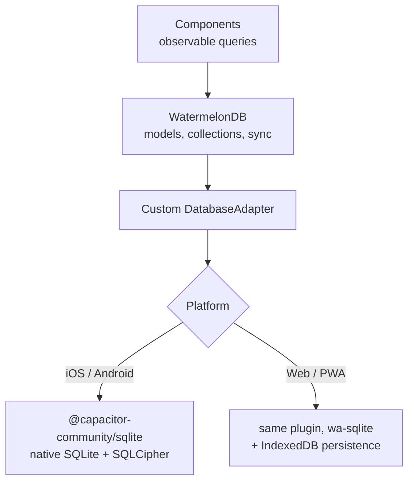

# 05 — Offline-First Architecture

**Phase 3.2 deliverable** · Sources: `MOBILE_STATE_MANAGEMENT.md`, `OFFLINE_SYNC_PROCESS.md`, `database/03_BUSINESS_ENTITY_ERD.md`, `api/openapi.yaml`
**Status:** Draft for review

Covers the local database and its adapter, the local schema, encryption at rest, the sync
protocol, conflict resolution, the offline queue, and consistency validation.

---

## The database stack

WatermelonDB's SQLite adapter targets React Native — it expects the RN bridge/JSI, which does not
exist in a Capacitor WebView. The stack keeps WatermelonDB's models, observable queries and sync
primitives, backed by `@capacitor-community/sqlite` through a custom adapter:



The adapter implements WatermelonDB's `DatabaseAdapter` interface — `find`, `query`, `count`,
`batch`, `getDeletedRecords`, `unsafeResetDatabase` and the schema/migration hooks — translating
each to plugin calls.

**The risk is explicit:** `DatabaseAdapter` is an internal interface with no compatibility
guarantee, so a WatermelonDB minor release can break the adapter. Mitigations: pin the version
exactly, keep the adapter under 500 lines with no cleverness, and run WatermelonDB's own adapter
test suite against it in CI. Treat a WatermelonDB upgrade as a change requiring a full sync
regression run, not a dependency bump.

The web build uses the same plugin's wa-sqlite path rather than WatermelonDB's LokiJS adapter, so
that both platforms run identical SQL and one query behaviour. Two adapters would mean two sets
of sync bugs.

## Encryption at rest

PHI stored on a device is PHI at rest, and `SECURITY_ARCHITECTURE.md` requires AES-256 for data
at rest. The database is opened with SQLCipher:

- The key is generated on first launch, stored in Keychain/Keystore (never in Preferences,
  never in the bundle), and unlocked by device biometrics or passcode (doc 06).
- Losing the key means the local database is unreadable — which is the intended behaviour on
  device loss, and means the key must never be the only copy of anything. Everything local is
  reconstructible from the server by definition.
- Attachment files cached outside SQLite are encrypted individually with a key from the same
  keystore. A file dropped in the app's Documents directory in plaintext is a breach even though
  the database is encrypted.

---

## Local schema

Mirrors the server (`database/03_BUSINESS_ENTITY_ERD.md`) with sync bookkeeping added.
WatermelonDB supplies `_status` and `_changed` per record; the columns below are ours.

| Table | Columns beyond the server's | Purpose |
|---|---|---|
| `records` | `server_version`, `base_version`, `synced_at`, `is_pending`, `conflict_state` | Conflict detection |
| `record_links` | `server_id`, `is_pending` | Links created offline |
| `files` | `local_path`, `upload_state`, `download_state`, `checksum` | Attachment caching |
| `sync_queue` | `operation`, `entity`, `entity_id`, `payload`, `attempt`, `depends_on`, `created_at` | Outbound queue |
| `sync_state` | `cursor`, `last_pull_at`, `last_push_at`, `full_sync_completed` | Watermark |
| `conflicts` | `record_id`, `local_snapshot`, `server_snapshot`, `detected_at`, `resolution` | Unresolved conflicts |

`base_version` is the critical one and is what the push protocol sends: the server version the
local edit was made against. `records.version` on the server (`database/03`) is the counterpart.
The pair is what makes conflict detection exact rather than heuristic.

`records.form_version_id` is synced too, so a record captured under an old form schema renders
under that schema offline (doc 01).

### Selective sync

Syncing an entire tenant to every device is wrong on three counts: a large tenant will not fit,
the initial sync takes minutes, and it puts every patient's data on every clinician's phone —
which is a data-minimization problem, not just a performance one.

Sync scope is bounded by policy, not by convenience:

```
Records:    assigned to me, or in my team's scope, or touched in the last N days
Types:      only record types the device's user has records:read on
Files:      metadata always; content only for records in scope, under a size cap
History:    not synced — audit and version history are fetched online
```

The scope is expressed as parameters on `/sync/pull` and enforced **server-side**. A client
asking for a wider scope than its permissions allow gets its permitted subset, silently — the
server is the boundary, per `api/01`.

---

## Sync protocol

```mermaid
sequenceDiagram
    participant DB as Local SQLite
    participant S as Sync engine
    participant API as Platform API

    Note over S: Trigger: app foreground, network regained,<br/>periodic timer, explicit pull-to-refresh
    S->>DB: read sync_state.cursor
    S->>DB: read sync_queue (ordered, ready)

    S->>API: POST /v1/sync/push {device_id, changes[{operation, record_id, base_version, data}]}
    API-->>S: per-item outcomes: applied | conflict | rejected

    loop each outcome
        alt applied
            S->>DB: clear queue entry, set server_version, is_pending=false
        else conflict
            S->>DB: write conflicts row with both snapshots
        else rejected
            S->>DB: mark queue entry failed with error code
        end
    end

    S->>API: POST /v1/sync/pull {device_id, cursor, limit}
    API-->>S: {changes[], deletions[], next_cursor, has_more}
    S->>DB: apply in a transaction; skip records with local pending edits
    S->>DB: sync_state.cursor = next_cursor
    Note over S: repeat while has_more
```

**Push before pull.** Pulling first would overwrite local edits that have not yet been sent, or
require them to be re-detected as conflicts on the next push. Pushing first means the server has
seen everything local before the client accepts anything new.

**The cursor is opaque and server-issued** (`api/02_ENDPOINT_SPECIFICATIONS.md`), not a device
timestamp. `OFFLINE_SYNC_PROCESS.md:322` sends `"last_sync": "2024-09-07T09:00:00Z"` from the
client; a device whose clock runs fast silently skips every record written in the gap, and the
records are never seen again because the watermark has already advanced past them. That is silent
data loss with no error to notice.

**Pull applies in one transaction per batch.** A batch interrupted halfway must not advance the
cursor, or the missed records are skipped permanently.

---

## Conflict resolution

A conflict is precise: the server's current `version` for a record differs from the
`base_version` the local edit was made against, **and** the local record has unsent changes. If
there are no local changes, an incoming update is not a conflict — it is just the newest data.

### Corrections to the documented algorithms

`OFFLINE_SYNC_PROCESS.md:340-400` proposes four algorithms. Three have concrete problems.

**Timestamp last-write-wins compares device clocks.** `if (server_timestamp > local_timestamp)`
is only meaningful if both come from the same clock. They do not: one is the server's, one is the
device's. A device with a clock ten minutes fast wins every conflict it participates in, forever,
and nobody notices because the outcome looks like a normal resolution. Where LWW is used at all,
both timestamps must be **server-assigned** — the server stamps receipt time on push.

**Field-level merge needs per-field timestamps that nothing stores.** The pseudocode reads
`local[field + '_timestamp']` and `server[field + '_timestamp']`. Neither exists: the server keeps
one `updated_at` per record and stores fields inside a `data` JSONB blob
(`database/03`), and the local schema has no per-field metadata either. As written the algorithm
cannot run. Implementing it properly means storing a per-field version vector — a real change to
both schemas, and a large one.

**The merge loop drops every unchanged field.** It only assigns `merged_record[field]` inside the
`if (local[field] != server[field])` branch, so fields that agree are never copied into the
result. The merged record contains only the fields that were in conflict, and everything else is
lost.

**"Medical data: always prefer server" silently discards clinical work.** For an offline-first
app whose stated purpose is letting clinicians work without connectivity, resolving every patient
record conflict in the server's favour means a clinician's offline notes vanish with no
indication. If server-wins is the policy for a record type, the local version must at minimum be
preserved and surfaced, never dropped.

### What is used instead

| Situation | Resolution |
|---|---|
| Local changed, server unchanged | Local wins — not a conflict, just a push |
| Server changed, local unchanged | Server wins — not a conflict, just a pull |
| Both changed, disjoint fields | **Three-way merge** against the common ancestor |
| Both changed, same field | **User resolves**, with both values shown |
| Both changed, record is `is_phi` | **Always user resolves.** Never automatic |
| Local delete vs server update | User resolves; default is to keep the record |
| Server delete vs local update | User resolves; default is to keep the local edit |

The three-way merge is what makes automatic resolution safe, and it needs no per-field
timestamps — only the common ancestor, which the client already has as the snapshot at
`base_version`:

```
ancestor = local snapshot at base_version
for each field:
    if local[field] == ancestor[field]  -> take server[field]   (only server changed it)
    if server[field] == ancestor[field] -> take local[field]    (only local changed it)
    if local[field] == server[field]    -> take either          (same edit)
    otherwise                           -> genuine conflict, escalate
```

This requires keeping the base snapshot for any record with pending edits — a real storage cost,
and the reason `conflicts.local_snapshot` and `server_snapshot` exist in the local schema.

Unresolved conflicts are **blocking and visible**: the record shows a conflict badge, is excluded
from further automatic sync, and the sync status surface (`UI_WIREFRAMES.md:129`) shows a count.
A conflict that is resolved silently, or queued invisibly, is how offline work is lost without
anyone knowing it happened.

---

## The offline queue

`sync_queue` is ordered and dependency-aware. Three properties matter:

**Ordering within an entity.** Two edits to the same record must reach the server in the order
they were made; the queue coalesces them where the second supersedes the first, and never
reorders them.

**Dependencies across entities.** A link created offline between two records created offline
cannot be pushed until both records have server ids. `depends_on` holds the queue entries that
must land first, and the push batches accordingly. Without it, the link push fails with a foreign
key error and looks like a server problem.

**Poison entries.** An entry rejected with a permanent error (`422`, a link rule violation) must
not retry forever. After the retry budget, it moves to a failed state, surfaces in the UI, and
stops blocking the entries behind it — a single bad record silently halting all sync is the worst
failure mode this queue has, because everything continues to look normal locally.

Retries use the same backoff-with-jitter shape as webhook delivery (`api/04`), and every push
carries an `Idempotency-Key` (`api/02`) so a retry after an ambiguous network failure cannot
create duplicates.

---

## Consistency validation

Sync bugs are silent by nature. Periodic verification, cheap enough to run on every full sync:

| Check | Method | On mismatch |
|---|---|---|
| Record count per type | Compare local count with server count for the sync scope | Trigger scoped re-pull |
| Content digest | Server returns a digest over `(record_id, version)` for the scope; client computes the same | Re-pull the diverging type |
| Orphaned links | Local links whose endpoints are absent | Delete link, re-pull |
| Queue integrity | Entries referencing missing records | Move to failed, report |
| Attachment integrity | `file_versions.checksum` vs local file (`database/05`) | Re-download |

The digest is the useful one: it detects divergence without transferring data, and it is the only
thing that catches the class of bug where sync *thinks* it succeeded. When it fails repeatedly, a
full local reset and re-pull is the correct escalation — safe precisely because local data is
reconstructible.

---

## Corrections to the source documents

| # | Severity | Issue | Resolution |
|---|---|---|---|
| 1 | **High** | WatermelonDB's SQLite adapter targets React Native and does not run under Capacitor | Custom adapter over `@capacitor-community/sqlite`, pinned and test-suited |
| 2 | **High** | LWW compares a server timestamp with a device timestamp; a skewed device clock silently wins every conflict | Server-assigned timestamps on both sides |
| 3 | **High** | Field-level merge reads per-field timestamps that neither schema stores — the algorithm cannot run | Three-way merge against the `base_version` ancestor |
| 4 | **High** | The merge loop only assigns fields that differ, so the merged record loses every unchanged field | Rewritten; all fields resolved |
| 5 | **High** | Sync cursor is a client wall-clock timestamp; skew skips records permanently and silently | Opaque server-issued version cursor |
| 6 | **High** | "Medical data: always prefer server" discards a clinician's offline work with no indication | PHI conflicts always escalate to the user |
| 7 | Medium | No encryption specified for the local database despite PHI at rest | SQLCipher, key in Keychain/Keystore; attachments encrypted individually |
| 8 | Medium | No sync scoping; the natural implementation puts the whole tenant on every device | Server-enforced selective sync |
| 9 | Medium | No queue dependency handling; offline-created links fail against server ids that do not exist yet | `depends_on` ordering |
| 10 | Medium | No poison-entry handling; one permanently rejected change blocks the queue indefinitely | Retry budget then failed state, surfaced |
| 11 | Low | No consistency verification, so silent divergence is undetectable | Count and digest checks per full sync |

---

## Open questions

1. **The adapter is the largest technical risk in Phase 3.** A spike proving it against
   WatermelonDB's adapter test suite, on both platforms, should happen before the rest of the
   mobile app is built on the assumption that it works.
2. **Selective sync policy.** "Assigned to me, or touched in N days" is a placeholder. The real
   rule is clinical and operational, and it determines both device storage and how useful the app
   is offline.
3. **Base snapshots cost storage.** Keeping the ancestor for every pending edit roughly doubles
   the footprint of pending records. Acceptable for a modest queue; needs a cap, and a decision
   about what happens when it is hit.
4. **Offline PHI read auditing.** Doc 03 raises it; it lands here. If offline reads of PHI must be
   audited, the local schema needs an `access_log` table and sync needs to upload it — which is
   not currently in scope and is a compliance decision.
5. **Multi-device conflicts.** The protocol handles device-versus-server. Two devices editing
   offline simultaneously produces a conflict for whichever pushes second, which is correct, but
   the UX of resolving it needs designing rather than inheriting the generic dialog.
6. **Schema migration while offline.** A client on an old local schema that has been offline
   through a server change must migrate locally before it can sync. Forward-only local migrations
   are assumed; the forced-upgrade path is in doc 07.
