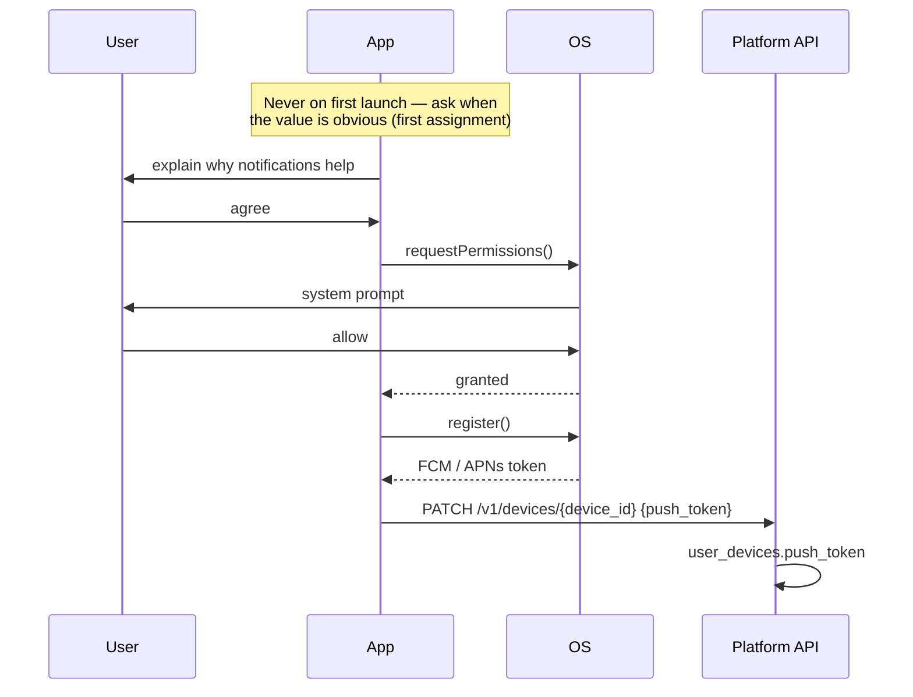
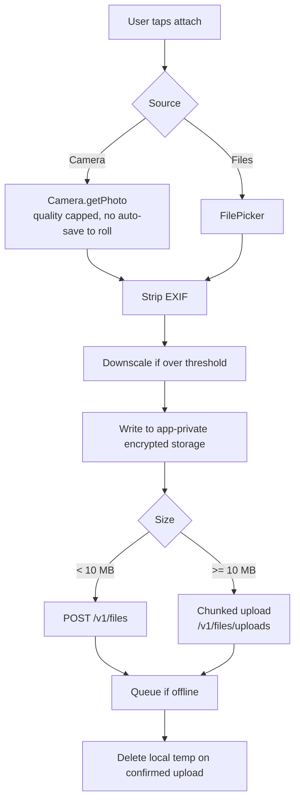
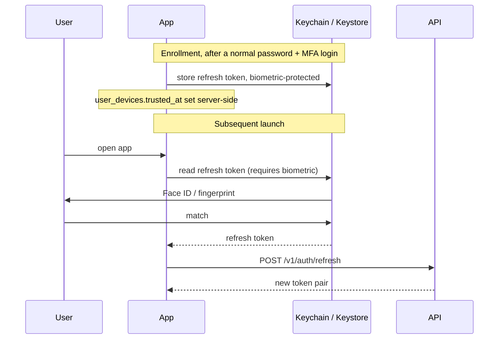

# 06 — Native Feature Integration

**Phase 3.2 deliverable** · Sources: `TECH_STACK_PLAN.md`, `MOBILE_STATE_MANAGEMENT.md`, `database/02_USER_AUTH_ERD.md`, `database/05_FILE_DOCUMENT_ERD.md`
**Status:** Draft for review

Covers push notifications, camera and file access, biometric authentication, background sync, and
the app-lifecycle behaviour a PHI-handling app needs.

Every native capability is reached through a Capacitor plugin wrapped behind an interface in
`packages/platform` (doc 07). No component imports a plugin directly.

---

## Push notifications

### Registration



The pre-prompt matters: the OS permission dialog can only be shown once, and asking on first
launch — before the user knows what the app does — is how apps get permanently denied. Ask at the
first moment a notification would be useful.

Tokens rotate. `user_devices.push_token` (`database/02_USER_AUTH_ERD.md`) is updated on every
launch, and a token rejected by FCM/APNs as unregistered is cleared server-side rather than
retried, or the platform accumulates dead tokens and wastes delivery budget on them.

### Payloads carry no PHI

Notifications appear on a **lock screen**, are processed by Apple's and Google's infrastructure,
and on Android may be persisted by the OS notification log. They are outside the audit trail and
outside the BAA.

```json
{
  "notification": { "title": "New assignment", "body": "You have a new record to review" },
  "data": { "type": "record.assigned", "path": "/records/patient/6f1c…", "tenant": "healthcare-plus" }
}
```

Never `"body": "New lab result for Sarah Johnson"`. The title and body are generic; the payload
carries a path, and the app fetches the real content after unlock — authorized and audited like
any other read. This is the same rule as webhook payloads in `api/04`.

Tapping a notification routes through the deep-link path in doc 03, including the guard chain. A
notification for a tenant other than the active session prompts to switch rather than routing
into the wrong tenant.

---

## Camera and file access



**EXIF stripping is not optional.** A photograph taken on a phone carries GPS coordinates, a
device identifier and a timestamp. A wound photograph with the patient's home address embedded in
it is PHI the platform created by accident, and it travels with the file into every export and
backup. Strip before the file leaves the capture step.

**`saveToGallery` stays false.** Capacitor's Camera plugin can write captures to the device photo
library, which is backed up to iCloud/Google Photos, shared with other apps, and entirely outside
the platform's control. Clinical captures must exist only in app-private storage.

Uploads route through the chunked flow above 10 MB (`api/02_ENDPOINT_SPECIFICATIONS.md`), resume
across app restarts using `file_uploads` state, and only delete the local temp file once the
server confirms — deleting on request completion loses the file if the response is lost.

Downloads write to app-private, encrypted storage, never to Downloads or Documents where other
apps can read them.

---

## Biometric authentication

The most common mistake here is treating biometrics as authentication. They are not — they are a
**local gate on a stored credential**.



What this means concretely:

- The server never sees a biometric and never trusts one. It sees a normal refresh (`api/01`),
  which it can revoke like any other.
- Biometrics unlock a credential; they do not extend its life. A revoked session stays revoked and
  the refresh fails, which is the correct outcome.
- Enrollment requires a **full** login first, including MFA. Biometrics are a convenience layered
  on an established session, never a way to establish one.
- If the device's biometric enrollment changes — a new fingerprint added — the keystore item is
  invalidated by the OS and the user must log in again. This is the intended behaviour and must
  not be worked around.
- Fallback is device passcode, then password login. Never a silent bypass.

Biometrics also gate re-entry after the session timeout below, which is what makes a short
timeout tolerable on a clinical device.

---

## Background sync

`TECH_STACK_PLAN.md` calls for background sync. The honest constraint is that **iOS provides no
guarantees**, and designing as though it does produces an app that appears broken.

| Platform | Mechanism | Reality |
|---|---|---|
| iOS | `BGAppRefreshTask` | Opportunistic. The OS decides, based on usage patterns and battery. May be hours, or never. Roughly 30 s of runtime |
| Android | `WorkManager` | Reliable within Doze constraints; batched when idle |
| Web/PWA | Background Sync API | Chromium only; absent on iOS Safari |

Design consequences:

- **Foreground sync is the primary path.** Sync on app foreground, on network regain, and on
  explicit pull-to-refresh. Background sync is a bonus that shortens the next foreground sync,
  never the mechanism the product depends on.
- **Background tasks must be interruptible.** With ~30 s on iOS, a batch must checkpoint after
  each page so a suspension loses at most one batch, not the whole run.
- **A silent push can prompt a sync** where timeliness matters, subject to the same no-PHI rule.
- **Never promise "always up to date."** The sync status surface shows a real last-sync time
  (`UI_WIREFRAMES.md:139`), and stale data is labelled as stale rather than presented as current.

---

## App lifecycle and PHI on screen

These are the behaviours a general-purpose app does not need and a PHI-handling one does.

| Behaviour | Implementation | Why |
|---|---|---|
| Session timeout on background | Blur and lock after 5 min backgrounded; require biometric to resume | `SECURITY_ARCHITECTURE.md` requires session timeouts; a phone left on a ward is the threat |
| App switcher privacy | Overlay a blank/branded view on `pause`, remove on `resume` | iOS and Android screenshot the app for the task switcher, and that screenshot persists to disk |
| Screenshot and screen recording | Android `FLAG_SECURE`; iOS detect `isCaptured` and warn | Cannot be fully prevented on iOS; detection plus audit is the achievable control |
| Pasteboard | Mark clinical fields no-copy where possible; clear on background | iOS pasteboard is shared across apps and syncs to other devices via Handoff |
| Keyboard | Disable predictive text and autocorrect on PHI fields | Keyboards learn and store what is typed, in a store outside the app |

The app-switcher overlay is the one most often missed: without it, the OS keeps a screenshot of
whatever was on screen — commonly a patient record — in unencrypted storage, visible to anyone who
opens the task switcher.

`appState` transitions drive all of this, which is the legitimate part of the `appState` field in
`MOBILE_STATE_MANAGEMENT.md:126` — it is genuine runtime state, and it is one of the fields that
must *not* be persisted (doc 02).

---

## Permissions

| Permission | When requested | If denied |
|---|---|---|
| Notifications | First assignment or mention | Feature disabled, in-app inbox still works |
| Camera | First capture attempt | Offer file picker instead |
| Photo library | First library attach | Offer camera instead |
| Biometrics | Opt-in from settings, after full login | Password login continues to work |
| Storage (Android) | Scoped storage; generally not needed | — |

No permission is requested at launch, and every denial has a working fallback. A permission
request the user cannot connect to an action they just took is the one they deny permanently.

Requests are re-checked rather than remembered: a user can revoke a permission in system settings
at any time, and the app must handle discovering that mid-session rather than assuming its
enrollment state is current.

---

## Additions and corrections to the source documents

| # | Severity | Issue | Resolution |
|---|---|---|---|
| 1 | **High** | Push notifications are specified with no payload policy; the natural implementation puts patient names on lock screens, outside the audit trail and the BAA | Generic title/body, path in `data`, content fetched after unlock |
| 2 | **High** | No app-switcher privacy overlay; the OS persists a screenshot of whatever was on screen, commonly a patient record | Overlay on `pause` |
| 3 | **High** | Biometric authentication is listed as an auth method; treating it as one would let a local gesture substitute for server authentication | Biometrics unlock a stored refresh token; the server sees a normal refresh |
| 4 | **High** | Camera capture with no EXIF handling embeds GPS coordinates in clinical photographs | Strip EXIF before the file leaves capture |
| 5 | Medium | Nothing prevents captures being written to the device photo library, where they leave platform control and reach cloud backups | `saveToGallery: false`, app-private encrypted storage |
| 6 | Medium | Background sync is specified as though it is reliable; iOS gives no guarantees and the app would appear broken | Foreground-primary, background as opportunistic, honest staleness labelling |
| 7 | Medium | No session timeout on backgrounding despite the requirement for session timeouts | Lock after 5 min backgrounded, biometric to resume |
| 8 | Low | No pasteboard or keyboard-learning handling on PHI fields | No-copy where possible, autocorrect disabled, clear on background |
| 9 | Low | Push tokens are stored but nothing clears rejected ones | Clear server-side on unregistered response |

---

## Open questions

1. **Background lock timeout.** Five minutes is proposed. Clinical staff moving between patients
   will find it intrusive; security will want shorter. It should be tenant-configurable within a
   platform-enforced maximum, which means a field on `tenant_configurations`.
2. **Screen recording on iOS.** Detection and warning is achievable; prevention is not. Whether
   detection alone satisfies the compliance position needs confirming, since the answer might be
   an MDM requirement rather than an app one.
3. **Which attachments cache offline.** Raised in doc 04, still open. It determines the storage
   footprint and how useful the app is without connectivity.
4. **Silent push for sync.** Useful for timeliness, but it is a wake-up the user cannot see and
   iOS rate-limits it aggressively. Worth deciding whether it is in v1 at all.
5. **Biometric enrollment change.** The OS invalidates the keystore item, forcing a full login.
   Correct, but it will generate support contacts unless the app explains what happened rather
   than showing a generic login screen.
