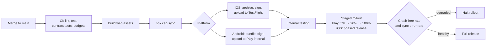

# 07 — Cross-Platform Considerations

**Phase 3.2 deliverable** · Sources: `TECH_STACK_PLAN.md`, `CICD_PIPELINE.md`, `UI_WIREFRAMES.md`
**Status:** Draft for review

Covers the platform abstraction layer, platform-specific behaviour, app store deployment, live
updates, the device testing matrix, and forced upgrades.

---

## Platform abstraction

Every native capability sits behind an interface in `packages/platform`, with three
implementations — iOS, Android and web. `packages/core` depends on the interface only.

```ts
// packages/platform/src/contracts.ts
export interface SecureStorage {
  set(key: string, value: string, opts?: { biometric?: boolean }): Promise<void>;
  get(key: string, opts?: { promptReason?: string }): Promise<string | null>;
  remove(key: string): Promise<void>;
  clear(): Promise<void>;
}

export interface Biometrics {
  isAvailable(): Promise<BiometricAvailability>;
  authenticate(reason: string): Promise<boolean>;
}

export interface PushNotifications { /* … */ }
export interface CameraAccess      { /* … */ }
export interface NetworkStatus     { /* … */ }
export interface AppLifecycle      { /* … */ }
```

Three reasons this earns its keep beyond tidiness:

**The web build has no Keychain.** `SecureStorage` on web is either memory-only or a
deliberately weaker implementation, and that choice needs to be visible in one file rather than
implied by scattered `Capacitor.isNativePlatform()` checks.

**Tests need fakes.** The sync engine is the most important thing to test and the hardest if it
imports Capacitor plugins that have no Node implementation.

**Capabilities are queried, not assumed.** `isAvailable()` returns a reason — no hardware, not
enrolled, locked out — because "biometrics unavailable" needs different copy in each case.

Rule: `@capacitor/*` appears in imports **only** inside `packages/platform`. Enforced by lint,
not convention.

---

## Platform differences that need handling

| Concern | iOS | Android | Web |
|---|---|---|---|
| Safe areas | Notch, home indicator | Cutouts, gesture bar | None |
| Back navigation | Edge swipe | Hardware/gesture back (doc 03) | Browser back |
| Keyboard | Overlays content; needs resize handling | Usually resizes viewport | Varies |
| Secure storage | Keychain | Keystore | None equivalent |
| Biometrics | Face ID / Touch ID | BiometricPrompt, fragmented | WebAuthn, different model |
| Background execution | Opportunistic, ~30 s | WorkManager, Doze-constrained | Limited or absent |
| Screenshot prevention | Detect only | `FLAG_SECURE` blocks | Not possible |
| File system | App sandbox | Scoped storage | OPFS / IndexedDB |
| Push | APNs, permission required | FCM, permission required from 13 | Web Push, no iOS PWA support |
| Storage eviction | WKWebView may evict web storage | Less aggressive | Origin quota |

Safe areas and the keyboard are the two that produce visible bugs on day one. Ionic's
`ion-content` handles most of it; custom fixed-position elements — a floating action button, a
sticky form footer — need `env(safe-area-inset-*)` explicitly or they sit under the home
indicator.

`UI_WIREFRAMES.md` shows bottom tab navigation on mobile, which is exactly where the iOS home
indicator and Android gesture bar live.

---

## App store deployment



This mirrors the canary pattern in `CICD_PIPELINE.md:620-681` — the difference being that a
mobile rollout cannot be rolled back. Users who took the bad version keep it until they update,
so the gate before widening the rollout is the only real control, and it has to be automatic.

### Store review specifics for this app

| Requirement | Detail |
|---|---|
| iOS privacy nutrition labels | Health data, identifiers, usage data — declared per data type and linkage |
| Android Data Safety form | Collection, sharing, encryption in transit and at rest, deletion request path |
| Account deletion | Both stores require an in-app path to request deletion — wire it to `data_subject_requests` (`database/04`) |
| Demo account | Reviewers need working credentials against a seeded demo tenant with synthetic data |
| Encryption declaration | Uses standard cryptography; usually exempt, but the export compliance answer must be consistent every submission |
| Health app disclosures | Apple scrutinises health apps; the review notes should state that data is entered by professionals, not collected from HealthKit |
| Permission strings | `NSCameraUsageDescription` and friends must explain the clinical purpose specifically — generic strings get rejected |

The demo account is the most common avoidable rejection. It must be seeded with **synthetic**
data — sending a reviewer into a real tenant is a breach, not a shortcut.

Because tenants are configured server-side, one binary serves all of them. That is a deliberate
consequence of the multi-tenant architecture: no per-tenant app submissions, and a tenant's
branding arrives as configuration (doc 01). If a tenant later demands a white-label store
presence, that is a separate build pipeline and a separate business decision.

---

## Live updates

Capacitor supports over-the-air updates of the web bundle. Useful, and bounded by store policy:

**Permitted:** bug fixes, copy, styling, and logic changes within the app's stated purpose.
**Not permitted:** changing what the app does, adding features the review did not cover, or
shipping native code. Both stores treat that as circumventing review.

If live updates are used, they need the same gating as a store rollout — staged percentage,
automatic halt on a crash-rate regression, and the ability to roll back to the previous bundle.
An OTA channel that can push to 100% of devices instantly is a way to break every install at once.

A native-code change always requires a store release, so the update path is two-track and the
version model has to express both: a bundle version and a native version, with the sync protocol
checking the pair (below).

---

## Forced upgrades

The sync protocol is a contract between client and server, and clients are long-lived — a device
can be offline for weeks and return running a build from two releases ago.

```
GET /v1/sync/status  →  { min_supported_client: "2.1.0", current_client: "2.4.0" }
```

Three states:

| Condition | Behaviour |
|---|---|
| Client ≥ current | Normal |
| min_supported ≤ client < current | Normal, with a dismissible update prompt |
| Client < min_supported | **Blocking screen.** Sync refused, app read-only |

The blocking state must still allow **reading local data and exporting the sync queue**, because
the alternative is that a clinician with unsynced offline work is locked out of it by an upgrade
prompt. Blocking sync is acceptable; destroying access to unsynced work is not.

`min_supported_client` moves only when the protocol genuinely breaks, and every such change needs
the expand/contract discipline from `database/07_DATA_MIGRATION_WORKFLOWS.md` applied to the sync
protocol — support both shapes for a release, then drop the old one.

---

## Testing matrix

| Tier | Devices | Coverage |
|---|---|---|
| Primary | Latest iPhone, latest mid-range Android, latest iPad | Full regression each release |
| Secondary | iPhone at min iOS, Android at min API, small-screen Android | Full regression each minor |
| Web | Chrome, Safari, Firefox, Edge — desktop and mobile | Automated E2E |
| Constrained | Low-memory Android, slow storage | Startup, large list, sync performance |

Minimum versions: iOS 15+ and Android 8 (API 26)+ is the usual starting point; both should be set
from the tenant base rather than assumed, since clinical environments run older hardware than
consumer averages.

Scenarios that only appear on real devices and must be in the release checklist:

- Airplane mode mid-sync, then restore
- Force-quit during a chunked upload, then relaunch
- OS-initiated kill while backgrounded, then resume
- Clock skew — set the device clock forward an hour and sync (this is the case that catches the
  cursor and LWW defects in doc 05)
- Storage full during sync
- Biometric enrollment changed between launches
- Permission revoked in system settings while the app is backgrounded
- Slow, lossy network — not just offline; a 2 s-latency 10%-loss link breaks more things than no
  network at all

The last one is under-tested almost everywhere and is the normal condition in a large building
with thick walls, which is the actual deployment environment.

---

## Additions and corrections to the source documents

| # | Severity | Issue | Resolution |
|---|---|---|---|
| 1 | **High** | No forced-upgrade mechanism; an old client can push against a changed sync protocol | `min_supported_client`, blocking state that preserves local read and queue export |
| 2 | Medium | `CICD_PIPELINE.md` covers server deployment only; mobile has no release path and cannot be rolled back | Staged rollout with automatic halt on crash-rate or sync-error regression |
| 3 | Medium | No platform abstraction specified; Capacitor calls would spread through the app and block testing | `packages/platform` interfaces, lint-enforced |
| 4 | Medium | Store compliance requirements are unaddressed — privacy labels, Data Safety, in-app deletion path | Table above; deletion wired to `data_subject_requests` |
| 5 | Low | No minimum OS versions or device matrix | Tiered matrix, versions set from the tenant base |
| 6 | Low | Live updates unmentioned; used naively they breach store policy or break every install at once | Bounded scope, staged, rollback-capable |

---

## Open questions

1. **Live updates at all.** They speed up fixes and add a second release path to operate, with
   real policy risk if misused. Worth an explicit yes or no rather than drifting into it.
2. **Minimum OS versions.** Proposed as a starting point only. The real answer comes from the
   device profile of the first tenants, which is not known yet.
3. **Tablet layouts.** `UI_WIREFRAMES.md` covers phone and desktop; the tablet breakpoint exists
   but no wireframe does, and clinical tablets are likely to be a primary device here.
4. **Demo tenant maintenance.** A seeded synthetic tenant for store review has to stay working
   across schema changes, or a submission fails on a broken demo login. It needs an owner and a
   CI check.
5. **White-label store presence.** Explicitly out of scope above. Enterprise tenants may ask, and
   the answer materially changes the release pipeline — better decided before it is sold.
