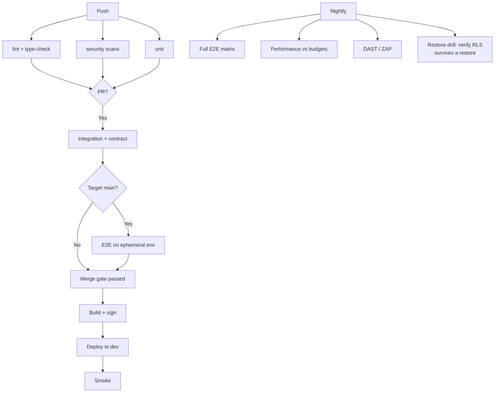

# 02 — Testing Automation Framework

**Phase 4.1 deliverable** · Sources: `CICD_PIPELINE.md`, `database/07`, `database/08`, `api/05`, `frontend/02`
**Status:** Draft for review

Covers the test pyramid and where each layer runs, environments, orchestration, and the
platform-specific tests that the generic pyramid does not cover.

---

## The pyramid, and where the documented workflow goes wrong

`CICD_PIPELINE.md:275-283` runs `matrix: [unit, integration, e2e]` against one job definition
whose only services are Postgres and Redis. Unit and integration tests fit that; E2E does not —
it needs the application running, a browser, and seeded data, and it takes an order of magnitude
longer. Running all three on every push to every branch makes the pipeline slow enough that people
start skipping it.

| Layer | Count | Runtime | Runs on | Needs |
|---|---|---|---|---|
| Unit | thousands | < 2 min | Every push | Nothing |
| Integration | hundreds | < 5 min | Every push | Postgres, Redis |
| Contract | ~100 | < 2 min | Every push | API + Postgres |
| E2E | tens | < 15 min | PR to main, nightly | Full stack + browser |
| Performance | ~10 | ~20 min | Nightly, pre-release | Production-like data |
| Security (DAST) | — | ~30 min | Nightly, pre-release | Deployed environment |

Split into `test.yml` (fast, blocking, every push) and `test-deep.yml` (slow, nightly and
pre-release). A pull request gets an answer in under ten minutes; the expensive suites still run
before anything reaches production.

---

## Tests this platform specifically needs

Generic advice covers the pyramid. These are the tests that exist because of decisions made in
Phases 1–3, and each one guards a defect that is invisible in normal testing.

### Tenant isolation

`RULE-HSC-02` makes row-level security the isolation mechanism. A bug there is a breach, and it
will not show up in ordinary tests, which run with one tenant.

```ts
test('RLS blocks cross-tenant reads', async () => {
  const a = await seedTenant(); const b = await seedTenant();
  const recA = await createRecord(a, { title: 'A' });

  await withTenantContext({ tenantId: b.id }, async (tx) => {
    expect(await tx.record.findUnique({ where: { record_id: recA.id } })).toBeNull();
    expect(await tx.record.count()).toBe(0);
  });
});

test('every tenant table has RLS enabled AND forced', async () => {
  const rows = await sql`
    SELECT c.relname, c.relrowsecurity, c.relforcerowsecurity
      FROM pg_class c JOIN pg_namespace n ON n.oid = c.relnamespace
     WHERE n.nspname = 'public' AND c.relkind = 'r'
       AND EXISTS (SELECT 1 FROM information_schema.columns
                    WHERE table_name = c.relname AND column_name = 'tenant_id')`;
  for (const t of rows) {
    expect(t.relrowsecurity).toBe(true);
    expect(t.relforcerowsecurity).toBe(true);   // database/04, correction 5
  }
});
```

The second test is the important one: it catches a migration that adds a tenant table and forgets
its policy (`database/07`), which is otherwise found only in production, by the wrong person.

### Connection pooling and tenant context

`database/08_SCALING_ARCHITECTURE.md` identifies the highest-severity failure in the platform: a
session-scoped tenant GUC leaks across pooled connections, and RLS then enforces the *previous*
tenant. It produces no error. It must have a test.

```ts
test('tenant context does not leak across a pooled connection', async () => {
  // Pool of exactly one, so both requests provably share a connection.
  const pool = createPool({ max: 1 });
  await withTenantContext({ tenantId: a.id, pool }, async (tx) => { await tx.record.count(); });

  await withTenantContext({ tenantId: b.id, pool }, async (tx) => {
    const setting = await tx.$queryRaw`SELECT current_setting('app.current_tenant_id', true) AS t`;
    expect(setting[0].t).toBe(b.id);          // not a.id
  });
});

test('a query outside withTenantContext sees nothing', async () => {
  // The fail-closed default from database/08 makes a missed SET LOCAL return zero rows
  // rather than the previous tenant's.
  expect(await rawClient.record.count()).toBe(0);
});
```

`max: 1` is what makes this deterministic. With a normal pool the two requests probably get
different connections and the test passes while the bug is present.

### Sync and conflict resolution

`frontend/05` corrected three data-losing defects in the documented conflict algorithms. Each
needs a regression test, and one of them requires manipulating the clock:

| Test | Guards |
|---|---|
| Device clock one hour fast, then sync | LWW comparing device against server time (`frontend/05`, correction 2) |
| Three-way merge, disjoint fields | Merge dropping unchanged fields (correction 4) |
| Edit offline, same record edited server-side, sync | Conflict detection via `base_version` |
| PHI record conflict | Must escalate to the user, never auto-resolve |
| Push interrupted mid-batch, resume | Cursor must not advance past unapplied records |
| Offline create + link, then sync | Queue dependency ordering |
| Duplicate push with same `Idempotency-Key` | No duplicate records |

The clock-skew test is the one that would have caught the original defect, and it only works
against a fake clock — real time cannot be moved backwards in CI.

### Audit completeness

An audit gap is a compliance defect (`RULE-HSC-02`), so audit behaviour is asserted, not assumed.

```ts
test('every write to an audited table produces a data_audit_log row', async () => {
  for (const { table, pk } of AUDITED_TABLES) {           // records, files, tenant_users, …
    const before = await auditCount(table);
    await insertFixture(table);
    expect(await auditCount(table)).toBe(before + 1);
  }
});

test('audit rows never contain credentials', async () => {
  await updateUser(user.id, { password_hash: 'new-hash' });
  const row = await latestAudit('tenant_users');
  expect(row.new_values).not.toHaveProperty('password_hash');   // database/04, correction 3
  expect(row.new_values).not.toHaveProperty('mfa_secret');
});

test('reading a PHI record writes a user_audit_log entry', async () => {
  await api.get(`/v1/records/${phiRecord.id}`).auth(token);
  expect(await phiAccessCount(phiRecord.id)).toBe(1);            // database/04, correction 7
});
```

The first would have caught the broken trigger from `database/04` — where `create_audit_log()`
reads `NEW.record_id` while attached to `files` and `tenant_users`, whose primary keys are
`file_id` and `user_id`.

### Migrations

Two kinds, both from `database/07`:

- **Forward migrations against a production-sized copy.** A migration that takes 200 ms on an
  empty dev database can lock a large table for minutes. CI runs migrations against a seeded
  database of realistic size and fails if any statement exceeds a lock-time budget.
- **Backward compatibility.** Canary deploys run two app versions against one database
  (`database/07`), so CI boots the *previous* release against the *new* schema and runs its smoke
  tests. This is the check that makes expand/contract real rather than aspirational.

Client-side, `frontend/02` requires the same for persisted state: a fixture of persisted stores
from each released version, rehydrated in CI, asserting the app boots.

### Contract

`api/05_OPENAPI_SPECIFICATION.md` specifies contract tests against `openapi.yaml`: every response
validated against the declared schema and status, including the error paths. Error responses are
where drift concentrates, because ordinary tests rarely assert them.

Spectral lints the spec, and `oasdiff` fails the build on a breaking change without a major
version bump.

---

## Test data

**No production data in any test environment, ever.** Not anonymized, not "just the schema plus a
few rows". Copying a production database into staging moves PHI into an environment with weaker
controls, broader access and no BAA coverage, and is a reportable breach if it goes wrong.

| Environment | Data | Volume |
|---|---|---|
| Local | Synthetic seeds | ~100 records |
| CI | Synthetic fixtures, deterministic | ~1,000 |
| Staging | Generated synthetic tenants | ~100,000 |
| Performance | Generated, production-shaped distribution | Largest expected tenant × 2 |

Generation is seeded and reproducible, so a failure can be replayed. Distribution matters more
than volume: a million evenly-sized tenants tests nothing, while one tenant with 500,000 records
and 200 with 50 each is what production looks like and what breaks queries.

Synthetic PHI uses obviously fake values — names from a fixed list, MRNs in a reserved range —
so that a leaked fixture is recognisable as fake, and so nobody mistakes staging for real data.

---

## Orchestration



E2E runs against an **ephemeral environment per pull request** — its own database and Redis,
created on demand and destroyed after. Shared long-lived test environments accumulate state, and
a suite that fails only on Tuesdays because of what someone did on Monday gets ignored.

The nightly restore drill is unusual and deliberate: `database/08` requires that a restored
database still has RLS *enabled and forced*, because a logical restore can silently drop it. That
is a total isolation failure that no application test would notice.

## Quality gates

| Gate | Threshold | Blocks |
|---|---|---|
| Unit coverage | 80% lines, 70% branches | Merge |
| Coverage on changed lines | 90% | Merge |
| Critical-path coverage (auth, RLS, sync, audit) | 95% | Merge |
| New high/critical CVE | Zero | Merge |
| Contract test failures | Zero | Merge |
| Performance budgets (`frontend/04`) | Within budget | Release |
| Flake rate | < 1% | Tracked, not blocking |

Coverage on **changed lines** matters more than the global number: a large codebase can sit at
80% forever while new code arrives untested.

Flaky tests are quarantined automatically after three non-deterministic failures, with an issue
opened and an owner assigned. A quarantined test that is not fixed within two weeks is deleted —
a permanently-skipped test is worse than no test, because it looks like coverage.

---

## Corrections to `CICD_PIPELINE.md`

| # | Severity | Issue | Resolution |
|---|---|---|---|
| 1 | **High** | No tenant-isolation or RLS tests despite isolation being enforced entirely in the database | Isolation suite, including the enabled-and-forced check across all tenant tables |
| 2 | **High** | No test for tenant-context leakage across pooled connections — the platform's highest-severity failure mode, which produces no error | Single-connection pool test |
| 3 | **High** | No audit-completeness tests; a missing audit row is a compliance defect and is otherwise invisible | Audit suite, including credential redaction and PHI read logging |
| 4 | Medium | E2E shares a job definition with unit and integration and has no app or browser | Split into fast and deep workflows; ephemeral environment per PR |
| 5 | Medium | Migrations tested only against an empty database; no backward-compatibility check despite canary running two versions | Production-sized migration run with a lock budget; previous release booted against the new schema |
| 6 | Medium | No statement about test data provenance; the convenient path is a production copy | Synthetic only, generated and seeded |
| 7 | Low | No flake policy; flaky tests erode trust until the suite is ignored | Auto-quarantine, owner, two-week deletion |

---

## Open questions

1. **Ephemeral environment cost.** A database per pull request is clean and not free. Cheaper
   options — a shared cluster with a database per PR, or template databases — trade isolation for
   cost, and the decision depends on PR volume.
2. **Performance baselines.** Budgets exist (`frontend/04`) but no baseline does. The first
   measurement becomes the baseline, so it should be taken on representative hardware rather than
   whatever runner is free.
3. **Restore drill scope.** Nightly RLS verification is proposed. A full restore-and-smoke drill
   is slower and more valuable; monthly is the usual compromise and matches
   `ARCHITECTURE_DESIGN.md`.
4. **DAST target.** Running ZAP against staging finds real issues and generates noise in the
   audit log of an environment auditors may look at. Worth deciding whether staging DAST runs
   need to be excluded from compliance reporting.
5. **Mobile E2E.** Device-farm testing (`frontend/07`) is expensive per run. Which subset runs
   per release versus per merge is unresolved.
