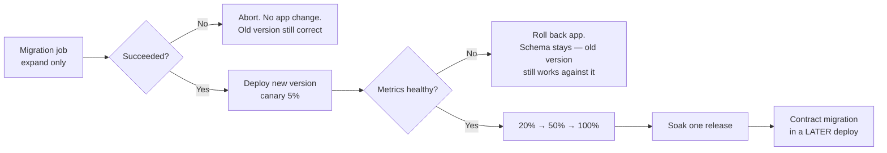

# 03 — Deployment Strategies

**Phase 4.1 deliverable** · Sources: `CICD_PIPELINE.md`, `ARCHITECTURE_DESIGN.md`, `database/07_DATA_MIGRATION_WORKFLOWS.md`
**Status:** Draft for review — **contains an unresolved platform fork**

Covers blue-green and canary deployment, rollback automation, environment promotion, and the
interaction between deployments and database migrations.

---

## Unresolved: ECS or Kubernetes

`CICD_PIPELINE.md` specifies both, in the same file.

| Location | Says |
|---|---|
| `CICD_PIPELINE.md:435-455` | `kubectl set image deployment/allguds-api --namespace=allguds-*` — Kubernetes |
| `CICD_PIPELINE.md:522` | "ECS Fargate clusters" in the Terraform component list |
| `ARCHITECTURE_DESIGN.md:118-127` | "Container Orchestration (AWS ECS/Fargate)" |
| `TECH_STACK_PLAN.md:20` | "Docker containers on AWS ECS/Fargate or Google Cloud Run" |

Three documents say ECS; one job in one workflow says Kubernetes. This document specifies the
deployment *behaviour* platform-independently and then gives both concrete paths, so the decision
can be made without redoing the design. **It does block Terraform (doc 04) and should be resolved
before that work starts.**

| | ECS Fargate | EKS |
|---|---|---|
| Control plane cost | None | ~$72/month per cluster, plus nodes |
| Operational burden | AWS-managed | Cluster upgrades, add-ons, CNI, IRSA |
| Blue-green | CodeDeploy, built in | Argo Rollouts or Flagger |
| Canary with metric gates | CodeDeploy + CloudWatch alarms | Argo Rollouts + Prometheus |
| Portability | AWS only | Portable |
| Fit for `TECH_STACK_PLAN.md`'s $50–100/month start | Good | Poor |
| Team size to run it well | Small | Larger, or a platform team |

On the documented constraints — small team, cost-sensitive start, AWS-committed for HIPAA BAA —
ECS is the better fit, and it is what three of the four references already assume.

---

## What any deployment must do

Platform-independent requirements. Both paths below satisfy all of them.

1. **Deploy by digest, never by tag** (doc 01). The tag `latest` is not a version.
2. **Verify the image signature** before it runs.
3. **Never take traffic before readiness passes** — `/health/ready` checks the database, Redis and
   that migrations are applied.
4. **Keep the previous version instantly restorable** for the soak window.
5. **Gate progression on metrics**, not on elapsed time alone.
6. **Roll back automatically** on a gate breach, without a human in the loop.
7. **Run migrations separately from the application rollout** — see below.
8. **Drain connections gracefully**: stop accepting new work, finish in-flight requests, close the
   database pool, exit. A hard kill mid-transaction leaves work half-done and, with the outbox in
   `api/04`, can strand undelivered events.

---

## Migrations and deployment are separate

This is the constraint that shapes everything else, and it comes from
`database/07_DATA_MIGRATION_WORKFLOWS.md`: canary and blue-green both run **two application
versions against one database**, simultaneously.



Rules that follow:

- **The migration job runs before the application rollout**, as a one-shot task, not as a
  container start-up step. Start-up migrations run once per instance and race each other during a
  scale-out.
- **Only expand migrations ship with a deploy.** Contract steps — dropping a column, adding a
  `NOT NULL` — wait until every running version tolerates them.
- **A failed migration aborts the deployment** with no application change. The old version keeps
  running against the old schema.
- **A failed deployment does not roll back the schema.** Expand-only migrations are backward
  compatible by construction, so the previous version still works. Rolling schema backwards
  destroys data written since.

The advisory lock matters: the migration job takes a Postgres advisory lock so two concurrent
pipelines cannot migrate at once, and it connects **directly to RDS**, bypassing PgBouncer, since
advisory locks are session-scoped and do not survive transaction pooling (`database/08`).

---

## ECS Fargate path

```yaml
# .github/workflows/deploy.yml  — corrected; see the corrections table
name: Deploy

on:
  workflow_call:
    inputs:
      environment: { required: true, type: string }
      image-digest: { required: true, type: string }   # digest, not tag

permissions:
  contents: read
  id-token: write            # OIDC — no static AWS keys

jobs:
  deploy:
    runs-on: ubuntu-latest
    environment: ${{ inputs.environment }}   # GitHub environment protection rules
    env:
      REGISTRY: ghcr.io
      IMAGE_NAME: ${{ github.repository }}   # defined here: workflow_call does not inherit env
    steps:
      - uses: actions/checkout@v4

      - uses: actions/setup-node@v4
        with: { node-version: '20.x', cache: npm }
      - run: npm ci                          # smoke tests need dependencies

      - name: Assume deployment role
        uses: aws-actions/configure-aws-credentials@v4
        with:
          role-to-assume: arn:aws:iam::${{ vars.AWS_ACCOUNT_ID }}:role/gha-deploy-${{ inputs.environment }}
          aws-region: us-east-1

      - name: Verify image signature
        run: |
          cosign verify \
            --certificate-identity-regexp "^https://github.com/${{ github.repository }}/" \
            --certificate-oidc-issuer https://token.actions.githubusercontent.com \
            "$REGISTRY/$IMAGE_NAME@${{ inputs.image-digest }}"

      - name: Run migrations
        run: |
          aws ecs run-task \
            --cluster allguds-${{ inputs.environment }} \
            --task-definition allguds-migrate \
            --launch-type FARGATE \
            --overrides '{"containerOverrides":[{"name":"migrate","command":["npm","run","db:migrate:deploy"]}]}' \
            --network-configuration "$NETWORK_CONFIG" \
            --query 'tasks[0].taskArn' --output text > task.arn
          aws ecs wait tasks-stopped --cluster allguds-${{ inputs.environment }} --tasks "$(cat task.arn)"
          code=$(aws ecs describe-tasks --cluster allguds-${{ inputs.environment }} \
                   --tasks "$(cat task.arn)" --query 'tasks[0].containers[0].exitCode' --output text)
          [ "$code" = "0" ] || { echo "Migration failed (exit $code)"; exit 1; }

      - name: Register task definition
        id: taskdef
        run: |
          aws ecs describe-task-definition --task-definition allguds-api-${{ inputs.environment }} \
            --query taskDefinition > td.json
          jq --arg img "$REGISTRY/$IMAGE_NAME@${{ inputs.image-digest }}" \
             '.containerDefinitions[0].image=$img
              | del(.taskDefinitionArn,.revision,.status,.requiresAttributes,
                    .compatibilities,.registeredAt,.registeredBy)' td.json > new-td.json
          arn=$(aws ecs register-task-definition --cli-input-json file://new-td.json \
                  --query 'taskDefinition.taskDefinitionArn' --output text)
          echo "arn=$arn" >> $GITHUB_OUTPUT

      - name: Deploy (CodeDeploy blue/green)
        run: |
          aws deploy create-deployment \
            --application-name allguds-${{ inputs.environment }} \
            --deployment-group-name allguds-api \
            --revision "$(scripts/codedeploy-revision.sh ${{ steps.taskdef.outputs.arn }})" \
            --query 'deploymentId' --output text > dep.id
          aws deploy wait deployment-successful --deployment-id "$(cat dep.id)"

      - name: Smoke tests
        run: npm run test:smoke -- --env=${{ inputs.environment }}

      - name: Notify
        if: always()             # otherwise failures are never announced
        uses: 8398a7/action-slack@v3
        with:
          status: ${{ job.status }}
        env:
          SLACK_WEBHOOK_URL: ${{ secrets.SLACK_WEBHOOK_URL }}
```

CodeDeploy shifts traffic between two target groups behind the ALB and rolls back automatically
when a CloudWatch alarm fires during the deployment window. Canary steps
(`CodeDeployDefault.ECSCanary10Percent5Minutes`, or a custom 5/20/50/100 configuration) come from
the deployment group, so the workflow does not implement traffic shifting itself.

## Kubernetes path

Same behaviour, different mechanism. Argo Rollouts replaces the `Deployment` with a `Rollout`:

```yaml
apiVersion: argoproj.io/v1alpha1
kind: Rollout
metadata:
  name: allguds-api
spec:
  replicas: 6
  strategy:
    canary:
      canaryService: allguds-api-canary
      stableService: allguds-api-stable
      trafficRouting:
        alb: { ingress: allguds-api, servicePort: 3000 }
      analysis:
        templates: [{ templateName: api-health }]
        startingStep: 1              # analyse from the first traffic step
      steps:
        - setWeight: 5
        - pause: { duration: 5m }
        - setWeight: 20
        - pause: { duration: 10m }
        - setWeight: 50
        - pause: { duration: 10m }
        - setWeight: 100
```

with an `AnalysisTemplate` querying Prometheus for the same gates as the CloudWatch alarms below.
Migrations run as a `Job` with a `PreSync` hook, and the workflow uses IRSA rather than a static
`KUBE_CONFIG` secret.

---

## Gates

Progression is automatic and metric-driven. These thresholds are evaluated continuously during
each canary step; any breach rolls back immediately.

| Metric | Threshold | Window |
|---|---|---|
| HTTP 5xx rate | > 1% or 2× baseline | 5 min |
| p95 latency | > 1.5× baseline | 5 min |
| Container restarts | Any crash loop | Immediate |
| `/health/ready` failures | > 10% of targets | 2 min |
| Audit write failures | **Any** | Immediate |
| Sync conflict rate | > 3× baseline | 10 min |
| Database connection saturation | > 90% | 5 min |

Two are platform-specific and would not appear on a generic list. **Audit write failure rolls back
immediately and unconditionally** — per `RULE-HSC-02`, a write path that skips the audit trail is
a compliance defect, so a release that breaks audit logging must not proceed at any traffic
percentage. **Sync conflict rate** catches a release that has broken conflict detection
(`frontend/05`), which otherwise looks healthy: requests succeed, and users quietly lose data.

Comparison is against the stable version running concurrently, not against a static number —
absolute thresholds produce false alarms at 3am and miss regressions at peak.

---

## Environment promotion

```
feature branch → dev (auto on merge to develop)
              → staging (auto, with manual approval gate)
              → production (canary, automatic promotion on gates)
```

| Environment | Data | Approval | Strategy |
|---|---|---|---|
| dev | Synthetic, reset nightly | None | Rolling |
| staging | Synthetic, production-shaped volume | One reviewer | Blue-green |
| production | Real | GitHub environment protection | Canary with gates |

**The same image digest is promoted through all three.** Rebuilding per environment means what
was tested is not what ships. Environment differences come from configuration and secrets
injected at runtime (doc 04), never from a different build.

Staging is production-shaped in volume but never holds production data (doc 02).

---

## Rollback

| What | Reversible | Mechanism |
|---|---|---|
| Application version | Yes, seconds | Shift traffic to the previous task set / stable replica set |
| Configuration | Yes | Parameter Store versioning, redeploy |
| Expand migration | Not needed | Backward compatible by construction |
| Contract migration | **No** | Restore from PITR — a data-loss event |
| Mobile release | **No** | Users keep the version they took (`frontend/07`) |
| Webhook deliveries already sent | **No** | Receivers have them |

The last three are why the gates matter. Application rollback is cheap enough to do
automatically; the others are not recoverable, which is the whole reason contract migrations wait
a release and mobile rollouts stage slowly.

`ARCHITECTURE_DESIGN.md` commits to point-in-time recovery. The deployment pipeline records its
start timestamp and the database LSN, so a PITR target is known precisely rather than estimated
during an incident (`database/07`).

## Decoupling deploy from release

Feature flags (`tenant_configurations.features`) separate shipping code from enabling behaviour.
A large change ships dark, is enabled for one internal tenant, then a pilot, then broadly — none
of which requires a deployment. This makes the risky moment a configuration change, which is
instantly reversible, rather than a rollout, which is not.

It also means flag cleanup is real work with an owner. A flag that outlives its rollout becomes
an untested code path that nobody remembers is there.

---

## Corrections to `CICD_PIPELINE.md`

| # | Severity | Issue | Resolution |
|---|---|---|---|
| 1 | **High** | Deploy job uses `kubectl` against Kubernetes while the Terraform list and both architecture documents specify ECS Fargate | Fork documented; both paths specified; ECS recommended |
| 2 | **High** | Long-lived `AWS_ACCESS_KEY_ID`/`AWS_SECRET_ACCESS_KEY` and a base64 `KUBE_CONFIG` in repository secrets | OIDC role assumption; no static credentials |
| 3 | **High** | No migration step in the deployment; the natural alternative is migrating on container start, which races during scale-out | Separate one-shot migration task with an advisory lock, direct to RDS |
| 4 | **High** | Deploys by mutable tag, and no signature verification | Deploy by digest; `cosign verify` before rollout |
| 5 | Medium | `export KUBECONFIG=kubeconfig` does not persist to later steps — each `run` is a new shell | N/A on the ECS path; `$GITHUB_ENV` on the Kubernetes path |
| 6 | Medium | `deploy.yml` uses `${{ env.REGISTRY }}` and `${{ env.IMAGE_NAME }}`, but `workflow_call` does not inherit the caller's `env`; the image resolves to `:tag` | `env` declared in the called workflow |
| 7 | Medium | Runs `npm run test:smoke` without `npm ci` | Dependencies installed |
| 8 | Medium | Slack notification lacks `if: always()`, so only successes are announced | `if: always()` |
| 9 | Medium | Canary progression is time-based with no automatic metric gate described in the workflow | CloudWatch alarms / Argo analysis, with audit-failure and sync-conflict gates |
| 10 | Low | No connection draining specified; a hard kill can strand outbox events mid-transaction | Graceful shutdown sequence |

---

## Open questions

1. **Resolve the platform fork.** This blocks doc 04. ECS is recommended on the documented
   constraints, and the decision should be recorded rather than inferred from whichever file
   someone reads first.
2. **Canary duration.** 5/20/50/100 with 5–10 minute pauses is roughly 30 minutes to full
   traffic. Low-traffic environments may not accumulate enough requests in five minutes for the
   gates to mean anything — the gate needs a minimum sample size as well as a window.
3. **Baseline source.** Gates compare against the stable version. On the first deploy there is no
   baseline, and the first canary of the day may compare against overnight traffic. Needs a
   defined fallback.
4. **Multi-region.** `ARCHITECTURE_DESIGN.md` mentions a warm standby. Whether deployments target
   both regions simultaneously or the standby lags is unresolved, and it changes the rollback
   story materially.
5. **Database failover during a deploy.** An RDS Multi-AZ failover mid-canary looks exactly like
   a bad release to the gates. Distinguishing the two automatically is hard; the practical answer
   may be to pause deployments during a failover event.
