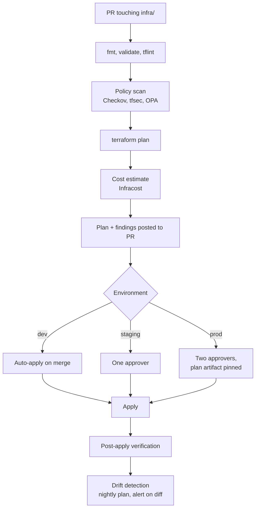

# 04 — Infrastructure as Code

**Phase 4.1 deliverable** · Sources: `CICD_PIPELINE.md`, `ARCHITECTURE_DESIGN.md`, `database/08_SCALING_ARCHITECTURE.md`
**Status:** Draft for review — depends on the platform fork in doc 03

Covers Terraform structure and state, environment configuration, secret management and rotation,
and infrastructure monitoring and alerting as code.

---

## Repository structure

```
infra/
  modules/
    network/          VPC, subnets, NAT, endpoints, flow logs
    database/         RDS, parameter groups, replicas, PgBouncer
    cache/            ElastiCache Redis
    compute/          ECS cluster, services, task definitions  (or eks/)
    storage/          S3 buckets, lifecycle, Object Lock
    edge/             ALB, CloudFront, WAF, ACM
    security/         KMS keys, Secrets Manager, IAM roles
    observability/    CloudWatch dashboards, alarms, log groups
  envs/
    dev/              main.tf, backend.tf, terraform.tfvars
    staging/
    prod/
  policies/           OPA / Sentinel policy-as-code
```

Environments are **separate root modules with separate state**, not workspaces. Workspaces share a
backend key and a single state lineage, which makes it far too easy for a `terraform apply` aimed
at dev to touch production. Separate directories mean separate backends, separate IAM roles and
separate approval gates.

Environments differ only in `terraform.tfvars` — instance sizes, replica counts, retention
windows. The module code is identical, so staging is structurally production, which is the only
way staging tells you anything.

## State

```hcl
terraform {
  required_version = "~> 1.9"

  backend "s3" {
    bucket         = "allguds-tfstate-prod"
    key            = "prod/terraform.tfstate"
    region         = "us-east-1"
    encrypt        = true
    kms_key_id     = "arn:aws:kms:us-east-1:…:key/…"
    dynamodb_table = "allguds-tfstate-lock"
  }
}
```

`CICD_PIPELINE.md:479-530` describes a Terraform pipeline with validate, plan, scan, approve and
apply, but says nothing about state. Three things it needs:

**Locking.** Without the DynamoDB lock table, two concurrent applies corrupt state. The pipeline
allows manual runs alongside automated ones, so this is not hypothetical.

**Encryption.** State contains resource attributes, including some marked sensitive. RDS master
passwords, if ever passed through Terraform, land in state in plaintext — encryption at rest with
a customer-managed key is the minimum, and the bucket is versioned with access logging.

**No secrets in state at all.** Better than encrypting them is not putting them there. Secrets are
created empty by Terraform and populated out of band:

```hcl
resource "aws_secretsmanager_secret" "db_password" {
  name       = "allguds/${var.environment}/db/password"
  kms_key_id = aws_kms_key.secrets.arn
}

# Terraform creates the container and the rotation schedule. The value is generated by the
# rotation Lambda on first run, so it never passes through Terraform or state.
resource "aws_secretsmanager_secret_rotation" "db_password" {
  secret_id           = aws_secretsmanager_secret.db_password.id
  rotation_lambda_arn = aws_lambda_function.rotate_db.arn
  rotation_rules { automatically_after_days = 30 }
}
```

State access is restricted to the deployment role. A developer with read access to the state
bucket has read access to whatever sensitive attributes are in it, which for most teams is a
broader grant than intended.

---

## HIPAA constraint: BAA-eligible services only

This governs every module and is absent from the source documents.

AWS signs a Business Associate Addendum covering a specific list of **HIPAA-eligible services**.
Processing, storing or transmitting PHI through a service outside that list is a compliance
violation regardless of how the service is configured — encryption does not cure it.

| Used for PHI | Status |
|---|---|
| ECS, Fargate, EKS, EC2 | Eligible |
| RDS PostgreSQL, ElastiCache Redis | Eligible |
| S3, EBS, KMS, Secrets Manager | Eligible |
| ALB, CloudFront, Route 53, WAF | Eligible |
| CloudWatch, CloudTrail, Config, GuardDuty | Eligible |
| SNS, SQS, Lambda, Step Functions | Eligible |
| **Any service not on the current list** | **Must not touch PHI** |

Two practical consequences. The list changes, so it is checked at design time for each new
service rather than assumed. And "does not touch PHI" has to be true in practice — a log line
containing a patient name puts PHI into whatever aggregates those logs, which is exactly the
failure mode the redaction rules in `frontend/02` and `api/06` guard against.

A policy check in the pipeline enforces the service allowlist, so an engineer adding a resource
type nobody assessed fails the plan rather than discovering it during an audit.

---

## Pipeline



**Production applies the exact plan file that was reviewed**, not a re-plan at apply time. A
re-plan can produce different actions if state or reality changed between review and approval,
which means the approver approved something other than what runs.

Policies that block, not warn:

| Policy | Rule |
|---|---|
| Encryption | Every S3 bucket, RDS instance, EBS volume and ElastiCache group encrypted with a CMK |
| Public access | No public S3, no `0.0.0.0/0` ingress except on the ALB's 443 |
| Service allowlist | Only BAA-eligible services in PHI-carrying accounts |
| Logging | CloudTrail on, S3 access logging on, VPC flow logs on |
| Tagging | `Environment`, `Owner`, `DataClass`, `CostCenter` required |
| TLS | ALB listeners use TLS 1.2 minimum, modern cipher policy |
| Deletion protection | RDS and critical S3 buckets protected in production |

`DataClass` drives audit scope: resources tagged `phi` are in scope for HIPAA evidence collection
(doc 07), and untagged resources are treated as in scope until proven otherwise.

**Drift detection runs nightly** with `terraform plan -detailed-exitcode` and alerts on any
difference. Drift means someone changed production by hand — which for a HIPAA workload is an
access-review question as much as an engineering one, since the change bypassed review.

---

## Environment configuration

Three tiers, by sensitivity:

| Tier | Store | Contents | Rotation |
|---|---|---|---|
| Non-secret config | SSM Parameter Store (String) | Log level, feature toggles, region | On deploy |
| Secrets | Secrets Manager | DB credentials, JWT signing keys, API keys | Automatic |
| Build-time | Not injected | Nothing sensitive — build args are in image history | — |

Containers receive secrets by **reference**, resolved at task start, never baked into images or
task definitions as literals:

```hcl
secrets = [
  { name = "DATABASE_URL",   valueFrom = aws_secretsmanager_secret.db_url.arn },
  { name = "JWT_PRIVATE_KEY", valueFrom = aws_secretsmanager_secret.jwt_key.arn },
]
```

`ARCHITECTURE_DESIGN.md` already lists Secrets Manager. The addition here is rotation, which the
source documents mention only as a monitoring alert ("encryption key rotation issues") without
specifying the mechanism.

### Rotation

| Secret | Cadence | Mechanism |
|---|---|---|
| RDS credentials | 30 days | Secrets Manager rotation Lambda, two-user strategy |
| Redis auth token | 90 days | Rotation with a dual-token window |
| JWT signing key | 90 days | Overlapping key IDs via JWKS — see below |
| Tenant data keys | Per `06_ENCRYPTION_IMPLEMENTATION.md` | KMS |
| API keys (tenant-facing) | Tenant-controlled | `api/01`, overlap window |
| OIDC deploy role | N/A | No static credential exists |

The two-user strategy for RDS is what makes rotation non-disruptive: two database users alternate,
so the credential in use is never the one being changed. Rotating a single user's password
invalidates every live connection at the moment of rotation.

**JWT signing key rotation needs the same overlap discipline**, and it has a subtlety the others
do not: access tokens live one hour and refresh tokens sixty days (`api/01`). A rotated key must
remain *verifiable* for at least the refresh token lifetime, or every user is logged out. That
means publishing both keys in JWKS with distinct `kid` values, signing with the new one, and
retiring the old only after the longest-lived token has expired.

---

## Monitoring and alerting as code

`database/08_SCALING_ARCHITECTURE.md` defines the database thresholds. They are Terraform, not
console clicks — an alarm created by hand is not reviewed, not versioned, and disappears in a
rebuild.

```hcl
module "db_alarms" {
  source = "../../modules/observability/alarms"

  alarms = {
    replica_lag        = { metric = "ReplicaLag",              threshold = 30,   unit = "Seconds" }
    connections        = { metric = "DatabaseConnections",     threshold = 0.9,  as_ratio_of = "max_connections" }
    free_storage       = { metric = "FreeStorageSpace",        threshold = 0.10, comparison = "LessThan" }
    cpu                = { metric = "CPUUtilization",          threshold = 80 }
    audit_write_errors = { metric = "AuditWriteFailures",      threshold = 1,    treat_missing = "notBreaching" }
  }
  sns_topic = aws_sns_topic.pager.arn
}
```

`audit_write_errors` is a custom metric with a threshold of one, and it pages. Per `RULE-HSC-02`,
a failing audit trail means writes must stop — this is also a canary gate in doc 03, and it is the
one alarm on this list where the correct response is to degrade availability rather than continue
serving.

Dashboards, log retention (`ARCHITECTURE_DESIGN.md`'s CloudWatch commitment) and log-group KMS
keys are all module outputs, so a new environment gets its observability automatically rather
than as a follow-up nobody does.

Log retention is set deliberately per group: application logs 90 days, audit-adjacent logs longer,
and anything that could contain PHI is minimized at source rather than retained and protected.

---

## Corrections and additions to `CICD_PIPELINE.md`

| # | Severity | Issue | Resolution |
|---|---|---|---|
| 1 | **High** | No BAA-eligible-service constraint, though the platform stores PHI on AWS | Service allowlist enforced by policy scan; `DataClass` tagging |
| 2 | **High** | No Terraform state backend, locking or encryption specified; concurrent applies corrupt state | S3 + DynamoDB lock + CMK, per-environment backends |
| 3 | **High** | Secret rotation appears only as an alert condition, with no mechanism | Secrets Manager rotation Lambdas, cadence table, two-user strategy |
| 4 | **High** | No JWT signing key rotation strategy; naive rotation logs out every user for up to 60 days of refresh-token lifetime | Overlapping `kid` values in JWKS, retire after the longest token expires |
| 5 | Medium | No drift detection; manual production changes are invisible | Nightly `plan -detailed-exitcode` with alerting |
| 6 | Medium | Environments not separated in state; a workspace mistake reaches production | Separate root modules and backends per environment |
| 7 | Medium | Production apply implied to re-plan; the approver may approve something other than what runs | Pinned plan artifact applied verbatim |
| 8 | Medium | Alerting thresholds from `database/08` exist only as prose | Alarms as Terraform, including the audit-failure alarm |
| 9 | Low | No tagging standard, so cost attribution and audit scoping are manual | Required tags enforced by policy |

---

## Open questions

1. **The ECS/EKS fork (doc 03) blocks the `compute/` module.** Everything else can proceed.
2. **Account strategy.** A single account with environment separation by tag is cheapest; separate
   accounts per environment give a real blast-radius boundary and cleaner audit scoping. For a
   HIPAA workload, separate accounts are the conventional answer and cost more to run.
3. **Multi-region.** `ARCHITECTURE_DESIGN.md` commits to a warm standby. Whether Terraform manages
   both regions from one root module or two, and how failover is triggered, is unresolved.
4. **PgBouncer placement.** `database/08` leaves open whether it is a sidecar, a shared instance,
   or RDS Proxy. The module shape differs for each, so this needs deciding with that document.
5. **Who holds break-glass access.** OIDC removes standing credentials, which is right, and means
   an emergency path is needed for when the pipeline itself is broken. That path must be
   time-boxed, alerted on, and audited — and it is a policy decision, not an engineering one.
