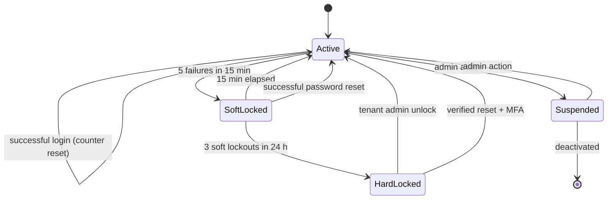
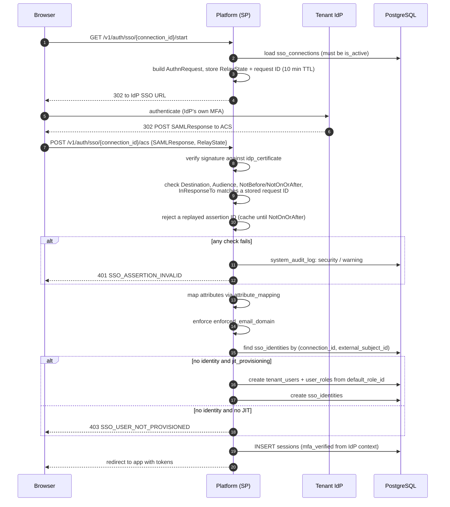
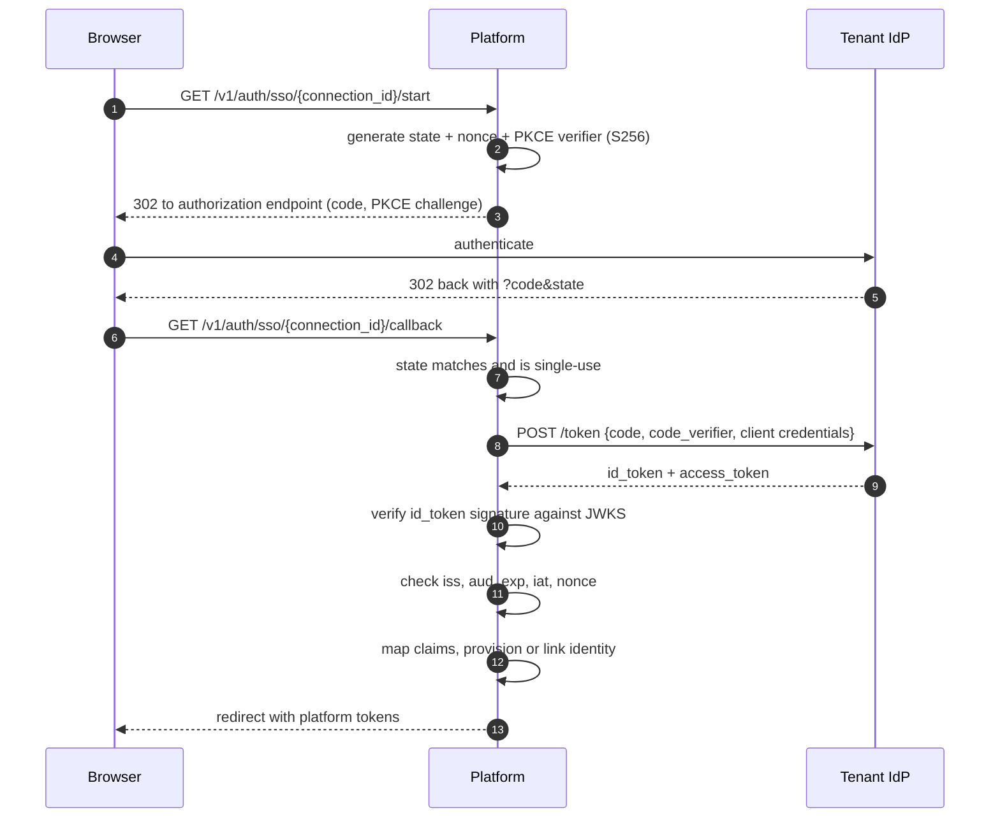

# 05 — Authentication Sequence Diagrams

**Phase 4.2 deliverable** · Sources: `SECURITY_ARCHITECTURE.md`, `database/02_USER_AUTH_ERD.md`, `api/01_AUTH_AUTHORIZATION_FLOWS.md`
**Status:** Draft for review

A complete, standalone set of authentication sequences for security review and audit: login with
MFA, password reset, account lockout and recovery, SSO integration, and step-up authentication.

> **Overlap note.** Login, MFA and token lifecycle also appear in
> `api/01_AUTH_AUTHORIZATION_FLOWS.md`. This document restates them so it can be read end to end
> in an audit package. To stop the two drifting: **`api/01` is normative for request and response
> shapes, error codes and status codes; this document is normative for the security decisions and
> control points.** A change to either must be reflected in both, and the contract tests in doc 02
> assert `api/01`, so a divergence surfaces there.

---

## Controls common to every flow

These apply throughout and are not repeated per diagram:

| Control | Rule |
|---|---|
| Enumeration resistance | Unknown user, unknown tenant and wrong password all return `INVALID_CREDENTIALS` |
| Constant-time work | The password hash is verified even when no user exists, against a dummy hash |
| Rate limiting | Per IP **and** per email, evaluated independently (`api/03`) |
| Audit | Every outcome writes `user_audit_log`; anomalies write `system_audit_log` at `security` severity |
| Token storage | Only hashes are persisted — refresh tokens, reset tokens, invitations, backup codes |
| Session binding | Every token references a `sessions` row that can be revoked (`database/02`) |
| Transport | TLS 1.3, HSTS, no credentials in URLs or query strings |

---

## 1. Login with MFA

```mermaid
sequenceDiagram
    autonumber
    participant C as Client
    participant GW as Gateway
    participant AS as Auth service
    participant DB as PostgreSQL
    participant R as Redis

    C->>GW: POST /v1/auth/login {email, password, tenant_domain, device_info}
    GW->>R: rate limit — IP and email
    alt exceeded
        GW-->>C: 429 RATE_LIMIT_EXCEEDED (Retry-After)
    end

    GW->>AS: forward
    AS->>DB: resolve tenant by subdomain (auth_service role)
    AS->>DB: SELECT user WHERE tenant_id, lower(email)
    AS->>AS: argon2id verify (always runs, dummy hash if no user)

    alt locked_until > now
        AS->>DB: audit login_blocked
        AS-->>C: 423 ACCOUNT_LOCKED {retry_after}
    else password invalid
        AS->>DB: failed_login_count += 1; set locked_until at threshold
        AS->>DB: audit login_failed
        AS-->>C: 401 INVALID_CREDENTIALS
    else valid
        AS->>DB: failed_login_count = 0
    end

    alt MFA enrolled
        AS->>R: store challenge {user_id, tenant_id}, TTL 5 min
        AS-->>C: 200 {mfa_required: true, challenge_id, methods}
        C->>AS: POST /v1/auth/verify-mfa {challenge_id, code}
        AS->>R: load and DELETE challenge (single use)
        alt TOTP
            AS->>DB: verify against mfa_methods.secret_encrypted (±1 step)
        else backup code
            AS->>DB: match code_hash, set used_at in the same transaction
        end
        alt invalid
            AS->>R: increment challenge attempts (max 5)
            AS-->>C: 401 MFA_INVALID
        end
    end

    AS->>DB: upsert user_devices; INSERT sessions (mfa_verified)
    AS->>DB: INSERT refresh_tokens (hash only)
    AS->>DB: audit login_success
    AS-->>C: 200 {access_token, refresh_token, expires_in, user}
```

Decisions worth stating for review:

- **The challenge is consumed on read**, not on success. A challenge that survives a failed
  attempt can be brute-forced within its five-minute window; the attempt counter is held
  separately in Redis.
- **TOTP accepts ±1 time step** (30 s either side) for clock drift, and a used step is recorded
  so the same code cannot be replayed inside its window.
- **Backup code consumption is in the login transaction**, so two concurrent uses of one code
  cannot both succeed.
- **Lockout is time-boxed, not permanent** — 5 failures, 15 minutes, escalating. Permanent lockout
  is a denial-of-service against a known email address.

## 2. Password reset

```mermaid
sequenceDiagram
    autonumber
    participant U as User
    participant AS as Auth service
    participant DB as PostgreSQL
    participant M as Email

    U->>AS: POST /v1/auth/forgot-password {email, tenant_domain}
    AS->>DB: look up user
    Note over AS: Response is 202 whether or not the user exists.
    alt user exists and is active
        AS->>DB: invalidate prior live reset tokens (unique partial index)
        AS->>DB: INSERT user_verification_tokens (purpose=password_reset,<br/>token_hash, expires_at = now + 1h, requested_ip)
        AS->>M: send link containing the raw token
    end
    AS-->>U: 202 Accepted (always)

    U->>AS: POST /v1/auth/reset-password {token, new_password}
    AS->>DB: SELECT by token_hash WHERE used_at IS NULL AND expires_at > now
    alt not found or expired
        AS-->>U: 400 INVALID_RESET_TOKEN
    else valid
        AS->>AS: validate password policy; check breach corpus
        AS->>DB: update password_hash, password_changed_at, must_change_password=false
        AS->>DB: mark token used_at
        AS->>DB: revoke ALL sessions and refresh tokens for the user
        AS->>DB: audit password_reset
        AS->>M: notify "your password was changed", with a report link
        AS-->>U: 200 OK
    end
```

Three control points:

**Revoke every session on reset.** A password reset is the remedy for a compromise, and leaving
existing sessions alive means the attacker keeps their access while the legitimate user believes
they have fixed it. This is why `sessions` must be consulted on every request (`api/01`,
correction 2) — without that, revocation is decorative for up to an hour.

**One live token per purpose.** Enforced by the partial unique index in `database/02`. Requesting
a new link invalidates the old one, so an email forwarded or intercepted earlier stops working.

**Notify after the change, not before.** The notification email is how a user learns their account
was reset by someone else. Sending it before the change would let an attacker time a race.

Reset never bypasses MFA: MFA enrollment survives a password reset, because otherwise password
reset becomes the way to defeat the second factor.

## 3. Lockout and recovery



| State | `tenant_users` | Login | Reset allowed |
|---|---|---|---|
| Active | `status=active`, `locked_until` null | Yes | Yes |
| SoftLocked | `locked_until` future | 423 | Yes — and it clears the lock |
| HardLocked | `locked_until` far future | 423 | Yes, with MFA |
| Suspended | `status=suspended` | 401 | No |
| Deactivated | `status=deactivated`, `deleted_at` set | 401 | No |

Suspended and deactivated return `INVALID_CREDENTIALS`, not a distinct code — otherwise the
response confirms that an account exists and reveals its administrative state.

Every lockout and unlock writes `user_audit_log`; three soft lockouts in 24 hours also writes a
`security` event to `system_audit_log`, because a distributed guessing attempt looks like
repeated soft lockouts rather than one dramatic event.

## 4. SSO — SAML 2.0



The validation block is the security boundary and every line of it is load-bearing:

- **Signature over the assertion**, verified against the configured certificate — not merely the
  presence of a signature, and not over a response whose assertion is unsigned.
- **`Audience` must match this SP.** Without it, an assertion issued for a different service is
  accepted here.
- **`InResponseTo` must match a request this SP issued**, which is what prevents an unsolicited
  assertion being replayed into a login.
- **Assertion IDs are cached and rejected on reuse** for the assertion's lifetime.
- **Identity is keyed on `external_subject_id`, never email** (`database/02`) — emails are
  mutable at the IdP, and matching on them is an account-takeover path.
- **`enforced_email_domain`** stops a misconfigured IdP asserting identities outside the tenant's
  domain.

## 5. SSO — OIDC



PKCE is used even though this is a confidential client: it costs nothing and closes
authorization-code interception if the redirect is ever mishandled. `state` and `nonce` are
distinct and both checked — `state` binds the callback to the browser session, `nonce` binds the
ID token to this authorization request.

The platform issues its **own** tokens after SSO. The IdP's tokens are used to establish identity
and then discarded; they are never passed to clients or used as platform credentials.

## 6. Step-up authentication

Some actions require fresh, strong authentication regardless of session age.

```mermaid
sequenceDiagram
    autonumber
    participant C as Client
    participant API
    participant DB

    C->>API: POST /v1/tenant/config (sensitive)
    API->>DB: sessions.mfa_verified, last_mfa_at
    alt mfa_verified false or last_mfa_at older than 15 min
        API-->>C: 403 STEP_UP_REQUIRED {methods}
        C->>API: POST /v1/auth/step-up {code}
        API->>DB: verify factor; sessions.last_mfa_at = now
        API-->>C: 200 OK
        C->>API: retry original request
    else fresh
        API->>API: proceed
    end
```

Actions requiring step-up: changing tenant configuration or branding, creating or revoking API
keys, changing a user's roles, creating a webhook, exporting records in bulk, viewing audit logs,
and any billing change. These are the actions an attacker with a stolen session would take, and
they are exactly the ones a legitimate user performs rarely enough not to be annoyed.

`last_mfa_at` is an addition to `sessions` beyond `database/02` — `mfa_verified` alone records
that MFA happened at some point in a session that may be twelve hours old.

---

## Corrections and additions to `SECURITY_ARCHITECTURE.md`

| # | Severity | Issue | Resolution |
|---|---|---|---|
| 1 | **High** | No SAML assertion validation requirements stated; an implementation that checks only the signature accepts replayed and misdirected assertions | Full validation list: Audience, Destination, InResponseTo, time bounds, assertion-ID replay cache |
| 2 | **High** | Password reset flow unspecified; the natural implementation leaves existing sessions alive, so a reset does not evict an attacker | All sessions and refresh tokens revoked on reset |
| 3 | **High** | No step-up authentication; a stolen long-lived session can change tenant configuration, mint API keys and export data | Step-up on sensitive actions, `sessions.last_mfa_at` |
| 4 | Medium | Lockout appears only as an alert threshold ("failed login > 5 attempts") with no state model or recovery path | Lockout state machine with soft/hard tiers and defined recovery |
| 5 | Medium | No MFA challenge lifecycle; a challenge that survives failures is brute-forceable | Single-use challenge, separate attempt counter, 5-minute TTL |
| 6 | Medium | Backup codes are required by Phase 1.1 but no consumption semantics are given | Single use, consumed in the login transaction |
| 7 | Medium | OIDC flow unspecified; PKCE, `state` and `nonce` are each individually omissible and individually necessary | All three specified |
| 8 | Low | Suspended and deactivated accounts would naturally return distinct errors, confirming account existence and state | Collapsed into `INVALID_CREDENTIALS` |

---

## Open questions

1. **Step-up window.** Fifteen minutes is proposed. Shorter is safer and more irritating for an
   administrator doing a batch of configuration changes; it should probably be tenant-configurable
   within a platform maximum.
2. **WebAuthn.** `mfa_methods.method_type` includes `webauthn` (`database/02`) but no flow is
   specified here. It is materially stronger than TOTP and phishing-resistant — worth deciding
   whether it is in v1 or deferred.
3. **IdP-initiated SSO.** The SAML flow above is SP-initiated, which is why `InResponseTo` can be
   checked. Many enterprise tenants ask for IdP-initiated login, which structurally cannot have
   that protection. If it is supported, it needs compensating controls and an explicit decision.
4. **Breached-password checking.** Proposed against a k-anonymity corpus at reset time. Whether it
   also runs at login (catching passwords breached after being set) is a usability trade-off.
5. **Session concurrency.** Nothing limits how many live sessions one user may hold, so a
   compromised credential can be used from many places at once without exceeding any limit.
