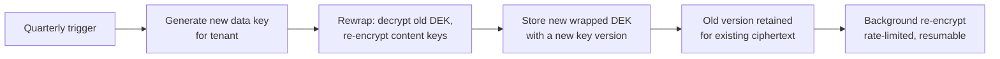

# 06 — Data Encryption Implementation

**Phase 4.2 deliverable** · Sources: `SECURITY_ARCHITECTURE.md`, `database/03`, `database/05`, `frontend/05`
**Status:** Draft for review

Covers encryption at rest, encryption in transit, KMS integration and the per-tenant key model,
application-level field encryption, and masking and tokenization.

---

## Encryption at rest

### PostgreSQL has no TDE

`SECURITY_ARCHITECTURE.md:222-226` specifies "PostgreSQL / AES-256-GCM / TDE Enabled". Community
PostgreSQL has no transparent data encryption feature, and RDS does not add one. What RDS provides
is **storage-level encryption**: the EBS volumes, snapshots, automated backups and read replicas
are encrypted with a KMS key, using AES-256-XTS.

The distinction changes what the control actually protects:

| Threat | RDS storage encryption | TDE would add |
|---|---|---|
| Stolen disk or snapshot | Protected | — |
| Snapshot shared to another account | Protected (needs the key) | — |
| Attacker with a database connection | **Not protected** | Not protected either |
| Attacker with OS access on the instance | Not applicable (managed) | Partially |
| Backup exfiltration | Protected | — |

So storage encryption is necessary and sufficient for media protection, and does nothing against
an attacker who has valid credentials — which is what RLS, RBAC and audit logging are for. Column
encryption (below) is the only thing that protects specific fields from a legitimate database
connection.

```hcl
resource "aws_db_instance" "main" {
  storage_encrypted       = true
  kms_key_id              = aws_kms_key.rds.arn
  performance_insights_kms_key_id = aws_kms_key.rds.arn   # PI data is separately encrypted
  backup_retention_period = 35
  deletion_protection     = true
}
```

Two details usually missed: Performance Insights stores query text and needs its own key
reference, and an **encrypted RDS instance cannot be un-encrypted or have its key changed in
place** — changing the key means a snapshot-copy-restore cycle, so the key decision is effectively
permanent at creation.

### S3

```hcl
resource "aws_s3_bucket_server_side_encryption_configuration" "files" {
  bucket = aws_s3_bucket.files.id
  rule {
    apply_server_side_encryption_by_default {
      sse_algorithm     = "aws:kms"
      kms_master_key_id = aws_kms_key.files.arn
    }
    bucket_key_enabled = true     # cuts KMS request cost by ~99% for high-volume buckets
  }
}
```

`bucket_key_enabled` matters at scale: without it, every object read is a KMS request, and an
attachment-heavy tenant makes KMS a meaningful line item.

Object Lock in compliance mode is enabled on the audit archive bucket
(`database/04_AUDIT_COMPLIANCE_ERD.md`), which is what makes a sealed archive genuinely immutable
rather than merely policy-protected.

### Mobile

`SECURITY_ARCHITECTURE.md:224` gives "SQLite / AES-256-CBC / Device Keystore". CBC alone is
unauthenticated and malleable — ciphertext can be modified without detection. SQLCipher 4's
default is AES-256-CBC **with per-page HMAC-SHA512**, which is authenticated and correct; the
specification should say so, because an implementation that reads "AES-256-CBC" and disables the
page HMAC for performance is following the document and producing a weaker system.

Key handling is in `frontend/05_OFFLINE_FIRST_ARCHITECTURE.md`: generated on first launch, stored
in Keychain/Keystore, never in Preferences, and cached attachment files encrypted individually —
an unencrypted file in the app sandbox is a breach even when the database is encrypted.

---

## Per-tenant keys

`SECURITY_ARCHITECTURE.md:265-271` specifies keys "derived from master key + tenant ID", quarterly
rotation, and key escrow. That model is adopted. Implemented naively — deriving with an HKDF from
a master key held in application memory — it has two properties worth being explicit about: every
tenant key is recoverable from the one master, and no tenant key can rotate independently of the
others.

Both are largely mitigated by deriving **inside KMS** using an encryption context rather than in
application code:

```ts
// The master key material never leaves KMS. The tenant id is bound into the ciphertext
// as encryption context, so a data key wrapped for tenant A cannot be unwrapped as tenant B —
// KMS refuses the decrypt if the context does not match.
const { Plaintext, CiphertextBlob } = await kms.generateDataKey({
  KeyId: PLATFORM_CMK_ARN,
  KeySpec: 'AES_256',
  EncryptionContext: { tenant_id: tenantId, purpose: 'field-encryption' },
});
```

| Property | Naive HKDF in app | KMS with encryption context |
|---|---|---|
| Master key exposure | In application memory | Never leaves KMS |
| Cross-tenant misuse | Possible if the code passes the wrong id | KMS rejects a context mismatch |
| Per-tenant audit trail | None | Every use logged in CloudTrail |
| Independent rotation | No | Per-tenant data key can be rewrapped |
| Cost | Free | Per-request, mitigated by caching |

The encryption context is the important part: it turns "we intend to use tenant A's key" into a
constraint the key service enforces. A bug that passes the wrong tenant id produces a decrypt
failure rather than a cross-tenant read.

Data keys are cached in memory for a short TTL (~5 minutes) to bound KMS request volume, keyed by
tenant, and cleared on tenant switch. The wrapped `CiphertextBlob` is stored alongside the data —
this is what `files.encryption_key_id` (`database/05`) references.

### Rotation

Quarterly, as documented. The mechanism matters because naive rotation means re-encrypting every
file a tenant owns:



Two-level wrapping keeps rotation cheap: the tenant data key encrypts per-object content keys
rather than object content directly, so rotation rewraps a small number of keys and the bulk
re-encryption can proceed lazily in the background. Old key versions stay available until the last
object referencing them is re-encrypted — deleting a key version early makes data unrecoverable,
and KMS's seven-day minimum deletion window exists precisely because that mistake is common.

**Key escrow** is specified in the source. It is a real requirement for data recovery and a real
risk concentration: whoever holds escrow can decrypt everything. It needs split knowledge (M-of-N
reconstruction), documented access procedure, and every access audited and alerted — not a copy of
the key in a vault someone can read alone.

---

## Application-level field encryption

`SECURITY_ARCHITECTURE.md:257-262` lists fields for application-level encryption. One of them
collides directly with the database design.

### Encrypted MRN cannot be the indexed lookup column

The source specifies "Medical Record Numbers → AES-256-GCM with unique IV". AES-GCM with a unique
IV is **non-deterministic**: the same MRN encrypts to different ciphertext every time.

`database/03_BUSINESS_ENTITY_ERD.md` defines:

```sql
ALTER TABLE records ADD COLUMN gc_mrn TEXT GENERATED ALWAYS AS (data ->> 'mrn') STORED;
CREATE UNIQUE INDEX uq_records_mrn ON records(tenant_id, gc_mrn) WHERE record_type = 'patient';
```

with "patient lookup by MRN" as hot query path 7 in `database/06_INDEXING_STRATEGY.md`. If `mrn`
inside `data` is non-deterministic ciphertext:

- The unique index enforces nothing — duplicate MRNs produce different ciphertext and both insert.
- Lookup by MRN is impossible without decrypting every row in the tenant.

The two designs cannot both be implemented as written. The resolution is a **blind index**: store
the ciphertext for retrieval and a keyed hash for equality search.

```sql
-- Ciphertext: AES-256-GCM, unique IV, not searchable.
-- Blind index: HMAC-SHA256(tenant_mrn_index_key, normalized_mrn), deterministic and searchable.
ALTER TABLE records
  ADD COLUMN gc_mrn_bidx TEXT GENERATED ALWAYS AS (data ->> 'mrn_bidx') STORED;

CREATE UNIQUE INDEX uq_records_mrn_bidx
  ON records(tenant_id, gc_mrn_bidx)
  WHERE record_type = 'patient' AND gc_mrn_bidx IS NOT NULL AND deleted_at IS NULL;
```

The blind index key is **separate from the encryption key and per tenant**, so a blind index value
is meaningless outside its tenant and cannot be rainbow-tabled across the platform. Values are
normalized before hashing (trim, upper-case) or the same MRN typed differently produces different
index values.

This gives exact-match lookup and uniqueness while the value itself stays encrypted. It does not
give range queries or prefix search on MRN — which is an acceptable loss for an identifier, and
would not be for a date of birth. That trade decides the list below.

### What to encrypt

| Field | Treatment | Reason |
|---|---|---|
| SSN | Encrypt + blind index | Never range-queried; high sensitivity |
| MRN | Encrypt + blind index | Exact lookup only |
| Payment card data | **Do not store.** Tokenize via Stripe | Storing PAN brings PCI DSS scope |
| Date of birth | **Not encrypted** | Range-queried and used in matching; `gc_dob` exists for this |
| Patient name | **Not encrypted** | Searched by prefix and full text |
| Clinical notes | **Not encrypted** | Full-text searched via `search_vector` |
| Insurance member id | Encrypt + blind index | Exact lookup only |

Encrypting everything is the instinct and it is wrong: an encrypted column cannot be indexed,
sorted, range-queried or full-text searched, so encrypting a name means either decrypting the
whole tenant to search it or abandoning search. Protection for those fields comes from RLS, RBAC,
audit logging and storage encryption — which is the layered model the platform already has.

**Format-preserving encryption** appears in the source for "personal identifiers". FF3 has known
cryptanalytic weaknesses at small domains, FPE is rarely needed outside legacy fixed-width
systems, and tokenization achieves the same goal with a stronger primitive. Recommend dropping FPE
unless a specific integration demands the format.

## Masking

Distinct from encryption: masking controls what a permitted reader *sees*.

| Context | Rule |
|---|---|
| API responses | Full values to holders of the relevant permission; masked otherwise (`123-45-6789` → `***-**-6789`) |
| Logs and traces | Never present — enforced by allowlist, not redaction patterns (`api/06`) |
| Audit `old_values`/`new_values` | `mask_sensitive()` (`database/04`) |
| Support tooling | Masked by default; unmasking is a step-up action, logged as PHI access |
| Non-production environments | Synthetic data only; no masked production copies (doc 02) |

Masking is applied at serialization, from a single field-policy definition, so a new endpoint
returning a masked field cannot forget to mask it.

---

## Encryption in transit

TLS 1.3 throughout, per the source. Additions:

| Hop | Configuration |
|---|---|
| Client → CloudFront/ALB | TLS 1.3, TLS 1.2 minimum fallback, modern cipher policy, HSTS with preload |
| ALB → ECS task | TLS within the VPC for PHI-carrying traffic |
| App → RDS | `sslmode=verify-full` with the RDS CA bundle |
| App → ElastiCache | In-transit encryption enabled with auth token |
| App → S3 | HTTPS, enforced by bucket policy denying `aws:SecureTransport = false` |

`sslmode=verify-full` rather than `require` is the one usually left weak: `require` encrypts but
does not verify the server certificate, so it does not prevent an in-VPC man-in-the-middle.

### Certificate pinning is an operational hazard here

`SECURITY_ARCHITECTURE.md:290` specifies certificate pinning on mobile, and lines 283-285 specify
ACM with **automatic renewal**. Those combine badly: ACM rotates the leaf certificate on its own
schedule, and an app pinned to a leaf certificate stops connecting the moment it does.

The failure mode is severe and self-locking — a mobile app that cannot reach the API also cannot
receive a live update to fix the pin (`frontend/07`), so recovery requires a store release and
every user updating. If pinning is used:

- Pin to the **intermediate CA or a public key**, not the leaf.
- Ship **at least two pins**, including a backup key not yet in use.
- Set a pin **expiry** after which the app falls back to standard validation rather than failing
  closed forever.
- Add a **kill switch** that can disable pinning via a signed configuration fetched over a
  separately-pinned channel.

Given that the platform controls both ends and already enforces HSTS with a modern TLS
configuration, pinning buys protection mainly against a compromised or coerced public CA. That is
a real threat and a narrow one, and the operational risk is high enough that it deserves an
explicit decision rather than inheriting it from the document.

---

## Corrections to `SECURITY_ARCHITECTURE.md`

| # | Severity | Issue | Resolution |
|---|---|---|---|
| 1 | **High** | Encrypted MRN (AES-GCM, unique IV) is non-deterministic and cannot back the unique index and lookup path that `database/03` and `database/06` depend on — the two designs are mutually unimplementable | Ciphertext for retrieval plus a per-tenant HMAC blind index for equality and uniqueness |
| 2 | **High** | Certificate pinning specified alongside ACM auto-renewal; the app stops connecting on rotation and cannot be fixed over the air | Pin to intermediate/public key, backup pins, expiry, kill switch — or drop pinning deliberately |
| 3 | **High** | "PostgreSQL AES-256-GCM, TDE Enabled" — Postgres has no TDE; the control described does not exist | RDS storage encryption via KMS, with its actual threat coverage stated |
| 4 | Medium | Naive derivation puts a master key in application memory and prevents independent rotation | KMS `GenerateDataKey` with `tenant_id` as encryption context |
| 5 | Medium | Quarterly rotation of a key that directly encrypts content requires re-encrypting every object | Two-level wrapping; rotation rewraps keys, bulk re-encryption proceeds lazily |
| 6 | Medium | "AES-256-CBC" for mobile SQLite, unqualified, invites an unauthenticated implementation | SQLCipher 4 defaults with per-page HMAC, stated explicitly |
| 7 | Medium | Key escrow specified with no controls; it concentrates the ability to decrypt everything | Split knowledge, M-of-N, audited and alerted access |
| 8 | Low | FPE proposed for personal identifiers; FF3 has known weaknesses and FPE is rarely justified | Tokenization instead, unless a format constraint requires it |
| 9 | Low | No guidance on which fields *not* to encrypt; encrypting searchable fields silently breaks search | Explicit field table with the searchability trade stated |

---

## Open questions

1. **Blind index key management.** A second per-tenant key, separate from the encryption key, and
   rotating it means recomputing every blind index for that tenant. Probably rotated far less
   often than the encryption key — needs a stated policy.
2. **Which fields actually need column encryption.** SSN and MRN are proposed. The real list
   depends on the tenant's threat model and on what a security review will demand; each addition
   costs a query capability.
3. **Escrow custody.** Split knowledge is proposed; who holds the shares is an organizational
   decision that has to exist before the first tenant's data does.
4. **Pinning.** Recommend deciding explicitly rather than implementing what the document says. The
   operational risk is asymmetric — the failure is unrecoverable without a store release.
5. **KMS cost at volume.** Data key caching bounds it, and `bucket_key_enabled` bounds S3's. Worth
   modelling before an attachment-heavy tenant makes it a surprise.
