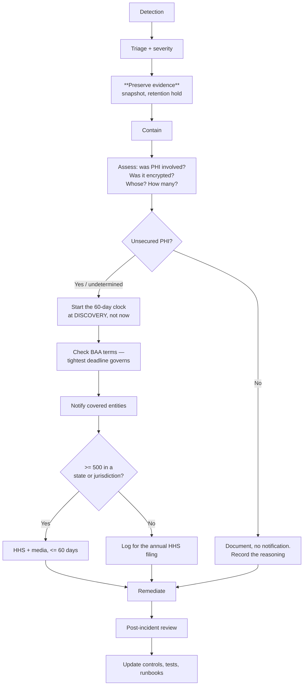

# 07 — Compliance Audit Procedures

**Phase 4.2 deliverable** · Sources: `SECURITY_ARCHITECTURE.md`, `REMAINING_PLANNING_AREAS.md`, `database/04_AUDIT_COMPLIANCE_ERD.md`
**Status:** Draft for review

Covers HIPAA compliance validation, SOC 2 audit preparation, vulnerability scanning automation,
and incident response — including the breach notification obligations the source document omits.

---

## The gap that matters most: breach notification

`SECURITY_ARCHITECTURE.md:369-379` gives an eight-step incident response workflow ending at
"Post-Incident Review". It contains no notification obligation and no clock.

The platform is a **Business Associate** under HIPAA. When PHI is breached, the Breach
Notification Rule (45 CFR §§164.400-414) imposes deadlines that begin at *discovery*, and
discovery means the first moment any workforce member knew or reasonably should have known:

| Obligation | Deadline | Trigger |
|---|---|---|
| Notify affected covered entities | Without unreasonable delay, **≤ 60 days** from discovery | Any breach of unsecured PHI |
| Covered entity notifies individuals | ≤ 60 days from *their* discovery | Their obligation, dependent on ours |
| HHS notification, ≥ 500 individuals in a state or jurisdiction | **≤ 60 days** from discovery | Contemporaneous with individual notice |
| Prominent media notice, ≥ 500 in a state or jurisdiction | ≤ 60 days | Same |
| HHS notification, < 500 individuals | Annually, ≤ 60 days after year end | Logged in a running record |
| BAA-specific terms | **Often shorter than 60 days** | Whatever the signed BAA says |

The last row is the operational trap: individual BAAs frequently require notice within 24 or 72
hours, and the tightest signed term governs. That means the BAA register (below) is not
paperwork — it is an input to incident response.

**Encrypted PHI is not "unsecured" PHI.** If the data was encrypted to HHS-recognised standards
and the key was not also compromised, the notification obligation does not attach. This is the
single highest-value reason the encryption work in doc 06 exists, and it is why an incident
assessment must record the encryption state of the affected data as a first-class finding.

### Incident response, corrected

Two steps are inserted before anything else can proceed:

**Evidence preservation, before containment.** Containment often destroys evidence — terminating a
compromised task discards its memory and local logs. Snapshot first, then contain. This also
places a `retention_holds` row (`database/04`) over the affected records so that a routine purge
job cannot delete evidence mid-investigation, which would be spoliation.

**The clock starts at discovery, not at assessment.** Teams routinely start counting from when
they finished investigating, which can burn thirty of the sixty days before anyone notices.

### Severity and response

| Severity | Definition | Page | Containment target |
|---|---|---|---|
| SEV1 | Confirmed PHI exposure, cross-tenant data access, or total outage | Immediate, 24/7 | 1 hour |
| SEV2 | Suspected exposure, auth bypass, audit logging failed | Immediate | 4 hours |
| SEV3 | Degradation, single-tenant impact, contained vulnerability | Business hours | 1 business day |
| SEV4 | Minor, no data risk | Ticket | Next sprint |

**Audit logging failure is SEV2.** Per `RULE-HSC-02` a write that skips the audit trail is a
compliance defect, so the system cannot be trusted to be recording while it is happening — this is
the same reasoning behind the deployment gate in doc 03 and the alarm in doc 04.

**Cross-tenant data access is SEV1 regardless of volume.** One record read by the wrong tenant is
a breach of the platform's central guarantee, not a small incident.

---

## HIPAA control validation

Controls are validated continuously and evidenced automatically, because an annual scramble to
assemble evidence produces neither compliance nor confidence.

| §164 requirement | Control | Evidence, automated |
|---|---|---|
| §164.308(a)(1) Risk analysis | Annual assessment, threat model per release | Documents, dated |
| §164.308(a)(3) Workforce access | RBAC + RLS (`database/02`) | Quarterly access review export |
| §164.308(a)(4) Access management | Permission model, least privilege | `effective_user_permissions` snapshot |
| §164.308(a)(5) Security training | Onboarding + annual | LMS completion records |
| §164.308(a)(6) Incident procedures | This document | Incident register with timestamps |
| §164.308(a)(7) Contingency plan | Backups, PITR, DR drills | Monthly restore drill results (doc 02) |
| §164.310 Physical safeguards | AWS BAA + MDM | AWS artifacts, MDM compliance report |
| §164.312(a) Access control | Unique user IDs, MFA, session timeout | Config-as-code plus CI test results |
| §164.312(b) **Audit controls** | Audit tables, PHI read logging (`database/04`) | Audit-completeness test results (doc 02) |
| §164.312(c) Integrity | Checksums, immutable audit, version history | Object Lock config, integrity checks |
| §164.312(d) Authentication | MFA, SSO, lockout (doc 05) | Auth test suite results |
| §164.312(e) Transmission security | TLS 1.3 everywhere (doc 06) | TLS scan results, policy checks |

**§164.312(b) is the one most at risk** in this platform, and its evidence comes from the tests in
doc 02 rather than from a document — because the audit trigger in `database/04` was found broken
on two of its three tables. A control that is written down and not exercised is not a control; the
test result is the evidence.

Access reviews run quarterly and produce a signed artifact: every user, their roles, their
last login, and any `user_permission_overrides` with their justification. Overrides require a
`reason` at the database level (`database/02`) precisely so this review is possible.

## BAA register

| Direction | Party | Tracked |
|---|---|---|
| Upstream | AWS, and any subprocessor touching PHI | Signed date, covered services, breach notice term |
| Downstream | Each tenant (covered entity) | Signed date, **breach notice term**, contacts |

The downstream breach-notice term is the field that governs incident response timing, and it must
be queryable during an incident rather than found in a PDF someone has to locate. Any new
subprocessor is blocked until a BAA exists — which is the same constraint as the BAA-eligible
services allowlist in doc 04, applied to vendors rather than AWS services.

---

## SOC 2 preparation

Type II covers a period, so evidence must exist continuously from the start of the observation
window. Retrofitting it is not possible.

| Criterion | Existing control | Evidence source |
|---|---|---|
| CC6.1 Logical access | RBAC, RLS, MFA | Access review artifacts, CI isolation tests |
| CC6.6 Boundary protection | WAF, security groups, TLS | Terraform state, policy scan results |
| CC6.7 Data transmission | TLS 1.3, encrypted storage | Config-as-code |
| CC7.1 Vulnerability detection | Scanning pipeline (below) | Scan history, remediation SLA tracking |
| CC7.2 Monitoring | CloudWatch alarms (doc 04) | Alarm definitions in Terraform, alert history |
| CC7.3 Incident evaluation | Severity model | Incident register |
| CC8.1 Change management | PR review, CI gates, approvals | Git history, GitHub environment approvals |
| A1.2 Availability | Multi-AZ, autoscaling, DR | Uptime records, drill results |
| C1.1 Confidentiality | Encryption, classification | Field policy, `DataClass` tags |

Almost every evidence source is a system artifact rather than a document — git history, Terraform
state, CI results, alarm definitions. That is deliberate: evidence that is generated by doing the
work cannot drift from what was actually done, and it makes the audit a query rather than a
project.

Three gaps that no amount of engineering closes and that need owners now: a documented change
advisory process for emergency changes, vendor management beyond the BAA register, and formal
role descriptions with segregation of duties.

---

## Vulnerability management

`SECURITY_ARCHITECTURE.md:382-425` defines scanning tools and CVSS-based remediation windows.
Those windows are adopted unchanged; what follows is how they are enforced rather than aspired to.

| Layer | Tool | Cadence | Gate |
|---|---|---|---|
| Dependencies | Dependabot, `npm audit` | Continuous | High+ blocks merge |
| SAST | CodeQL, Semgrep | Every PR | High+ blocks merge |
| Secrets | Gitleaks (full history) | Every PR | Any finding blocks |
| Container image | Trivy, by digest | Every build | Critical/High blocks (doc 01) |
| IaC | Checkov, tfsec, OPA | Every infra PR | Policy violations block (doc 04) |
| Runtime | AWS Inspector, GuardDuty | Continuous | Alerts to SEV queue |
| DAST | OWASP ZAP | Nightly against staging | High+ opens a tracked issue |
| Penetration test | External | Annually + on major change | Findings tracked to closure |

| Severity | Remediation | Escalation if missed |
|---|---|---|
| Critical (CVSS ≥ 9.0, or exploited) | 24 hours | CTO, daily until closed |
| High (7.0–8.9) | 7 days | Engineering lead weekly |
| Medium (4.0–6.9) | 30 days | Sprint planning |
| Low (< 4.0) | 90 days or accepted | Quarterly review |

Two additions the source lacks:

**A documented exception path.** Some vulnerabilities cannot be fixed inside the window — no patch
exists, or the fix is a breaking upgrade. An exception needs a stated compensating control, an
expiry date and named approval, recorded where an auditor can find it. Without that path, the
real-world outcome is that the SLA is quietly ignored, which is worse than an approved exception.

**Reachability triage.** A critical CVE in a transitive dependency that the application never
calls is not a critical risk. Triage records exploitability in this deployment; the raw CVSS score
sets the initial priority, not the final one. Otherwise the queue fills with noise and genuine
criticals get the same attention as everything else.

---

## Runbooks

Each is a rehearsed procedure, not a description. The ones specific to this platform:

| Runbook | Trigger | First action |
|---|---|---|
| Cross-tenant data exposure | RLS bypass suspected | Freeze writes, snapshot, place retention holds |
| Audit logging failure | Audit alarm (doc 04) | **Stop accepting writes**, then investigate |
| Credential compromise | Leaked key, suspicious auth | Revoke sessions and keys, rotate, review audit log |
| Ransomware / destructive action | Anomalous deletion volume | Isolate, verify backup integrity, PITR target |
| Data subject erasure request | `data_subject_requests` row | Verify identity, check retention conflict (`database/04`) |
| Tenant offboarding | Contract end | Export, verify, purge, certificate of destruction |
| Key compromise | Suspected KMS or escrow exposure | Rotate, re-encrypt, assess breach reportability |

"Stop accepting writes" as the first action for audit failure is deliberate and will be
uncomfortable in the moment. It is the position `RULE-HSC-02` and `api/06` already take, and the
runbook exists so that decision is made in advance rather than under pressure.

Runbooks are exercised: a tabletop exercise quarterly and one full technical drill annually,
which is also the §164.308(a)(7) contingency evidence.

---

## Corrections and additions to `SECURITY_ARCHITECTURE.md`

| # | Severity | Issue | Resolution |
|---|---|---|---|
| 1 | **High** | Incident response ends at post-incident review with no breach notification obligation, no deadline, and no BAA term awareness | Full notification matrix; clock starts at discovery; tightest BAA term governs |
| 2 | **High** | No evidence preservation step; containment as the first action destroys forensic evidence and can be spoliation if a purge runs | Snapshot plus `retention_holds` before containment |
| 3 | **High** | No incident severity model or response times; "audit log gaps" is listed as a low-priority alert | Severity matrix; audit failure is SEV2 and cross-tenant access is SEV1 |
| 4 | Medium | No encryption safe-harbour assessment, so every incident would be treated as reportable | Encryption state of affected data recorded as a first-class finding |
| 5 | Medium | No BAA register; downstream notice terms are unknowable during an incident | Register with breach-notice term as a queryable field |
| 6 | Medium | No vulnerability exception path, so the SLA is ignored rather than managed when a fix is impossible | Documented exception with compensating control, expiry and approval |
| 7 | Medium | Remediation prioritised on raw CVSS with no reachability triage | Exploitability-in-deployment recorded; CVSS sets initial priority only |
| 8 | Medium | No continuous evidence collection; SOC 2 Type II covers a period and cannot be retrofitted | Evidence generated as system artifacts from day one |
| 9 | Low | No access review cadence despite §164.308(a)(3) | Quarterly signed access review artifact |

---

## Open questions

1. **Who is the Security Officer?** §164.308(a)(2) requires a named individual.
   `SECURITY_ARCHITECTURE.md:184` maps it to "Tenant Admin Role", which conflates the tenant's
   officer with the platform's. The platform needs its own named officer, and that is an
   organizational decision.
2. **BAA breach-notice term to offer tenants.** Committing to 24 hours is a competitive advantage
   and an operational commitment that requires 24/7 staffing. Committing to 60 days is easier and
   will lose enterprise deals. This should be decided deliberately, before the first contract.
3. **SOC 2 timing.** The observation window cannot start before controls are operating. Starting
   evidence collection now costs little; starting the audit before controls are real wastes it.
4. **Penetration test scope.** Annual is proposed. Multi-tenant isolation deserves a dedicated
   test focused on cross-tenant access, which is a different engagement from a general web
   application test.
5. **Incident response staffing.** SEV1 requires 24/7 response. At current team size that implies
   an on-call rotation that may not exist yet, and a stated response time nobody can meet is worse
   than an honest one.
