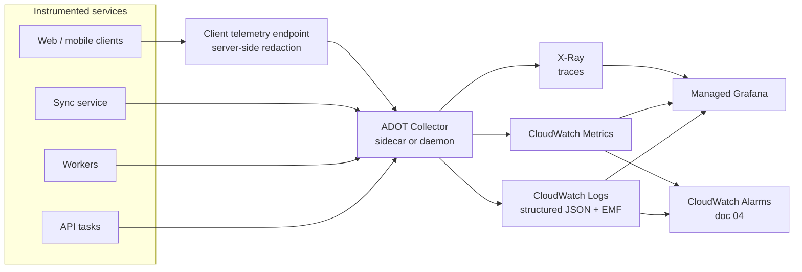

# 01 — Application Performance Monitoring

**Phase 5.1 deliverable** · Sources: `ENHANCEMENT_OPPORTUNITIES.md`, `api/06_MIDDLEWARE_ARCHITECTURE.md`, `frontend/04_PERFORMANCE_OPTIMIZATION.md`
**Status:** Draft for review

Covers OpenTelemetry instrumentation, custom metrics, distributed tracing, and error tracking.

---

## Stack

AWS-native throughout, so that every signal stays inside the account boundary already covered by
the AWS BAA (`infrastructure/04_INFRASTRUCTURE_AS_CODE.md`). `ENHANCEMENT_OPPORTUNITIES.md` lists
CloudWatch, ELK and Datadog for logs, Prometheus and CloudWatch for metrics, and Jaeger, Zipkin
and X-Ray for traces without choosing — running all of them fragments the data and multiplies the
vendors in audit scope.



The ADOT (AWS Distro for OpenTelemetry) Collector is the single egress point for telemetry, which
is what makes the redaction rule below enforceable in one place rather than in every service.

Client telemetry does **not** go direct to a collector endpoint. It posts to the API, which
redacts server-side before forwarding — a browser cannot be trusted to have applied the redaction
processor, and a mobile build from six months ago certainly has not.

---

## The rule that governs everything: no PHI in telemetry

`ENHANCEMENT_OPPORTUNITIES.md:190-207` specifies application logs carrying "Context" and error
logs carrying "Context • User info". On this platform, context is PHI: a record title is a patient
name, a request body is a clinical note, a URL path is a patient identifier (`api/02`).

Telemetry is not covered by the audit trail (`database/04`), not subject to retention policies,
and is read by engineers who have no clinical relationship with the patient. PHI arriving there is
a disclosure, whether or not it ever leaves AWS.

**Allowlist, never redact.** A denylist of patterns — regex for SSNs, name lists — fails the first
time someone adds a field nobody anticipated, and failure is silent.

```ts
// Span attributes are dropped unless explicitly permitted.
const ALLOWED_SPAN_ATTRS = new Set([
  'http.method', 'http.route',            // route PATTERN, never the resolved URL
  'http.status_code', 'http.request.duration',
  'tenant.id', 'request.id', 'session.id',
  'record.type',                          // 'patient' — the type, never the record
  'db.operation', 'db.statement.name', 'db.rows_affected',
  'sync.batch_size', 'sync.conflict_count',
  'error.type', 'error.code',             // our code, never the message
]);

export const phiScrubber: SpanProcessor = {
  onEnd(span) {
    for (const key of Object.keys(span.attributes)) {
      if (!ALLOWED_SPAN_ATTRS.has(key)) delete span.attributes[key];
    }
  },
};
```

| Signal | Rule |
|---|---|
| Span names | Route pattern (`GET /v1/records/:type/:id`), never the resolved path |
| Span attributes | Allowlist above; unknown keys dropped |
| Log fields | Allowlist; structured only, never `console.log(object)` |
| Error messages | Our error codes; the message is logged only for errors we raised (`api/06`) |
| Metric dimensions | Enumerable low-cardinality values only |
| **`user_id`** | Not a searchable attribute — correlate via `session.id` |
| Request/response bodies | **Never**, in any environment |
| SQL statements | Statement *name* or a normalized digest, never parameter values |

`db.statement` deserves emphasis: the default OpenTelemetry database instrumentation captures the
statement text, and depending on the driver that can include bound parameters — which for this
platform is patient data. The instrumentation is configured with statement capture off, and a
normalized digest is emitted instead.

Enforcement is a CI check, not review vigilance: a test asserts that a synthetic request carrying
a known canary string produces no telemetry containing it.

### RUM and session replay

`ENHANCEMENT_OPPORTUNITIES.md:163-168` lists "RUM tracking" and "user analytics" for the web app.
Session replay — which is what most RUM products actually sell — records the rendered DOM. On a
clinical screen that is a patient record, stored by a vendor, viewable by staff, outside every
control the platform has.

**Session replay is not deployed.** RUM is limited to Core Web Vitals and navigation timing
(`frontend/04`), reported with route patterns only:

```ts
onLCP(({ value }) => report({ metric: 'lcp', value, route: matchedRoutePattern, tenant: tenantId }));
```

No screen capture, no click paths with element text, no form field names, no console capture.

---

## Instrumentation

Auto-instrumentation for HTTP, Express, Prisma, Redis, AWS SDK and the queue; manual spans for
the operations that matter to this platform and that no library knows about:

| Span | Attributes | Why |
|---|---|---|
| `auth.authenticate` | method (`jwt`/`api_key`), outcome | Auth latency is on every request |
| `auth.resolve_permissions` | role count | Runs at token mint (`api/01`) |
| `tenant.context.set` | tenant.id | The `SET LOCAL` boundary (`api/06`) |
| `rls.query` | table, rows | Confirms the tenant filter applied |
| `sync.pull` / `sync.push` | batch size, conflicts, device | The mobile critical path |
| `sync.conflict.resolve` | strategy, escalated | Watches for silent auto-resolution |
| `audit.write` | table, queued | Audit health (`RULE-HSC-02`) |
| `file.scan` | result, duration | Gates availability (`database/05`) |
| `webhook.deliver` | attempt, status | Delivery health (`api/04`) |
| `record.link.validate` | rule matched | Link rule enforcement |

`sync.conflict.resolve` with an `escalated` flag is the one that would have surfaced the
data-losing conflict defects in `frontend/05` — a sudden drop in escalations means conflicts are
being auto-resolved that should not be.

### Context propagation

`request_id` is generated at the edge (`api/06`) and travels as `traceparent` plus
`X-Request-Id`. It is the join key across the API log, the X-Ray trace, `system_audit_log` and
webhook delivery rows.

Two propagation boundaries need explicit handling, because the trace ends at both by default:

- **Queue and outbox.** The trace context is stored on the queued row and restored when the worker
  picks it up, using span links rather than a continued span — the work happens later and a span
  spanning hours is useless.
- **Mobile sync.** The device generates a client trace id, sends it as `traceparent`, and the
  server links to it. This is what makes "this user's sync is slow" answerable end to end rather
  than server-side only.

### Sampling

Tail-based sampling in the collector, so the decision is made after the trace completes and can be
based on its outcome:

| Trace | Rate |
|---|---|
| Any error | 100% |
| Duration above the route's p99 | 100% |
| PHI-accessing routes | 100% |
| Sync operations | 20% |
| Everything else | 5% |

Head-based sampling would discard the errors, since the decision is made before anything has gone
wrong. The cost is that the collector buffers spans until the trace ends, which sets a memory
ceiling and a trace-duration timeout.

PHI routes are sampled fully because their traces are the operational counterpart to the audit
trail — not a substitute for it (`database/04` requires the audit row regardless), but the thing
that explains *why* an access was slow or failed.

---

## Custom metrics, and the cardinality trap

CloudWatch charges per unique metric-plus-dimension combination. `tenant_id` as a dimension is
the obvious design and it does not survive contact with growth:

```
20 metrics × 500 tenants = 10,000 custom metrics
                         ≈ $3,000/month, before API request charges
```

At 5,000 tenants it is an order of magnitude worse. The naive implementation makes observability
one of the largest line items on the bill.

The resolution is to split by intent:

| Purpose | Mechanism | Cardinality |
|---|---|---|
| Alerting and SLOs | CloudWatch metrics, **no tenant dimension** | Low |
| Top-N tenant health | Tenant dimension on ~5 key metrics only | Bounded |
| Per-tenant investigation | Embedded Metric Format in logs, queried on demand | Unbounded, cheap |
| Billing and quota | `usage_counters` in Postgres (`database/01`) | Exact |

Embedded Metric Format is the important one: the tenant dimension lives in a log line, so Logs
Insights can aggregate per tenant when someone asks, without creating a billable metric for every
tenant permanently. This is also what makes the per-tenant observability that
`database/08_SCALING_ARCHITECTURE.md` asks for affordable.

Naming is `hsc.<domain>.<measure>` with a stated unit — `hsc.sync.push.duration_ms`,
`hsc.audit.write.failures`, `hsc.file.scan.queue_depth`.

## Error tracking

| Concern | Approach |
|---|---|
| Grouping | Fingerprint on error code plus normalized stack, not on the message |
| Web source maps | Uploaded at build, **not** served publicly |
| Mobile symbolication | dSYM/mapping uploaded per release build |
| Offline crashes | Queued locally, uploaded on next launch — a crash while offline is otherwise invisible |
| PHI in messages | Only errors the platform raised are logged with their message (`api/06`); everything else logs a code and `request_id` |
| Ownership | Every error group routes to a service owner, or it is nobody's |

Fingerprinting on the message is the common mistake here: messages interpolate values, so one
defect becomes thousands of groups and nothing is actionable.

---

## Corrections to `ENHANCEMENT_OPPORTUNITIES.md`

| # | Severity | Issue | Resolution |
|---|---|---|---|
| 1 | **High** | Logs specified as carrying "Context" and "User info" with no PHI rule; default instrumentation would send patient data to the observability backend | Allowlist at the collector; CI canary test |
| 2 | **High** | RUM and "user analytics" listed; session replay records patient screens into vendor storage | Session replay not deployed; RUM limited to Web Vitals with route patterns |
| 3 | **High** | Default database instrumentation captures statement text including bound parameters | Statement capture disabled; normalized digest only |
| 4 | Medium | Three log destinations, three trace stores, three metric collectors, none chosen | AWS-native stack, single collector egress |
| 5 | Medium | Client telemetry would post directly to a collector, trusting the client to have redacted | Posted to the API, redacted server-side |
| 6 | Medium | Metrics with a tenant dimension are the obvious design and cost roughly $3,000/month at 500 tenants | Split: low-cardinality metrics for alerting, EMF logs for per-tenant queries |
| 7 | Medium | No sampling strategy; head-based sampling would discard the error traces | Tail-based, 100% of errors and PHI routes |
| 8 | Low | No context propagation across the queue or into mobile sync, so traces end at both boundaries | Span links on queued work; client `traceparent` |

---

## Open questions

1. **X-Ray's limits.** It is thinner than Jaeger or Tempo — no trace comparison, weaker search.
   Acceptable for the compliance benefit; worth revisiting if trace analysis becomes a bottleneck.
2. **Log volume and cost.** CloudWatch Logs ingestion is the usual surprise. A retention and
   sampling policy per log group is needed before volume sets it (`infrastructure/04`).
3. **Client telemetry through the API** adds request volume on the API tier and needs its own rate
   limit, or a misbehaving client build becomes a denial of service.
4. **The canary test's coverage.** It proves the allowlist works for the fields it exercises.
   Extending it to every span-producing path is the only way it stays true as services are added.
5. **Profiling.** Continuous profiling is genuinely useful and is not available AWS-native in the
   way Datadog offers it. Deferred; worth reconsidering if CPU-bound issues appear.
