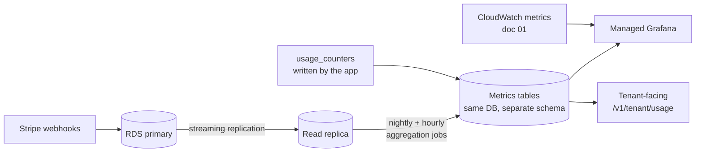

# 03 — Business Metrics & Dashboards

**Phase 5.1 deliverable** · Sources: `ENHANCEMENT_OPPORTUNITIES.md`, `BUSINESS_PRODUCT_PLANNING.md`, `database/01_TENANT_MANAGEMENT_ERD.md`
**Status:** Draft for review

Covers usage analytics, revenue and churn tracking, feature adoption, SLO/SLA definition, and the
four dashboards.

---

## Where business metrics come from

`ENHANCEMENT_OPPORTUNITIES.md:225-236` lists business metrics alongside system metrics as though
both come from the same pipeline. They do not: system metrics come from instrumentation, business
metrics come from the database, and computing them against the OLTP primary is how a dashboard
refresh takes down production.

Aggregation runs against the **read replica** (`database/08`), which is what it is for. Results
land in a `metrics` schema as pre-aggregated rows — daily per tenant, per metric — so a dashboard
query reads hundreds of rows rather than scanning millions.

Real-time is not a requirement here. Revenue and churn are daily figures; usage is hourly at
finest. Anything genuinely live comes from CloudWatch (doc 01), not from this pipeline.

---

## Metric definitions

The definitions matter more than the plumbing. Every organisation argues about what "active user"
means once a number is on a board; deciding here means the number is comparable over time.

| Metric | Definition | Source |
|---|---|---|
| **DAU** | Distinct `user_id` with ≥ 1 authenticated request in the UTC day, excluding synthetic and platform-staff sessions | `user_audit_log` |
| **MAU** | Same over a rolling 28 days — not a calendar month, so the number is not longer in March | `user_audit_log` |
| **Stickiness** | DAU ÷ MAU | Derived |
| **Active tenant** | Tenant with ≥ 1 active user in the period, `status = 'active'` | `tenants` + above |
| **Seat utilisation** | Active users ÷ `subscriptions.seats` | `database/01` |
| **MRR** | Sum of active subscription value normalised to monthly; annual plans divided by 12 | `subscriptions` + `plans` |
| **Net revenue retention** | (Start MRR + expansion − contraction − churn) ÷ start MRR, for the cohort present at start | `subscriptions` history |
| **Logo churn** | Tenants moving to `canceled`/`expired` in the period ÷ tenants at start | `subscriptions` |
| **Revenue churn** | MRR lost from those tenants ÷ start MRR | `subscriptions` |
| **Trial conversion** | Trials converting to paid ÷ trials *ended* in the period | `subscriptions` |
| **Feature adoption** | Tenants with the feature enabled **and** ≥ 1 use in 28 days ÷ tenants with it enabled | `tenant_configurations.features` + usage |
| **Time to first value** | Signup → first record created by a non-admin user | `tenants`, `records` |

Three of these are commonly got wrong in ways that flatter the number:

**MAU on a rolling 28 days**, not a calendar month — otherwise January and February are not
comparable and every month-length change looks like growth.

**Trial conversion measured against trials *ended***, not trials started. Measuring against
started counts trials still running as failures and understates the rate; the reverse error —
counting only conversions — overstates it.

**Feature adoption requires actual use, not just being enabled.** A feature switched on for every
tenant by default has 100% "adoption" and possibly zero users. `TENANT_ONBOARDING_FLOW.md:438`
already identifies data import as 35% of onboarding time; adoption measured properly is what
tells you whether a feature is earning its maintenance.

Every definition carries an **exclusion list**: synthetic monitoring tenants (doc 02), internal
demo tenants, the app-store review account (`frontend/07`), and platform staff impersonation
sessions. Without it, a five-minute synthetic check is the most active user on the platform.

---

## SLIs, SLOs and the SLA

`ENHANCEMENT_OPPORTUNITIES.md` lists "SLA compliance status" on the executive dashboard, but no
SLA is defined anywhere in the documents, and no SLOs exist to support one.

The distinction is load-bearing: an **SLO** is an internal target that drives alerting and
release decisions; an **SLA** is a contractual commitment with a remedy. The SLA should be
looser than the SLO, so the platform notices it is in trouble before a customer can claim.

| SLI | Measurement | SLO | Candidate SLA |
|---|---|---|---|
| API availability | Non-5xx ÷ total, per tenant, 28-day window | 99.9% | 99.5% |
| API latency | p95 of read requests | < 500 ms | none |
| Sync success | Successful sync sessions ÷ attempted | 99.5% | none |
| File availability | Uploaded files reaching `available` | 99.9% | none |
| **Audit completeness** | Audited writes ÷ writes to audited tables | **100%** | none |
| Data durability | Backup and restore verification | 100% | 99.999999999% (S3/RDS backed) |

**Availability is measured per tenant, not platform-wide** — the correction that runs through
doc 04. A platform-wide 99.95% can contain one tenant at 92%, and that tenant is the one who
calls. The SLO is met only if the *worst* tenant meets it, or a stated percentile of tenants does.

**Audit completeness has a 100% target and no error budget.** Every other SLO trades reliability
against velocity; this one does not, because per `RULE-HSC-02` a missing audit row is a
compliance defect rather than a degradation.

Error budgets follow from the SLOs: 99.9% over 28 days is about 40 minutes. Budget consumption
is a first-class dashboard element and it is what makes the burn-rate alerting in doc 04
meaningful — an alert that fires when the budget will be exhausted, rather than when a threshold
is crossed for two minutes.

---

## Dashboards

Four audiences, as `ENHANCEMENT_OPPORTUNITIES.md:298-330` specifies. The discipline is that each
answers a specific question; a dashboard that shows everything is read by nobody.

### Executive — "is the business healthy?"

MRR with trend, net revenue retention, logo and revenue churn, active tenants, trial conversion,
tenants by plan, SLO attainment summary, per-tenant unit cost outliers (doc 02). Weekly and
monthly granularity, no real-time panels.

### Operations — "is the platform healthy right now?"

Error budget burn per SLO, request rate and error rate by route, p50/p95/p99 latency, database
health (`database/08`), pool saturation, sync queue depth and conflict rate, webhook delivery
backlog, active incidents, deploy markers overlaid on every chart.

**Deploy markers are the highest-value element on this board.** Most "what changed?" questions are
answered by a vertical line, and without them every incident starts with someone checking the
deploy history by hand.

### Engineering — "where is the system weak?"

Slowest endpoints by total time, top error groups by count and by affected tenants, `n+1` query
detection from span counts (`database/06` warns about `record_links`), cache hit rates, build and
test duration, flaky test rate, dependency and CVE age.

Errors ranked by **affected tenants** as well as raw count: an error hitting one tenant a thousand
times is one broken workflow; an error hitting a thousand tenants once is a platform defect.

### Tenant-facing — "how are we using this?"

Surfaced through `GET /v1/tenant/usage` and rendered in-product: seat utilisation against
`subscriptions.seats`, storage against plan quota, API usage against rate limits, active users,
records by type, sync health per device, recent audit activity for their own tenant.

---

## Tenant-facing metrics have to respect isolation

A dashboard is a read path, and this one is exposed to customers. Two rules:

**Every query is tenant-scoped through the same RLS path as any other read** (`api/06`). The
aggregation jobs run as the platform role and cross tenants by design, but the *serving* query
does not — a metrics table without a `tenant_id` filter is a cross-tenant leak that RLS cannot
catch, because the aggregate was computed before the filter would apply.

**Benchmarks need k-anonymity.** "You are in the top 20% of clinics your size" is a genuinely
valuable feature and a disclosure risk: with few tenants in a segment, a benchmark reveals a
competitor's numbers. Any comparative statistic requires a minimum cohort size (≥ 20 tenants is a
reasonable floor), suppresses the segment otherwise, and never exposes a rank that could identify
a specific tenant.

Tenant-visible metrics are also subject to the PHI rule: a usage dashboard shows counts and
trends, never record titles or patient identifiers, even to the tenant's own staff — the record
itself has an audited access path, and a dashboard is not it.

---

## Corrections and additions to `ENHANCEMENT_OPPORTUNITIES.md`

| # | Severity | Issue | Resolution |
|---|---|---|---|
| 1 | **High** | Tenant-facing dashboards specified with no isolation rule; a metrics table read without a tenant filter leaks across tenants, invisibly to RLS | Serving queries tenant-scoped; benchmarks require k-anonymity |
| 2 | **High** | "SLA compliance status" is a dashboard element but no SLA or SLO exists anywhere | SLI/SLO table with per-tenant availability and error budgets |
| 3 | **High** | Business metrics implied to come from the same pipeline as system metrics; computing them on the primary risks production | Aggregation on the read replica into a pre-aggregated `metrics` schema |
| 4 | Medium | No metric definitions, so DAU, churn and adoption mean whatever the query author chose that day | Explicit definitions with stated windows |
| 5 | Medium | No exclusion list; synthetic checks every 5 minutes would dominate usage figures | Synthetic, demo, store-review and staff sessions excluded |
| 6 | Medium | "Feature adoption" naturally measured as enablement, which is 100% for anything on by default | Requires enablement plus actual use in 28 days |
| 7 | Low | No deploy markers on operations charts, so every incident begins by manually checking release history | Deploy annotations on all time series |
| 8 | Low | Error ranking by count alone conflates one broken tenant with a platform-wide defect | Ranked by affected tenants as well |

---

## Open questions

1. **What SLA to offer.** The candidate 99.5% is a placeholder. It is a commercial decision with
   an operational cost, and it interacts with the BAA breach-notice term (`infrastructure/07`) —
   both are commitments made in contracts before the capability exists to meet them.
2. **Per-tenant availability aggregation.** "The worst tenant meets the SLO" is strict and will
   fail on one tenant's bad network. A stated percentile (95% of tenants meet it) is more
   practical and needs deciding before it is measured.
3. **Warehouse.** The `metrics` schema on the replica is sufficient now. `NEXT_STAGE_NOTES.md`
   Phase 6 anticipates a data warehouse; the boundary between these aggregates and that is worth
   marking so the work is not done twice.
4. **Benchmark cohort floor.** 20 tenants is proposed. The right number depends on segment
   distribution, which is unknown until there are customers.
5. **Attribution.** Trial conversion is measured but nothing records the acquisition source, so
   marketing spend cannot be tied to revenue. That needs a field at signup
   (`TENANT_ONBOARDING_FLOW.md`), which is a Phase 1 schema change.
