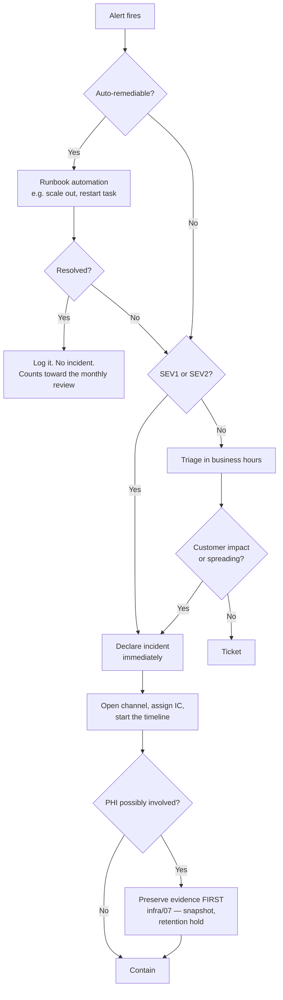

# 05 — Incident Response Operations

**Phase 5.2 deliverable** · Sources: `ENHANCEMENT_OPPORTUNITIES.md`, `infrastructure/07_COMPLIANCE_AUDIT_PROCEDURES.md`
**Status:** Draft for review

Covers on-call, alert-to-incident promotion, response roles, communications, post-incident review,
and the continuous improvement loop.

> **Scope.** `infrastructure/07` is normative for **severity definitions, breach notification
> obligations, evidence preservation and the technical runbooks**. This document covers the
> operational layer around them: who is on call, how an alert becomes an incident, who does what
> during one, what gets said to whom, and what happens afterwards. Where the two touch — severity,
> notification timing — this document links rather than restates, so the notification deadlines
> have exactly one home.

---

## On-call

| Element | Specification |
|---|---|
| Rotation | Weekly, primary and secondary, handoff Monday 10:00 local |
| Coverage | 24/7 for SEV1 and SEV2 (`04_ALERT_CONFIGURATION.md`) |
| Acknowledgement | 5 minutes, then escalate to secondary |
| Compensation | Defined before the rotation starts, not after the first bad week |
| Minimum rotation size | 4 engineers — below that, one person's holiday breaks coverage |
| Tooling access | Full production read, break-glass write (`infrastructure/04`) |

**Handoff is a written exchange, not a calendar change.** The outgoing on-call records what fired
during the week, anything still degraded, any maintenance in flight, and any alert currently
suppressed. A suppression that outlives the person who set it is how a real outage goes unnoticed.

Two things the rotation needs that are usually missing at this stage. **A named incident commander
pool** distinct from the on-call engineer — the person debugging cannot also be coordinating, and
SEV1 needs both. And **an explicit escalation-without-blame norm**: an on-call engineer who is
unsure whether something is SEV2 must be able to escalate and be wrong without cost, or they will
guess low at 3am.

---

## From alert to incident

Not every alert is an incident, and treating them identically produces either noise or missed
severity.



The branch that matters is the PHI one, and it is placed before containment deliberately —
`infrastructure/07` establishes that containment destroys forensic evidence and that a routine
purge job running mid-investigation is spoliation. The operational consequence is that a responder
must ask "could PHI be involved?" before doing the obvious thing, which is why it is a step in the
flow rather than a note in a runbook.

**Declare early, downgrade freely.** Declaring an incident is cheap; discovering forty minutes in
that something should have been an incident is not. Downgrading is a normal outcome and is never
treated as a false alarm in review.

---

## Roles

For SEV1 and SEV2. SEV3 has one owner and no ceremony.

| Role | Responsibility | Explicitly not |
|---|---|---|
| **Incident Commander** | Coordinates, decides, tracks state, delegates | Debugging |
| **Operations lead** | Investigates and applies fixes | Talking to customers |
| **Communications lead** | Status page, customer notice, internal updates | Investigating |
| **Scribe** | Timeline with timestamps, decisions and their reasons | Anything else |
| **Subject expert** | Domain depth, pulled in as needed | Coordinating |
| **Privacy officer** | Joins any incident where PHI may be involved | — |

One person may hold several roles in a small incident, but **the IC never also debugs**. The
failure mode is well known: the best-informed engineer takes the IC role, disappears into a
terminal, and nobody is tracking the clock, the comms, or the notification deadline.

The scribe's timeline is not administrative overhead. It is the evidence base for the review, and
for a PHI incident it is the record of when discovery occurred — which is when the 60-day
notification clock started (`infrastructure/07`).

---

## Communications

| Audience | Channel | SEV1 | SEV2 | SEV3 |
|---|---|---|---|---|
| Responders | Incident channel | Continuous | Continuous | As needed |
| Internal | `#incidents` | 30 min | Hourly | On resolve |
| Leadership | Direct | Immediate | On escalation | — |
| All customers | Status page | Yes | If customer-visible | No |
| Affected tenant | Account owner | Direct contact | Direct contact | If asked |
| Covered entities | Formal notice | **Per `infrastructure/07`** | Per assessment | — |

### What goes on a status page

Three rules, each of which exists because of a specific way this goes wrong:

**Never name a tenant.** "Degraded performance for some customers" — not "Memorial Clinic is
affected". Naming a customer in a public incident is a disclosure the customer did not consent to.

**Never describe symptoms that imply a breach before one is confirmed.** "Users may see data from
another account" is a public breach announcement, made by an engineer, before assessment. The
correct public wording during investigation is a functional one — "we have disabled X while we
investigate" — with the substantive statement made through the formal notification path once the
assessment is done.

**Never include PHI, request payloads, record ids or stack traces.** Status updates get indexed
and screenshotted.

Updates are on a stated cadence even when there is nothing new: "still investigating, next update
in 30 minutes" is a real update, and silence is what generates support volume.

The initial post is a template so it can go out in two minutes rather than being drafted during
the worst part of the incident:

```
[Investigating] Elevated error rates
We are investigating reports of elevated error rates affecting some users.
Next update in 30 minutes.
```

---

## Post-incident review

Required for every SEV1 and SEV2, and for any SEV3 that recurs. Held **within 5 business days** —
later than that and the details are reconstructed rather than remembered.

**Blameless, and specifically so.** The question is what made the failure possible and what made
it hard to detect or fix, never who did it. This is a practical commitment rather than a cultural
slogan: a review that assigns fault produces engineers who describe incidents carefully rather
than accurately, and the accuracy is the whole value.

Structure:

| Section | Contents |
|---|---|
| Summary | Two or three sentences. What broke, who was affected, how long |
| Impact | Tenants affected, requests failed, error budget consumed, data affected |
| Timeline | From the scribe. First occurrence, detection, declaration, mitigation, resolution |
| Contributing factors | Plural, always. Single-cause explanations are almost always incomplete |
| What went well | Genuinely — detection, tooling, a runbook that worked |
| What was hard | Missing signal, unclear ownership, a runbook that did not match reality |
| Action items | Owner, due date, tracked in the normal backlog |

Four numbers recorded every time, because they are what the improvement loop measures:

- **Time to detect** — first occurrence to alert. Large values mean the monitoring gap is the
  finding, not the bug.
- **Time to acknowledge** — alert to a human responding.
- **Time to mitigate** — impact stopped, which is usually before resolution.
- **Time to resolve** — fully fixed.

The gap between detect and occur is the one most often ignored and most often the actual lesson:
an incident found by a customer rather than by an alert is a monitoring failure regardless of what
caused the outage.

### Action items

The review's only durable output. They go into the normal backlog with an owner and a date — not
into the review document, where they die.

| Class | Target | Note |
|---|---|---|
| Stop recurrence | Next sprint | The fix itself |
| Improve detection | Next sprint | Usually a new alert or SLI |
| Improve response | 30 days | Runbook, tooling, access |
| Systemic | Tracked as normal work | Architecture, staffing |

**A SEV1 action item that slips twice is escalated to engineering leadership.** Unclosed action
items are the mechanism by which the same incident happens three times, and each recurrence costs
more than the fix would have.

---

## Continuous improvement

| Cadence | Activity |
|---|---|
| Weekly | On-call handoff; alerts that fired and whether they were actionable |
| Monthly | Alert rule review with the deletion rule (`04_ALERT_CONFIGURATION.md`); incident metrics trend |
| Quarterly | Tabletop exercise (`infrastructure/07`); action item audit; runbook accuracy check |
| Annually | Full DR drill; on-call load and staffing review |

Runbooks are verified against reality quarterly by having someone who did not write them follow
one. A runbook that references a dashboard that no longer exists is worse than none — it costs
time during an incident and it looks authoritative.

Incident metrics are tracked as a trend, not as targets:

| Metric | Watching for |
|---|---|
| Incidents per month by severity | Trend, not absolute |
| Percentage detected by monitoring vs by customers | Should rise toward 100% |
| Median time to detect / mitigate | Should fall |
| Repeat incidents | Should be near zero — a repeat means an action item did not land |
| Pages per on-call shift | < 2, or the alerting is wrong |
| Action items closed on time | > 80% |

**"Detected by monitoring rather than by a customer" is the single most useful number here.** It
measures whether the observability work in docs 01–04 is doing its job, and it is the one metric
that improves only when the monitoring genuinely improves.

---

## Corrections and additions to `ENHANCEMENT_OPPORTUNITIES.md`

| # | Severity | Issue | Resolution |
|---|---|---|---|
| 1 | **High** | The eight-step workflow has no PHI branch, so the natural response contains first and destroys evidence | Evidence preservation before containment, linked to `infrastructure/07` |
| 2 | **High** | No status page guidance; the obvious wording during a cross-tenant incident is itself a public breach announcement | Three explicit rules: no tenant names, no breach-implying symptoms, no PHI |
| 3 | Medium | "Escalation policies (15 min → manager → director)" is a path with no rotation, acknowledgement window or minimum size behind it | Full on-call specification with written handoff |
| 4 | Medium | No distinction between an alert and an incident, so either everything is an incident or nothing is | Promotion flow with auto-remediation and declare-early-downgrade-freely |
| 5 | Medium | No response roles; the best-informed engineer becomes both IC and investigator and the clock goes untracked | Role table with the IC-does-not-debug rule |
| 6 | Medium | Post-incident review named as step 8 with no structure, timing or output | Blameless structure, 5-day window, tracked action items |
| 7 | Medium | No incident metrics, so there is no way to tell whether response is improving | MTTD/MTTA/MTTM/MTTR plus detection source |
| 8 | Low | No runbook verification; runbooks drift and are trusted anyway | Quarterly walkthrough by someone who did not write them |

---

## Open questions

1. **Rotation viability.** Four engineers is the stated minimum for a sustainable 24/7 rotation.
   If the team is smaller, the honest options are a narrower paging window, a third-party
   first-response service, or an SLA that reflects reality — the same tension
   `infrastructure/07` raises.
2. **Incident commander pool.** Distinct from on-call and needs training. Who is in it, and
   whether IC duty rotates separately, is unresolved.
3. **Status page hosting.** A status page hosted on the same infrastructure is unavailable during
   exactly the incidents it exists for. Third-party hosting is standard and adds a vendor.
4. **Customer notification thresholds.** When an affected tenant hears directly rather than via
   the status page is currently judgement. Enterprise contracts will likely specify it, which
   means it belongs alongside the BAA terms in `infrastructure/07`.
5. **Auto-remediation scope.** Restarting a task or scaling out is safe. Anything touching data is
   not, and the boundary should be explicit before the first automation is written.
