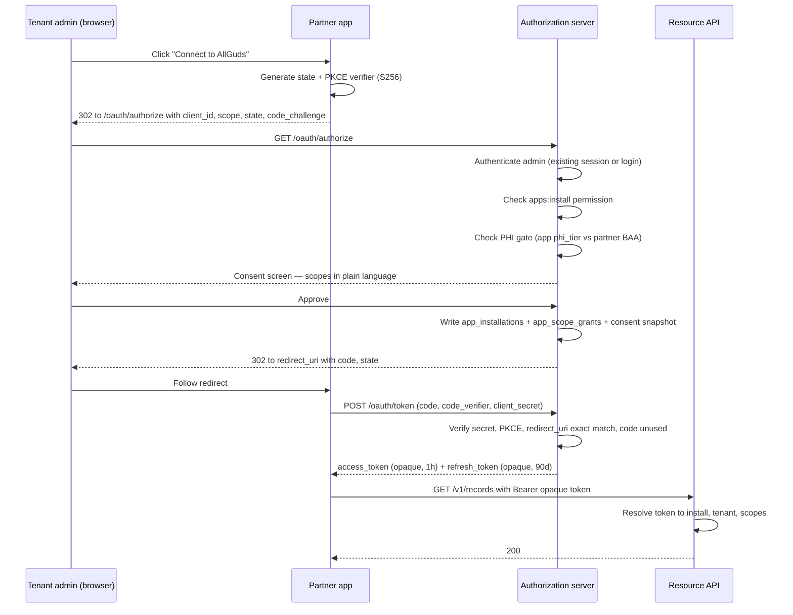
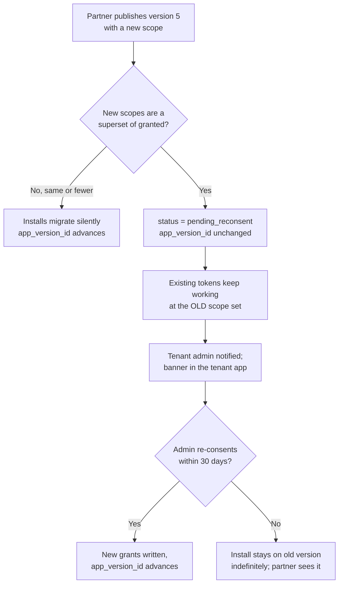

# 02 — App Authorization & Isolation

**Phase 8.1 deliverable** · Sources: `01_PARTNER_PROGRAM.md`, `../api/01_AUTH_AUTHORIZATION_FLOWS.md`, `../api/03_RATE_LIMITING_THROTTLING.md`, `../api/06_MIDDLEWARE_ARCHITECTURE.md`, `../database/02_USER_AUTH_ERD.md`, `../database/04_AUDIT_COMPLIANCE_ERD.md`
**Status:** Draft for review

Covers the OAuth authorization server, the app scope catalogue, the consent and installation
lifecycle, token issuance and revocation, the isolation model, per-app rate budgets, and audit
attribution.

**Scope decision:** apps are **API-only, server-to-server**. No third-party code renders inside the
platform's web or mobile clients. Everything below follows from that; the forward-compatibility
note at the end says what must not be precluded if embedded UI is added later.

---

## The platform takes on a third OAuth role

| Role | Status today | Where |
|---|---|---|
| Resource server — validates tokens it issued | Exists | `api/01`, `api/06` stage 6 |
| Client — obtains tokens from Google, DocuSign | Exists | `api/04` `integration_connections` |
| **Authorization server — issues tokens to third parties** | **Does not exist** | This document |

`api/01` and `api/04` both defer this explicitly and independently, which is the clearest evidence
it is the real substance of Phase 8 rather than a detail of it:

> *"If partners need delegated per-user access, that is a full OAuth 2.0 authorization-code server —
> a much larger build."* — `api/01` OQ5
>
> *"a marketplace needs per-app OAuth clients and consent, which is a larger build."* — `api/04` OQ5

Being an authorization server is a different security posture from being a resource server. A bug
in resource-server token validation exposes the platform's own API. A bug in authorization-server
token issuance hands a third party a credential to a tenant's PHI, with a consent record that says
the tenant agreed to it.

---

## Installation flow

Authorization code with PKCE, even though a marketplace app is a confidential client. The reasoning
is `infrastructure/05`'s: PKCE costs nothing and closes code interception, and a uniform flow means
one implementation rather than two.



Four checks in that flow are the ones that matter, and each fails silently if omitted:

**The installing user must hold `apps:install`.** A new permission code in the `database/02`
catalogue, granted to tenant admins only. Without it any user can hand an external company access
to everything they can see — which is exactly the permissions-escalation shape that RBAC exists to
prevent. It is not a `settings:write` sub-case; installing an app is a disclosure decision, not a
configuration change.

**`redirect_uri` is compared by exact string match** against `partner_apps.redirect_uris`. Prefix
matching, wildcards, and "same origin is close enough" are all how authorization codes get
delivered to an attacker-controlled path on a partner's own domain.

**The authorization code is single-use and short-lived** — 60 seconds, deleted on exchange. A code
presented twice invalidates the tokens issued from the first exchange, mirroring the refresh-token
reuse response in `database/02`: reuse means the code leaked, and the safe assumption is that the
attacker got there first.

**The PHI gate is evaluated at authorize time, not install time.** If the app's `phi_tier` is
`phi` and its partner has no live BAA, the flow stops at the consent screen with an explanation —
not after the tenant has approved.

---

## App scopes are not user permissions

`database/02` defines `permissions` as `resource:action` — `records:read`, `files:write`. Those are
the right granularity for a role, and the wrong granularity for a consent screen. "This app is
requesting records:read" tells a practice manager nothing about what will leave the building.

App scopes are a separate, coarser, human-readable catalogue that maps onto permissions.

```sql
CREATE TABLE app_scopes (
    scope_code       VARCHAR(60) PRIMARY KEY,     -- 'records.read.nonphi'
    display_name     VARCHAR(120) NOT NULL,       -- 'Read non-clinical records'
    consent_text     TEXT NOT NULL,               -- shown verbatim on the consent screen
    is_phi           BOOLEAN NOT NULL DEFAULT FALSE,
    requires_baa     BOOLEAN NOT NULL DEFAULT FALSE,
    is_grantable     BOOLEAN NOT NULL DEFAULT TRUE,  -- false = platform-internal only
    sort_order       INTEGER NOT NULL DEFAULT 0
);

CREATE TABLE app_scope_permissions (
    scope_code    VARCHAR(60) NOT NULL REFERENCES app_scopes(scope_code) ON DELETE CASCADE,
    permission_id UUID        NOT NULL REFERENCES permissions(permission_id) ON DELETE CASCADE,
    PRIMARY KEY (scope_code, permission_id)
);
```

Seed catalogue:

| Scope | PHI | Underlying permissions |
|---|---|---|
| `profile.read` | No | tenant name, plan, timezone — no user list |
| `users.read` | No | `users:read` |
| `records.read.nonphi` | No | `records:read`, restricted to types where `is_phi = false` |
| `records.write.nonphi` | No | `records:write`, same restriction |
| `files.read.nonphi` | No | `files:read`, same restriction |
| `billing.read` | No | `billing:read` |
| `webhooks.manage` | No | `webhooks:manage`, limited to the app's own subscriptions |
| `records.read.phi` | **Yes** | `records:read` over PHI types |
| `records.write.phi` | **Yes** | `records:write` over PHI types |
| `files.read.phi` | **Yes** | `files:read` over PHI types |
| `audit.read` | **Yes** | `audit:read` — reading the audit log is itself audited (`api/01`) |

The `.nonphi` / `.phi` split is the mechanism that makes the tiered marketplace decision
enforceable rather than advisory. It reads `record_type_definitions.is_phi`, the same field
`api/04` uses to decide whether a webhook payload may carry content, so there is one definition of
"this is PHI" rather than two that drift.

### The effective-permission rule

```
effective = scopes granted at install
          ∩ permissions of the admin who consented
          ∩ permissions mapped to those scopes
          ∩ scopes still present in the installed app_version
```

The second term is `api/01`'s API-key rule — *a key's scopes are a subset of what its creator could
grant* — extended to apps, and it is the term most likely to be dropped. Without it, a tenant admin
who cannot export records can install an app that exports records, and the app becomes a
privilege-escalation path with a consent screen in front of it.

Validate at install, and **re-validate at token refresh**. `api/01` already established that
permissions go stale in a token; an install lives for years and the admin who consented may lose
permissions or leave. See the revocation matrix below for what happens then.

---

## Installation, consent and tokens

```sql
CREATE TYPE install_status AS ENUM ('active', 'suspended_by_tenant', 'suspended_by_platform',
                                    'pending_reconsent', 'uninstalled');

CREATE TABLE app_installations (
    installation_id     UUID PRIMARY KEY DEFAULT gen_random_uuid(),
    tenant_id           UUID NOT NULL REFERENCES tenants(tenant_id) ON DELETE CASCADE,
    app_id              UUID NOT NULL REFERENCES partner_apps(app_id) ON DELETE RESTRICT,
    app_version_id      UUID NOT NULL REFERENCES app_versions(app_version_id),

    status              install_status NOT NULL DEFAULT 'active',
    status_reason       TEXT,

    consented_by        UUID REFERENCES tenant_users(user_id),
    consented_at        TIMESTAMP WITH TIME ZONE NOT NULL,
    consent_snapshot    JSONB NOT NULL,   -- exact scope codes + consent_text shown, verbatim
    consent_ip          INET,

    -- PHI installs only. Copied from partners at install time, not joined at read time.
    baa_reference       VARCHAR(120),
    baa_verified_at     TIMESTAMP WITH TIME ZONE,

    installed_at        TIMESTAMP WITH TIME ZONE NOT NULL DEFAULT NOW(),
    uninstalled_at      TIMESTAMP WITH TIME ZONE,

    CHECK (status <> 'uninstalled' OR uninstalled_at IS NOT NULL)
);

-- One live installation per (tenant, app). History is retained.
CREATE UNIQUE INDEX uq_installation_live ON app_installations(tenant_id, app_id)
    WHERE status <> 'uninstalled';

CREATE TABLE app_scope_grants (
    installation_id UUID NOT NULL REFERENCES app_installations(installation_id) ON DELETE CASCADE,
    scope_code      VARCHAR(60) NOT NULL REFERENCES app_scopes(scope_code),
    granted_at      TIMESTAMP WITH TIME ZONE NOT NULL DEFAULT NOW(),
    PRIMARY KEY (installation_id, scope_code)
);

CREATE TABLE app_tokens (
    token_id         UUID PRIMARY KEY DEFAULT gen_random_uuid(),
    installation_id  UUID NOT NULL REFERENCES app_installations(installation_id) ON DELETE CASCADE,
    tenant_id        UUID NOT NULL REFERENCES tenants(tenant_id) ON DELETE CASCADE,

    token_type       VARCHAR(10) NOT NULL,          -- 'access' | 'refresh'
    token_hash       VARCHAR(64) NOT NULL UNIQUE,   -- SHA-256, never the token
    issued_at        TIMESTAMP WITH TIME ZONE NOT NULL DEFAULT NOW(),
    expires_at       TIMESTAMP WITH TIME ZONE NOT NULL,
    used_at          TIMESTAMP WITH TIME ZONE,      -- refresh rotation, as database/02
    replaced_by      UUID REFERENCES app_tokens(token_id) ON DELETE SET NULL,
    revoked_at       TIMESTAMP WITH TIME ZONE,
    revoked_reason   VARCHAR(50)
);

CREATE INDEX idx_app_tokens_live ON app_tokens(token_hash) WHERE revoked_at IS NULL;
CREATE INDEX idx_app_tokens_install ON app_tokens(installation_id) WHERE revoked_at IS NULL;

ALTER TABLE app_installations ENABLE ROW LEVEL SECURITY;
ALTER TABLE app_installations FORCE  ROW LEVEL SECURITY;
ALTER TABLE app_tokens        ENABLE ROW LEVEL SECURITY;
ALTER TABLE app_tokens        FORCE  ROW LEVEL SECURITY;
ALTER TABLE app_scope_grants  ENABLE ROW LEVEL SECURITY;
ALTER TABLE app_scope_grants  FORCE  ROW LEVEL SECURITY;

CREATE POLICY tenant_isolation ON app_installations FOR ALL TO app_user
    USING (tenant_id = current_setting('app.current_tenant_id')::UUID);
CREATE POLICY tenant_isolation ON app_tokens FOR ALL TO app_user
    USING (tenant_id = current_setting('app.current_tenant_id')::UUID);

-- app_scope_grants has no tenant_id of its own; it inherits isolation through its
-- installation. Denormalising tenant_id onto it would be faster to check but gives the
-- row two sources of truth for which tenant it belongs to.
CREATE POLICY tenant_isolation ON app_scope_grants FOR ALL TO app_user
    USING (installation_id IN (SELECT installation_id FROM app_installations));
```

### Two audiences, one table, still RLS

`app_installations` has to be readable two ways: a tenant sees the apps it installed, a partner
sees the tenants that installed its app. Those are orthogonal filters over the same rows, and no
single policy on `app_user` expresses both.

The wrong fix is to read it from application code with a `WHERE` clause for the partner portal.
That is precisely the application-layer filtering RULE-HSC-02 rules out, and it is the same class
of defect as `api/01`'s tenant-resolution bug: one missing predicate and a partner enumerates every
install on the platform.

The fix is a second database role with its own policy and its own GUC.

```sql
CREATE POLICY partner_isolation ON app_installations FOR SELECT TO partner_portal_user
    USING (app_id IN (SELECT app_id FROM partner_apps
                       WHERE partner_id = current_setting('app.current_partner_id')::UUID));

CREATE POLICY partner_isolation ON app_scope_grants FOR SELECT TO partner_portal_user
    USING (installation_id IN (SELECT installation_id FROM app_installations));

-- The policy expression is evaluated as the querying role, so the role needs SELECT on
-- every table the subquery touches — omitting this makes the policy fail with a
-- permission error rather than returning no rows.
GRANT SELECT ON app_installations, partner_apps, app_versions, app_scope_grants
    TO partner_portal_user;
-- No INSERT/UPDATE/DELETE: a partner never changes an install, the tenant does.

-- partner_apps is a global catalogue with no tenant dimension, but it is not public to
-- partners: it holds every competitor's client_id and webhook_url. RLS confines the
-- portal role to its own partner's rows, and the same predicate makes the subquery above
-- correct rather than merely permitted.
ALTER TABLE partner_apps ENABLE ROW LEVEL SECURITY;
ALTER TABLE partner_apps FORCE  ROW LEVEL SECURITY;
ALTER TABLE app_versions ENABLE ROW LEVEL SECURITY;
ALTER TABLE app_versions FORCE  ROW LEVEL SECURITY;
CREATE POLICY partner_own_apps ON partner_apps FOR SELECT TO partner_portal_user
    USING (partner_id = current_setting('app.current_partner_id')::UUID);
CREATE POLICY partner_own_versions ON app_versions FOR SELECT TO partner_portal_user
    USING (app_id IN (SELECT app_id FROM partner_apps));
```

`partner_portal_user` gets `SELECT` on install metadata and `app_usage_daily`, and **no grant at
all** on `records`, `files`, `tenant_users`, or any audit table. The portal cannot reach tenant data
even with a SQL injection in the portal, because the role has no privilege to reach it. The GUC is
set through the same single-entry-point wrapper `api/06` uses for `app.current_tenant_id`, with
`set_config(..., true)` so it cannot leak across a pooled connection (`database/08`).

### Tokens are opaque, not JWTs

`api/01` issues self-contained JWTs to users and checks `sessions.revoked_at` in Redis on each
request. App tokens are **opaque random strings resolved against `app_tokens` on every request**.

The difference is revocation latency. A user's JWT is short-lived and the user is present to
re-authenticate. An uninstall is a tenant saying *stop having my data now* — and a self-contained
token stays cryptographically valid until it expires, so a JWT design either accepts a window in
which a revoked app still reads PHI, or bolts on a per-request revocation check and thereby pays
the lookup cost anyway while keeping the stateless design's downsides.

Since the check is unavoidable, make the token a reference. The resolution result — installation,
tenant, scopes, status — is cached in Redis under `performance/01`'s **state** instance
(`noeviction`), not the cache instance: an eviction here would fall through to the database, which
is correct, but the same instance holds rate-limiter windows that must not be silently dropped.
The cache entry is deleted synchronously by every revocation path below, and carries a 60-second
TTL as a backstop.

---

## Consent recording

`consent_snapshot` stores the scope codes **and the exact `consent_text` shown at the time**, not a
foreign key to `app_scopes`.

Consent text will be reworded — for clarity, on legal advice, or because a scope's meaning widens.
A join to the live catalogue means every historical install silently appears to have consented to
today's wording. For a HIPAA disclosure authorization that is not a cosmetic problem; the record of
what a tenant agreed to must be the thing they actually saw.

This is deliberately unlike `database/04`'s `consent_records`, which models **patient** consent to
data processing, keyed on `subject_record_id` and `purpose`. Installation consent is a tenant
administrator authorizing a disclosure to a business associate. Different subject, different legal
basis, different retention. They must not be merged, and the naming should keep them apart.

### Scope escalation on app update

An app that adds `records.read.phi` in version 5 does **not** acquire it on existing installs.



Existing tokens keep working at the old scope set rather than being revoked, because revoking on
publish means any partner can break every one of their installs with a routine release. A scope
*reduction* migrates silently — nothing is escalated by taking access away.

`pending_reconsent` with no deadline is deliberate. A forced cutoff would create an incentive to
click through, and clicking through is the failure mode the whole re-consent step exists to prevent.

---

## Isolation

Apps run on the partner's own infrastructure. There is no process to sandbox, so isolation here
means four confinement mechanisms plus one honest limit.

### 1. Scope confinement

The effective-permission rule above, evaluated at `api/06` stage 10. A scope maps to permissions;
permissions are checked exactly as they are for a user; RLS then evaluates the tenant predicate as
it always does. No new authorization engine, and no path that skips RLS.

### 2. Tenant confinement

**A token is bound to exactly one installation, and therefore to exactly one tenant.** An app with
200 installs holds 200 refresh tokens. There is no cross-tenant token, no "app-level" token, and no
`X-Tenant-ID` header for apps — the tenant comes from the resolved token and nothing else, which is
`api/01`'s correction 1 applied to a new identity type before the bug can be written.

This is worth stating because the convenient design is the opposite one: a single app credential
plus a tenant parameter is less code for both sides. It is also a single forged parameter away from
a cross-tenant read, on a path with no user session to constrain it.

### 3. Rate budget

`api/03` derives limits from `plans.limits` per tenant. An installed app spends that budget, so
without a carve-out one badly-written app starves the tenant's own users — and the tenant blames
the platform, correctly, since the platform certified the app.

```json
{
  "app_requests_per_hour_default": 5000,
  "app_share_of_tenant_budget_max": 0.25
}
```

Each installation gets its own limiter window keyed `rl:app:{installation_id}`, capped at the lower
of the app's per-hour default and 25% of the tenant's hourly budget. Consequences:

- An app hitting its ceiling gets 429 with `Retry-After`; the tenant's users are unaffected.
- Four greedy apps still cannot consume more than the tenant's whole budget between them, and the
  tenant's own traffic is never fully crowded out.
- The per-app default is a tenant-adjustable setting, because a tenant that installs a bulk export
  tool wants it to run fast and is the right party to decide.

Apps are excluded from the *user* rate limit dimension entirely — they have no `user_id`, and
counting them against a null user key would put every app in one bucket.

### 4. Egress accountability

Every app request carries `app_id` and `installation_id` into the request log, `user_audit_log` and
`data_audit_log`. The tenant gets a per-app activity view built on that, and a suspend switch that
takes effect immediately — a status change plus a synchronous Redis delete, not a token expiry.

### The limit worth stating plainly

**Once data reaches the vendor's server the platform has no technical control over it.** No scope,
budget or audit column constrains what happens next. What actually governs that is the BAA, the
certification review, and the tenant's own contract — doc 03 — and the audit trail exists to detect
misuse after the fact rather than to prevent it.

Documents that describe marketplace "sandboxing" without saying this leave readers believing the
platform enforces something it cannot. It does not; it enforces the boundary up to the wire, and
contracts govern the far side.

---

## Audit attribution

`api/01` already flags that key-authenticated writes leave `data_audit_log.changed_by` null. App
writes make it worse: a null actor with no way to tell which of a tenant's twelve installed apps
made the change. For HIPAA that is an incomplete accounting of disclosures — the same defect shape
as the `sessions.impersonated_by` finding in `experience/02`.

```sql
ALTER TABLE user_audit_log
    ADD COLUMN app_id          UUID REFERENCES partner_apps(app_id),
    ADD COLUMN installation_id UUID;

ALTER TABLE data_audit_log
    ADD COLUMN app_id          UUID REFERENCES partner_apps(app_id),
    ADD COLUMN installation_id UUID;

CREATE INDEX idx_user_audit_app ON user_audit_log(tenant_id, app_id, timestamp DESC)
    WHERE app_id IS NOT NULL;
```

Populated from a `app.current_app_id` GUC set by the same `withTenantContext` wrapper that sets the
tenant GUC, so the trigger in `database/04` reads it with `current_setting('app.current_app_id', true)`
— the `missing_ok` form, which `database/04`'s fault 2 already established is mandatory for writes
that occur outside a request.

Both `data_audit_log` and `user_audit_log` are partitioned, so these are `ADD COLUMN` on the
partitioned parent — cheap, since neither has a default.

Reading rule, in the same spirit as `api/01`'s note on `audit:read`: an app granted `audit.read`
sees the tenant's audit log **including its own rows**. Filtering an app's own actions out of the
log it can read would let a compromised app hide its tracks.

---

## Amendments to `api/06`'s middleware stack

App requests traverse the same 17-stage pipeline. Three stages behave differently, and the ordering
constraints that make the stack correct are unchanged.

| Stage | Change |
|---|---|
| 6 · Authentication | Third branch: `Bearer` with an opaque token resolves against `app_tokens` (Redis-backed). JWT and `hsc_live_` branches unchanged |
| 7 · Session check | Replaced for apps by the installation status check — `active` only; `suspended_*` and `pending_reconsent` beyond its granted scopes are 403 |
| 8 · Tenant binding | Tenant comes from the installation. **`X-Tenant-ID` is rejected outright on an app-authenticated request**, not merely compared |
| 9 · Rate limit | Keyed on `installation_id`; the user dimension is skipped |
| 10 · Authorization | Route permission must be in the effective-permission intersection, not merely in the app's scope list |
| 13 · Transaction | Sets `app.current_app_id` alongside the tenant GUC, with `set_config(..., true)` |
| 14 · PHI access log | Unchanged, but writes `app_id`; `phi_read_count` in `app_usage_daily` rolls up from here |

Stage 8's difference from the user path is deliberate. For a user, `X-Tenant-ID` contradicting the
token is `403 TENANT_MISMATCH` because browsers and proxies genuinely send stale headers. An app has
no such excuse — it obtained a token bound to one tenant — so the header's presence is either a bug
worth surfacing loudly or an attempt worth logging as a security event.

---

## Revocation matrix

Every row here must revoke tokens **and** delete the Redis entry synchronously. A revocation that
leaves a cached resolution live is not a revocation.

| Trigger | Installation | Tokens | Webhooks | Notify |
|---|---|---|---|---|
| Tenant uninstalls | `uninstalled` | All revoked | App's subscriptions deleted | Partner, via app webhook |
| Tenant suspends | `suspended_by_tenant` | All revoked | Paused, retained | Partner |
| Platform suspends app | Every install `suspended_by_platform` | All revoked, all tenants | Paused | Partner + every affected tenant |
| Partner terminated | Every install of every app | All revoked | Deleted | Every affected tenant |
| App version adds scopes | `pending_reconsent` | **Kept**, old scopes only | Unchanged | Tenant admins |
| Certification expires | `suspended_by_platform` | All revoked | Paused | Partner + tenants |
| BAA expires (PHI app) | PHI installs suspended | Revoked on PHI installs | Paused | Partner + tenants |
| Consenting admin deactivated | **Unchanged**, flagged for re-attestation | Kept | Unchanged | Tenant admins |
| Tenant offboarded | Cascades with the tenant | Revoked | Deleted | Partner |

The last-but-one row is the one that looks wrong and is not. Killing an install when the admin who
approved it leaves would break a tenant's billing sync every time an office manager changes jobs —
and the consent was given by the tenant, not personally by that individual. But an install whose
only human authorization has walked out is a real audit gap, so it surfaces in the tenant's next
access review with an explicit re-attestation prompt.

`webhook_deliveries` rows already in flight are allowed to complete or die naturally; they carry
ids only (`api/04`), so no PHI moves after revocation.

---

## Additions and corrections to existing documents

| # | Severity | Document | Issue | Resolution |
|---|---|---|---|---|
| 1 | **Critical** | `api/03` | Plan limits are per-tenant, so an installed app spends the tenant's own budget and can starve its users | Per-installation window, capped at 25% of the tenant budget |
| 2 | **Critical** | `database/04` | App-authenticated writes leave a null actor with no way to identify which app acted — incomplete HIPAA disclosure accounting | `app_id` + `installation_id` on both audit tables, from a GUC |
| 3 | **High** | `api/06` | Stage 6 knows two credential types; an app token silently fails or, worse, is treated as a tenant key | Third auth branch; app path specified stage by stage |
| 4 | **High** | `api/01` | No authorization-server model, so the natural implementation is a long-lived app credential plus a tenant parameter — one forged field from a cross-tenant read | Token bound to one installation; `X-Tenant-ID` rejected outright for apps |
| 5 | **High** | `database/02` | No permission gates app installation, so any user could authorize an external disclosure | New `apps:install`, admin roles only |
| 6 | Medium | `database/04` | `consent_records` is patient consent; reusing it for installation consent conflates two legal bases | Separate `app_installations.consent_snapshot`, verbatim text |
| 7 | Medium | `performance/01` | App token resolution is state, not cache; on the `volatile-lru` instance a revocation could be undone by an eviction | Resolution cached on the `noeviction` state instance, deleted synchronously on revoke |
| 8 | Low | `api/04` | Webhook subscriptions are tenant-owned with no notion of an app owning one | `webhooks.manage` scope limited to the app's own subscriptions; paused on suspend |

---

## Open questions

1. **Scope granularity for record types.** `records.read.phi` grants every PHI record type. A
   scheduling app needs appointments, not diagnoses. Per-type scopes would be far tighter, but the
   type catalogue is tenant-defined (`database/03`), so the scope list would differ per tenant and
   could not be declared by the app in advance. A middle path — scopes over a small fixed set of
   platform-level type *categories* — needs the categories to exist first.
2. **Refresh token lifetime.** 90 days with rotation matches `database/02`'s user tokens. A
   server-to-server integration that runs monthly will find its token expired exactly when it next
   runs. Either the lifetime is longer for apps, or rotation is decoupled from use — both weaken
   the reuse-detection signal.
3. **`pending_reconsent` with no deadline.** An install can sit there indefinitely while the
   partner has moved on. The partner sees the count, but there is no mechanism to retire a version
   that still has installs on it — and a forced deadline reintroduces the click-through problem.
4. **App-to-app data flow.** Nothing prevents two installed apps from exchanging tenant data
   between themselves outside the platform. This is invisible to the audit trail and is a
   contractual matter, but tenants will reasonably assume the platform sees it.
5. **Forward compatibility with embedded UI.** Apps are API-only by decision. If extension-point UI
   is added later, the identity and consent model here does not need to change, but three things
   must not be precluded: a scope dimension distinguishing "read via API" from "render in the
   tenant's browser", a CSP and frame-ancestors policy authored before the first embed rather than
   after, and a rule that PHI never crosses into an app-controlled frame under the installing
   admin's session cookie.
