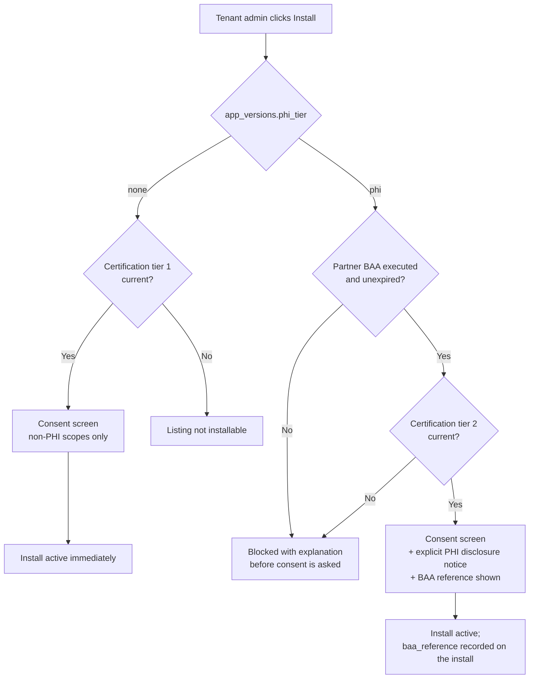

# 03 — Marketplace, Certification & Revenue

**Phase 8.1 deliverable** · Sources: `01_PARTNER_PROGRAM.md`, `02_APP_AUTHORIZATION_AND_ISOLATION.md`, `../REMAINING_PLANNING_AREAS.md` §10, `../database/01_TENANT_MANAGEMENT_ERD.md`, `../infrastructure/02_TESTING_AUTOMATION.md`, `../infrastructure/07_COMPLIANCE_AUDIT_PROCEDURES.md`
**Status:** Draft for review

Covers marketplace listings, the two install paths, the two certification tiers and the BAA chain,
re-certification triggers, integration testing automation, and the two revenue models.

Greenfield: `NEXT_STAGE_NOTES.md` marks Phase 8 "New Documentation Needed", so this document ends
with design notes rather than a corrections table. The additions it needs from Phase 1 are listed
with them.

---

## Listings

```sql
CREATE TYPE billing_model  AS ENUM ('free', 'platform_billed', 'vendor_billed');
CREATE TYPE listing_status AS ENUM ('draft', 'in_review', 'published', 'unlisted', 'removed');

CREATE TABLE app_listings (
    listing_id        UUID PRIMARY KEY DEFAULT gen_random_uuid(),
    app_id            UUID NOT NULL UNIQUE REFERENCES partner_apps(app_id) ON DELETE RESTRICT,

    tagline           VARCHAR(200) NOT NULL,
    description_md    TEXT NOT NULL,
    category          VARCHAR(50)  NOT NULL,
    icon_file_id      UUID,
    screenshots       UUID[]       NOT NULL DEFAULT '{}',
    support_url       TEXT NOT NULL,
    privacy_policy_url TEXT NOT NULL,
    terms_url         TEXT NOT NULL,

    billing_model     billing_model  NOT NULL DEFAULT 'free',
    pricing_summary   TEXT,                       -- human text; the platform bills from below
    revenue_share_bps INTEGER,                    -- platform_billed only, basis points
    referral_fee_bps  INTEGER,                    -- vendor_billed only

    status            listing_status NOT NULL DEFAULT 'draft',
    published_at      TIMESTAMP WITH TIME ZONE,
    removed_at        TIMESTAMP WITH TIME ZONE,
    removed_reason    TEXT,

    install_count     INTEGER NOT NULL DEFAULT 0,  -- denormalised, rounded for display

    CHECK ((billing_model = 'platform_billed') = (revenue_share_bps IS NOT NULL)),
    CHECK ((billing_model = 'vendor_billed')   = (referral_fee_bps  IS NOT NULL))
);
```

`privacy_policy_url` and `terms_url` are `NOT NULL` for every listing including free ones. A tenant
authorizing a disclosure needs somewhere to read what the recipient will do with the data, and for
a PHI-capable app that link is part of the tenant's own compliance file.

`install_count` is displayed rounded (`10+`, `50+`, `100+`). An exact count on a listing with three
installs, combined with a partner's public customer logos, identifies which practices use which
software — a small leak that costs nothing to avoid.

---

## Two install paths

The tiered decision: non-PHI apps install self-serve; PHI-capable apps are gated on an executed
BAA and a deeper review.



The PHI gate is evaluated **before** the consent screen, not after approval. A tenant that clicks
through consent and is then told the app cannot be installed has been asked to authorize a
disclosure that could not legally occur, and the interaction is recorded in a way that suggests
otherwise.

`app_installations.baa_reference` and `baa_verified_at` are copied onto the install at install time
rather than joined from `partners` at read time. When the tenant's compliance officer asks in 2029
what agreement was in force when this app was authorized, the answer must be the one that was in
force then, not the current row.

---

## Certification

### Tier 1 — non-PHI apps

| Check | How |
|---|---|
| Conformance suite passes | Automated, against the partner sandbox — see below |
| Scope justification | Written reason per requested scope; reviewer confirms the app's described function needs it |
| No PHI scopes requested | Mechanical: every requested scope has `app_scopes.is_phi = false` |
| Redirect URIs are HTTPS, exact, partner-controlled | Automated + domain-control check |
| Privacy policy and terms resolve and mention data handling | Reviewer |
| Support contact responds | Automated ping, human confirm |

Target turnaround: five business days. Most of this is automatable, and a slow tier-1 review is the
thing that kills a young marketplace.

### Tier 2 — PHI-capable apps

Everything in tier 1, plus:

| Check | Why |
|---|---|
| **Executed BAA between platform and partner** | §164.308(b)(1) and §164.502(e)(1)(ii). Non-negotiable and non-substitutable |
| **Breach notification flow-down, ≤ 5 calendar days** | See below |
| SOC 2 Type II report, or an independent penetration test within 12 months | Evidence that the vendor has controls at all |
| Named security officer with 24h contact | Mirrors the platform's own §164.308(a)(2) obligation |
| Data retention and deletion statement | What happens to PHI on the vendor's side after uninstall |
| Subprocessor list | A vendor that pipes PHI into a fourth party extends the chain again |
| Minimum-necessary review of each PHI scope | §164.502(b). The reviewer's question is which scope could be removed without breaking the app's stated function |

### The breach notification chain is the part that is easy to get wrong

`infrastructure/07` established the platform's own obligation as a Business Associate: notify
covered entities within **60 days of discovery**, and signed BAAs frequently impose 24–72 hours,
which governs.

A marketplace app vendor is a subcontractor. Its breach is the platform's breach for notification
purposes, and the clock runs from the *vendor's* discovery — not from the day they get around to
telling the platform.

```
Vendor discovers breach
   ├─ ≤ 5 days ──▶ notifies platform  (BAA flow-down term)
   │                  └─ platform's own clock already running from vendor discovery
   └─ platform ──▶ notifies affected tenants ──▶ tenants notify individuals / HHS
```

The flow-down term must therefore be **strictly shorter than the platform's own obligation to
tenants**, with margin to investigate. A vendor BAA that mirrors the platform's 60 days back to the
platform guarantees the platform misses its own deadline in every case, because it consumes the
entire budget before the platform learns anything.

This is a contract term with an engineering consequence: `partners.security_contact` is `NOT NULL`
for exactly this path, and the platform must be able to identify every affected tenant for a given
app quickly — which is what `app_installations` and `app_usage_daily.phi_read_count` are for.

### Re-certification triggers

Certification is a snapshot, and apps ship on their own schedule.

| Trigger | Tier re-run | Installs while pending |
|---|---|---|
| New scope requested | Full, current tier | Stay on the prior version (doc 02) |
| `phi_tier` rises from `none` to `phi` | Tier 2 from scratch | Stay non-PHI |
| Redirect URI or secret-handling change | Automated checks only | Unaffected |
| Partner ownership or legal-name change | Tier 2 BAA re-execution | Suspended on BAA lapse |
| Annual expiry | Full, current tier | 30-day grace, then suspend |
| Security incident at the vendor | Full, plus incident review | Suspended immediately |
| Platform scope catalogue change | Reviewer confirms mapping still holds | Unaffected |

Annual expiry with a 30-day grace exists because the alternative — hard expiry — takes a working
integration offline over a paperwork lapse, and the pressure that creates leads to rubber-stamping.

---

## Integration testing automation

`infrastructure/02` already defines the platform's own test pyramid, contract testing against the
OpenAPI spec, and a mock server. The marketplace adds one thing: a **conformance suite the partner
runs in their own CI, and the platform runs at submission**, against the partner's sandbox tenant.

It is published as a container image so the two runs are identical.

| Group | What it asserts | Why it is in the suite |
|---|---|---|
| OAuth | Exact-match redirect, PKCE required, code single-use, state validated | The four checks in doc 02's flow that fail silently |
| Token lifecycle | Refresh rotation handled; a revoked token produces re-auth, not a retry loop | An app that retries a revoked token forever is a self-inflicted DDoS |
| Scope discipline | App functions with only its declared scopes; requests outside them are absent, not 403-handled | Catches scope requests wider than the app's actual use — the minimum-necessary check, mechanised |
| Rate limits | 429 honours `Retry-After`; no thundering retry | The sandbox enforces real limits (doc 01) so this is testable before production |
| Errors | 5xx retried with backoff; 4xx not retried | `api/04`'s retry rules, from the client side |
| Webhooks | Signature verified against the raw body in constant time; replay window enforced | `api/04`: the step integrators most often get wrong |
| **Delivery semantics** | Duplicate `event.id` is a no-op; out-of-order `record.updated` before `record.created` is handled | `api/04` states delivery is at-least-once and unordered, and calls this the assumption integrators most often get wrong. The suite proves it rather than documenting it again |
| PHI hygiene (tier 2) | No PHI in the app's own logs or webhook echoes; deletion propagates on uninstall | Vendor-side attestation, spot-checked |
| Uninstall | Tokens stop working; the app degrades cleanly rather than erroring in a loop | The path nobody tests until a tenant complains |

The delivery-semantics group is the one worth insisting on. `api/04` documents at-least-once and
unordered delivery prominently *because* integrators assume otherwise; a certification that
re-documents it changes nothing, and a test that fails their build does.

---

## Revenue

Two models, chosen per listing. They are genuinely different money paths and only one involves the
platform moving funds.

### `platform_billed` — Stripe Connect

The tenant sees one bill. App charges become line items on the existing `invoices` row
(`database/01`), and the platform pays the vendor its share.

```sql
CREATE TYPE payout_status AS ENUM ('accruing', 'pending', 'paid', 'failed', 'reversed');

CREATE TABLE partner_billing_accounts (
    partner_id              UUID PRIMARY KEY REFERENCES partners(partner_id) ON DELETE RESTRICT,
    external_account_id     VARCHAR(255) NOT NULL UNIQUE,   -- Stripe Connect account
    kyc_status              VARCHAR(30)  NOT NULL DEFAULT 'pending',
    payouts_enabled         BOOLEAN      NOT NULL DEFAULT FALSE,
    payout_currency         CHAR(3)      NOT NULL DEFAULT 'USD',
    hold_days               INTEGER      NOT NULL DEFAULT 30,
    created_at              TIMESTAMP WITH TIME ZONE NOT NULL DEFAULT NOW()
);

CREATE TABLE app_charges (
    charge_id        UUID PRIMARY KEY DEFAULT gen_random_uuid(),
    installation_id  UUID NOT NULL REFERENCES app_installations(installation_id) ON DELETE RESTRICT,
    tenant_id        UUID NOT NULL REFERENCES tenants(tenant_id) ON DELETE RESTRICT,
    app_id           UUID NOT NULL REFERENCES partner_apps(app_id) ON DELETE RESTRICT,
    invoice_id       UUID REFERENCES invoices(invoice_id) ON DELETE RESTRICT,

    period_start     TIMESTAMP WITH TIME ZONE NOT NULL,
    period_end       TIMESTAMP WITH TIME ZONE NOT NULL,
    gross_cents      INTEGER NOT NULL,
    currency         CHAR(3) NOT NULL DEFAULT 'USD',
    platform_bps     INTEGER NOT NULL,          -- snapshotted from the listing
    platform_cents   INTEGER NOT NULL,
    vendor_cents     INTEGER NOT NULL,

    idempotency_key  VARCHAR(80) NOT NULL UNIQUE,
    created_at       TIMESTAMP WITH TIME ZONE NOT NULL DEFAULT NOW(),

    CHECK (gross_cents = platform_cents + vendor_cents)
);

CREATE TABLE partner_payouts (
    payout_id           UUID PRIMARY KEY DEFAULT gen_random_uuid(),
    partner_id          UUID NOT NULL REFERENCES partners(partner_id) ON DELETE RESTRICT,
    status              payout_status NOT NULL DEFAULT 'accruing',
    period_start        TIMESTAMP WITH TIME ZONE NOT NULL,
    period_end          TIMESTAMP WITH TIME ZONE NOT NULL,

    amount_cents        INTEGER NOT NULL,
    currency            CHAR(3) NOT NULL,
    fx_rate             NUMERIC(18,8),          -- fixed at accrual, never recomputed
    fx_rate_at          TIMESTAMP WITH TIME ZONE,

    external_transfer_id VARCHAR(255) UNIQUE,
    idempotency_key     VARCHAR(80) NOT NULL UNIQUE,
    paid_at             TIMESTAMP WITH TIME ZONE,
    failure_reason      TEXT,
    created_at          TIMESTAMP WITH TIME ZONE NOT NULL DEFAULT NOW()
);

CREATE TABLE payout_line_items (
    payout_id  UUID NOT NULL REFERENCES partner_payouts(payout_id) ON DELETE RESTRICT,
    charge_id  UUID NOT NULL REFERENCES app_charges(charge_id) ON DELETE RESTRICT,
    amount_cents INTEGER NOT NULL,
    PRIMARY KEY (payout_id, charge_id)
);
```

Five things in that model are load-bearing:

**`idempotency_key` is a column, not a Redis entry.** `api/02` requires `Idempotency-Key` on every
billing-affecting mutation and its OQ5 asks whether Redis with a 24-hour TTL is sufficient. For
money leaving the platform the answer is no: `performance/01` establishes that a Redis flush loses
state, and a lost payout key means a second transfer of real funds. The unique constraint is the
guarantee, and it survives the flush.

**`platform_bps` is snapshotted onto the charge.** Reading the current listing at payout time means
a revenue-share renegotiation silently restates history.

**`fx_rate` is fixed at accrual.** A vendor paid in EUR against a USD invoice must be paid at a
recorded rate. Recomputing at transfer time makes reconciliation impossible and makes the platform
carry currency risk it never priced.

**`hold_days` defaults to 30.** A tenant refund after the vendor has been paid leaves the platform
chasing money, and a chargeback arrives later still. The hold window is what makes a `reversed`
payout a ledger entry instead of a debt-collection problem.

**Every financial FK is `ON DELETE RESTRICT`.** `database/01` gives `invoices.tenant_id` the same
treatment, deliberately unlike the rest of the tenant tree, because financial records must survive
tenant deletion for tax and audit retention. Payouts inherit it: a terminated partner's payout
history is retained, and termination is a status change.

### `vendor_billed` — direct, with a referral fee

The vendor bills the tenant themselves. The platform never touches app revenue and takes a referral
or listing fee instead.

```sql
CREATE TABLE referral_fee_events (
    event_id        UUID PRIMARY KEY DEFAULT gen_random_uuid(),
    installation_id UUID NOT NULL REFERENCES app_installations(installation_id) ON DELETE RESTRICT,
    partner_id      UUID NOT NULL REFERENCES partners(partner_id) ON DELETE RESTRICT,
    event_type      VARCHAR(30) NOT NULL,     -- 'install' | 'conversion' | 'renewal'
    fee_cents       INTEGER NOT NULL,
    currency        CHAR(3) NOT NULL DEFAULT 'USD',
    reported_by     VARCHAR(20) NOT NULL,     -- 'platform' | 'partner'
    invoiced_at     TIMESTAMP WITH TIME ZONE,
    idempotency_key VARCHAR(80) NOT NULL UNIQUE,
    created_at      TIMESTAMP WITH TIME ZONE NOT NULL DEFAULT NOW()
);
```

Simpler financially and worse for the tenant, who now gets two bills. The trade is worth making
available because some vendors already have billing relationships with these practices and will not
re-platform them.

`reported_by = 'partner'` is the uncomfortable part: for conversion and renewal fees the platform
depends on the vendor's self-report, since it cannot see their invoices. That is an audit-rights
clause in the partner agreement, not an engineering control, and the model should not pretend
otherwise — `event_type = 'install'` is the only variety the platform observes directly.

### What the marketplace must not do

- **Rank by revenue share without disclosure.** A marketplace that sorts `platform_billed` listings
  above `vendor_billed` ones is steering tenants toward the platform's own margin. If it happens,
  it must be labelled.
- **Auto-enable a paid tier on an existing install.** A pricing change is a re-consent event by the
  same logic as a scope change in doc 02.
- **Expose per-tenant revenue to other partners.** `app_usage_daily` is per-app; nothing aggregates
  spend across apps for a partner audience.

---

## Design notes and dependencies

Greenfield, so these are decisions rather than corrections to a source document.

| # | Decision | Alternative rejected | Why |
|---|---|---|---|
| 1 | Two certification tiers keyed on `phi_tier` | One tier for everything | A single strict tier makes a read-only calendar widget carry SOC 2; a single loose tier is unusable for PHI |
| 2 | Vendor breach flow-down ≤ 5 days | Mirror the platform's 60-day obligation | Mirroring consumes the platform's entire budget before it learns anything |
| 3 | Both billing models, chosen per listing | One model | Vendors with existing billing relationships will not re-platform them; tenants prefer one bill when there is no such relationship |
| 4 | Idempotency keys as unique columns | Redis with TTL, per `api/02` OQ5 | A Redis flush loses the key and the second transfer is real money |
| 5 | Conformance suite as a container the partner runs | Platform-side review only | Certification that runs once catches nothing on the partner's next release |
| 6 | `install_count` displayed rounded | Exact | Exact counts plus public customer logos identify which practices use which software |
| 7 | BAA reference copied onto the install | Joined from `partners` | The compliance question is what was in force then, not now |

**Phase 1 additions this document needs:**

| Addition | Where | Cost of delay |
|---|---|---|
| `plans.code = 'partner_sandbox'` seed row | `database/01` | Blocks partner onboarding entirely |
| Line-item support on `invoices` | `database/01` — `invoices` has an amount but no items table | `platform_billed` cannot render a tenant's bill |
| `apps:install` permission + admin role grant | `database/02` | Any user could authorize a disclosure (doc 02, correction 5) |
| `app_id` / `installation_id` on both audit tables | `database/04` | Disclosure accounting incomplete from the first install |

---

## Open questions

1. **Who signs the platform–vendor BAA, and how long does it take?** Every tier-2 certification
   blocks on legal review of a counterparty agreement. At ten partners that is manageable; at a
   hundred it needs a standard non-negotiable template and a named owner, and it interacts with
   open decision 6 (the named HIPAA Security Officer) from `infrastructure/07`.
2. **Does a tenant's own BAA permit disclosure to platform subcontractors?** The platform's BAA with
   each tenant needs a subcontractor clause covering marketplace vendors. If existing tenants signed
   a BAA without one, PHI-capable installs may require a contract amendment per tenant before the
   first PHI app can be installed at all. This should be checked against the current template before
   tier 2 is built.
3. **Revenue share percentage.** `revenue_share_bps` is modelled but unset. It is a commercial
   decision with a technical consequence only in that changing it must not restate history — which
   the snapshot on `app_charges` already handles.
4. **Metering for usage-priced apps.** `app_charges` assumes the vendor reports a period amount. An
   app priced per API call would need the platform to meter on its behalf, which `app_usage_daily`
   could support but which makes the platform the system of record for someone else's pricing.
5. **Marketplace removal and tenant continuity.** When a listing is removed, existing installs
   continue under doc 02's rules — but a tenant that depends on a removed app has no path to a
   replacement and may not know it is unsupported. An end-of-life notice period, and what it
   obliges the partner to do, is unspecified.
6. **International vendors.** `partner_billing_accounts.payout_currency` and `fx_rate` anticipate
   them, but a non-US vendor handling US PHI raises export and jurisdiction questions that sit with
   open decision 1 (the vertical) and are not resolved here.
